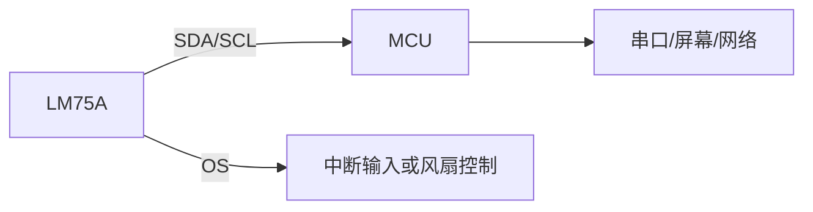
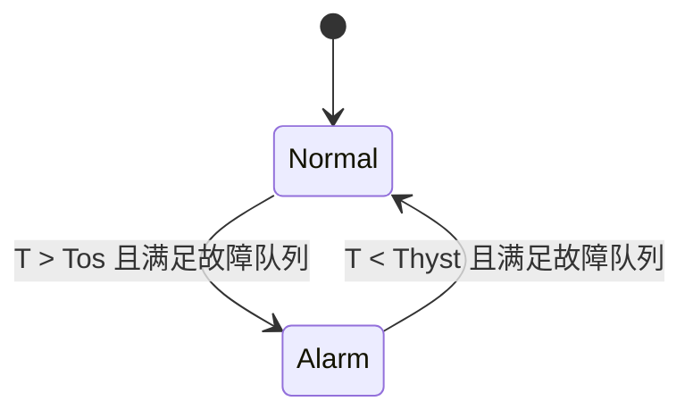
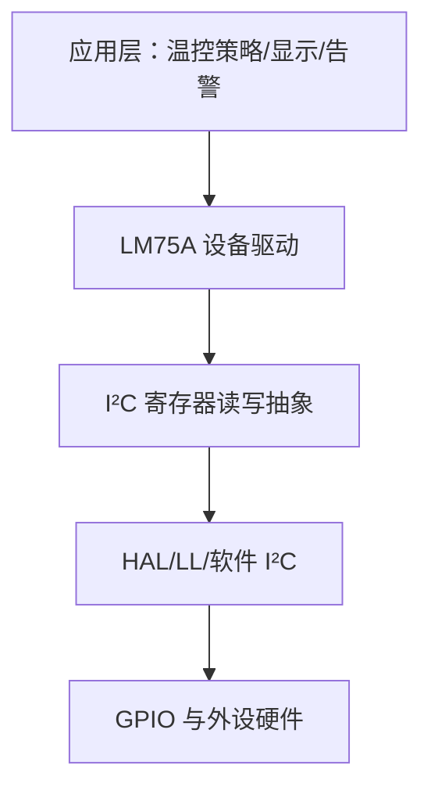

# LM75A 数字温度传感器详解

## 从 I²C 时序到温度采集、阈值报警与驱动设计

适用对象：已掌握 C 语言基础、单片机 GPIO 与基本 I²C 概念的学习者

---

# 学习目标

完成本章后，你应能够：

1. 说明 LM75A 的功能、引脚和典型应用场景；
2. 根据 A2～A0 计算 7 位从机地址及总线地址字节；
3. 读写 Temp、Conf、Thyst、Tos 四个寄存器；
4. 正确解析 11 位二进制补码温度，包括负温度；
5. 区分比较器模式与中断模式，设计过温报警逻辑；
6. 编写可移植、可诊断的 LM75A 驱动；
7. 使用示波器或逻辑分析仪定位常见 I²C 故障。

---

# 课程路线


---

# 1. LM75A 是什么？

LM75A 是一款带 I²C 接口的数字温度传感器和温度监控器。

- 测温范围：-55℃～+125℃；
- 温度数据分辨率：0.125℃；
- 温度寄存器：11 位二进制补码；
- 供电范围：典型资料为 2.8V～5.5V；
- 支持正常工作与低功耗关断模式；
- OS 开漏输出可配置为比较器或中断模式；
- 3 个地址选择脚，同一总线最多连接 8 颗器件；
- 可编程过温阈值、滞回阈值、输出极性和故障队列。

> 关键理解：LM75A 不仅能“读温度”，还可以脱离 MCU 的持续干预，直接完成过温监控。

---

# 2. 典型应用

- 机箱、服务器和通信设备温度监控；
- 电源、充电器、功率器件附近的过热保护；
- 风扇启停控制；
- 工业控制板、仪器仪表温度采集；
- 多点温度巡检；
- 低功耗设备的周期性温度检测。



---

# 3. 引脚功能

| 引脚 | 名称 | 类型 | 功能与注意事项 |
|---|---|---|---|
| 1 | SDA | 双向开漏 | I²C 数据线，必须上拉 |
| 2 | SCL | 输入 | I²C 时钟线，必须上拉 |
| 3 | OS | 开漏输出 | 过温报警输出，使用时需上拉 |
| 4 | GND | 电源 | 系统地，也是重要热传导路径 |
| 5 | A2 | 输入 | 从机地址选择位 2，不可悬空 |
| 6 | A1 | 输入 | 从机地址选择位 1，不可悬空 |
| 7 | A0 | 输入 | 从机地址选择位 0，不可悬空 |
| 8 | VCC | 电源 | 接系统电源，近端放置去耦电容 |

> 不使用 OS 时可悬空；A2、A1、A0 不能悬空，应明确接 VCC 或 GND。

---

# 4. 推荐硬件连接

```text
3.3V/5V ──────── VCC
   │               │
 100nF             LM75A
   │               │
 GND ──────────── GND

VCC ── Rp ── SDA ───────── MCU_SDA
VCC ── Rp ── SCL ───────── MCU_SCL
VCC ── Rp ── OS  ───────── MCU_EXTI（可选）

A2、A1、A0 ────── GND 或 VCC
```

- 去耦电容尽量靠近 VCC 和 GND；
- SDA/SCL 常用 4.7kΩ～10kΩ 上拉，最终值应结合总线电容和速率计算；
- OS 上拉阻值应兼顾逻辑电平、响应速度和自热误差；
- 传感器应远离 MCU、LDO、电感和大电流走线等热源。

---

# 5. 为什么 I²C 需要上拉？

SDA、SCL 和 OS 采用开漏结构：器件可以主动拉低，但不能主动输出高电平。

```text
输出“0”：MOS 管导通，线路被拉低
输出“1”：MOS 管关断，外部上拉电阻把线路拉高
```

这样可以让多个器件安全地共享总线，并实现“线与”逻辑。

上拉过大：上升沿慢，高速通信可能失败。

上拉过小：灌电流增大、功耗增加，还可能引入传感器自热误差。

---

# 6. I²C 地址组成

LM75A 的 7 位从机地址为：

```text
bit6 bit5 bit4 bit3 bit2 bit1 bit0
 1    0    0    1    A2   A1   A0
```

因此地址范围为 `0x48`～`0x4F`。

| A2 | A1 | A0 | 7 位地址 | 写地址字节 | 读地址字节 |
|---:|---:|---:|---:|---:|---:|
| 0 | 0 | 0 | `0x48` | `0x90` | `0x91` |
| 0 | 0 | 1 | `0x49` | `0x92` | `0x93` |
| 0 | 1 | 0 | `0x4A` | `0x94` | `0x95` |
| 0 | 1 | 1 | `0x4B` | `0x96` | `0x97` |
| 1 | 0 | 0 | `0x4C` | `0x98` | `0x99` |
| 1 | 0 | 1 | `0x4D` | `0x9A` | `0x9B` |
| 1 | 1 | 0 | `0x4E` | `0x9C` | `0x9D` |
| 1 | 1 | 1 | `0x4F` | `0x9E` | `0x9F` |

---

# 7. 7 位地址与 8 位地址：最常见的坑

两种写法都可能在资料中出现：

```c
/* 7 位器件地址 */
#define LM75A_ADDR_7BIT  0x4F

/* 地址字节：把 7 位地址左移，再加入 R/W 位 */
#define LM75A_ADDR_WRITE ((LM75A_ADDR_7BIT << 1) | 0U)  // 0x9E
#define LM75A_ADDR_READ  ((LM75A_ADDR_7BIT << 1) | 1U)  // 0x9F
```

但不同驱动接口的入参约定不同：

- 自己写的 `I2C_ReadReg()` 可能接收 7 位地址；
- 某些 HAL 接口要求传入左移后的地址；
- 如果把 `0x9E` 再左移一次，器件一定不会应答。

> 调试前第一问：当前 I²C API 要的是 `0x4F`，还是 `0x9E/0x9F`？

---

# 8. 内部寄存器总览

LM75A 通过“指针寄存器”选择后续访问对象。

| 指针值 | 名称 | 长度 | 权限 | 上电默认值/说明 |
|---:|---|---:|---|---|
| `0x00` | Temp | 2 字节 | 只读 | 当前温度，11 位，0.125℃/LSB |
| `0x01` | Conf | 1 字节 | 读写 | 默认 `0x00` |
| `0x02` | Thyst | 2 字节 | 读写 | 默认 75℃，9 位，0.5℃/LSB |
| `0x03` | Tos | 2 字节 | 读写 | 默认 80℃，9 位，0.5℃/LSB |

> 温度寄存器和阈值寄存器的分辨率不同：Temp 是 0.125℃，Thyst/Tos 是 0.5℃。

---

# 9. 指针寄存器的作用

指针寄存器可理解为 LM75A 内部的“寄存器选择器”。

```text
P7 P6 P5 P4 P3 P2 P1 P0
 0  0  0  0  0  0  R1 R0
```

| R1:R0 | 被选中的寄存器 |
|---|---|
| `00` | Temp |
| `01` | Conf |
| `10` | Thyst |
| `11` | Tos |

指针具有保持作用。上电默认指向 Temp，因此连续只读温度时可以省去再次设置指针；为了驱动逻辑清晰、降低状态依赖，通用驱动通常仍显式指定寄存器地址。

---

# 10. 读取寄存器的 I²C 事务

读取 Temp 的标准过程：

```text
S → SLA+W → ACK → Pointer(0x00) → ACK
  → Sr → SLA+R → ACK → MSB → ACK → LSB → NACK → P
```

- `S`：起始条件；
- `Sr`：重复起始条件；
- `P`：停止条件；
- `SLA+W/SLA+R`：地址字节及读写位；
- 主机读取最后一个字节后发送 NACK，表示读取结束。

> 读取 16 位寄存器时必须完整处理两个字节，避免器件或软件 I²C 状态异常。

---

# 11. 写入寄存器的 I²C 事务

写 Conf：

```text
S → SLA+W → ACK → Pointer(0x01) → ACK
  → ConfigData → ACK → P
```

写 Thyst 或 Tos：

```text
S → SLA+W → ACK → Pointer → ACK
  → MSB → ACK → LSB → ACK → P
```

LM75A 采用高字节在前的传输顺序。

工程实践建议：写入关键配置后回读并比较，能够尽早发现地址、连线或总线层问题。

---

# 12. Temp 温度寄存器格式

```text
字节 0（MSB）               字节 1（LSB）
D15 D14 D13 D12 D11 D10 D9 D8 | D7 D6 D5 D4 D3 D2 D1 D0
 T10 T9  T8  T7  T6  T5 T4 T3 | T2 T1 T0  X  X  X  X  X
```

- 有效数据位：D15～D5，共 11 位；
- D15 对应 11 位数据的符号位 T10；
- D4～D0 未使用；
- 数据采用二进制补码；
- 1 LSB = 0.125℃。

计算核心：先组合成 16 位有符号数，再右移 5 位得到 11 位有符号计数值。

---

# 13. 正温度解析示例：+27.875℃

读到两个字节：

```text
MSB = 0x1B = 0001 1011
LSB = 0xE0 = 1110 0000
组合值       = 0001 1011 1110 0000 = 0x1BE0
右移 5 位    = 000 0011 0111 11₂   = 223
温度         = 223 × 0.125℃ = 27.875℃
```

等价计算：

```c
int16_t raw = (int16_t)(((uint16_t)msb << 8) | lsb);
float temperature = (float)(raw >> 5) * 0.125f;
```

---

# 14. 负温度解析示例：-25℃

11 位计数值为：

```text
-25 ÷ 0.125 = -200
```

其 11 位补码为 `11100111000₂`。放入 D15～D5 后，原始 16 位数据为 `0xE700`。

```text
MSB = 0xE7
LSB = 0x00
按 int16_t 解释 0xE700 = -6400
算术右移 5 位         = -200
温度                  = -200 × 0.125℃ = -25℃
```

> 不能把数据始终当作 `uint16_t` 右移后直接乘 0.125，否则负温度会变成一个很大的正数。

---

# 15. 更稳健的温度解码函数

```c
#include <stdint.h>

static float LM75A_DecodeTemperature(uint8_t msb, uint8_t lsb)
{
    int16_t raw = (int16_t)(((uint16_t)msb << 8) | (uint16_t)lsb);

    /* 有效值位于 D15:D5；用除法避免依赖负数右移的实现细节 */
    int16_t counts = (int16_t)(raw / 32);
    return (float)counts * 0.125f;
}
```

还可以直接利用缩放关系：

```c
return (float)raw / 256.0f;  // 32 × 8 = 256
```

前提是低 5 位按器件定义忽略，且 `raw` 已正确解释为有符号 16 位数。

---

# 16. 不使用浮点数的表示方法

在资源紧张或没有硬件 FPU 的 MCU 上，可以返回“千分之一摄氏度”或“八分之一摄氏度”。

```c
/* 返回单位：0.125℃，例如 223 表示 27.875℃ */
static int16_t LM75A_DecodeCounts(uint8_t msb, uint8_t lsb)
{
    int16_t raw = (int16_t)(((uint16_t)msb << 8) | lsb);
    return (int16_t)(raw / 32);
}

/* 返回单位：m℃ */
int32_t temp_mC = (int32_t)LM75A_DecodeCounts(msb, lsb) * 125;
```

显示时：整数部分为 `temp_mC / 1000`，小数部分取绝对值后补足三位。

---

# 17. 常用温度编码速查

| 温度 | 11 位计数值 | 寄存器原始值 | MSB | LSB |
|---:|---:|---:|---:|---:|
| +125℃ | 1000 | `0x7D00` | `0x7D` | `0x00` |
| +27.875℃ | 223 | `0x1BE0` | `0x1B` | `0xE0` |
| +25℃ | 200 | `0x1900` | `0x19` | `0x00` |
| +0.125℃ | 1 | `0x0020` | `0x00` | `0x20` |
| 0℃ | 0 | `0x0000` | `0x00` | `0x00` |
| -0.125℃ | -1 | `0xFFE0` | `0xFF` | `0xE0` |
| -25℃ | -200 | `0xE700` | `0xE7` | `0x00` |
| -55℃ | -440 | `0xC900` | `0xC9` | `0x00` |

---

# 18. Conf 配置寄存器

```text
bit  7   6   5    4   3      2       1       0
     0   0   0   F1  F0   OS_POL  OS_MODE  SHUTDOWN
```

| 位 | 名称 | 含义 |
|---:|---|---|
| D7:D5 | Reserved | 保留，正常使用保持 0 |
| D4:D3 | Fault Queue | 连续越限次数：1、2、4、6 |
| D2 | OS_POL | 0：低有效；1：高有效 |
| D1 | OS_MODE | 0：比较器；1：中断 |
| D0 | SHUTDOWN | 0：正常；1：关断 |

上电默认值为 `0x00`。

---

# 19. 故障队列 Fault Queue

| D4 | D3 | 触发 OS 所需连续越限次数 |
|---:|---:|---:|
| 0 | 0 | 1 |
| 0 | 1 | 2 |
| 1 | 0 | 4 |
| 1 | 1 | 6 |

作用：过滤瞬时干扰和单次异常采样，减少误报警。

代价：次数越多，确认真实过温所需时间越长。

设计原则：

- 安全保护优先：队列不宜过长；
- 环境噪声较大：适当增加次数；
- 不要用故障队列代替合理的 Tos/Thyst 滞回设置。

---

# 20. 关断模式

设置 Conf.D0 = 1，LM75A 停止周期温度转换并进入低功耗状态；I²C 接口仍然可访问。

```c
config |= 0x01U;              // 进入关断
config &= (uint8_t)~0x01U;    // 退出关断
```

推荐采用“读-改-写”，只改变 D0，保留其他配置位。

退出关断后不能马上把旧寄存器值当作新温度，应等待一次新的温度转换完成。实际等待时间应依据所用器件版本的数据手册和系统设计余量确定。

---

# 21. Thyst 与 Tos 阈值寄存器

Tos：过温上限；Thyst：恢复下限。

```text
D15........D7 D6........D0
 9 位补码温度     未定义
```

- 有效数据为 D15～D7，共 9 位；
- 分辨率为 0.5℃/LSB；
- Tos 上电默认 80℃；
- Thyst 上电默认 75℃；
- 设计时通常满足 `Thyst < Tos`。

示例：Tos = 50℃，Thyst = 45℃，形成 5℃滞回区，避免温度在阈值附近波动造成输出反复跳变。

---

# 22. 阈值编码

```c
/* 摄氏温度必须能够用 0.5℃表示；返回高字节在前的寄存器值 */
static uint16_t LM75A_EncodeLimit(float temp_c)
{
    int16_t counts = (int16_t)(temp_c / 0.5f);
    return (uint16_t)((uint16_t)counts << 7);
}
```

示例：

```text
50℃ ÷ 0.5℃ = 100 → 100 << 7 = 0x3200
45℃ ÷ 0.5℃ =  90 →  90 << 7 = 0x2D00
```

工程版函数还应：

- 检查输入是否超出允许温度范围；
- 明确采用截断、四舍五入还是拒绝非 0.5℃整数倍；
- 对负数移位的可移植性进行处理。

---

# 23. OS 比较器模式

比较器模式下，OS 的行为类似恒温器：

1. 温度连续达到故障队列要求并高于 Tos，OS 有效；
2. 启动风扇、降频或关断负载；
3. 温度下降到 Thyst 以下，OS 自动恢复无效。



适合：无需软件确认、希望硬件自动闭环控制的场合。

---

# 24. OS 中断模式

中断模式下，越限事件会被“锁存”：

1. 温度越过 Tos 后 OS 有效；
2. MCU 读取 LM75A 任一寄存器后，OS 复位；
3. 此后需温度低于 Thyst，才可形成下一阶段事件；
4. 再次读取寄存器可复位该事件。

适合：希望 MCU 对每次温度边界事件进行记录、决策或上报的场合。

> 注意：中断服务程序中的“读寄存器”本身会改变 OS 锁存状态，软件设计必须理解这种副作用。

---

# 25. 比较器模式与中断模式对比

| 对比项 | 比较器模式 | 中断模式 |
|---|---|---|
| OS 是否锁存 | 否 | 是 |
| 温度恢复后是否自动释放 | 是 | 否，需读取寄存器复位 |
| 典型用途 | 风扇、硬件保护 | MCU 事件通知 |
| 软件参与程度 | 低 | 高 |
| 对读操作的敏感性 | 较低 | 读操作会清除 OS 状态 |

无论哪种模式，OS 都是开漏输出；极性位只是改变“有效状态”的逻辑定义，并不把引脚变成推挽输出。

---

# 26. 一个完整的驱动分层



建议职责：

- 应用层不接触寄存器位；
- LM75A 层负责地址、编码、单位和模式；
- I²C 抽象层负责起始、停止、ACK、超时和错误码；
- 底层负责具体 MCU 外设。

这样更容易移植、测试和定位问题。

---

# 27. 建议的驱动接口

```c
typedef enum {
    LM75A_OK = 0,
    LM75A_ERR_ARG,
    LM75A_ERR_I2C,
    LM75A_ERR_RANGE
} LM75A_Status;

LM75A_Status LM75A_Init(void);
LM75A_Status LM75A_ReadTemperature(float *temp_c);
LM75A_Status LM75A_ReadConfig(uint8_t *config);
LM75A_Status LM75A_WriteConfig(uint8_t config);
LM75A_Status LM75A_SetShutdown(bool enable);
LM75A_Status LM75A_SetLimits(float thyst_c, float tos_c);
```

为什么返回状态码，而不是失败时返回 `-99.0f`？

- `-99℃` 仍可能被误认为温度值；
- 状态码与输出数据分离，更容易判断错误；
- 便于传递 NACK、超时、总线忙等诊断信息。

---

# 28. 温度读取参考实现

```c
LM75A_Status LM75A_ReadTemperature(float *temp_c)
{
    uint8_t data[2];

    if (temp_c == NULL) {
        return LM75A_ERR_ARG;
    }

    if (I2C_ReadReg(LM75A_ADDR_7BIT, LM75A_TEMP_REG,
                    data, sizeof(data)) != I2C_OK) {
        return LM75A_ERR_I2C;
    }

    int16_t raw = (int16_t)(((uint16_t)data[0] << 8) | data[1]);
    *temp_c = (float)raw / 256.0f;
    return LM75A_OK;
}
```

重点：检查空指针、检查总线返回值、正确处理有符号数。

---

# 29. 关断控制参考实现

```c
LM75A_Status LM75A_SetShutdown(bool enable)
{
    uint8_t config;

    if (I2C_ReadReg(LM75A_ADDR_7BIT, LM75A_CONFIG_REG,
                    &config, 1) != I2C_OK) {
        return LM75A_ERR_I2C;
    }

    if (enable) {
        config |= 0x01U;
    } else {
        config &= (uint8_t)~0x01U;
    }

    if (I2C_WriteReg(LM75A_ADDR_7BIT, LM75A_CONFIG_REG,
                     &config, 1) != I2C_OK) {
        return LM75A_ERR_I2C;
    }

    return LM75A_OK;
}
```

---

# 30. 结合本工程代码阅读

本工程头文件中使用：

```c
#define LM75A_ADDR  0x4F
```

这意味着硬件地址脚应为 `A2=A1=A0=1`。若实际板卡将地址脚全部接地，则应改为 `0x48`。

现有实现已经具备三个基本功能：

- 读取温度寄存器；
- 设置 Conf.D0 进入关断；
- 清除 Conf.D0 退出关断。

课堂检查点：

1. `I2C_ReadReg()` 接收 7 位还是 8 位地址？
2. 底层函数是否返回错误码，当前代码是否检查？
3. 退出关断固定等待 2 秒是否必要？
4. 失败时如何把故障传递给应用层？

---

# 31. 对现有解码逻辑的理解

工程代码先组合两字节，再右移 5 位并处理符号：

```c
uint16_t temp_data = (buffer[0] << 8) | buffer[1];
int16_t temp_val = (int16_t)temp_data;
temp_val >>= 5;
```

在常见 ARM/GCC 编译器上，有符号负数右移通常执行算术右移，符号已经得到扩展；后续再次检查 `0x400` 并按位或 `0xF800` 通常是冗余的。

更清晰的方案是直接保留 16 位寄存器格式：

```c
int16_t raw = (int16_t)(((uint16_t)buffer[0] << 8) | buffer[1]);
return (float)raw / 256.0f;
```

---

# 32. 初始化建议

推荐流程：

1. 初始化 GPIO 和 I²C 外设；
2. 扫描或探测预期的 LM75A 地址；
3. 读取 Conf，确认器件应答；
4. 写入期望配置；
5. 写入 Thyst 和 Tos；
6. 回读并校验关键寄存器；
7. 等待首次有效转换；
8. 读取温度并进行范围合理性检查；
9. 若使用 OS，清理 MCU 中断标志后再使能外部中断。

不要只以“总线有 ACK”判断初始化成功，还应核对寄存器回读值。

---

# 33. 采样任务设计

不建议在主循环中无延时地持续读取：

```c
for (;;) {
    if (time_to_sample) {
        float temp;
        if (LM75A_ReadTemperature(&temp) == LM75A_OK) {
            Temperature_Process(temp);
        } else {
            SensorFault_Process();
        }
    }
}
```

采样周期应由应用需求决定，而不是越快越好。

- 人机显示：500ms～1s 通常足够；
- 风扇控制：结合热惯性选择；
- 低功耗设备：关断后定时唤醒采样；
- 安全保护：优先使用 OS 硬件输出形成独立保护路径。

---

# 34. 软件滤波是否必要？

温度对象通常变化较慢，可使用简单滤波改善显示稳定性：

```text
滑动平均：抑制随机抖动，但会增加延迟
中值滤波：抑制孤立异常值
一阶低通：计算量小，适合连续显示
```

一阶低通示例：

```c
filtered = filtered + alpha * (sample - filtered);
```

但要区分两个问题：

- 总线读错产生的异常数据，应通过错误检测处理；
- 真实温度波动，才适合用滤波平滑。

滤波不能掩盖通信故障。

---

# 35. 温控策略示例

目标：50℃开风扇，45℃关风扇。

软件实现：

```c
if ((!fan_on) && (temp_c >= 50.0f)) {
    Fan_Set(true);
    fan_on = true;
} else if (fan_on && (temp_c <= 45.0f)) {
    Fan_Set(false);
    fan_on = false;
}
```

硬件实现：

- Tos = 50℃；
- Thyst = 45℃；
- OS 设为比较器模式；
- OS 经合适的驱动电路控制风扇或通知 MCU。

> 滞回区可以防止温度在单一阈值附近来回抖动导致风扇频繁启停。

---

# 36. OS 不能直接带大负载

OS 是逻辑级开漏输出，不能直接驱动风扇、继电器或加热器。


驱动感性负载时还需考虑：

- 续流二极管；
- MOSFET 电压、电流和导通电阻；
- 电源地回流路径；
- 上电默认状态；
- MCU 与 LM75A 失效时的安全状态。

---

# 37. 测到的到底是谁的温度？

LM75A 测量的是芯片内部晶粒温度，不是抽象意义上的“空气温度”。结果受热传导路径影响：

- PCB 铜皮和引脚将板温传给芯片；
- 附近功率器件可能通过铜皮加热传感器；
- 气流、外壳和安装方式影响热平衡；
- OS 或 I²C 引脚过大电流可能造成轻微自热；
- 快速变化时存在热响应延迟。

布局时先明确测量目标：环境空气、PCB 热点、散热片，还是密闭腔体？

---

# 38. PCB 布局建议

- 靠近需要感知的热源，但避开不希望测到的热源；
- 避免紧邻 MCU、LDO、DC-DC、电阻阵列和背光电路；
- 根据测量目标设计铜皮：大铜皮利于测 PCB 温度，小热岛更接近局部空气温度；
- SDA/SCL 远离强开关节点；
- 去耦电容靠近器件；
- 潮湿或冷凝环境考虑防护涂层；
- 探头式应用需注意绝缘、防水和热耦合一致性。

> 精度不仅是芯片参数，还取决于布局、安装、热路径和标定方法。

---

# 39. 常见故障 1：器件无 ACK

按以下顺序检查：

1. VCC 与 GND 电压是否正确；
2. A2～A0 实际电平与软件地址是否一致；
3. API 使用的是 7 位地址还是左移后的地址；
4. SDA/SCL 是否有上拉；
5. SDA/SCL 是否接反；
6. 引脚是否被配置成正确的开漏复用功能；
7. 总线是否被其他器件拉低；
8. I²C 速率是否过高、上升沿是否过慢；
9. 是否共地；
10. 芯片方向和封装焊接是否正确。

---

# 40. 常见故障 2：读数固定或异常

| 现象 | 可能原因 |
|---|---|
| 始终读到相同值 | 指针错误、未退出关断、未等待新转换 |
| 负温度变成大正数 | 未按有符号补码解析 |
| 数值扩大 8 倍 | 忘记乘 0.125 或移位错误 |
| 小数总为 0 | 只读取 MSB，丢失低 3 位温度数据 |
| 跳变到极端值 | I²C 错误未检查，缓冲区残留 |
| 比实际偏高 | 靠近热源、自热、布局热耦合不当 |
| 偶发异常 | 上拉不合适、干扰、供电去耦不足 |

调试时同时记录原始 `MSB/LSB`，不要只打印最终浮点温度。

---

# 41. 常见故障 3：总线被拉低

可能原因：

- 主机在多字节读操作中途异常退出；
- 软件 I²C 没有正确释放 SDA；
- 器件在等待剩余时钟；
- MCU 复位时从机仍处于事务中；
- 硬件短路或器件损坏。

常见恢复策略：

1. 将 SCL 临时配置为 GPIO；
2. 在确认 SDA 状态的同时输出最多 9 个时钟脉冲；
3. 产生 STOP 条件；
4. 重新初始化 I²C 外设；
5. 再次探测器件。

恢复逻辑应设置次数和超时，不能无限循环。

---

# 42. 使用逻辑分析仪看什么？

一次寄存器读取应重点观察：

- START 是否正确；
- 地址是否为预期值；
- R/W 位是否正确；
- 每个字节后是否有 ACK；
- 指针是否为 `0x00`；
- 是否出现重复 START；
- 两个温度字节顺序是否为 MSB、LSB；
- 主机是否在最后一字节后发送 NACK；
- STOP 是否完整；
- SCL/SDA 上升沿是否过慢。

> 最有效的调试记录：波形截图 + 地址/寄存器/原始字节 + 软件错误码。

---

# 43. 建议的错误处理

```c
typedef struct {
    uint32_t ok_count;
    uint32_t nack_count;
    uint32_t timeout_count;
    uint32_t recover_count;
    float last_good_temp;
} LM75A_Diagnostics;
```

应用策略：

- 单次失败：保留上次有效值，同时标记数据陈旧；
- 连续失败：尝试总线恢复和重新初始化；
- 持续失败：上报告警，进入预定安全状态；
- 不要用 0℃ 或 -99℃伪装通信失败；
- 显示层明确区分“当前值”“旧值”和“无效值”。

---

# 44. 单元测试：解码函数

无需连接硬件即可测试数据解析：

```c
assert_close(decode(0x19, 0x00),  25.000f);
assert_close(decode(0x1B, 0xE0),  27.875f);
assert_close(decode(0x00, 0x20),   0.125f);
assert_close(decode(0x00, 0x00),   0.000f);
assert_close(decode(0xFF, 0xE0),  -0.125f);
assert_close(decode(0xE7, 0x00), -25.000f);
assert_close(decode(0xC9, 0x00), -55.000f);
```

边界测试尤其重要：0℃附近、最大/最小温度、负数以及低 5 位为非零的异常输入。

---

# 45. 实验一：读取并显示温度

实验目标：完成从硬件连线到稳定输出摄氏温度的完整链路。

步骤：

1. 确认 A2～A0，计算 7 位地址；
2. 扫描 I²C 总线，确认器件应答；
3. 每 500ms 读取 Temp 两个字节；
4. 串口同时打印原始数据和换算温度；
5. 手指轻触器件或使用安全热源，观察温度变化；
6. 断开 SDA 或修改错误地址，验证错误处理。

期望输出：

```text
addr=0x4F raw=1B E0 temp=27.875 C status=OK
```

---

# 46. 实验二：验证关断模式

1. 正常读取并记录温度；
2. 读 Conf，保存原值；
3. 置位 D0，回读确认；
4. 改变环境温度，观察 Temp 是否停止更新；
5. 清除 D0，回读确认；
6. 等待新转换完成后再次读取；
7. 比较正常与关断状态下系统功耗。

思考题：

- 关断后 I²C 为什么仍能通信？
- 退出关断后为何不能立即认为温度已更新？
- 固定延时与查询式/定时式设计各有什么优缺点？

---

# 47. 实验三：过温报警

配置目标：

- Tos = 35℃；
- Thyst = 30℃；
- OS 低有效；
- 先使用比较器模式；
- 故障队列设为 2 次。

观察项目：

1. 升温超过 35℃后 OS 的变化；
2. 温度降至 35℃以下但仍高于 30℃时 OS 是否恢复；
3. 降到 30℃以下后 OS 的变化；
4. 改成中断模式后，读寄存器对 OS 的影响；
5. 改变故障队列后响应时间的变化。

---

# 48. 课堂练习：地址计算

某电路将 A2、A1、A0 分别接为 `1、0、1`。

请回答：

1. 7 位从机地址是多少？
2. 总线上的写地址字节是多少？
3. 总线上的读地址字节是多少？
4. 如果 HAL 要求传入左移后的地址，应传哪个值？

答案：

```text
1001 101₂ = 0x4D
写地址字节 = 0x9A
读地址字节 = 0x9B
HAL 若自行处理 R/W 位，通常传 0x9A；必须以所用 API 文档为准。
```

---

# 49. 课堂练习：温度换算

读取结果为：

```text
MSB = 0xFF
LSB = 0x60
```

求实际温度。

解析：

```text
raw = (int16_t)0xFF60 = -160
temperature = raw / 256.0 = -0.625℃
```

也可：`-160 / 32 = -5` 个计数，`-5 × 0.125℃ = -0.625℃`。

---

# 50. 课堂练习：配置寄存器

要求：

- 正常工作；
- 中断模式；
- OS 高有效；
- 连续 4 次越限才触发。

计算 Conf：

```text
D4:D3 = 10 → 0x10
D2    = 1  → 0x04
D1    = 1  → 0x02
D0    = 0  → 0x00
Conf        = 0x16
```

保留位 D7:D5 必须保持 0。

---

# 51. LM75 与 LM75A 不要混用数据格式

不同厂商、不同后缀或旧版 LM75 资料可能描述：

- 9 位温度数据；
- 0.5℃/LSB；
- 不同供电范围、精度和转换时间。

本课件按工程所附 LM75A 中文编程资料采用：

- Temp：11 位，0.125℃/LSB；
- Thyst/Tos：9 位，0.5℃/LSB。

采购替代料或更换厂商时，必须重新核对完整料号对应的数据手册，不能只看到“LM75 兼容”就默认所有位宽和参数完全相同。

---

# 52. 知识总结

1. LM75A 的 7 位地址为 `1001 A2 A1 A0`，范围 `0x48～0x4F`；
2. Temp 寄存器是 11 位二进制补码，0.125℃/LSB，高字节在前；
3. `raw16 / 256.0f` 是简洁的温度换算方法；
4. Conf 控制关断、模式、极性和故障队列；
5. Tos 是上限，Thyst 是恢复下限，二者形成滞回；
6. 比较器模式自动恢复，中断模式需要读寄存器清除锁存；
7. SDA、SCL、OS 为开漏结构，正确上拉是可靠工作的基础；
8. 好驱动必须处理地址约定、负温度、总线错误、超时与数据有效性；
9. 温度精度不仅取决于芯片，还取决于 PCB 布局和热路径。

---

# 53. 课后任务

基础任务：

- 完成温度读取、串口打印和错误码处理；
- 测试 0℃附近的正负温度解码；
- 支持运行时修改 I²C 地址。

进阶任务：

- 实现 Tos/Thyst 设置与回读校验；
- 支持比较器/中断模式切换；
- 实现总线恢复和连续失败统计；
- 设计无浮点版本，并保持 0.125℃ 分辨率；
- 在同一 I²C 总线上连接两颗不同地址的 LM75A。

---

# 54. 参考资料

本课件结合以下工程内资料整理：

- [LM75A 编程说明（中文）](<./LM75（温度传感器）/LM75A编程说明（中文）.pdf>)
- [LM75A 应用范例（中文）](<./LM75（温度传感器）/LM75A应用范例（中文）.pdf>)
- [LM75 数据手册（中文）](<./LM75（温度传感器）/LM75数据手册（中文）.pdf>)
- [LM75 数据手册（英文）](<./LM75（温度传感器）/LM75数据手册（英文）.pdf>)
- [工程驱动头文件](./LM75A/lm75a.h)
- [工程驱动源文件](./LM75A/lm75a.c)

> 最终产品设计应以实际采购器件的厂商、完整料号及对应最新版数据手册为准。

---

# 谢谢

## 提问与讨论

建议讨论方向：地址不应答、负温度解析、OS 模式选择、低功耗采样、PCB 热设计。
