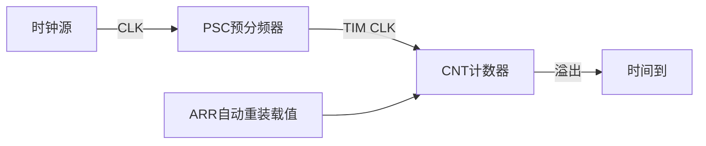

# 定时器概述
## 软件定时器
比如51单片机，主频是12MHz，一个机器周期就是1us
通常会这样使用软件定时
```c
for()
{
	__nop();
}
```
这个`__nop()`是一个机器周期，执行一次就是1us，所以想要延迟n us就执行n次
**软件定时**是使用纯软件（CPU死等）的方式实现定时（延时）功能
在STM32中可以这样实现延迟
```c
void delay_us(uint32_t us)
{
	us *= 72;
	while(us--);
}
```
但是这种软件定时是不精准的，首先是函数调用是有函数压栈、出栈的过程，这个过程是需要消耗时间的。其次STM32是ARM架构的，ARM有个东西叫流水线，这也会导致时间不确定。
缺点：
- 延迟不精准
- CPU死（就是延迟时整个进程都卡在延迟函数内）
## 定时器定时
使用精准的时基，通过硬件的方式，实现定时功能
定时器的核心就是计数器

预分频器就是做一个除法，把CLK的频率除以一个预分频系数，得到TIM CLK，也就是计数器工作的频率。计数器计数到一个数之后会溢出，会产生一个中断，然后ARR自动重装载值会重装到计数器内
## STM32定时器分类
- 常规定时器
	- 基本定时器
	- 通用定时器
	- 高级定时器
- 专用定时器
	- 独立看门狗
	- 窗口看门狗
	- 实时时钟
	- 低功耗定时器
- 内核定时器
	- SysTick定时器
## STM32基本、通用、高级定时器功能整体的区别

| 定时器类型 | 主要功能                                                    |
| ----- | ------------------------------------------------------- |
| 基本定时器 | 没有输入输出通道，常用作时基，即定时功能                                    |
| 通用定时器 | 具有多路独立通道，可用于输入捕获/输出比较，也可用作时基                            |
| 高级定时器 | 除具备通用定时器所有功能以外，还具备带死区控制的互补信号输出、刹车输入等功能（可用于电机控制、数字电源设计等） |
# 基本定时器
基本定时器的时钟源只能来自于内部时钟
计数器溢出时，产生一个中断，使得预装载寄存器的值加载到对应影子寄存器
## STM32定时器计数模式及溢出条件

| 计数器模式  | 溢出条件              |
| ------ | ----------------- |
| 递增计数模式 | CNT==ARR          |
| 递减计数模式 | CNT==0            |
| 中心对齐模式 | CNT==ARR-1,CNT==1 |
# 通用定时器
STM32F1中的通用定时器有TIM2，TIM3，TIM4，TIM5
## 主要特性
16位递增、递减、中心对齐计数器（计数值：0~65535）
16位预分频器（分频系数：1~65536）
可用于触发DAC、ADC
在更新时间、触发事件、输入捕获、输出比较时，会产生中断/DMA请求
4个独立通道，可用于：输入捕获、输出比较、输出PWM、单脉冲模式
使用外部信号控制定时器且可实现多个定时器互连的同步电路
支持编码器和霍尔传感器电路等
>这里DAC和ADC简单介绍一下：
>现实模拟信号 ──ADC──> STM32能处理的数字
>STM32数字数据 ──DAC──> 现实模拟电压

## 通用定时器的时钟源
通用定时器的时钟源主要有4类
第一类是APB上的时钟源，即内部时钟
第二类是ITR0、ITR1、ITR2、ITR3
这四个称为内部触发输入，ITR是` Internal Trigger`的缩写
第三类来自于`TIMx_ETR`，也就是来自于IO口。这个也称为**外部时钟模式2**
第四类是外部时钟模式1就是`TIxFPy`,`TIxFPy`,`TI1F_ED`，来自于通道1和通道2，但是不能来自于通道3和通道4

---
对于通道，要避免一个误区，通道没有自己的PSC、自己的CNT
一个定时器只有唯一的PSC、CNT和ARR，而这个定时器下面的四个通道共用这个定时器的PSC、CNT和ARR
就比如说一个72MHz的芯片内部的TIM3
```Plain
72MHz
  ↓
TIM3唯一的PSC
  ↓
TIM3唯一的CNT
  ├── CH1与CCR1比较
  ├── CH2与CCR2比较
  ├── CH3与CCR3比较
  └── CH4与CCR4比较
```
在PWM输出模式下，不同的通道可以用来生成不同占空比的信号
# CubeMX中的时钟源选择

这里的这个Internal Clock表示的是选择STM32芯片RCC/APB1内部时钟，然后通过PSC分频、CNT计数
如果选择ETR2，表示使用外部时钟模式2，注意这里的2不是“外部时钟通道2”，而是外部时钟模式2外部脉冲通过TIM2_ETR引脚然后经过滤波、极性选择、预分频等，再经过TIM2的PSC分频、TIM2的CNT计数
注意：板载8 MHz石英晶振不能直接理解为从 TIM2_ETR 输入。
你板上的8 MHz晶振连接的是：
```
OSC_IN / OSC_OUT
```
它属于 RCC 的 HSE 时钟源，经过 RCC、PLL 和 APB1 后，最终成为 TIM2 的 `Internal Clock`。
如果选择Disable，表示：不在 CubeMX 中为这个定时器配置计数时钟源。它不是关闭整个 STM32 系统时钟，也不是关闭整个定时器外设，只是这里不主动配置定时器的计数时钟来源。