# 嵌入式智能硬件开发—Cortex-M开发

> **第 02 讲｜GPIO**  
> 从“引脚为什么能输入和输出”出发，依次认识 GPIO 电气特性、内部结构、8 种工作模式、关键寄存器，并完成按键控制 LED 的寄存器与 HAL 库开发。

## 目录

1. [认识 GPIO](#1-认识-gpio)
2. [GPIO 的电气特性](#2-gpio-的电气特性)
3. [GPIO 的内部结构](#3-gpio-的内部结构)
4. [GPIO 的 8 种工作模式](#4-gpio-的-8-种工作模式)
5. [GPIO 寄存器](#5-gpio-寄存器)
6. [按键控制 LED 实例](#6-按键控制-led-实例)
7. [总结](#7-总结)

---

## 1 认识 GPIO

### 1.1 GPIO 基本概念

GPIO 是 **General-Purpose Input/Output** 的缩写，即通用输入输出接口。

它是微控制器最基础的外设之一。学习 GPIO，首先要解决两个问题：GPIO 能做什么，以及程序中的高、低电平如何传递到真实引脚。

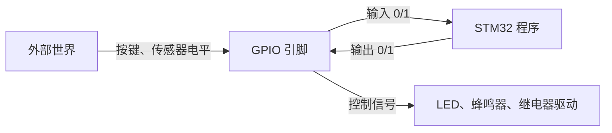

> GPIO 是 STM32 与外部电路之间最基本的数字信号通道：  
> **输入时，STM32 读取外部电平；输出时，STM32 控制外部电平。**

| 工作方向 | 信号流向 | STM32 的动作 | 常见设备 |
|---|---|---|---|
| 输入 | 外部设备 → STM32 | 读取高、低电平 | 按键、数字传感器、限位开关 |
| 输出 | STM32 → 外部设备 | 输出高、低电平 | LED、蜂鸣器、继电器驱动 |
| 复用功能 | 片上外设 ↔ 引脚 | 传输外设信号 | USART、SPI、I²C、定时器 |
| 模拟功能 | 模拟信号 → 片上外设 | 关闭数字输入输出通道 | ADC、DAC |

### 1.2 端口与引脚

STM32 将 GPIO 引脚按端口分组，端口通常以字母命名：

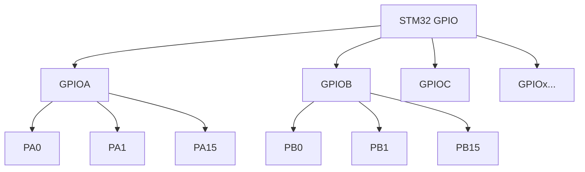

- **GPIOA** 表示 A 端口。
- **PA0** 表示 A 端口的第 0 号引脚。
- 每个完整 GPIO 端口最多包含 16 个引脚，编号为 0～15。
- 不同封装引出的端口和引脚数量不同，具体以芯片数据手册为准。

> `PA0`、`PB0` 中的字母表示端口，数字表示端口内的引脚编号。

### 1.3 GPIO 的主要能力

| 能力      | 说明                              | 使用时关注什么          |
| ------- | ------------------------------- | ---------------- |
| 独立配置    | 每个引脚可以单独设置工作模式                  | 不要误改同一端口的其他引脚    |
| 可配置输出速度 | STM32F1 可选择 2 MHz、10 MHz、50 MHz | 速度越高不一定越好        |
| 内部上拉/下拉 | 可为输入引脚提供默认电平                    | 外部信号悬空时尤其重要      |
| 外设复用    | 引脚可以连接 USART、SPI、定时器等外设         | 查引脚定义和重映射配置      |
| 外部中断    | GPIO 可作为 EXTI 触发源               | 同编号 EXTI 线存在映射关系 |
| 原子置位/复位 | 通过 BSRR 单次写操作改变引脚               | 避免读—改—写冲突        |

#### 1.3.1 输出速度

STM32F1 的“GPIO 输出速度”主要描述输出驱动电路的翻转能力，并不等于程序自动以该频率输出方波。

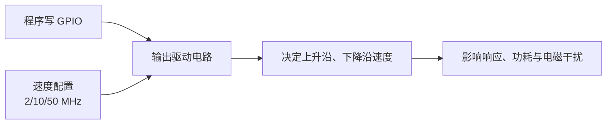

| 速度选择   | 适用场景         | 特点                |
| ------ | ------------ | ----------------- |
| 2 MHz  | LED、继电器、低速控制 | 功耗和干扰相对较小         |
| 10 MHz | 一般数字控制       | 速度与信号质量折中         |
| 50 MHz | 高速翻转信号       | 边沿快，但功耗和 EMI 风险更高 |

> 选择原则：**满足信号速度要求即可，不要盲目选择最高速度。**

---

## 2 GPIO 的电气特性

### 2.1 输入电平判定

数字输入并不是“高于 0 V 就是 1”，而是通过输入阈值判断。

因此，数字电路中的“0”和“1”不是两个绝对的电压点，而是两个能够被芯片可靠识别的电压范围。两个范围之间还存在一个应当避免使用的不确定区域。

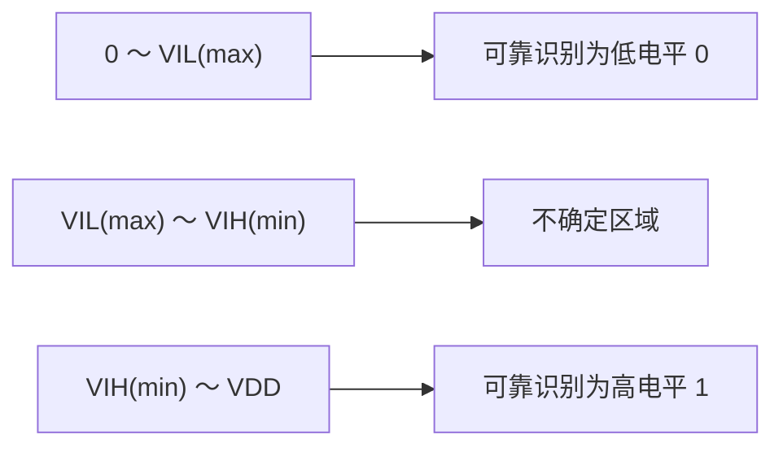

| 输入区域 | 芯片判断 | 设计要求 |
|---|---|---|
| 低于低电平最大阈值 | 可靠的逻辑 0 | 保留噪声裕量 |
| 位于两个阈值之间 | 结果不确定 | 应避免长期停留 |
| 高于高电平最小阈值 | 可靠的逻辑 1 | 不得超过允许电压 |

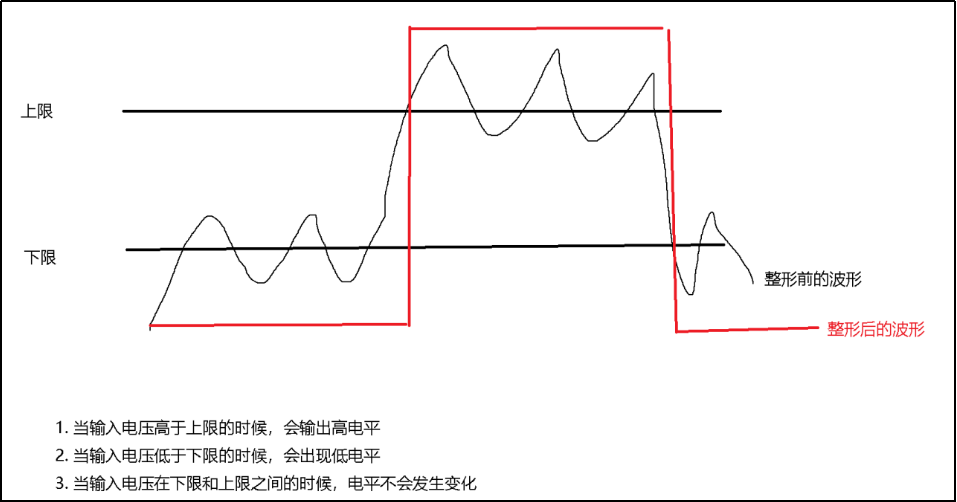

> 具体阈值随芯片型号、供电电压和引脚类型变化，最终必须查阅对应数据手册。

### 2.2 5 V 容限

STM32 通常工作在 3.3 V，但不能由此推断所有引脚都能承受 5 V。

判断一个 3.3 V GPIO 能否连接 5 V 信号，不能只看芯片供电电压，还要检查具体引脚是否具有 5 V 容忍能力，以及当前工作模式是否满足数据手册的限制条件。

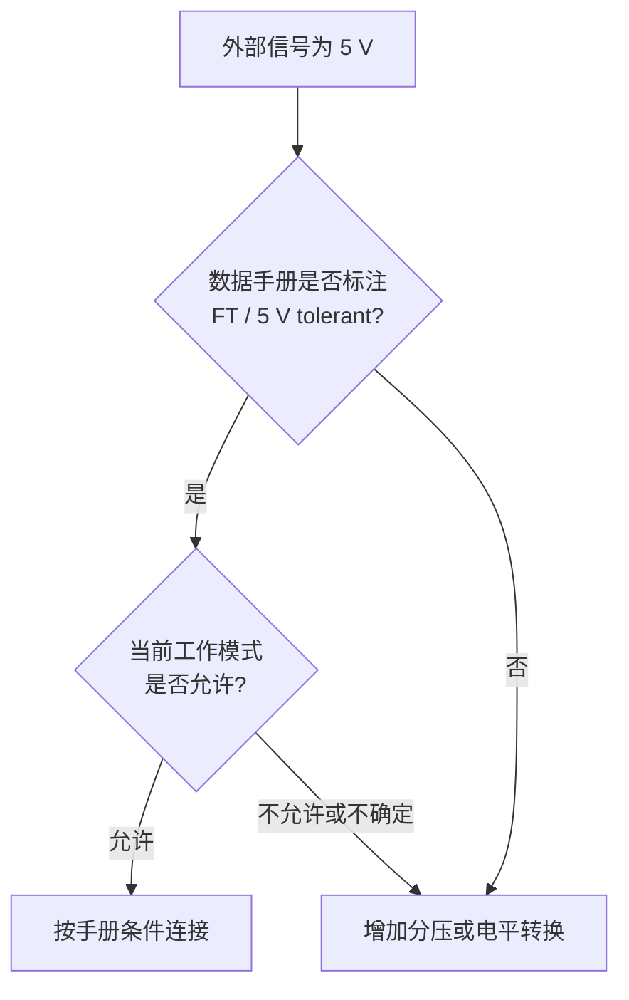

- 只有数据手册明确标注为 **5 V tolerant** 的引脚，才可能直接接收 5 V 数字信号。
- 某些引脚在模拟模式或特定功能下不具备 5 V 容忍能力。
- 输出引脚不会因为“可容忍 5 V 输入”就能输出 5 V。
- 不确定时，应使用分压、电平转换器或隔离器件。

> **“部分引脚兼容 5 V”不等于“所有 GPIO 都可以随意接 5 V”。**

### 2.3 输出驱动能力

GPIO 适合输出控制信号，不适合作为大功率电源。

判断能否直接驱动某个器件，不能只比较单个引脚的电流，还要同时考虑单引脚限制、端口累计电流、芯片总电流、输出压降以及负载启动电流。

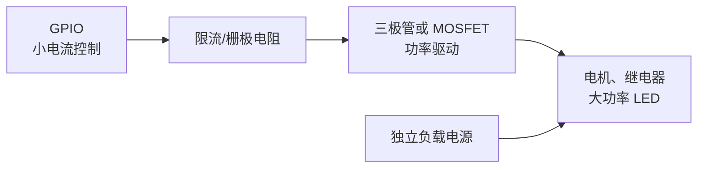

| 负载 | 能否直接驱动 | 建议 |
|---|---|---|
| 小电流指示 LED | 通常可以 | 必须串联限流电阻 |
| 有源蜂鸣器 | 取决于工作电流 | 电流较大时增加三极管 |
| 继电器线圈 | 不可以 | 使用驱动管和续流二极管 |
| 直流电机 | 不可以 | 使用电机驱动器 |
| 大功率 LED | 不可以 | 使用恒流驱动电路 |

> 引脚最大电流、单端口总电流和芯片总电流都有约束，数值必须以对应型号的数据手册为准。最大额定值不是推荐的长期工作值。

### 2.4 悬空与上下拉

悬空输入没有确定的电压来源，容易受到人体、导线和电磁环境干扰。

上拉和下拉电阻的作用不是增强驱动能力，而是在外部设备没有输出信号时，为输入引脚建立一个确定的默认状态。

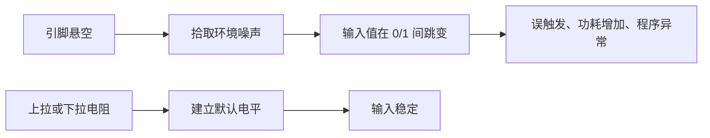

---

## 3 GPIO 的内部结构

### 3.1 内部结构总览

GPIO 引脚内部并不是一根导线，而是由输入通道、输出通道、复用选择和保护电路共同组成。

理解 GPIO 内部结构，需要沿着两条信号路径观察：外部电平如何进入输入寄存器，以及输出寄存器中的数据如何经过驱动电路到达物理引脚。

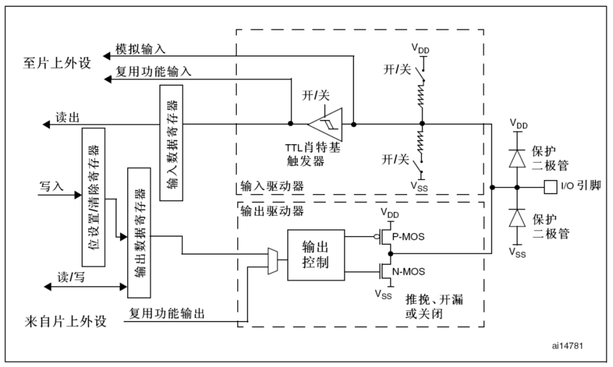


| 内部模块 | 主要作用 |
|---|---|
| 保护二极管 | 限制异常电压，提供基础保护 |
| 上拉/下拉电阻 | 为输入引脚建立默认电平 |
| 施密特触发器 | 将有噪声的电压转换为稳定数字电平 |
| 输入数据寄存器 IDR | 保存当前引脚采样结果 |
| 输出数据寄存器 ODR | 保存软件希望输出的逻辑值 |
| 输出驱动器 | 以推挽或开漏方式驱动物理引脚 |
| 复用功能选择 | 在 GPIO 与片上外设信号之间切换 |

### 3.2 输入通道

输入通道解决的问题是：外部引脚上的连续电压，怎样变成程序能够读取的数字量 `0` 或 `1`。


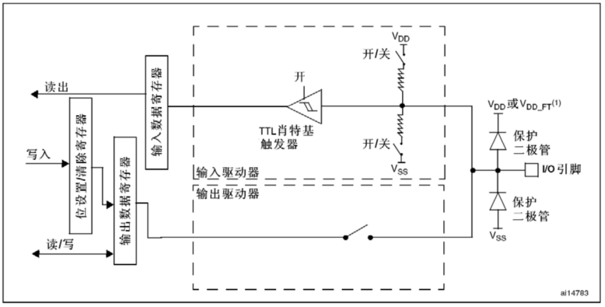

> `GPIOx_IDR` 反映的是引脚当前实际电平。即使引脚配置为输出，也可以读取 IDR 来观察物理引脚上的电平。

### 3.3 输出通道

输出通道解决的问题是：CPU 写入寄存器的数据，怎样经过锁存器和输出驱动器，最终改变物理引脚的电平。

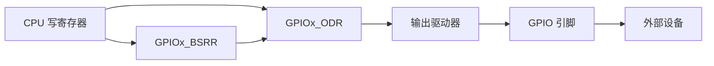

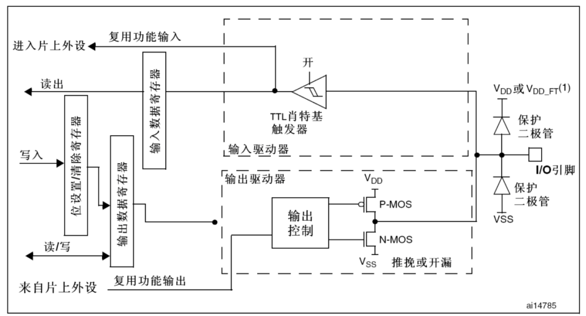

> 写 ODR 或 BSRR 改变的是输出锁存值；物理引脚是否真正达到预期电平，还受到工作模式、外部电路和负载能力的影响。

### 3.4 普通与复用功能

GPIO 引脚既可以由软件直接控制，也可以交给 USART、SPI、I²C、定时器等片上外设控制。两种使用方式对应普通功能和复用功能。

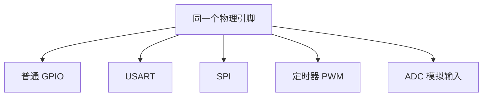

同一引脚可以承担多个功能，但同一时刻只能按配置使用其中一种。

| 使用目的 | 引脚配置方向 |
|---|---|
| 软件控制 LED | 通用输出 |
| 软件读取按键 | 通用输入 |
| USART 发送 | 复用推挽输出 |
| I²C 时钟/数据 | 复用开漏输出 |
| ADC 采样 | 模拟输入 |

> STM32F1 主要通过 **AFIO 和重映射配置**改变部分外设的引脚位置；较新的 STM32 系列通常使用 GPIO 的 `AFR` 寄存器选择复用功能。两者不要混淆。

---

## 4 GPIO 的 8 种工作模式

### 4.1 模式分类

STM32F1 的 8 种 GPIO 模式看似较多，但可以先按输入和输出分成两组，再根据是否需要上下拉、模拟通道、复用功能和开漏结构继续判断。

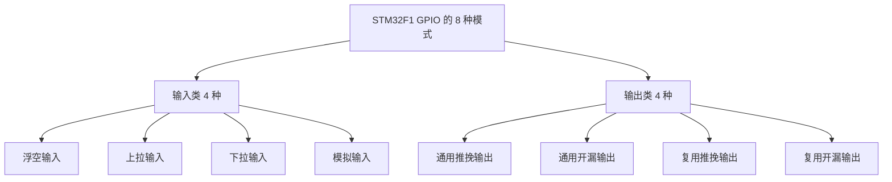

| 判断维度 | 问题 |
|---|---|
| 输入还是输出？ | 信号主要流入还是流出 MCU？ |
| 普通还是复用？ | 信号由软件 GPIO 控制，还是由片上外设控制？ |
| 推挽还是开漏？ | 输出能否主动拉高？是否需要多设备共线？ |
| 数字还是模拟？ | 是否需要经过数字输入电路？ |

### 4.2 四种输入模式

#### 4.2.1 浮空输入

引脚电平完全由外部电路决定，内部不提供上拉或下拉。

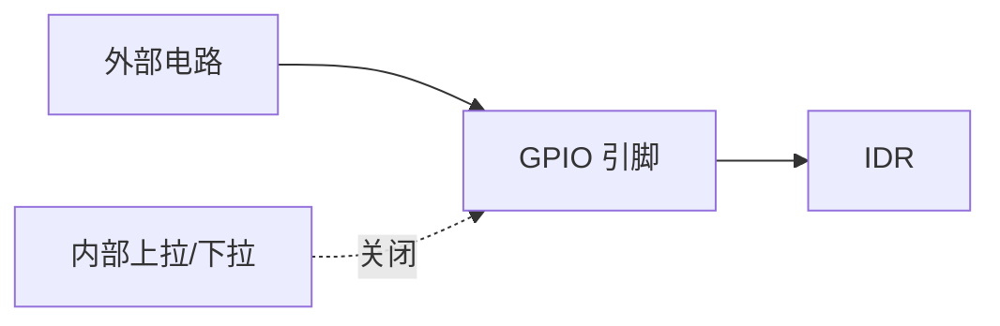

| 优点 | 风险 | 适用场景 |
|---|---|---|
| 不干扰外部信号 | 外部断开时容易悬空 | 外部已有明确上下拉或推挽驱动 |

#### 4.2.2 上拉输入

内部弱上拉电阻使引脚在外部未驱动时默认为高电平。

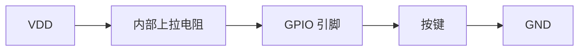

- 按键松开：读取高电平 `1`。
- 按键按下：引脚接地，读取低电平 `0`。
- 常用于低电平有效按键。

#### 4.2.3 下拉输入

内部弱下拉电阻使引脚在外部未驱动时默认为低电平。

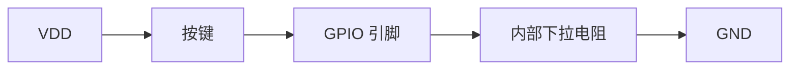

- 按键松开：读取低电平 `0`。
- 按键按下：引脚接入 VDD，读取高电平 `1`。

#### 4.2.4 模拟输入

模拟输入模式关闭数字输入缓冲和数字输出通道，使信号进入 ADC 等模拟外设。

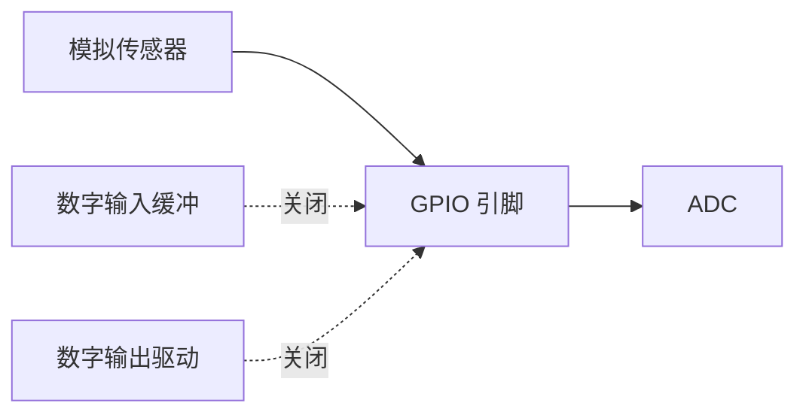

> 未使用的模拟引脚或 ADC 输入应按芯片手册和低功耗要求配置，不能简单套用所有场景。

### 4.3 四种输出模式

#### 4.3.1 通用推挽输出

推挽输出包含上、下两个受控开关，能够主动输出高电平和低电平。

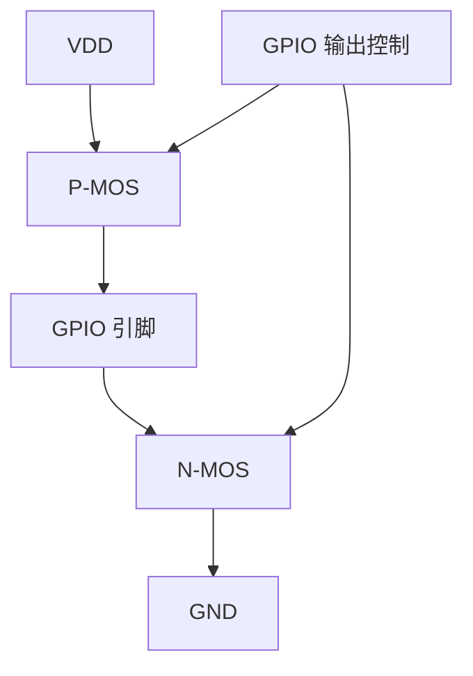

| 输出值 | P-MOS | N-MOS | 引脚状态 |
|---|---|---|---|
| 1 | 导通 | 关闭 | 主动输出高电平 |
| 0 | 关闭 | 导通 | 主动输出低电平 |

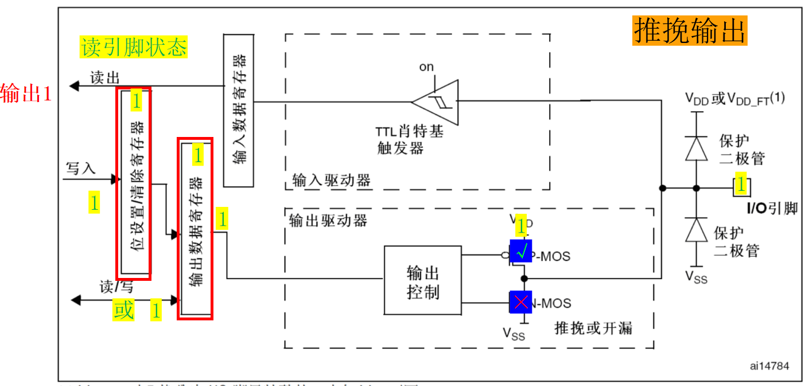

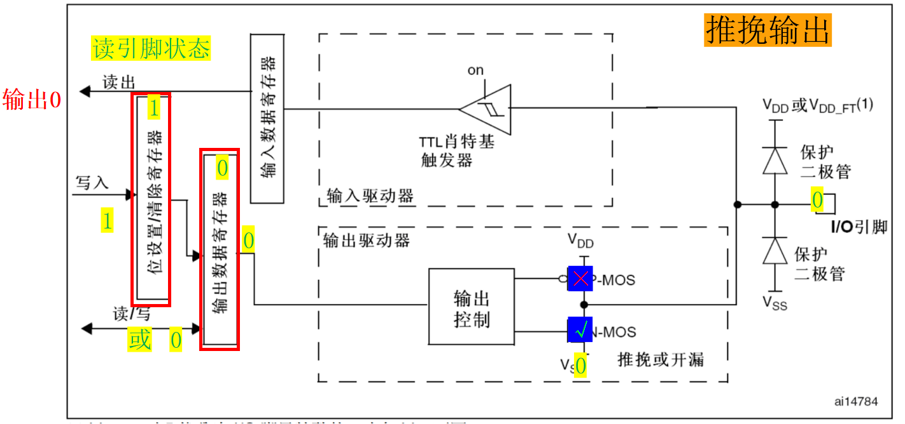

**特点：**

- 高、低电平均有主动驱动能力。
- 翻转速度快，适合 LED、片选、普通控制信号。
- 不适合多个推挽输出直接并联，否则可能发生电源到地的低阻通路。

#### 4.3.2 通用开漏输出

开漏输出只有下拉开关，能够主动拉低，但不能主动拉高。

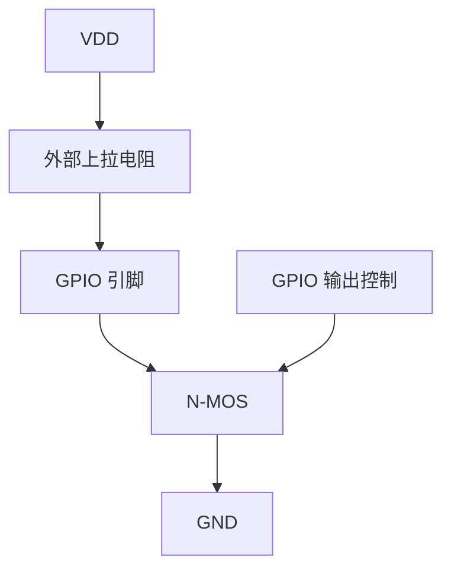

| 输出数据 | N-MOS | 引脚状态 |
|---|---|---|
| 0 | 导通 | 主动拉低 |
| 1 | 关闭 | 高阻态，由上拉电阻拉高 |

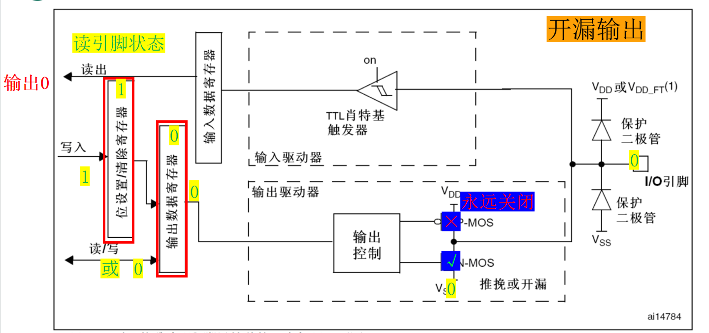

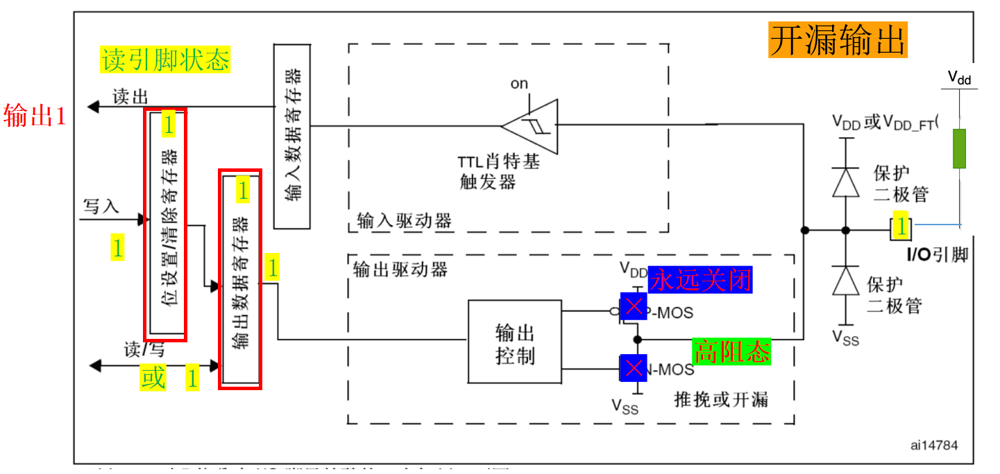

**为什么开漏适合多设备共线？**

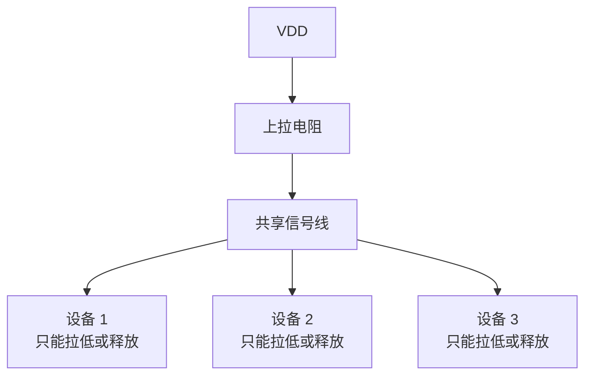

- 所有设备都释放时，总线为高电平。
- 任一设备拉低时，总线为低电平。
- 不会出现一个设备主动拉高、另一个设备主动拉低的直接冲突。
- I²C 总线就是典型的开漏应用。

#### 4.3.3 复用推挽输出

输出驱动结构仍然是推挽，但控制信号来自片上外设，而不是普通 GPIO 输出寄存器。

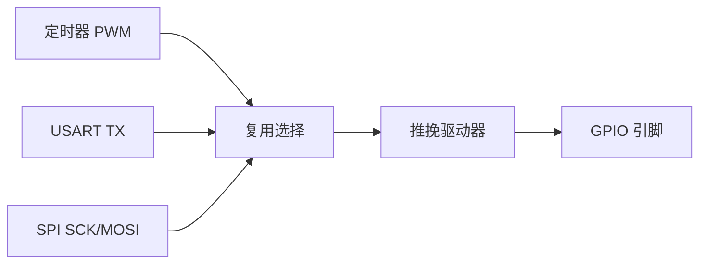

典型应用：USART TX、SPI 时钟、PWM 输出。

#### 4.3.4 复用开漏输出

控制信号来自片上外设，输出级采用开漏结构。

```mermaid
flowchart LR
    I2C[I²C 外设] --> MUX[复用选择]
    MUX --> OD[开漏驱动器]
    OD --> PIN[SCL / SDA]
    PULLUP[外部上拉] --> PIN
```

典型应用：I²C 的 SCL 和 SDA。

### 4.4 模式选择

实际开发时不需要孤立记忆 8 个名称。可以从信号方向、信号来源、输出结构和电气要求四个方面逐步选择。

| 需求 | 推荐模式 | 典型例子 |
|---|---|---|
| 读取外部已有明确驱动的数字信号 | 浮空输入 | 模块的数字输出 |
| 按键按下接地 | 上拉输入 | 低电平有效按键 |
| 按键按下接 VDD | 下拉输入 | 高电平有效按键 |
| 采集连续电压 | 模拟输入 | 电位器、模拟传感器 |
| 软件直接输出高低电平 | 通用推挽输出 | LED、普通控制线 |
| 软件输出且需要线与/电平转换 | 通用开漏输出 | 多设备共享信号 |
| 外设输出高速数字信号 | 复用推挽输出 | USART TX、SPI、PWM |
| 外设需要开漏总线 | 复用开漏输出 | I²C |

> 模式选择口诀：  
> **先看方向，再看普通或复用；输出再分推挽或开漏；模拟信号使用模拟模式。**

---

## 5 GPIO 寄存器

### 5.1 寄存器的作用

```mermaid
flowchart LR
    REQUIRE[我要让 PB0 输出低电平] --> MODE[CRL/CRH<br/>决定工作模式]
    MODE --> DATA[ODR/BSRR/BRR<br/>决定输出数据]
    DATA --> DRIVER[输出驱动器]
    DRIVER --> PIN[PB0 引脚]
    PIN --> LED[LED 状态变化]
```

学习寄存器的目的不是死记地址，而是理解：

- GPIO 模式配置保存在哪里。
- 输入数据从哪里读取。
- 输出数据写到哪里。
- HAL 函数最终如何控制这些寄存器。

### 5.2 寄存器总览

STM32F1 使用 7 个主要寄存器完成模式配置、数据输入、数据输出、原子置位/复位和配置锁定。可以按功能将它们分为四组。

| 寄存器 | 位宽 | 作用 | 操作方向 |
|---|---:|---|---|
| `GPIOx_CRL` | 32 位 | 配置 Pin 0～7 的模式和速度 | 读/写 |
| `GPIOx_CRH` | 32 位 | 配置 Pin 8～15 的模式和速度 | 读/写 |
| `GPIOx_IDR` | 32 位 | 读取引脚当前实际电平 | 只读为主 |
| `GPIOx_ODR` | 32 位 | 保存输出锁存值 | 读/写 |
| `GPIOx_BSRR` | 32 位 | 原子置位或复位输出位 | 只写 |
| `GPIOx_BRR` | 16 位 | 原子复位输出位 | 只写 |
| `GPIOx_LCKR` | 32 位 | 锁定引脚配置 | 读/写 |

```mermaid
flowchart TD
    CONFIG[配置寄存器] --> CRL[CRL<br/>Pin 0～7]
    CONFIG --> CRH[CRH<br/>Pin 8～15]
    DATA[数据寄存器] --> IDR[IDR<br/>读实际电平]
    DATA --> ODR[ODR<br/>输出锁存值]
    ATOMIC[原子操作] --> BSRR[BSRR<br/>置位/复位]
    ATOMIC --> BRR[BRR<br/>复位]
    PROTECT[配置保护] --> LCKR[LCKR<br/>锁定配置]
```

### 5.3 配置寄存器 CRL/CRH

STM32F1 中，每个引脚使用 `MODE[1:0]` 和 `CNF[1:0]` 共 4 位进行配置。

CRL 负责端口的低 8 个引脚，CRH 负责端口的高 8 个引脚。定位某个引脚的配置位时，需要先确定使用哪个寄存器，再计算它在寄存器中的 4 位位置。

```text
CRL： Pin7    Pin6    Pin5    Pin4    Pin3    Pin2    Pin1    Pin0
      [4 bit] [4 bit] [4 bit] [4 bit] [4 bit] [4 bit] [4 bit] [4 bit]

CRH： Pin15   Pin14   Pin13   Pin12   Pin11   Pin10   Pin9    Pin8
      [4 bit] [4 bit] [4 bit] [4 bit] [4 bit] [4 bit] [4 bit] [4 bit]
```

#### 5.3.1 MODE 位

MODE 位首先决定引脚是输入还是输出；当引脚为输出时，它还决定输出速度等级。

| MODE[1:0] | 含义 |
|---|---|
| `00` | 输入模式 |
| `01` | 输出模式，最大速度 10 MHz |
| `10` | 输出模式，最大速度 2 MHz |
| `11` | 输出模式，最大速度 50 MHz |

#### 5.3.2 CNF 位

CNF 位必须结合 MODE 位解释：输入模式下，它选择模拟、浮空或上下拉；输出模式下，它选择推挽、开漏以及普通或复用功能。

输入模式下：

| CNF[1:0] | 模式 |
|---|---|
| `00` | 模拟输入 |
| `01` | 浮空输入 |
| `10` | 上拉/下拉输入 |
| `11` | 保留 |

输出模式下：

| CNF[1:0] | 模式 |
|---|---|
| `00` | 通用推挽输出 |
| `01` | 通用开漏输出 |
| `10` | 复用推挽输出 |
| `11` | 复用开漏输出 |

> 上拉输入和下拉输入在 CRL/CRH 中使用相同配置，再通过对应 ODR 位选择上拉还是下拉。

### 5.4 数据寄存器 IDR/ODR

IDR 和 ODR 都与引脚数据有关，但观察角度不同：IDR 面向物理引脚的实际状态，ODR 面向输出电路保存的目标状态。

```mermaid
flowchart LR
    PIN[引脚实际电平] --> IDR[IDR]
    CPU[CPU 写数据] --> ODR[ODR]
    ODR --> DRIVER[输出驱动器]
    DRIVER --> PIN
```

| 寄存器 | 回答的问题 |
|---|---|
| IDR | “引脚现在实际是什么电平？” |
| ODR | “程序最后要求输出什么电平？” |

外部短路、负载过重或开漏未上拉时，IDR 与 ODR 的含义可能不同，因此不能混为一谈。

### 5.5 原子操作 BSRR

BSRR 用一次写操作完成指定引脚的置位或复位，不需要先读取整个端口，因此特别适合主程序和中断都可能操作 GPIO 的场景。

直接修改 ODR 的某一位，通常需要“读—改—写”：

```c
GPIOB->ODR |= (1U << 0);
```

如果主程序与中断同时修改 ODR 的不同位，可能产生竞争。BSRR 只需一次写操作：

```c
GPIOB->BSRR = (1U << 0);          // PB0 置 1
GPIOB->BSRR = (1U << (0 + 16U));  // PB0 清 0
```

```text
GPIOx_BSRR
31                       16 15                         0
+--------------------------+---------------------------+
| 写 1：复位对应 ODR 位    | 写 1：置位对应 ODR 位     |
| 写 0：不产生影响         | 写 0：不产生影响          |
+--------------------------+---------------------------+
```

| 操作 | 写入 BSRR |
|---|---|
| Px0 输出高电平 | `1U << 0` |
| Px0 输出低电平 | `1U << 16` |
| Px5 输出高电平 | `1U << 5` |
| Px5 输出低电平 | `1U << 21` |

> BSRR 的优势：**单次写入、原子操作、不影响端口其他引脚。**

### 5.6 复位与锁定寄存器

BRR 用于复位输出位，LCKR 用于保护已经完成的引脚配置。它们分别解决“怎样安全输出低电平”和“怎样防止配置被意外修改”两个问题。

| 寄存器 | 用途 | 教学重点 |
|---|---|---|
| BRR | 将对应输出位复位为 0 | 功能相当于 BSRR 高 16 位的复位操作 |
| LCKR | 锁定 CRL/CRH 中的引脚配置 | 锁定后需复位芯片才能解除 |

LCKR 需要按芯片手册规定的写、读序列完成锁定。普通入门项目较少使用，但安全关键引脚可用它防止运行时被意外改写。

---

## 6 按键控制 LED 实例

### 6.1 硬件分析

假设本节使用：

- LED：连接 `PB0`，低电平点亮。
- 按键：连接 `PA0`，按下接地，使用上拉输入。

```mermaid
flowchart LR
    VDD1[VDD] --> RLED[限流电阻]
    RLED --> LED[LED]
    LED --> PB0[PB0<br/>输出低：点亮]
    VDD2[VDD] --> PULL[内部上拉]
    PULL --> PA0[PA0<br/>输入]
    PA0 --> KEY[按键]
    KEY --> GND[GND]
```

| 状态 | PA0 读取值 | PB0 输出值 | LED |
|---|---:|---:|---|
| 按键松开 | 1 | 1 | 熄灭 |
| 按键按下 | 0 | 0 | 点亮 |

程序中的端口号和有效电平都来自硬件连接。只有先确定 LED 的连接方向、限流电阻位置、按键接地或接电源的方式，才能选择正确的输入输出模式。

> 在实际开发板上，LED 和按键可能连接到其他引脚，也可能采用相反有效电平。必须先看原理图。

### 6.2 通用开发流程

```mermaid
flowchart LR
    SCH[1 看原理图<br/>确认端口和有效电平] --> CLK[2 开启 GPIO 时钟]
    CLK --> CONFIG[3 配置输入和输出模式]
    CONFIG --> READ[4 读取按键]
    READ --> LOGIC[5 判断与消抖]
    LOGIC --> WRITE[6 控制 LED]
    WRITE --> TEST[7 下载、观察、调试]
```

### 6.3 寄存器版本

#### 6.3.1 配置思路

| 引脚 | 需要的配置 |
|---|---|
| PA0 按键 | 上拉输入 |
| PB0 LED | 2 MHz 通用推挽输出 |

```c
#include "stm32f10x.h"

static void GPIO_KeyLed_Init(void)
{
    /* 1. 开启 GPIOA、GPIOB 的 APB2 时钟 */
    RCC->APB2ENR |= RCC_APB2ENR_IOPAEN |
                    RCC_APB2ENR_IOPBEN;

    /* 2. PA0：上拉/下拉输入，MODE=00，CNF=10 */
    GPIOA->CRL &= ~(0xFU << 0);
    GPIOA->CRL |=  (0x8U << 0);

    /* ODR0=1，选择内部上拉 */
    GPIOA->BSRR = (1U << 0);

    /* 3. PB0：2 MHz 通用推挽输出，MODE=10，CNF=00 */
    GPIOB->CRL &= ~(0xFU << 0);
    GPIOB->CRL |=  (0x2U << 0);

    /* LED 初始熄灭：低有效 LED 的 PB0 输出高电平 */
    GPIOB->BSRR = (1U << 0);
}
```

#### 6.3.2 输入与输出控制

主循环先从 IDR 读取按键状态，再根据有效电平向 BSRR 写入置位或复位命令，从而控制 LED。

```c
int main(void)
{
    GPIO_KeyLed_Init();

    while (1)
    {
        if ((GPIOA->IDR & (1U << 0)) == 0U)
        {
            /* 按键按下，PB0 输出低电平，LED 点亮 */
            GPIOB->BSRR = (1U << 16);
        }
        else
        {
            /* 按键松开，PB0 输出高电平，LED 熄灭 */
            GPIOB->BSRR = (1U << 0);
        }
    }
}
```

#### 6.3.3 软硬件控制路径

一条 C 语句能够影响 LED，是因为代码、总线、寄存器、GPIO 输出驱动器和外部电路形成了一条完整的控制链。

```mermaid
flowchart LR
    CODE[执行 GPIOA->IDR] --> BUS1[通过总线读取]
    BUS1 --> IDR[GPIOA_IDR]
    IDR --> KEY[获得 PA0 按键电平]
    KEY --> IF[程序判断]
    IF --> BSRR[写 GPIOB_BSRR]
    BSRR --> ODR[改变 PB0 输出锁存]
    ODR --> DRIVER[输出驱动器]
    DRIVER --> LED[LED 亮或灭]
```

### 6.4 HAL 库版本

#### 6.4.1 GPIO 初始化

```c
#include "stm32f1xx_hal.h"

static void MX_GPIO_Init(void)
{
    GPIO_InitTypeDef GPIO_InitStruct = {0};

    /* 1. 开启端口时钟 */
    __HAL_RCC_GPIOA_CLK_ENABLE();
    __HAL_RCC_GPIOB_CLK_ENABLE();

    /* 2. 设置 LED 初始状态：PB0 输出高，LED 熄灭 */
    HAL_GPIO_WritePin(GPIOB, GPIO_PIN_0, GPIO_PIN_SET);

    /* 3. PB0：推挽输出 */
    GPIO_InitStruct.Pin = GPIO_PIN_0;
    GPIO_InitStruct.Mode = GPIO_MODE_OUTPUT_PP;
    GPIO_InitStruct.Pull = GPIO_NOPULL;
    GPIO_InitStruct.Speed = GPIO_SPEED_FREQ_LOW;
    HAL_GPIO_Init(GPIOB, &GPIO_InitStruct);

    /* 4. PA0：上拉输入 */
    GPIO_InitStruct.Pin = GPIO_PIN_0;
    GPIO_InitStruct.Mode = GPIO_MODE_INPUT;
    GPIO_InitStruct.Pull = GPIO_PULLUP;
    HAL_GPIO_Init(GPIOA, &GPIO_InitStruct);
}
```

#### 6.4.2 主循环

```c
int main(void)
{
    HAL_Init();
    SystemClock_Config();
    MX_GPIO_Init();

    while (1)
    {
        if (HAL_GPIO_ReadPin(GPIOA, GPIO_PIN_0) == GPIO_PIN_RESET)
        {
            HAL_GPIO_WritePin(GPIOB, GPIO_PIN_0, GPIO_PIN_RESET);
        }
        else
        {
            HAL_GPIO_WritePin(GPIOB, GPIO_PIN_0, GPIO_PIN_SET);
        }
    }
}
```

### 6.5 HAL 常用函数

HAL 将 GPIO 的配置、读取、写入、翻转和锁定操作封装成统一接口。学习这些函数时，应同时建立它们与底层寄存器之间的对应关系。

| 函数 | 作用 | 返回值 |
|---|---|---|
| `HAL_GPIO_Init(GPIOx, &init)` | 配置引脚模式、上下拉和速度 | `void` |
| `HAL_GPIO_DeInit(GPIOx, pin)` | 将指定引脚恢复到复位状态 | `void` |
| `HAL_GPIO_ReadPin(GPIOx, pin)` | 读取单个引脚电平 | `GPIO_PIN_SET/RESET` |
| `HAL_GPIO_WritePin(GPIOx, pin, state)` | 设置一个或多个引脚电平 | `void` |
| `HAL_GPIO_TogglePin(GPIOx, pin)` | 反转一个或多个引脚输出 | `void` |
| `HAL_GPIO_LockPin(GPIOx, pin)` | 锁定引脚配置 | `HAL_StatusTypeDef` |

#### 6.5.1 `HAL_GPIO_Init`

```c
void HAL_GPIO_Init(GPIO_TypeDef *GPIOx,
                   GPIO_InitTypeDef *GPIO_Init);
```

| 参数 | 含义 |
|---|---|
| `GPIOx` | 目标端口，如 `GPIOA`、`GPIOB` |
| `GPIO_Init` | 指向 GPIO 配置结构体 |

`GPIO_InitTypeDef` 的关键成员：

| 成员 | 作用 | 示例 |
|---|---|---|
| `Pin` | 选择引脚，可用位或连接多个引脚 | `GPIO_PIN_0 \| GPIO_PIN_1` |
| `Mode` | 输入、输出、复用、模拟或中断模式 | `GPIO_MODE_OUTPUT_PP` |
| `Pull` | 无上下拉、上拉或下拉 | `GPIO_PULLUP` |
| `Speed` | 输出速度 | `GPIO_SPEED_FREQ_LOW` |

#### 6.5.2 `HAL_GPIO_ReadPin`

```c
GPIO_PinState HAL_GPIO_ReadPin(GPIO_TypeDef *GPIOx,
                              uint16_t GPIO_Pin);
```

```c
GPIO_PinState key_state;
key_state = HAL_GPIO_ReadPin(GPIOA, GPIO_PIN_0);
```

> `HAL_GPIO_ReadPin()` 返回的是引脚状态枚举，不是函数执行成功或失败。

#### 6.5.3 `HAL_GPIO_WritePin`

```c
void HAL_GPIO_WritePin(GPIO_TypeDef *GPIOx,
                       uint16_t GPIO_Pin,
                       GPIO_PinState PinState);
```

```c
HAL_GPIO_WritePin(GPIOB, GPIO_PIN_0, GPIO_PIN_SET);
HAL_GPIO_WritePin(GPIOB, GPIO_PIN_0, GPIO_PIN_RESET);
```

HAL 内部通常使用 BSRR 完成置位和复位，因此不会影响同一端口的其他引脚。

#### 6.5.4 `HAL_GPIO_TogglePin`

```c
void HAL_GPIO_TogglePin(GPIO_TypeDef *GPIOx,
                        uint16_t GPIO_Pin);
```

```c
HAL_GPIO_TogglePin(GPIOB, GPIO_PIN_0);
HAL_Delay(500);
```

适用于 LED 闪烁等周期性翻转场景。

#### 6.5.5 `HAL_GPIO_LockPin`

```c
HAL_StatusTypeDef HAL_GPIO_LockPin(GPIO_TypeDef *GPIOx,
                                   uint16_t GPIO_Pin);
```

锁定成功后返回 `HAL_OK`。锁定的配置在芯片复位前不能再次修改。

### 6.6 HAL 与寄存器

寄存器方式和 HAL 方式不是两套互不相关的硬件控制方法。HAL 函数内部仍然通过 GPIO 寄存器完成配置和数据操作。

```mermaid
flowchart LR
    APP[应用需求] --> HAL[HAL GPIO 函数]
    HAL --> REG[GPIO 寄存器]
    REG --> CIRCUIT[GPIO 内部电路]
    CIRCUIT --> PIN[物理引脚]
    PIN --> DEVICE[按键 / LED]
```

| HAL 操作 | 底层核心寄存器 |
|---|---|
| `HAL_GPIO_Init()` | CRL、CRH，必要时涉及 AFIO |
| `HAL_GPIO_ReadPin()` | IDR |
| `HAL_GPIO_WritePin()` | BSRR |
| `HAL_GPIO_TogglePin()` | ODR、BSRR |
| `HAL_GPIO_LockPin()` | LCKR |

> HAL 没有绕开寄存器。HAL 是把寄存器配置规则封装成更易读、更易维护的接口。

### 6.7 按键消抖

机械按键闭合和断开时，触点会在短时间内多次接触和分离。

如果程序直接把每次电平变化都视为一次有效按键事件，那么用户按下一次按键，程序可能执行多次操作。消抖的目的就是从一串快速变化中确认一次稳定的按下或释放。

```mermaid
flowchart LR
    PRESS[按下一次] --> BOUNCE[电平快速抖动<br/>1↔0↔1↔0]
    BOUNCE --> READ[程序多次检测]
    READ --> FALSE[误认为按下多次]
```

简单阻塞式消抖：

```c
if (HAL_GPIO_ReadPin(GPIOA, GPIO_PIN_0) == GPIO_PIN_RESET)
{
    HAL_Delay(20);

    if (HAL_GPIO_ReadPin(GPIOA, GPIO_PIN_0) == GPIO_PIN_RESET)
    {
        HAL_GPIO_TogglePin(GPIOB, GPIO_PIN_0);

        while (HAL_GPIO_ReadPin(GPIOA, GPIO_PIN_0) == GPIO_PIN_RESET)
        {
            /* 等待按键释放 */
        }
    }
}
```

| 方法 | 优点 | 局限 |
|---|---|---|
| 延时后再次确认 | 简单，适合入门 | 阻塞 CPU |
| 状态机消抖 | 不阻塞，适合多任务 | 程序结构稍复杂 |
| 定时器周期扫描 | 易统一管理多个按键 | 需要定时基准 |
| 硬件 RC/施密特电路 | 降低软件负担 | 增加器件和成本 |

### 6.8 故障排查

GPIO 问题应沿着“供电—原理图—时钟—模式—输入—输出”的顺序检查，这样比反复修改代码更容易定位故障。

```mermaid
flowchart TD
    START[LED 不受按键控制] --> POWER{板卡供电正常?}
    POWER -->|否| FIX1[检查电源和下载连接]
    POWER -->|是| PIN{引脚与有效电平正确?}
    PIN -->|否| FIX2[查看原理图]
    PIN -->|是| CLOCK{GPIO 时钟已开启?}
    CLOCK -->|否| FIX3[开启对应端口时钟]
    CLOCK -->|是| MODE{模式配置正确?}
    MODE -->|否| FIX4[检查输入上下拉和输出类型]
    MODE -->|是| READ{按键电平能变化?}
    READ -->|否| FIX5[检查接线、IDR 和按键]
    READ -->|是| WRITE[检查输出逻辑、BSRR 和 LED 极性]
```

| 现象 | 常见原因 |
|---|---|
| LED 始终不亮 | 引脚错误、LED 极性相反、GPIO 时钟未开 |
| LED 始终点亮 | 有效电平理解错误、输出初值错误 |
| 按键值随机变化 | 输入悬空、上下拉配置错误 |
| 按一次变化多次 | 机械按键抖动 |
| 写了 ODR 但引脚不变 | 模式错误、引脚被复用、外部负载异常 |
| 下载后工作，复位后异常 | 初始化顺序或启动配置问题 |

---

## 7 总结

### 7.1 知识主线

```mermaid
flowchart LR
    ELECTRIC[电气特性<br/>电压、电流、悬空] --> STRUCTURE[内部结构<br/>输入与输出通道]
    STRUCTURE --> MODE[8 种工作模式]
    MODE --> REGISTER[7 个关键寄存器]
    REGISTER --> CODE[寄存器/HAL 代码]
    CODE --> HARDWARE[按键控制 LED]
```

### 7.2 核心结论

| 核心问题 | 结论 |
|---|---|
| GPIO 是什么？ | MCU 与外部数字电路之间的通用输入输出接口 |
| 输入为什么要上下拉？ | 为外部未驱动时建立确定的默认电平 |
| 推挽和开漏的区别？ | 推挽能主动拉高和拉低；开漏只能拉低或释放 |
| IDR 和 ODR 的区别？ | IDR 读实际引脚电平；ODR 保存输出锁存值 |
| 为什么使用 BSRR？ | 原子修改输出位，不影响同端口其他引脚 |
| HAL 与寄存器的关系？ | HAL 最终仍通过寄存器控制 GPIO 硬件 |
| 写程序前先做什么？ | 看原理图，确认引脚、连接方式和有效电平 |

> GPIO 开发的完整思维：  
> **先看电路 → 确认电气条件 → 选择工作模式 → 配置寄存器或 HAL → 读取/输出电平 → 用实际硬件验证。**
