# 嵌入式智能硬件开发—Cortex-M开发

> **第 03 讲｜中断系统**  
> 本版以原课件内容和讲解顺序为主，仅优化结构、图表、排版和个别技术表述。

## 目录

1. [什么是中断](#1-什么是中断)
2. [为什么需要中断](#2-为什么需要中断)
3. [中断相关概念](#3-中断相关概念)
4. [STM32 中断体系](#4-stm32-中断体系)
5. [中断处理流程](#5-中断处理流程)
6. [实例：按键中断](#6-实例按键中断)
7. [总结](#7-总结)

---

## 1 什么是中断

### 1.1 中断的定义

当某个特定事件发生时，CPU 暂停当前正在执行的程序，转去处理该事件；处理完成后，再恢复原任务的执行。

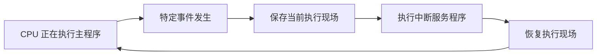
```mermaid
flowchart LR
    MAIN[CPU 正在执行主程序] --> EVENT[特定事件发生]
    EVENT --> SAVE[保存当前执行现场]
    SAVE --> ISR[执行中断服务程序]
    ISR --> RESTORE[恢复执行现场]
    RESTORE --> MAIN
```

> 中断的核心过程：**暂停当前任务 → 处理突发事件 → 返回原任务。**

### 1.2 中断示意

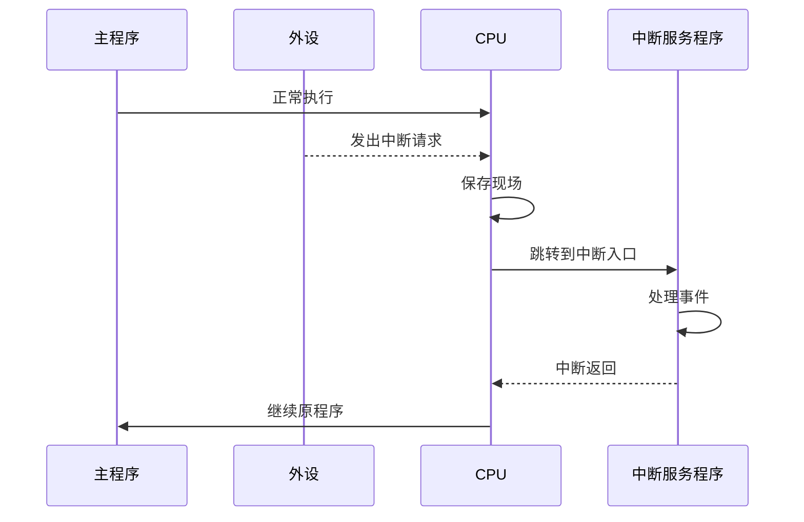
```mermaid
sequenceDiagram
    participant Main as 主程序
    participant HW as 外设
    participant CPU as CPU
    participant ISR as 中断服务程序
    Main->>CPU: 正常执行
    HW-->>CPU: 发出中断请求
    CPU->>CPU: 保存现场
    CPU->>ISR: 跳转到中断入口
    ISR->>ISR: 处理事件
    ISR-->>CPU: 中断返回
    CPU->>Main: 继续原程序
```

---

## 2 为什么需要中断

### 2.1 避免低效轮询

轮询方式需要 CPU 不断检查设备状态；中断方式允许 CPU 在事件发生时再进行处理，从而减少无效检查。

| 对比项 | 轮询方式 | 中断方式 |
|---|---|---|
| 谁发起检查 | CPU 主动查询 | 外设主动通知 CPU |
| 无事件时 | CPU 仍不断检查 | CPU 可执行其他任务 |
| 响应时间 | 受轮询周期影响 | 事件发生后及时响应 |
| 程序特点 | 简单直观 | 需要配置中断系统 |

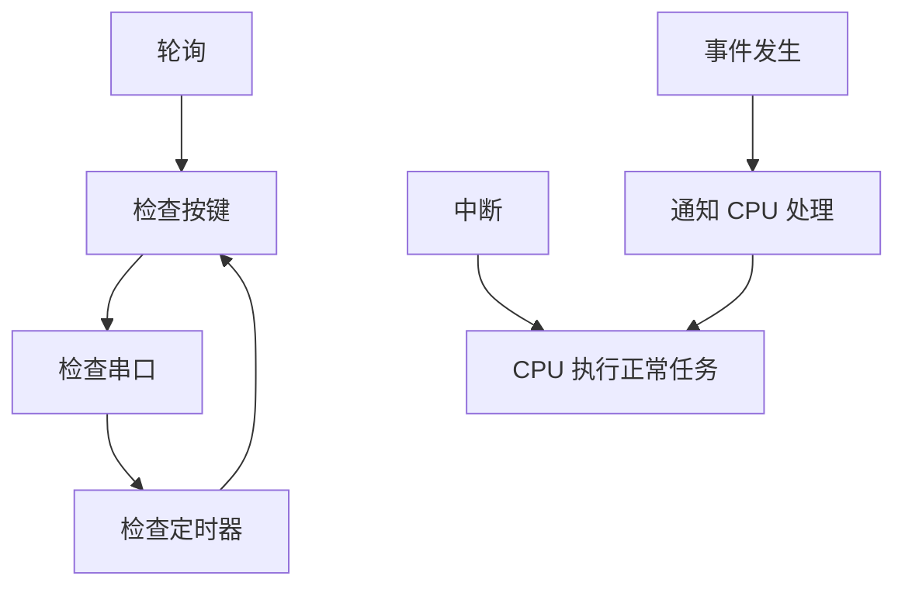
```mermaid
flowchart TD
    POLLING[轮询] --> P1[检查按键]
    P1 --> P2[检查串口]
    P2 --> P3[检查定时器]
    P3 --> P1
    INTERRUPT[中断] --> WORK[CPU 执行正常任务]
    EVENT[事件发生] --> ISR[通知 CPU 处理]
    ISR --> WORK
```

### 2.2 提高实时性

硬件故障、传感器信号和通信数据等事件可能需要立即处理。中断机制可以缩短 CPU 发现事件的等待时间。

| 事件 | 为什么需要及时响应 |
|---|---|
| 硬件故障 | 防止故障进一步扩大 |
| 传感器信号 | 避免错过短时间有效信号 |
| 串口接收 | 防止后续数据覆盖当前数据 |
| 定时器到期 | 保证周期任务按时执行 |

### 2.3 支持多任务处理

CPU 可以借助中断在不同任务之间切换，形成宏观上的“并行”效果，例如一边接收数据，一边处理已有数据。


```mermaid
flowchart LR
    MAIN[处理已有数据] --> IRQ[串口接收中断]
    IRQ --> RECEIVE[快速保存新数据]
    RECEIVE --> MAIN
```

> 单核 CPU 并非真正同时执行两段程序，而是在主程序和中断服务程序之间快速切换。

---

## 3 中断相关概念

### 3.1 中断源

中断源是能够产生中断请求的事件来源。

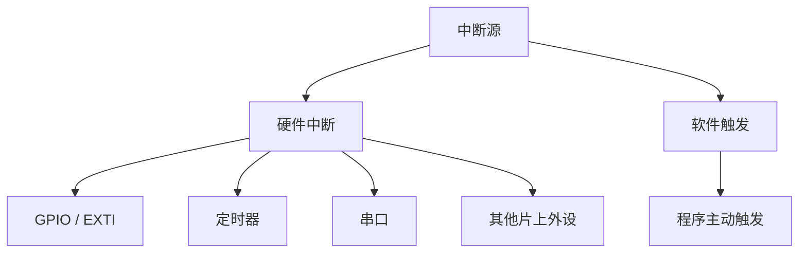
```mermaid
flowchart TD
    SOURCE[中断源] --> HARDWARE[硬件中断]
    SOURCE --> SOFTWARE[软件触发]
    HARDWARE --> GPIO[GPIO / EXTI]
    HARDWARE --> TIMER[定时器]
    HARDWARE --> USART[串口]
    HARDWARE --> OTHER[其他片上外设]
    SOFTWARE --> CALL[程序主动触发]
```

| 类型 | 来源 | 示例 |
|---|---|---|
| 硬件中断 | 外部设备或芯片内部硬件模块 | GPIO、定时器、串口 |
| 软件触发 | 程序主动产生 | 系统调用、软件触发中断 |

### 3.2 中断服务程序

中断服务程序 ISR 是专门处理某个中断事件的函数，例如处理按键事件或读取串口数据。

```c
void EXTI0_IRQHandler(void)
{
    /* 检查中断来源 */
    /* 清除中断标志 */
    /* 处理或记录中断事件 */
}
```

ISR 的基本要求：

| 要求 | 原因 |
|---|---|
| 短小高效 | 避免其他中断长时间等待 |
| 及时清除标志 | 防止重复进入中断 |
| 避免阻塞 | 防止系统停留在 ISR 中 |
| 只处理必要工作 | 复杂业务交给主程序完成 |

> 不应在普通 ISR 中使用 `HAL_Delay()` 等依赖中断节拍的阻塞延时函数。

### 3.3 中断向量表

中断向量表保存所有中断服务程序的入口地址，类似一张供 CPU 查询的“电话簿”。

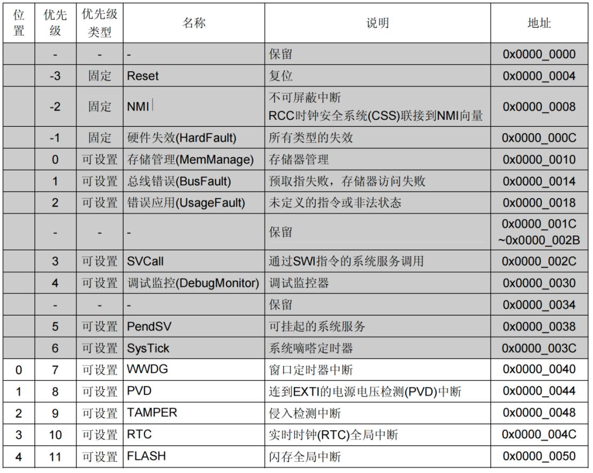


```mermaid
flowchart LR
    IRQ[中断请求] --> NUMBER[确定中断编号]
    NUMBER --> TABLE[查询中断向量表]
    TABLE --> ADDRESS[取得 ISR 入口地址]
    ADDRESS --> ISR[执行中断服务程序]
```

### 3.4 中断嵌套

正在执行某个中断服务程序时，如果出现优先级更高的中断，CPU 可以暂停当前 ISR，转去处理更高优先级中断。

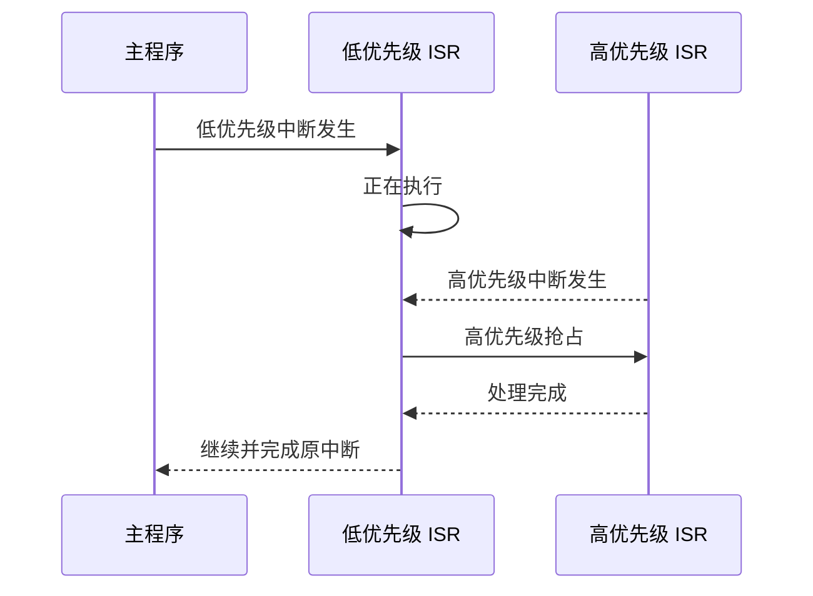
```mermaid
sequenceDiagram
    participant Main as 主程序
    participant Low as 低优先级 ISR
    participant High as 高优先级 ISR
    Main->>Low: 低优先级中断发生
    Low->>Low: 正在执行
    High-->>Low: 高优先级中断发生
    Low->>High: 高优先级抢占
    High-->>Low: 处理完成
    Low-->>Main: 继续并完成原中断
```

---

## 4 STM32 中断体系

### 4.1 体系结构

STM32 的中断请求由外设或 EXTI 产生，经 NVIC 管理后交给 Cortex-M 内核处理。

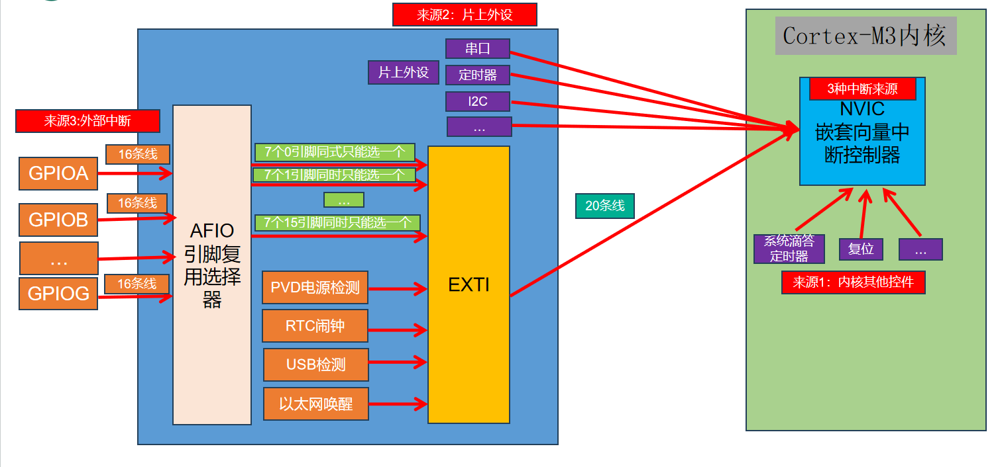

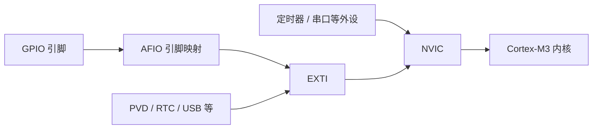
```mermaid
flowchart LR
    GPIO[GPIO 引脚] --> AFIO[AFIO 引脚映射]
    AFIO --> EXTI[EXTI]
    INTERNAL[PVD / RTC / USB 等] --> EXTI
    PERIPHERAL[定时器 / 串口等外设] --> NVIC[NVIC]
    EXTI --> NVIC
    NVIC --> CORE[Cortex-M3 内核]
```

### 4.2 中断分类

原课件将 STM32 中断按来源分为以下几类：

| 类别 | 来源 | 示例 |
|---|---|---|
| 内核异常 | Cortex-M 内核 | Reset、NMI、HardFault、SysTick |
| 片上外设中断 | MCU 内部外设 | 定时器、串口、ADC、DMA |
| 外部中断 | GPIO 或 EXTI 相关信号 | GPIO、PVD、RTC、USB 唤醒等 |

> “Cortex-M3 最多支持多少中断”和“具体 STM32 型号实际有多少中断”是两个层次。具体数量应以当前芯片的数据手册、`IRQn_Type` 和启动文件为准。

### 4.3 NVIC

NVIC 是嵌套向量中断控制器，负责管理中断的使能、挂起、优先级和嵌套。

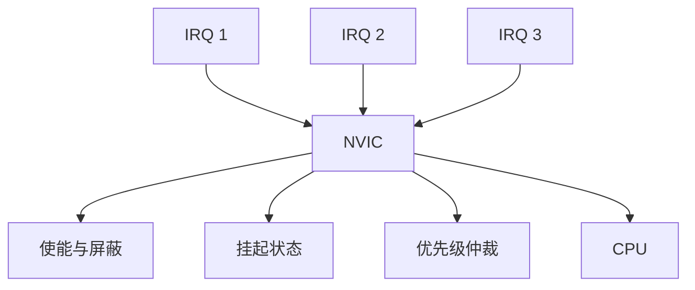
```mermaid
flowchart TD
    IRQ1[IRQ 1] --> NVIC[NVIC]
    IRQ2[IRQ 2] --> NVIC
    IRQ3[IRQ 3] --> NVIC
    NVIC --> ENABLE[使能与屏蔽]
    NVIC --> PENDING[挂起状态]
    NVIC --> PRIORITY[优先级仲裁]
    NVIC --> CPU[CPU]
```

### 4.4 中断优先级

STM32F1 实现了 4 个有效优先级位，可配置 16 个优先级等级。

> **优先级数值越小，优先级越高。**

优先级分为：

| 优先级   | 作用                     |
| ----- | ---------------------- |
| 抢占优先级 | 决定一个中断能否打断另一个 ISR      |
| 响应优先级 | 抢占优先级相同时，决定多个挂起中断的先后顺序 |

原课件中的“响应优先级”在当前 CMSIS/HAL 文档中通常称为“子优先级”。

### 4.5 优先级分组

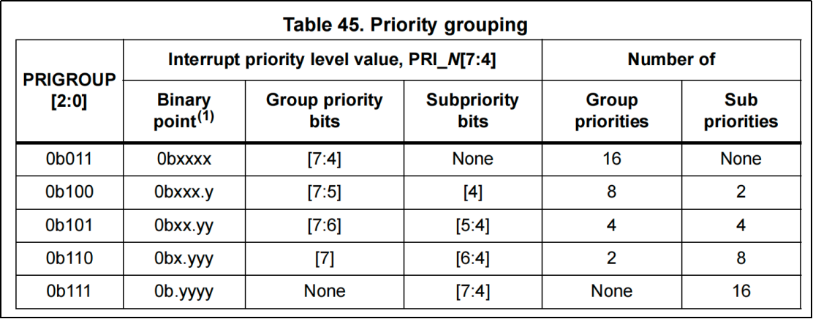

| 分组 | 抢占优先级位 | 子优先级位 |
|---|---:|---:|
| `NVIC_PRIORITYGROUP_0` | 0 | 4 |
| `NVIC_PRIORITYGROUP_1` | 1 | 3 |
| `NVIC_PRIORITYGROUP_2` | 2 | 2 |
| `NVIC_PRIORITYGROUP_3` | 3 | 1 |
| `NVIC_PRIORITYGROUP_4` | 4 | 0 |

优先级判断规则：

1. 优先比较抢占优先级，数值小者优先。
2. 高抢占优先级可以打断低抢占优先级 ISR。
3. 抢占优先级相同时，再比较子优先级。
4. 子优先级只决定等待顺序，不产生中断嵌套。
5. 两种优先级都相同时，异常号较小者先响应。

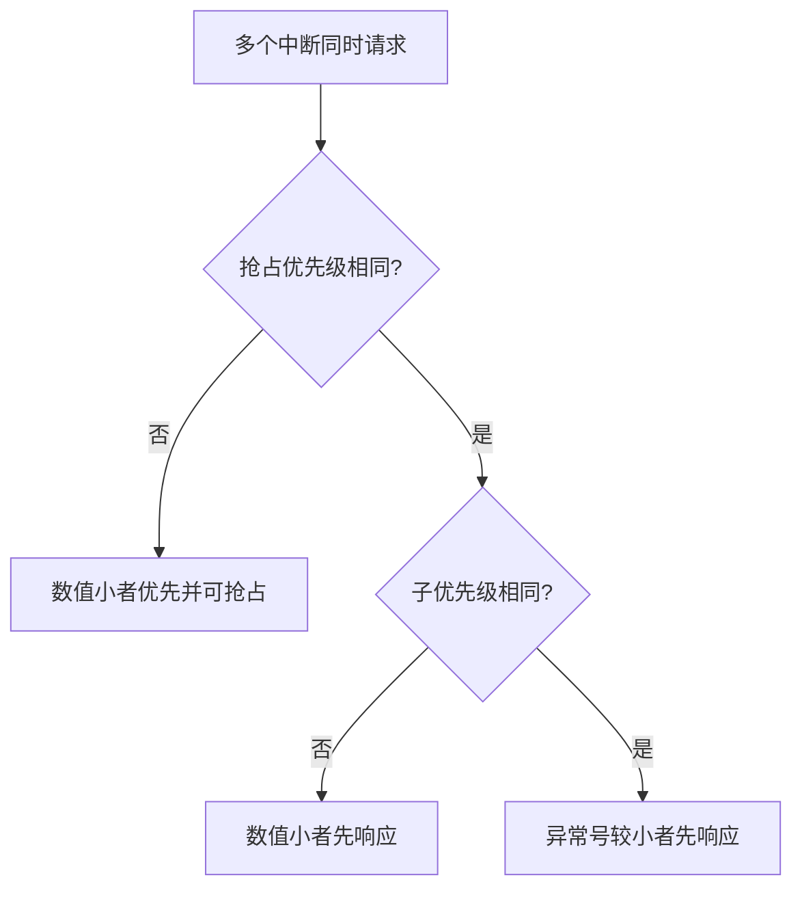
```mermaid
flowchart TD
    START[多个中断同时请求] --> PRE{抢占优先级相同?}
    PRE -->|否| P1[数值小者优先并可抢占]
    PRE -->|是| SUB{子优先级相同?}
    SUB -->|否| P2[数值小者先响应]
    SUB -->|是| NUM[异常号较小者先响应]
```

### 4.6 AFIO

AFIO 是 **Alternate Function I/O** 的缩写。在 STM32F1 中，它主要负责引脚功能之间的连接和映射。

> AFIO 不直接检测中断，也不直接控制 GPIO 电平。它更像一个“信号路由器”，决定某个片上功能连接到哪个引脚或端口。

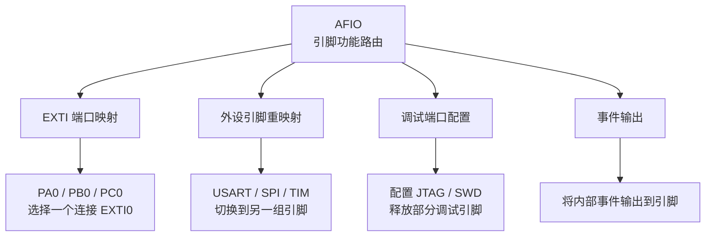
```mermaid
flowchart TD
    AFIO[AFIO<br/>引脚功能路由] --> EXTI_MAP[EXTI 端口映射]
    AFIO --> REMAP[外设引脚重映射]
    AFIO --> DEBUG[调试端口配置]
    AFIO --> EVENT[事件输出]
    EXTI_MAP --> E1[PA0 / PB0 / PC0<br/>选择一个连接 EXTI0]
    REMAP --> E2[USART / SPI / TIM<br/>切换到另一组引脚]
    DEBUG --> E3[配置 JTAG / SWD<br/>释放部分调试引脚]
    EVENT --> E4[将内部事件输出到引脚]
```

#### 4.6.1 AFIO 的主要作用

| 功能 | 相关寄存器 | 作用 |
|---|---|---|
| 事件输出 | `AFIO_EVCR` | 将指定内部事件输出到引脚 |
| 外设重映射 | `AFIO_MAPR` | 改变部分片上外设使用的引脚 |
| EXTI 映射 | `AFIO_EXTICR1～4` | 选择哪一个 GPIO 端口连接到 EXTI0～15 |
| 扩展重映射 | `AFIO_MAPR2` | 为部分高密度型号提供额外重映射配置 |

使用 AFIO 前必须开启时钟：

```c
RCC->APB2ENR |= RCC_APB2ENR_AFIOEN;
```

HAL 库或 CubeMX 工程通常会在需要时完成该配置，但学习寄存器开发时必须明确：**AFIO 位于 APB2 总线上，没有时钟就不能正常配置。**

#### 4.6.2 EXTI 端口映射

GPIO 引脚编号决定 EXTI 线编号，AFIO 决定这条 EXTI 线连接到哪个 GPIO 端口。

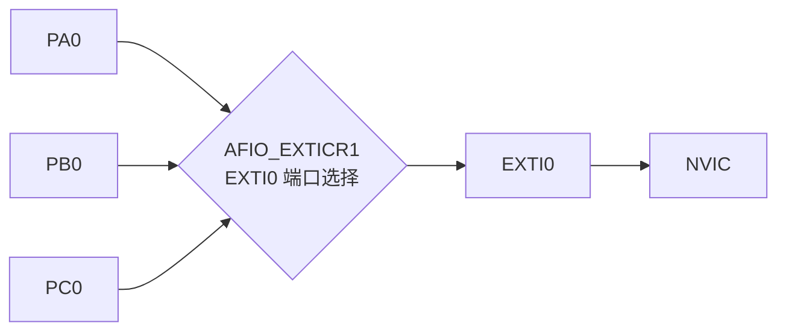
```mermaid
flowchart LR
    PA0[PA0] --> MUX{AFIO_EXTICR1<br/>EXTI0 端口选择}
    PB0[PB0] --> MUX
    PC0[PC0] --> MUX
    MUX --> EXTI0[EXTI0]
    EXTI0 --> NVIC[NVIC]
```

| 引脚 | 对应 EXTI 线 | AFIO 负责的选择 |
|---|---|---|
| PA0、PB0、PC0…… | EXTI0 | 选择 A、B、C……中的一个端口 |
| PA1、PB1、PC1…… | EXTI1 | 选择 A、B、C……中的一个端口 |
| PA7、PB7、PC7…… | EXTI7 | 选择 A、B、C……中的一个端口 |
| PA15、PB15、PC15…… | EXTI15 | 选择 A、B、C……中的一个端口 |

例如，将 PA0 连接到 EXTI0：

```c
/* EXTICR1 的 EXTI0[3:0] = 0000，选择 Port A */
AFIO->EXTICR[0] &= ~(0xFU << 0);
```

将 PB0 连接到 EXTI0：

```c
/* EXTICR1 的 EXTI0[3:0] = 0001，选择 Port B */
AFIO->EXTICR[0] &= ~(0xFU << 0);
AFIO->EXTICR[0] |=  (0x1U << 0);
```

```text
AFIO_EXTICR1
15            12 11             8 7              4 3              0
+----------------+----------------+----------------+----------------+
| EXTI3 端口选择 | EXTI2 端口选择 | EXTI1 端口选择 | EXTI0 端口选择 |
+----------------+----------------+----------------+----------------+
```

> PA0 和 PB0 都对应 EXTI0，因此同一时刻只能选择其中一个作为 EXTI0 的输入源。

#### 4.6.3 外设引脚重映射

部分 STM32F1 外设可以使用默认引脚，也可以通过 AFIO 切换到另一组引脚，这称为重映射。

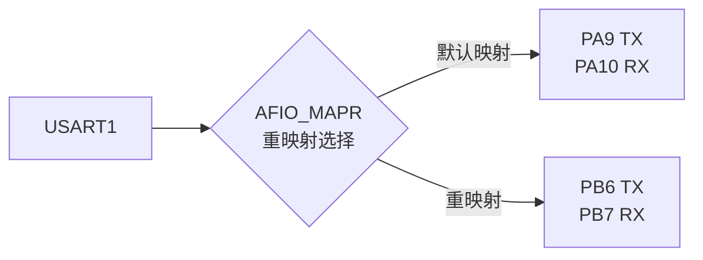
```mermaid
flowchart LR
    USART1[USART1] --> SELECT{AFIO_MAPR<br/>重映射选择}
    SELECT -->|默认映射| PA[PA9 TX<br/>PA10 RX]
    SELECT -->|重映射| PB[PB6 TX<br/>PB7 RX]
```

| 外设 | 默认引脚示例 | 重映射后的意义 |
|---|---|---|
| USART | 使用默认 TX/RX 引脚 | 避开被其他模块占用的引脚 |
| SPI | 使用默认 SCK/MISO/MOSI | 调整 PCB 走线或解决引脚冲突 |
| 定时器 | 使用默认通道引脚 | 将 PWM、输入捕获切换到其他引脚 |
| CAN | 使用默认 CAN 引脚 | 配合不同封装和硬件布局 |

重映射只改变“外设连接到哪个引脚”，不会自动完成以下配置：

- 不会自动开启 GPIO 和外设时钟。
- 不会自动配置 GPIO 输入输出模式。
- 不会自动初始化 USART、SPI、定时器等外设。
- 不会自动修改外部电路连接。

> 正确流程是：**查引脚表 → 确定是否重映射 → 配置 AFIO → 配置 GPIO → 配置外设。**

#### 4.6.4 调试端口配置

STM32F1 的部分引脚上电后默认用于 JTAG/SWD 调试。AFIO 可以通过 `SWJ_CFG` 调整调试接口，从而释放部分引脚作为普通 GPIO。

| 配置方式 | 保留的调试功能 | 引脚使用影响 |
|---|---|---|
| 完整 JTAG + SWD | JTAG 和 SWD 均可用 | 占用较多调试引脚 |
| 关闭 JTAG，保留 SWD | 保留 SWD 下载调试 | 可释放部分 JTAG 引脚 |
| 关闭 JTAG 和 SWD | 不保留在线调试接口 | 调试器可能无法再次连接 |

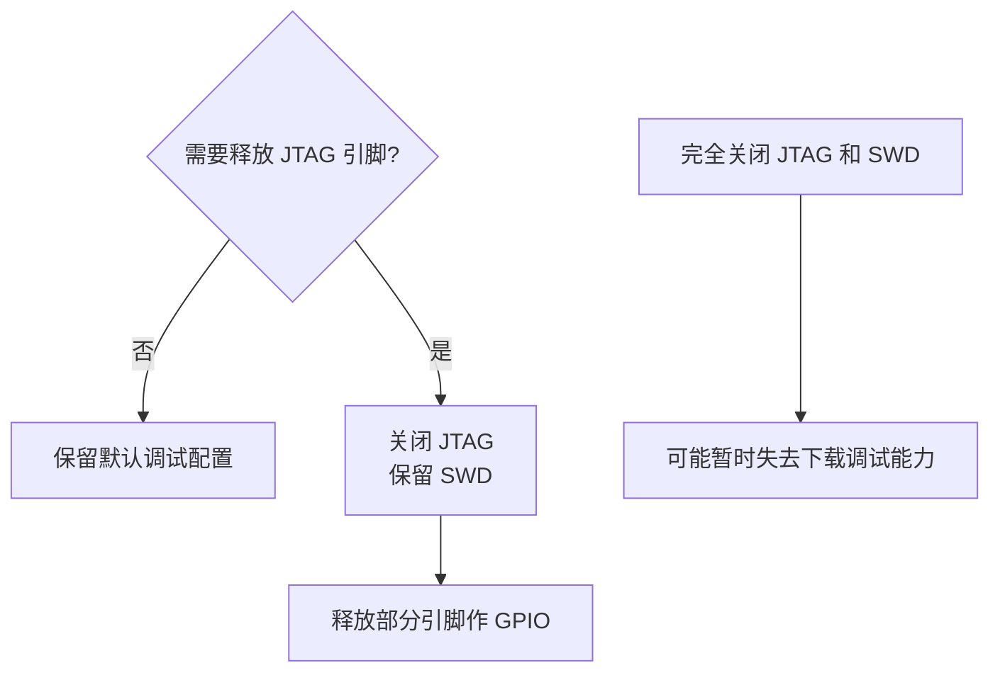
```mermaid
flowchart TD
    NEED{需要释放 JTAG 引脚?} -->|否| KEEP[保留默认调试配置]
    NEED -->|是| SWD[关闭 JTAG<br/>保留 SWD]
    SWD --> GPIO[释放部分引脚作 GPIO]
    DANGER[完全关闭 JTAG 和 SWD] --> LOST[可能暂时失去下载调试能力]
```

> 初学阶段建议保留 SWD。若程序错误关闭全部调试端口，可能需要通过复位连接或 BOOT 模式重新下载程序。

#### 4.6.5 AFIO 与 EXTI 的关系

AFIO 和 EXTI 分工不同：

| 模块 | 回答的问题 |
|---|---|
| GPIO | 引脚当前输入什么电平？ |
| AFIO | 哪个 GPIO 端口连接到这条 EXTI 线？ |
| EXTI | 检测哪种边沿？是否产生中断请求？ |
| NVIC | 是否允许响应？优先级是多少？ |
| CPU | 执行哪个中断服务程序？ |

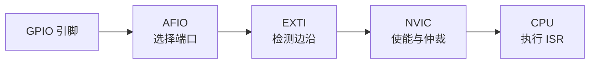
```mermaid
flowchart LR
    PIN[GPIO 引脚] --> AFIO[AFIO<br/>选择端口]
    AFIO --> EXTI[EXTI<br/>检测边沿]
    EXTI --> NVIC[NVIC<br/>使能与仲裁]
    NVIC --> CPU[CPU<br/>执行 ISR]
```

### 4.7 EXTI 控制器

EXTI 用于检测 GPIO 或内部信号的边沿，并向 NVIC 发送中断请求。

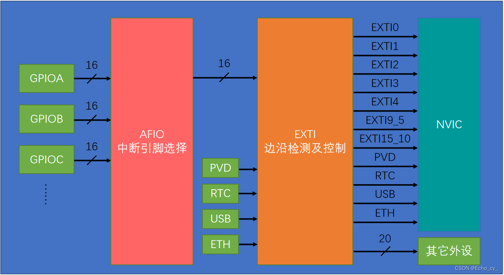

```text
PA0 / PB0 / PC0 / ... ──选择一个──> EXTI0
PA1 / PB1 / PC1 / ... ──选择一个──> EXTI1
...
PA15/PB15/PC15/...    ──选择一个──> EXTI15
```

| EXTI 线 | NVIC 中断通道 |
|---|---|
| EXTI0～EXTI4 | 每条线拥有独立 IRQ |
| EXTI5～EXTI9 | 共用 `EXTI9_5_IRQn` |
| EXTI10～EXTI15 | 共用 `EXTI15_10_IRQn` |

> 同编号 GPIO 引脚共用同一条 EXTI 线。例如 PA0、PB0、PC0 中只能选择一个映射到 EXTI0。

---

## 5 中断处理流程

### 5.1 硬件流程


```mermaid
flowchart LR
    TRIGGER[1 中断触发] --> FLAG[2 设置中断标志]
    FLAG --> IRQ[3 向 NVIC 请求]
    IRQ --> JUDGE[4 优先级仲裁]
    JUDGE --> SAVE[5 CPU 保存现场]
    SAVE --> VECTOR[6 查询向量表]
    VECTOR --> ISR[7 进入 ISR]
```

| 步骤 | 说明 |
|---|---|
| 中断触发 | 外设或 EXTI 检测到事件 |
| 设置标志 | 例如 USART 设置 RXNE，EXTI 设置 PR |
| 发出请求 | 外设向 NVIC 发送 IRQ |
| 优先级仲裁 | NVIC 判断是否立即响应 |
| 保存现场 | CPU 将必要寄存器压栈 |
| 查询向量 | 从向量表取得 ISR 入口 |

### 5.2 软件流程


```mermaid
flowchart LR
    ENTER[进入 ISR] --> CHECK[检查中断标志]
    CHECK --> CLEAR[清除中断标志]
    CLEAR --> HANDLE[处理或记录事件]
    HANDLE --> RETURN[中断返回]
    RETURN --> RESTORE[CPU 恢复现场]
    RESTORE --> MAIN[继续原程序]
```

软件处理的主要工作：

1. 执行中断服务函数。
2. 检查中断来源。
3. 清除中断标志，防止重复触发。
4. 执行必要的用户逻辑。
5. 退出 ISR，由 CPU 恢复上下文。

### 5.3 完整路径


```mermaid
flowchart LR
    EVENT[事件] --> PERIPHERAL[外设/EXTI]
    PERIPHERAL --> FLAG[标志位置位]
    FLAG --> NVIC[NVIC]
    NVIC --> CPU[CPU 响应]
    CPU --> VECTOR[中断向量表]
    VECTOR --> ISR[ISR]
    ISR --> CLEAR[清标志]
    CLEAR --> RETURN[返回原程序]
```

---

## 6 实例：按键中断

### 6.1 实例思路

本例使用 GPIO 按键产生外部中断，并在中断事件发生后控制 LED。


```mermaid
flowchart LR
    KEY[按键电平变化] --> GPIO[GPIO 输入]
    GPIO --> AFIO[AFIO 映射]
    AFIO --> EXTI[EXTI 边沿检测]
    EXTI --> NVIC[NVIC]
    NVIC --> ISR[中断服务函数]
    ISR --> LED[控制 LED]
```

### 6.2 寄存器版本

#### 6.2.1 开发流程


```mermaid
flowchart LR
    CLOCK[1 开启时钟] --> GPIO[2 配置 GPIO]
    GPIO --> AFIO[3 配置 AFIO 映射]
    AFIO --> EXTI[4 配置 EXTI]
    EXTI --> NVIC[5 配置 NVIC]
    NVIC --> ISR[6 编写 ISR]
```

具体步骤：

| 步骤 | 配置内容 |
|---|---|
| 开启时钟 | GPIO 和 AFIO 时钟 |
| 配置 GPIO | 按键引脚设置为输入，LED 设置为输出 |
| 配置 AFIO | 将 GPIO 端口映射到对应 EXTI 线 |
| 配置 EXTI | 选择上升沿或下降沿，开放中断屏蔽 |
| 配置 NVIC | 设置优先级并使能对应 IRQ |
| 编写 ISR | 函数无参数、无返回值，名称与启动文件一致 |

#### 6.2.2 配置示例

假设按键连接 PA0，使用上拉输入，按下产生下降沿：

```c
static volatile uint8_t key_event = 0U;

static void Key_EXTI_Init(void)
{
    RCC->APB2ENR |= RCC_APB2ENR_AFIOEN |
                    RCC_APB2ENR_IOPAEN;

    /* PA0：上拉输入 */
    GPIOA->CRL &= ~(0xFU << 0);
    GPIOA->CRL |=  (0x8U << 0);
    GPIOA->BSRR =  (1U << 0);

    /* PA0 映射到 EXTI0 */
    AFIO->EXTICR[0] &= ~(0xFU << 0);

    /* EXTI0：下降沿触发并开放中断 */
    EXTI->RTSR &= ~(1U << 0);
    EXTI->FTSR |=  (1U << 0);
    EXTI->PR    =  (1U << 0);
    EXTI->IMR  |=  (1U << 0);

    NVIC_SetPriority(EXTI0_IRQn, 2U);
    NVIC_EnableIRQ(EXTI0_IRQn);
}
```

#### 6.2.3 中断服务函数

```c
void EXTI0_IRQHandler(void)
{
    if ((EXTI->PR & (1U << 0)) != 0U)
    {
        EXTI->PR = (1U << 0);  /* 写 1 清除挂起位 */
        key_event = 1U;
    }
}
```

中断服务函数只记录事件，按键消抖和 LED 控制可放在主循环中完成。

### 6.3 HAL 库版本

#### 6.3.1 CubeMX 配置

| 配置引脚为外部中断 | 使能 NVIC 中断 |
|---|---|
| 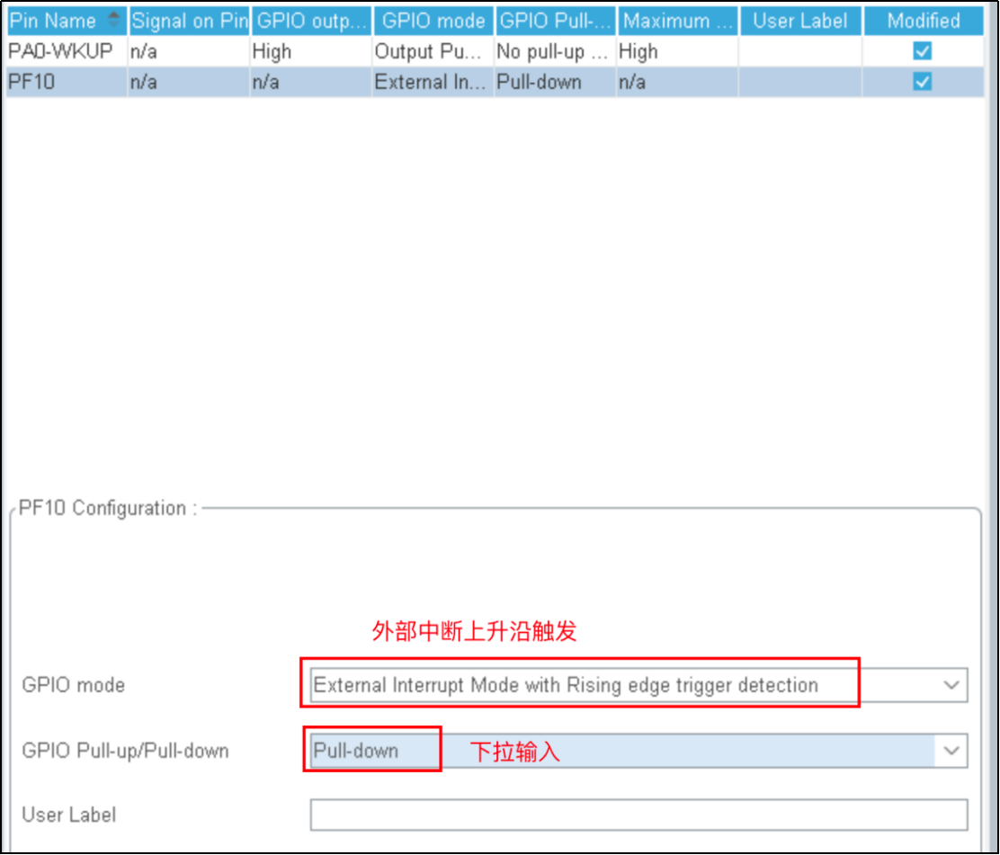 | 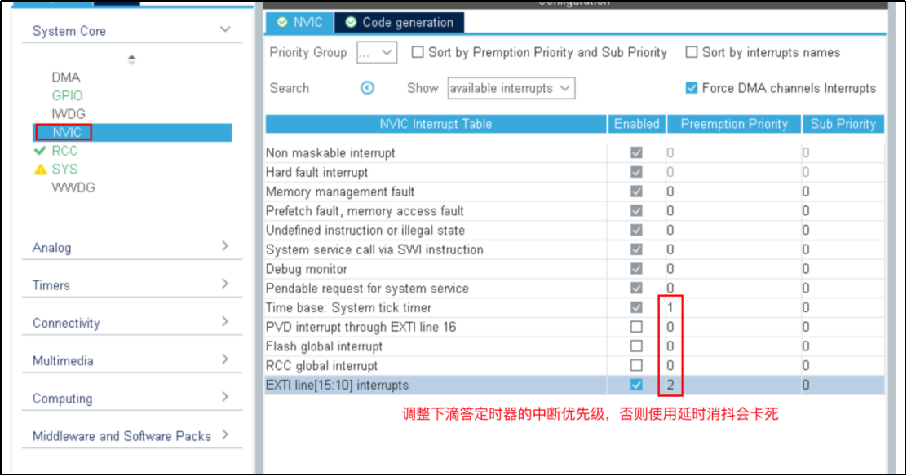 |

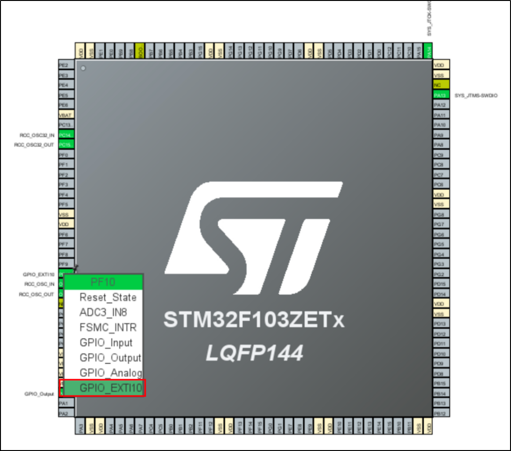

配置内容：

1. 将按键引脚配置为外部中断模式。
2. 根据按键电路选择上升沿或下降沿。
3. 设置上拉或下拉。
4. 在 NVIC 中使能对应 EXTI 中断。
5. 设置抢占优先级和子优先级。

#### 6.3.2 中断调用关系

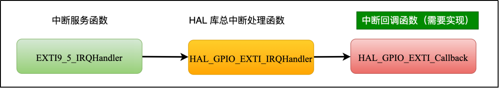

```mermaid
flowchart LR
    ISR[EXTI0_IRQHandler] --> HANDLER[HAL_GPIO_EXTI_IRQHandler]
    HANDLER --> CLEAR[清除 EXTI 标志]
    CLEAR --> CALLBACK[HAL_GPIO_EXTI_Callback]
    CALLBACK --> USER[用户处理逻辑]
```

```c
void EXTI0_IRQHandler(void)
{
    HAL_GPIO_EXTI_IRQHandler(GPIO_PIN_0);
}

void HAL_GPIO_EXTI_Callback(uint16_t GPIO_Pin)
{
    if (GPIO_Pin == GPIO_PIN_0)
    {
        key_event = 1U;
    }
}
```

#### 6.3.3 延时消抖问题

原课件指出：如果在外部中断中调用 `HAL_Delay()`，可能出现程序卡死。

原因如下：

```mermaid
flowchart TD
    EXTI[进入外部中断] --> DELAY[调用 HAL_Delay]
    DELAY --> WAIT[等待 SysTick 更新计数]
    WAIT --> BLOCK{SysTick 能否抢占当前 ISR?}
    BLOCK -->|不能| DEAD[计数不更新，延时无法结束]
    BLOCK -->|能| RISK[仍会延长 ISR 执行时间]
```

更合适的处理方法：

- ISR 中只记录按键事件和时间。
- 立即退出 ISR。
- 在主循环或定时任务中完成延时确认和按键消抖。

> 调整 SysTick 优先级可以解释卡死现象，但不应把“在 ISR 中阻塞延时”作为推荐方案。

---

## 7 总结

### 7.1 内容主线

```mermaid
flowchart LR
    CONCEPT[什么是中断] --> NEED[为什么需要中断]
    NEED --> TERMS[中断相关概念]
    TERMS --> SYSTEM[STM32 中断体系]
    SYSTEM --> FLOW[中断处理流程]
    FLOW --> EXAMPLE[按键中断实例]
```

### 7.2 核心结论

| 问题 | 结论 |
|---|---|
| 什么是中断？ | CPU 暂停当前程序，处理事件后返回原任务 |
| 为什么需要中断？ | 减少无效轮询，提高实时响应能力 |
| NVIC 的作用是什么？ | 管理中断使能、挂起、优先级和嵌套 |
| 优先级如何判断？ | 数值越小优先级越高，先比较抢占优先级 |
| EXTI 的作用是什么？ | 检测 GPIO 或内部信号的边沿并产生请求 |
| ISR 有什么要求？ | 短小、及时清标志、避免阻塞 |
| HAL 外部中断如何执行？ | IRQHandler 调用 HAL 处理函数，再进入用户回调 |

> 中断开发流程：  
> **配置事件源 → 配置 EXTI/外设 → 配置 NVIC → 编写 ISR → 清除标志 → 返回主程序。**
