# 嵌入式智能硬件开发—Cortex-M开发

<style>
body {
  font-family: "Microsoft YaHei", "PingFang SC", "Noto Sans CJK SC", Arial, sans-serif;
  color: #263238;
  font-size: 16px;
  line-height: 1.8;
  letter-spacing: 0.02em;
}
h1 {
  color: #123B5D;
  text-align: center;
  font-size: 2.1em;
  margin: 0.7em 0 1em;
}
h2 {
  color: #0B6285;
  font-size: 1.55em;
  margin-top: 2em;
  padding: 0.35em 0.55em;
  border-left: 6px solid #18A0AE;
  border-bottom: 1px solid #B9DDE3;
  background: #F3FAFB;
}
h3 {
  color: #24758C;
  font-size: 1.25em;
  margin-top: 1.5em;
  padding-bottom: 0.2em;
  border-bottom: 1px dashed #C8DCE2;
}
h4, h5 {
  color: #355E6B;
}
p, li {
  text-align: justify;
}
li {
  margin: 0.25em 0;
}
blockquote {
  color: #425B65;
  border-left: 4px solid #62B6C6;
  background: #F5FAFC;
  margin: 1em 0;
  padding: 0.7em 1em;
}
table {
  width: 100%;
  border-collapse: collapse;
  margin: 1.2em auto;
  font-size: 0.96em;
}
th {
  color: #FFFFFF;
  background: #24758C;
  text-align: center;
}
th, td {
  border: 1px solid #B8CDD4;
  padding: 0.55em 0.7em;
  vertical-align: middle;
}
tr:nth-child(even) td {
  background: #F7FAFB;
}
pre {
  border: 1px solid #D8E2E6;
  border-radius: 6px;
  background: #F6F8FA;
  padding: 1em;
  overflow-x: auto;
}
code, pre code {
  font-family: Consolas, "Cascadia Code", "JetBrains Mono", monospace;
  font-size: 0.94em;
}
.course-figure {
  text-align: center;
  margin: 1.15em auto 1.5em;
  break-inside: avoid;
}
.course-figure img {
  display: block;
  max-width: 94%;
  max-height: 760px;
  height: auto;
  margin: 0 auto;
  border: 1px solid #D5E0E4;
  border-radius: 6px;
  box-shadow: 0 3px 12px rgba(20, 63, 82, 0.10);
}
.course-figure figcaption {
  color: #607D86;
  font-size: 0.88em;
  margin-top: 0.45em;
}
hr {
  border: 0;
  border-top: 1px solid #C8DCE2;
  margin: 2em 0;
}
@media print {
  body { font-size: 11pt; color: #111; }
  h2, h3, .course-figure, pre, table { break-inside: avoid; }
  .course-figure img { box-shadow: none; max-height: 650px; }
}
</style>


> **第 05 讲｜I²C 通讯**
> 从“两根线如何连接多个设备”出发，认识I²C物理结构和通信协议，并先通过LM75A完成温度采集，再通过OLED0561完成数据显示。

## 本讲内容主线


```mermaid
flowchart LR
    A["通信需求"] --> B["物理层<br/>开漏与上拉"]
    B --> C["协议层<br/>起始、地址、应答、停止"]
    C --> D["软件模拟I²C<br/>GPIO产生时序"]
    D --> E["OLED与LM75A<br/>真实设备操作"]
    E --> F["STM32硬件I²C"]
    F --> G["HAL封装与工程应用"]
```

| 学习阶段 | 需要回答的问题 |
|---|---|
| 认识总线 | 为什么两根线可以连接多个设备？ |
| 物理层 | 为什么必须开漏输出并连接上拉电阻？ |
| 协议层 | 主机和从机怎样确认地址、方向与应答？ |
| 软件实现 | 每一个协议动作怎样转换为GPIO代码？ |
| 器件驱动 | OLED和LM75A分别需要写入、读取什么？ |
| 硬件与HAL | 外设状态机和HAL函数怎样完成同一套时序？ |

---

## 目录

1. [认识 I²C](#1-认识-i²c)
2. [总线物理层](#2-总线物理层)
3. [I²C协议：从基本条件到完整事务](#3-i²c协议从基本条件到完整事务)
4. [软件模拟 I²C](#4-软件模拟-i²c)
5. [LM75A与OLED驱动](#5-lm75a-与-oled-驱动)
6. [STM32硬件I²C工作原理](#6-stm32硬件i²c工作原理)
7. [HAL 库开发](#7-hal-库开发)
8. [总结](#8-总结)

---

## 1 认识 I²C

> **本章入口**：先从“多个设备怎样只用少量引脚通信”这个问题出发，认识I²C的主从关系、两根信号线和速度等级。此处先建立整体印象，暂不进入寄存器。

### 1.1 为什么需要 I²C？

本工程需要同时连接 LM75A 温度传感器和 OLED 显示屏。如果每个设备都使用独立的数据线和控制线，会占用更多 GPIO。

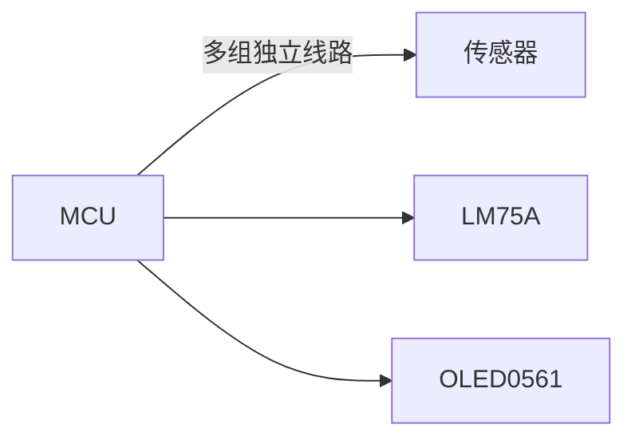
```mermaid
flowchart LR
    MCU1[MCU] -->|多组独立线路| SENSOR1[传感器]
    MCU1 --> LM75A1[LM75A]
    MCU1 --> OLED1[OLED0561]
```

I²C 让多个设备共享两根信号线：

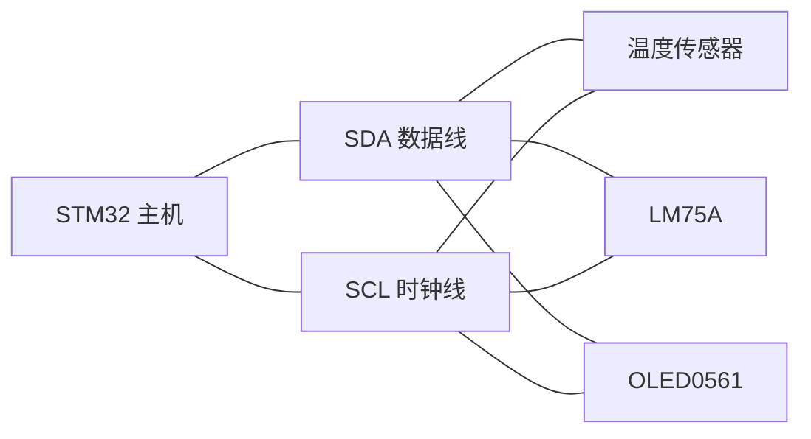
```mermaid
flowchart LR
    MCU[STM32 主机] --- SDA[SDA 数据线]
    MCU --- SCL[SCL 时钟线]
    SDA --- SENSOR[温度传感器]
    SCL --- SENSOR
    SDA --- LM75A2[LM75A]
    SCL --- LM75A2
    SDA --- OLED[OLED0561]
    SCL --- OLED
```

> I²C 的价值：**使用较少的 MCU 引脚连接多个低速外设，并通过设备地址区分通信对象。**

### 1.2 I²C 是什么？

I²C 是一种同步、串行、半双工的板级通信总线。

| 特性 | 含义 |
|---|---|
| 同步通信 | 使用 SCL 提供统一采样节拍 |
| 串行通信 | 数据在 SDA 上逐位传输 |
| 半双工 | SDA 双向使用，但同一时刻只有一方发送 |
| 总线结构 | 多个设备共享 SDA 和 SCL |
| 地址访问 | 主机通过地址选择目标从机 |
| 主从通信 | 主机发起并控制一次传输 |

### 1.3 主机与从机

| 角色              | 主要职责                    |
| --------------- | ----------------------- |
| 主机 Master       | 发起通信、产生 SCL、发送地址、产生停止条件 |
| 从机 Slave/Target | 监听地址，被选中后发送或接收数据        |

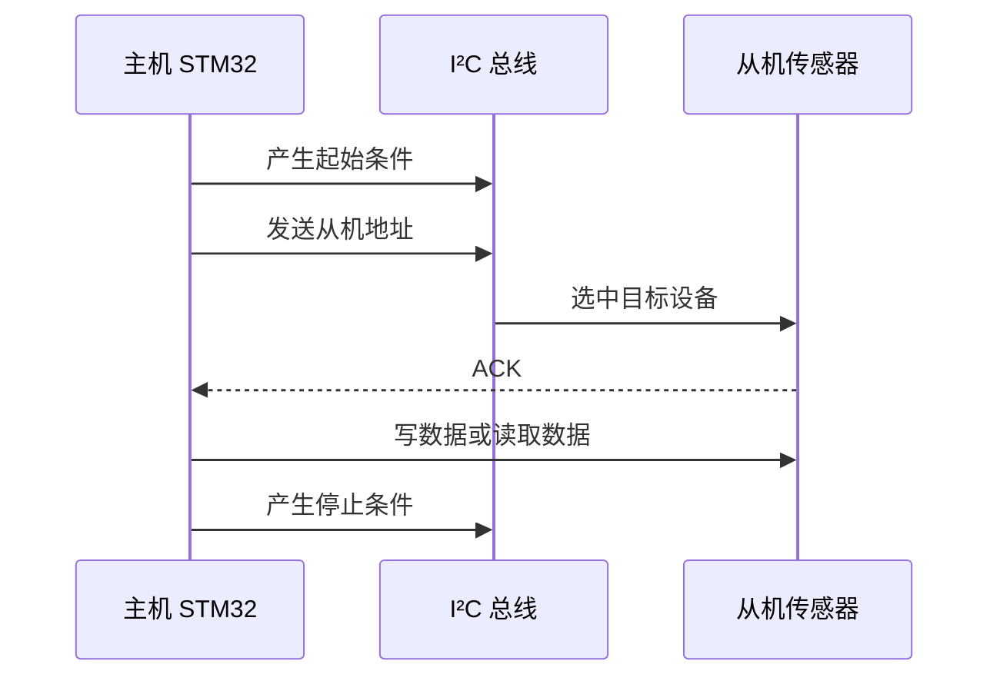
```mermaid
sequenceDiagram
    participant M as 主机 STM32
    participant B as I²C 总线
    participant S as 从机传感器
    M->>B: 产生起始条件
    M->>B: 发送从机地址
    B->>S: 选中目标设备
    S-->>M: ACK
    M->>S: 写数据或读取数据
    M->>B: 产生停止条件
```

I²C 支持多主机，但大多数入门项目采用一个 STM32 主机和多个从机。

### 1.4 两根信号线

| 信号 | 全称 | 作用 |
|---|---|---|
| SDA | Serial Data | 双向传输地址、数据和应答 |
| SCL | Serial Clock | 由主机提供通信时钟 |

<figure class="course-figure">
  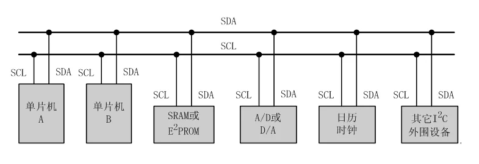
  <figcaption>图5-1　I²C 多设备总线结构</figcaption>
</figure>

### 1.5 传输速度

| 模式 | 最大速率 | 说明 |
|---|---:|---|
| 标准模式 Standard-mode | 100 kbit/s | 本工程 OLED0561 和 LM75A 使用该速度 |
| 快速模式 Fast-mode | 400 kbit/s | 常用高速模式 |
| 快速模式增强 Fast-mode Plus | 1 Mbit/s | 需要器件明确支持 |
| 高速模式 High-speed mode | 3.4 Mbit/s | 需要专门协议和器件支持 |

> STM32 和从机必须同时支持目标速率。实际速度还会受到总线电容和上拉电阻的限制。

---

> **上一节结论**：I²C通过地址区分设备，通过SCL和SDA完成同步串行通信。下面先解决两根线在电路上怎样可靠共享。

---

## 2 总线物理层

> **内容衔接**：知道I²C只使用SCL和SDA后，下一个问题是：为什么这些引脚必须采用开漏结构，为什么总线上必须接上拉电阻？这一节先解释电平怎样产生。

### 2.1 开漏结构

I²C 的 SDA 和 SCL 通常采用开漏输出。设备只能主动把线路拉低，不能主动输出高电平。

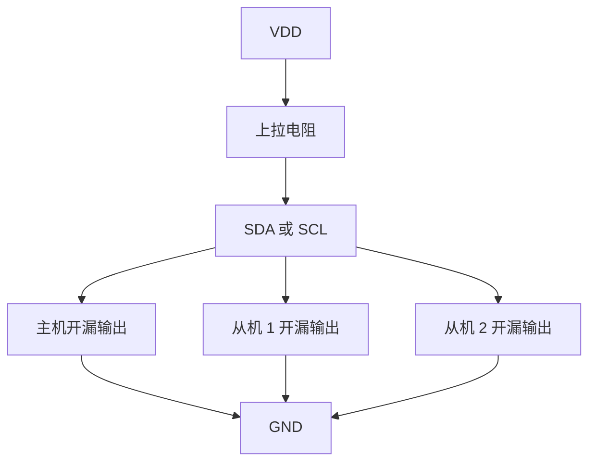
```mermaid
flowchart TB
    VDD[VDD] --> RP[上拉电阻]
    RP --> BUS[SDA 或 SCL]
    BUS --> M1[主机开漏输出]
    BUS --> S1[从机 1 开漏输出]
    BUS --> S2[从机 2 开漏输出]
    M1 --> GND[GND]
    S1 --> GND
    S2 --> GND
```

| 设备动作 | 晶体管状态 | 总线状态 |
|---|---|---|
| 输出 0 | 导通 | 主动拉低 |
| 输出 1 | 关闭 | 释放总线，由电阻拉高 |

> I²C 中所谓“输出高电平”，本质是设备释放线路，而不是主动把线路推到高电平。

### 2.2 为什么需要上拉？

当所有设备都释放线路时，上拉电阻把 SDA 和 SCL 拉成高电平；任一设备拉低时，线路变为低电平。

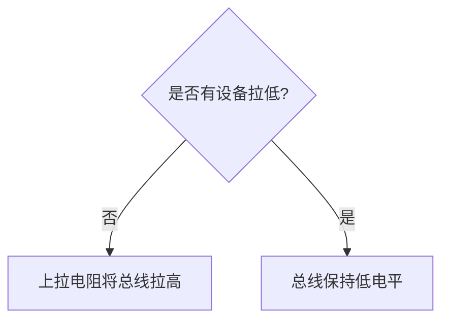
```mermaid
flowchart TD
    STATE{是否有设备拉低?}
    STATE -->|否| HIGH[上拉电阻将总线拉高]
    STATE -->|是| LOW[总线保持低电平]
```

这种结构实现了“线与”逻辑：

| 主机释放 | 从机释放 | 总线电平 |
|---:|---:|---:|
| 是 | 是 | 1 |
| 否 | 是 | 0 |
| 是 | 否 | 0 |
| 否 | 否 | 0 |

开漏结构使多个设备可以安全共享线路，也是应答、时钟延展和多主机仲裁能够实现的基础。

### 2.3 上拉电阻选择

上拉电阻与总线电容共同决定信号上升速度。

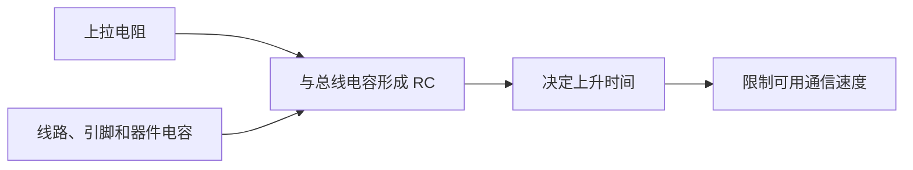
```mermaid
flowchart LR
    R[上拉电阻] --> RC[与总线电容形成 RC]
    C[线路、引脚和器件电容] --> RC
    RC --> RISE[决定上升时间]
    RISE --> SPEED[限制可用通信速度]
```

| 电阻选择 | 优点 | 风险 |
|---|---|---|
| 阻值过大 | 拉低电流小 | 上升沿太慢，高速通信失败 |
| 阻值过小 | 上升沿较快 | 低电平电流增大，器件可能拉不动 |
| 合理阻值 | 兼顾速度和电流 | 应结合电压、电容和速率计算 |

常见模块可能已经安装上拉电阻。多个模块并联时，等效阻值会降低，应检查总线上的实际上拉情况。

### 2.4 总线空闲

当没有设备通信时，SDA 和 SCL 均被上拉为高电平。

```text
SCL：──────────── 高电平
SDA：──────────── 高电平
状态：总线空闲
```

如果上电后 SDA 或 SCL 长期为低，可能存在：

- 设备仍在拉低总线；
- 接线错误或线路短路；
- 上一次通信异常中止；
- 从机掉电但通过信号线被反向供电；
- GPIO 模式配置错误。

### 2.5 地址容量

I²C 支持 7 位和 10 位地址，实际项目以 7 位地址最常见。

7 位能够形成 128 种位组合，但其中有一部分属于保留地址。因此，不能简单理解为总线上一定能连接 127 个普通从机。

实际设备数量还受以下因素限制：

- 从机地址是否冲突；
- 总线电容是否超过规范；
- 上拉电阻是否合适；
- 主机软件是否支持；
- 供电和 PCB 布局是否可靠。

### 2.6 多主机仲裁

多个主机同时发送时，每个主机一边发送 SDA，一边读取总线实际状态。

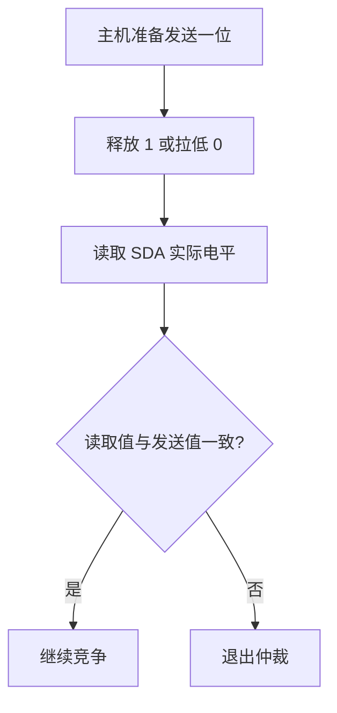
```mermaid
flowchart TD
    SEND[主机准备发送一位] --> OUTPUT[释放 1 或拉低 0]
    OUTPUT --> READ[读取 SDA 实际电平]
    READ --> SAME{读取值与发送值一致?}
    SAME -->|是| CONTINUE[继续竞争]
    SAME -->|否| LOSE[退出仲裁]
```

由于总线满足“只要有设备拉低，线路就是低电平”：

- 发送 0 并读到 0 的主机继续通信。
- 发送 1 却读到 0 的主机发现其他主机优先，退出竞争。
- 仲裁过程不会破坏获胜主机的数据。

> 单主机项目通常不需要实现多主仲裁，但理解它有助于理解开漏总线的作用。

---

> **上一节结论**：开漏输出与上拉电阻让多个器件能够安全连接到同一总线。下面按照起始、停止、传输和完整事务的顺序学习通信语法。

---

## 3 I²C协议：从基本条件到完整事务

> **内容衔接**：物理层解决“0和1怎样出现在导线上”；协议层继续规定“什么时候开始、怎样发送地址、怎样应答以及什么时候结束”。

> 本节严格按照总线动作发生和组合的顺序讲解：**起始 → 停止 → 数据传输 → 地址与应答 → 指定地址写 → 当前地址读 → 指定地址读**。

### 3.1 第一步：起始条件

总线空闲时SCL和SDA都为高电平。主机要发起通信，必须在 **SCL保持高电平** 时让SDA从高变低，这个特殊变化就是起始条件 `START`。

<figure class="course-figure">
  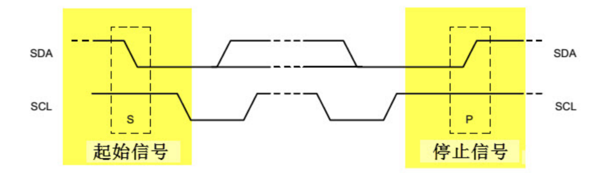
  <figcaption>图5-2　I²C起始和停止条件</figcaption>
</figure>

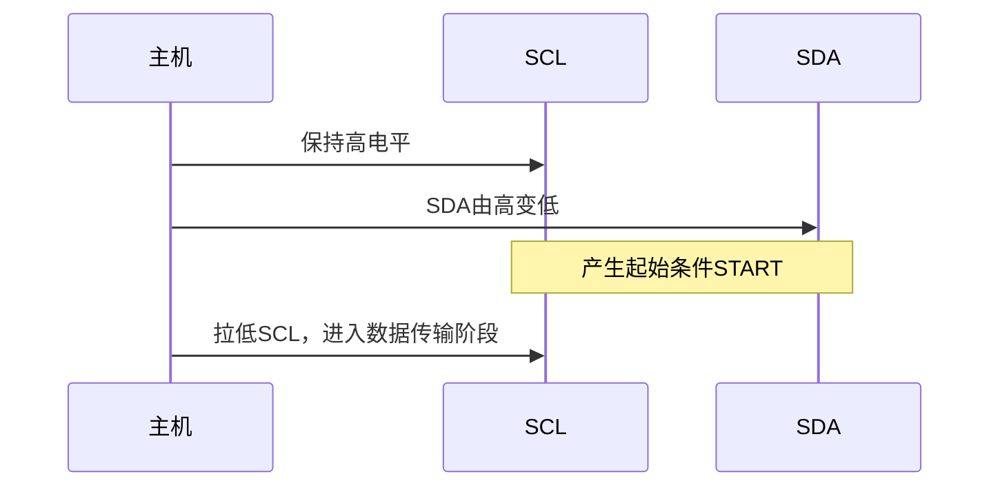
```mermaid
sequenceDiagram
    participant M as 主机
    participant SCL as SCL
    participant SDA as SDA
    M->>SCL: 保持高电平
    M->>SDA: SDA由高变低
    Note over SCL,SDA: 产生起始条件START
    M->>SCL: 拉低SCL，进入数据传输阶段
```

```text
起始前：SCL=1，SDA=1，总线空闲
起始时：SCL=1，SDA产生 1→0
起始后：主机拉低SCL，准备发送第1位
```

起始条件告诉总线上的所有从机：“一次新的通信开始了，请准备接收地址。”

### 3.2 第二步：停止条件

通信完成后，主机在 **SCL保持高电平** 时让SDA从低变高，产生停止条件 `STOP`，释放总线。

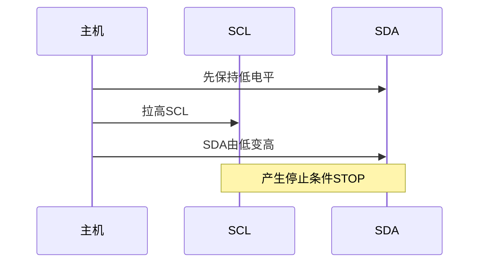
```mermaid
sequenceDiagram
    participant M as 主机
    participant SCL as SCL
    participant SDA as SDA
    M->>SDA: 先保持低电平
    M->>SCL: 拉高SCL
    M->>SDA: SDA由低变高
    Note over SCL,SDA: 产生停止条件STOP
```

```text
停止前：SDA=0
停止时：SCL=1，SDA产生 0→1
停止后：SCL=1，SDA=1，总线重新空闲
```

| 特殊条件 | SCL状态 | SDA变化 | 作用 |
|---|---|---|---|
| START | 高电平 | 高→低 | 开始一次通信 |
| STOP | 高电平 | 低→高 | 结束通信并释放总线 |

> START和STOP是数据稳定规则的两个例外：它们故意在SCL为高时改变SDA，用特殊边沿标记事务边界。

### 3.3 第三步：传输数据位和数据字节

进入数据阶段后，SDA必须遵守稳定性规则：

- SCL为低时，发送方可以改变SDA，准备下一位。
- SCL为高时，接收方采样SDA，此时SDA必须保持稳定。
- 每个数据位都经历“低电平准备—高电平采样—回到低电平”的过程。

<figure class="course-figure">
  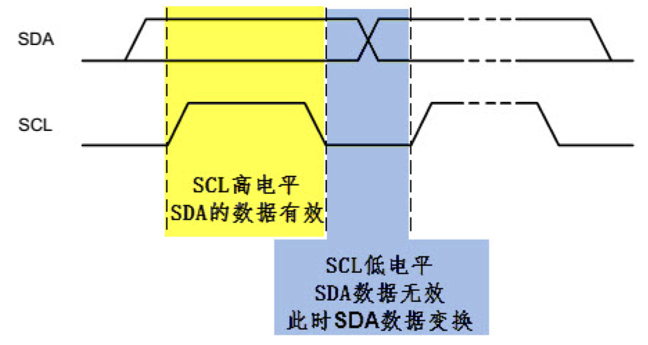
  <figcaption>图5-3　I²C数据有效性</figcaption>
</figure>

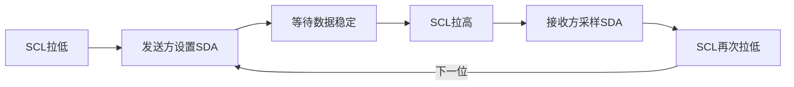
```mermaid
flowchart LR
    A["SCL拉低"] --> B["发送方设置SDA"]
    B --> C["等待数据稳定"]
    C --> D["SCL拉高"]
    D --> E["接收方采样SDA"]
    E --> F["SCL再次拉低"]
    F -->|"下一位"| B
```

I²C每次传输8位数据，并且先发送最高位MSB；第9个时钟不传普通数据，而是传输ACK/NACK应答位。

<figure class="course-figure">
  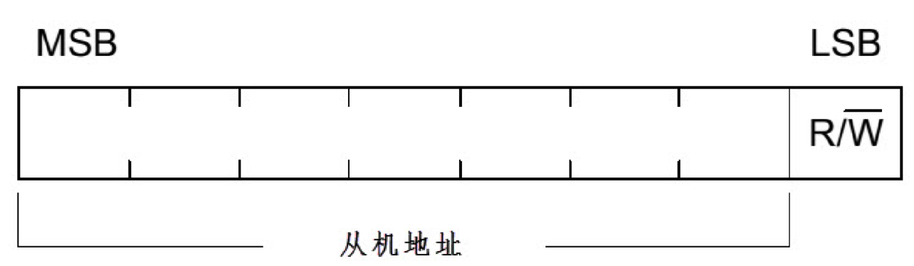
  <figcaption>图5-4　I²C字节格式</figcaption>
</figure>

```text
SCL：  1   2   3   4   5   6   7   8      9
SDA： D7  D6  D5  D4  D3  D2  D1  D0   ACK/NACK
      └────────── 8位数据 ──────────┘   应答位
```

### 3.4 第四步：发送地址并检查ACK/NACK

起始条件之后的第一个字节通常是地址字节，由7位设备地址和1位读写方向组成：

```text
bit7                                      bit0
+----+----+----+----+----+----+----+--------+
| A6 | A5 | A4 | A3 | A2 | A1 | A0 | R/W   |
+----+----+----+----+----+----+----+--------+
                                         0：写
                                         1：读
```

| 表示形式 | LM75A示例 |
|---|---:|
| 7位设备地址 | `0x4F` |
| 写地址字节 | `(0x4F << 1) | 0 = 0x9E` |
| 读地址字节 | `(0x4F << 1) | 1 = 0x9F` |

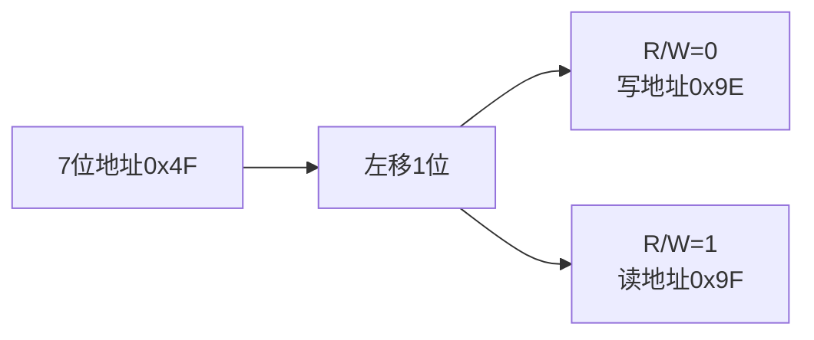
```mermaid
flowchart LR
    ADDR["7位地址0x4F"] --> SHIFT["左移1位"]
    SHIFT --> WRITE["R/W=0<br/>写地址0x9E"]
    SHIFT --> READ["R/W=1<br/>读地址0x9F"]
```

每发送完8位，发送方释放SDA，接收方在第9个时钟返回应答：

<figure class="course-figure">
  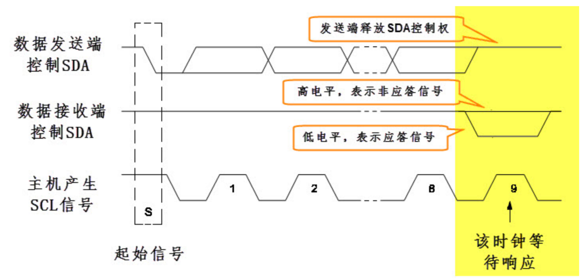
  <figcaption>图5-5　I²C ACK时序</figcaption>
</figure>

| 应答 | 第9个时钟的SDA | 含义 |
|---|---|---|
| ACK | 接收方拉低SDA | 已接收，可以继续 |
| NACK | SDA保持高电平 | 没有应答，或接收方不再继续 |

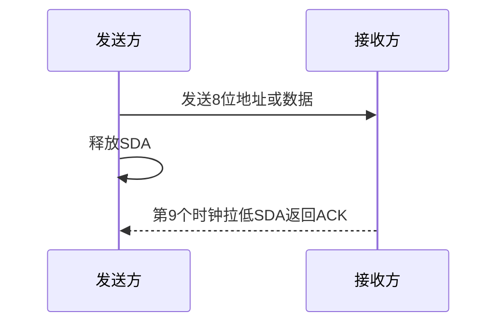
```mermaid
sequenceDiagram
    participant TX as 发送方
    participant RX as 接收方
    TX->>RX: 发送8位地址或数据
    TX->>TX: 释放SDA
    RX-->>TX: 第9个时钟拉低SDA返回ACK
```

主机读取多个字节时，中间字节后返回ACK表示“继续读取”；最后一个字节后返回NACK表示“读取结束”，随后产生STOP。

### 3.5 第五步：组合为指定地址写

**事务组合顺序：** START → 地址写方向 → 内部地址 → 数据 → STOP。

指定地址写用于向从机的某个内部寄存器或内部地址写入数据。


```mermaid
flowchart LR
    S["START"] --> AW["从机地址+W"]
    AW --> A1["ACK"]
    A1 --> REG["内部寄存器地址"]
    REG --> A2["ACK"]
    A2 --> DATA["写入数据"]
    DATA --> A3["ACK"]
    A3 --> P["STOP"]
```

| 阶段 | 谁发送 | 作用 |
|---|---|---|
| 从机地址+W | 主机 | 选择设备并说明要写 |
| 内部寄存器地址 | 主机 | 选择设备内部目标位置 |
| 数据 | 主机 | 写入目标内容 |
| ACK | 从机 | 确认上一字节已接收 |

对应本工程封装：

```c
I2C_WriteReg(dev_addr, reg_addr, pData, len);
```

### 3.6 第六步：组合为当前地址读

**事务组合顺序：** START → 地址读方向 → 数据 → NACK → STOP。

如果从机内部地址指针已经指向目标位置，主机可以直接以读方向访问，这就是当前地址读。


```mermaid
flowchart LR
    S["START"] --> AR["从机地址+R"]
    AR --> A["从机ACK"]
    A --> DATA["从机发送数据"]
    DATA --> N["最后一个字节后主机NACK"]
    N --> P["STOP"]
```

对应本工程封装：

```c
I2C_ReadCurrent(dev_addr, pData, len);
```

> 当前地址读依赖从机内部指针的当前位置。如果程序不能确定指针指向哪里，就不应直接使用这种事务。

### 3.7 第七步：组合为指定地址读

**事务组合顺序：** 先写内部地址，再通过重复起始切换到读方向。

读取指定内部寄存器时，主机先以写方向发送寄存器地址，再使用重复起始 `Re-START` 切换为读方向。


```mermaid
flowchart LR
    S1["START"] --> AW["从机地址+W"]
    AW --> A1["ACK"]
    A1 --> REG["内部寄存器地址"]
    REG --> A2["ACK"]
    A2 --> RS["Re-START"]
    RS --> AR["从机地址+R"]
    AR --> A3["ACK"]
    A3 --> DATA["从机发送数据"]
    DATA --> N["最后一个字节后主机NACK"]
    N --> P["STOP"]
```

对应本工程封装：

```c
I2C_ReadReg(dev_addr, reg_addr, pData, len);
```

这里先发送寄存器地址的阶段常被称为“假写”，但它并没有写入寄存器数据，只是在设置从机内部地址指针。

<figure class="course-figure">
  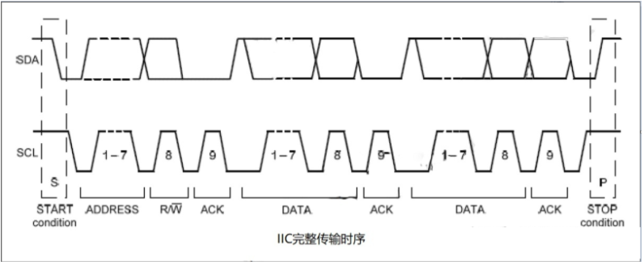
  <figcaption>图5-6　I²C完整传输时序</figcaption>
</figure>

### 3.8 最后：按顺序分析逻辑波形

拿到逻辑分析仪波形时，不要直接盯着数据值，应按照事务顺序逐项检查：


```mermaid
flowchart LR
    START["1. START是否正确"] --> ADDRESS["2. 设备地址是否正确"]
    ADDRESS --> RW["3. R/W方向是否正确"]
    RW --> ACK["4. 每个字节是否有ACK"]
    ACK --> DATA["5. 数据顺序是否正确"]
    DATA --> STOP["6. STOP是否正常"]
```

原课件中的实测波形：

| 波形1 | 波形2 | 波形3 |
|---|---|---|
| 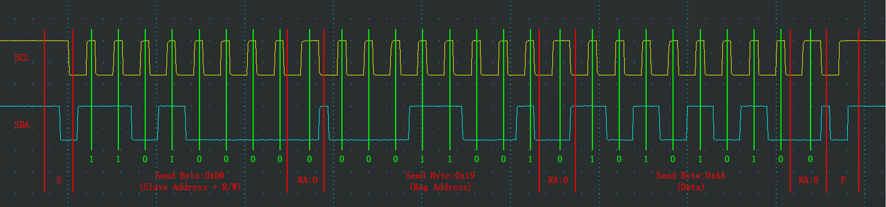 | 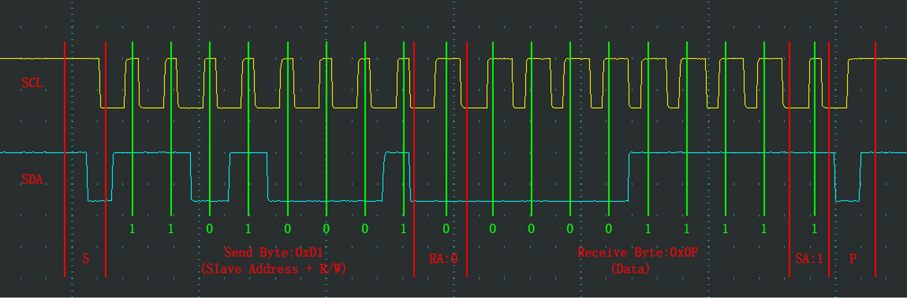 | 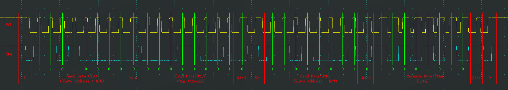 |

---

> **上一节结论**：一帧I²C通信由起始、地址、数据、应答和停止组成。下面把这些时序逐一翻译为GPIO操作。

---

## 4 软件模拟 I²C

> **内容衔接**：协议时序已经明确，现在用普通GPIO主动产生SCL和SDA波形。软件模拟I²C最适合帮助学生把协议图与每一行代码对应起来。

### 4.1 实现机制

软件模拟 I²C 又称 GPIO Bit-Banging：使用两个 GPIO 分别模拟 SCL 和 SDA，由 CPU 按照 I²C 时序逐步改变引脚状态。

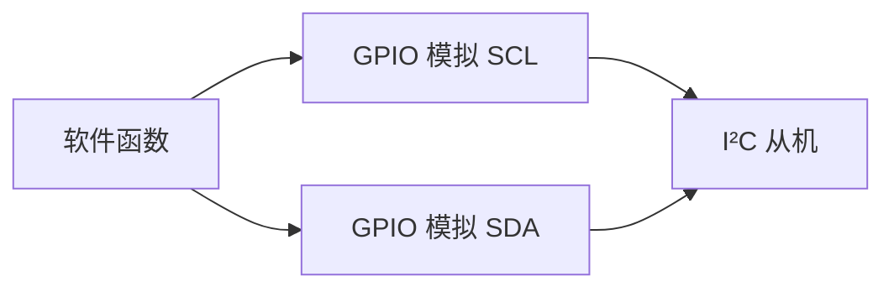
```mermaid
flowchart LR
    CODE[软件函数] --> GPIO_SCL[GPIO 模拟 SCL]
    CODE --> GPIO_SDA[GPIO 模拟 SDA]
    GPIO_SCL --> DEVICE[I²C 从机]
    GPIO_SDA --> DEVICE
```

| 优点 | 局限 |
|---|---|
| 引脚选择灵活 | 占用 CPU 时间 |
| 时序直观，便于学习 | 速度和时序精度受软件影响 |
| 容易调试和移植 | 中断可能改变时序 |
| 不依赖硬件 I²C 外设 | 多主、仲裁等功能实现复杂 |

### 4.2 GPIO 配置

本节代码来自工程：

```text
E:/HAL_STM32/GPIO_Demo/Hardware/i2c/i2c.c
E:/HAL_STM32/GPIO_Demo/Hardware/i2c/i2c.h
```

头文件使用宏统一控制 SCL、SDA，并读取 SDA 电平：

```c
#define I2C_SCL(x)                                                      \
    do                                                                  \
    {                                                                   \
        (x) ? HAL_GPIO_WritePin(GPIOB, SCL_Pin, GPIO_PIN_SET)           \
            : HAL_GPIO_WritePin(GPIOB, SCL_Pin, GPIO_PIN_RESET);        \
    } while (0)

#define I2C_SDA(x)                                                      \
    do                                                                  \
    {                                                                   \
        (x) ? HAL_GPIO_WritePin(GPIOB, SDA_Pin, GPIO_PIN_SET)           \
            : HAL_GPIO_WritePin(GPIOB, SDA_Pin, GPIO_PIN_RESET);        \
    } while (0)

#define I2C_SDA_READ HAL_GPIO_ReadPin(GPIOB, SDA_Pin)
```

工程初始化函数为 `i2c_init()`。为符合标准 I²C 的“线与”特性，SCL 和 SDA 都按开漏输出讲解；这与工程原文件中 SCL 使用推挽输出的写法相比，只调整了 `Mode`，函数接口保持不变。

```c
void i2c_init(void)
{
    GPIO_InitTypeDef GPIO_InitStruct = {0};

    __HAL_RCC_GPIOB_CLK_ENABLE();

    GPIO_InitStruct.Pin = SCL_Pin | SDA_Pin;
    GPIO_InitStruct.Mode = GPIO_MODE_OUTPUT_OD;
    GPIO_InitStruct.Pull = GPIO_NOPULL;
    GPIO_InitStruct.Speed = GPIO_SPEED_FREQ_HIGH;
    HAL_GPIO_Init(GPIOB, &GPIO_InitStruct);

    I2C_SCL(1);
    I2C_SDA(1);
}
```

> **工程核对**：源文件把 `SCL_Pin` 配置为 `GPIO_MODE_OUTPUT_PP`。单主机实验通常也能产生波形，但会失去时钟线的开漏共享能力，不能支持时钟拉伸和多主仲裁。课堂代码统一改为开漏输出。

### 4.3 基本信号

**代码阅读顺序：** 起始 → 停止 → 写1字节 → 等待应答 → 读1字节 → 主机返回ACK/NACK。

#### 4.3.1 起始条件

```c
void i2c_start(void)
{
    I2C_SCL(1);
    I2C_SDA(1);       /* 总线空闲 */
    delay_us(2);
    I2C_SDA(0);       /* SCL为高时，SDA产生下降沿 */
    delay_us(2);
    I2C_SCL(0);       /* 进入数据传输阶段 */
    delay_us(2);
}
```

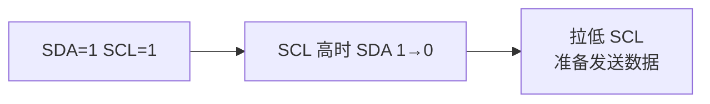
```mermaid
flowchart LR
    A[SDA=1 SCL=1] --> B[SCL 高时 SDA 1→0]
    B --> C[拉低 SCL<br/>准备发送数据]
```

#### 4.3.2 停止条件

```c
void i2c_stop(void)
{
    I2C_SDA(0);
    delay_us(2);
    I2C_SCL(1);
    delay_us(2);
    I2C_SDA(1);       /* SCL为高时，SDA产生上升沿 */
    delay_us(2);
}
```

#### 4.3.3 发送一个字节

I²C 先发送最高位：

```c
void i2c_sendByte(uint8_t byte)
{
    for (uint8_t i = 0; i < 8; i++)
    {
        I2C_SDA((byte & 0x80U) >> 7);
        delay_us(2);
        I2C_SCL(1);
        delay_us(2);
        I2C_SCL(0);
        byte <<= 1;
    }

    I2C_SDA(1);       /* 释放SDA，等待从机应答 */
}
```

#### 4.3.4 等待应答

发送方必须释放 SDA，把控制权交给接收方：

```c
uint8_t i2c_wait_ack(void)
{
    uint8_t result = 0;
    uint8_t timeout = 0;

    I2C_SDA(1);       /* 释放SDA，由从机驱动应答位 */
    delay_us(2);
    I2C_SCL(1);
    delay_us(2);

    while (I2C_SDA_READ == GPIO_PIN_SET)
    {
        timeout++;
        if (timeout > 250U)
        {
            i2c_stop();
            result = 1;
            break;
        }
    }

    I2C_SCL(0);
    delay_us(2);
    return result;    /* 0：收到ACK；1：NACK或超时 */
}
```

> 注意本工程返回值的含义：`i2c_wait_ack()==0` 表示成功收到 ACK，返回 `1` 表示 NACK 或等待超时。

#### 4.3.5 读取一个字节

```c
uint8_t i2c_recvByte(uint8_t ack)
{
    uint8_t byte = 0;

    I2C_SDA(1);       /* 释放SDA，由从机发送数据 */

    for (uint8_t i = 0; i < 8; i++)
    {
        byte <<= 1;
        I2C_SCL(1);
        delay_us(2);

        if (I2C_SDA_READ == GPIO_PIN_SET)
        {
            byte += 1;
        }

        I2C_SCL(0);
        delay_us(2);
    }

    if (ack == 0U)
    {
        i2c_ack();     /* 还要继续读取 */
    }
    else
    {
        i2c_nack();    /* 最后一个字节，结束读取 */
    }

    return byte;
}
```

#### 4.3.6 发送 ACK/NACK

```c
void i2c_ack(void)
{
    I2C_SDA(0);
    delay_us(2);
    I2C_SCL(1);
    delay_us(2);
    I2C_SCL(0);       /* 应答时钟结束，必须重新拉低SCL */
    I2C_SDA(1);       /* 释放SDA */
    delay_us(2);
}

void i2c_nack(void)
{
    I2C_SDA(1);
    delay_us(2);
    I2C_SCL(1);
    delay_us(2);
    I2C_SCL(0);
    delay_us(2);
}
```

| 调用 | 发送的应答 |
|---|---|
| `i2c_recvByte(0)` | 读取完成后发送 ACK，继续接收 |
| `i2c_recvByte(1)` | 读取完成后发送 NACK，结束接收 |

> **工程核对**：源文件中的 `i2c_ack()` 在 `I2C_SCL(1)` 后直接释放SDA，缺少 `I2C_SCL(0)`。SCL为高时释放SDA会形成类似停止条件的变化，因此课件使用上面的修正版。

### 4.4 软件驱动层次

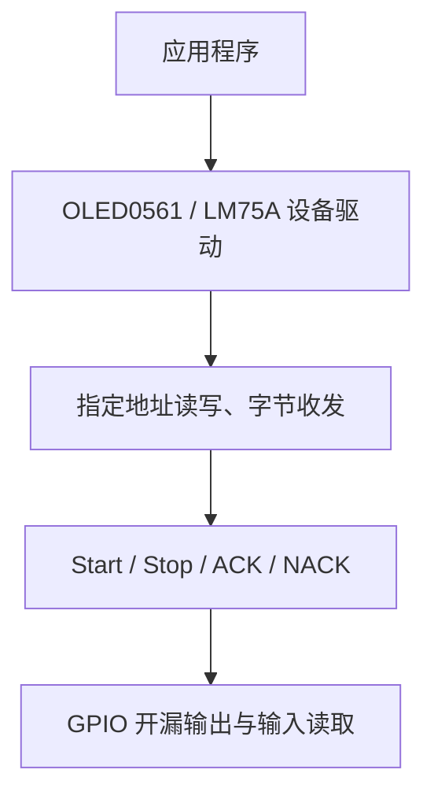
```mermaid
flowchart TD
    APP[应用程序] --> DEVICE[OLED0561 / LM75A 设备驱动]
    DEVICE --> BYTE[指定地址读写、字节收发]
    BYTE --> SIGNAL[Start / Stop / ACK / NACK]
    SIGNAL --> GPIO[GPIO 开漏输出与输入读取]
```

> 设备驱动不应到处直接操作 GPIO。将起始、停止、字节收发封装为底层接口后，设备驱动只需描述数据手册规定的通信流程。

### 4.5 与工程一致的便捷封装

`i2c.h` 在基本时序函数上继续封装了三种常用事务。三个函数统一接收 **7位从机地址**，内部再左移并添加读写位。

| 工程函数 | 对应协议事务 | 典型用途 |
|---|---|---|
| `I2C_WriteReg()` | 指定内部地址写 | 写配置寄存器、发送OLED命令或数据 |
| `I2C_ReadCurrent()` | 当前地址读 | 从设备当前指针处连续读取 |
| `I2C_ReadReg()` | 指定内部地址读 | 读取LM75A温度寄存器 |

#### 4.5.1 指定地址写

```c
uint8_t I2C_WriteReg(uint8_t dev_addr,
uint8_t reg_addr,
uint8_t *pData,
uint16_t len)
{
    i2c_start();
    i2c_sendByte((dev_addr << 1) | 0U);
    if (i2c_wait_ack())
    {
        i2c_stop();
        return 1;
    }

    i2c_sendByte(reg_addr);
    if (i2c_wait_ack())
    {
        i2c_stop();
        return 1;
    }

    while (len--)
    {
        i2c_sendByte(*pData++);
        if (i2c_wait_ack())
        {
            i2c_stop();
            return 1;
        }
    }

    i2c_stop();
    return 0;
}
```

#### 4.5.2 当前地址读

```c
uint8_t I2C_ReadCurrent(uint8_t dev_addr,
uint8_t *pData,
uint16_t len)
{
    if (len == 0U)
    {
        return 1;
    }

    i2c_start();
    i2c_sendByte((dev_addr << 1) | 1U);
    if (i2c_wait_ack())
    {
        i2c_stop();
        return 1;
    }

    while (len--)
    {
        *pData++ = i2c_recvByte((len == 0U) ? 1U : 0U);
    }

    i2c_stop();
    return 0;
}
```

#### 4.5.3 指定地址读

```c
uint8_t I2C_ReadReg(uint8_t dev_addr,
uint8_t reg_addr,
uint8_t *pData,
uint16_t len)
{
    if (len == 0U)
    {
        return 1;
    }

    i2c_start();
    i2c_sendByte((dev_addr << 1) | 0U);
    if (i2c_wait_ack())
    {
        i2c_stop();
        return 1;
    }

    i2c_sendByte(reg_addr);
    if (i2c_wait_ack())
    {
        i2c_stop();
        return 1;
    }

    i2c_start();       /* 重复起始，不先发送停止条件 */
    i2c_sendByte((dev_addr << 1) | 1U);
    if (i2c_wait_ack())
    {
        i2c_stop();
        return 1;
    }

    while (len--)
    {
        *pData++ = i2c_recvByte((len == 0U) ? 1U : 0U);
    }

    i2c_stop();
    return 0;
}
```

```mermaid
flowchart LR
    A["器件驱动<br/>OLED / LM75A"] --> B["I2C_WriteReg / I2C_ReadReg"]
    B --> C["i2c_start / stop"]
    B --> D["i2c_sendByte / recvByte"]
    B --> E["i2c_wait_ack / ack / nack"]
    C --> F["I2C_SCL / I2C_SDA / I2C_SDA_READ"]
    D --> F
    E --> F
    F --> G["HAL GPIO"]
```

---

> **上一节结论**：底层函数已经能够产生合法时序。接下来先用LM75A完成寄存器读取和数据解析，再用OLED完成命令发送与显存写入。

---

## 5 LM75A 与 OLED 驱动

> **内容衔接**：掌握基本时序后，用两个真实设备验证协议。OLED体现“连续写入命令和显示数据”，LM75A体现“先选择寄存器，再重复起始读取数据”。

本节只讲两个工程中实际使用的 I²C 外围设备：OLED0561 显示屏和 LM75A 温度传感器。

### 5.1 两个设备怎样协作？

```mermaid
flowchart LR
    LM75A[LM75A<br/>采集温度] -->|I²C 读取| STM32[STM32F103]
    STM32 --> FORMAT[格式化温度字符串]
    FORMAT -->|I²C 写入| OLED[OLED0561<br/>显示温度]
    STM32 -->|USART printf| PC[计算机串口]
```

| 设备 | 7 位地址 | 工程中的地址写法 | 数据方向 | 主要任务 |
|---|---:|---:|---|---|
| LM75A | `0x4F` | `0x9E/0x9F` | 双向 | 读取温度、读写配置寄存器 |
| OLED0561 | `0x3C` | `0x78` | STM32 → OLED | 发送命令和显示数据 |

> `0x78 = 0x3C << 1`，是OLED的左移后地址；`0x9E/0x9F`分别是LM75A的写/读地址字节。设备驱动统一保存7位地址，底层发送地址阶段再左移并添加读写位。

### 5.2 LM75A：先完成温度采集

**设备学习顺序：** 测温原理 → 地址与内部寄存器 → 数据格式 → I²C读写事务 → 工程驱动 → 温度采集与关断。

> 驱动来源：`E:/HAL_STM32/GPIO_Demo/Hardware/LM75A/lm75a.c`、`lm75a.h`
> 底层总线：`Hardware/i2c/i2c.c` 提供的软件 I²C 接口

#### 5.2.1 LM75A 怎样测量温度？

LM75A 是数字温度传感器。芯片内部先感知环境温度，再完成模数转换和数字编码，最后把测量结果保存到温度寄存器。STM32 通过 I²C 读取的是数字编码，不需要使用自身 ADC。

```mermaid
flowchart LR
    A["环境温度"] --> B["片内温度传感单元"]
    B --> C["模数转换与数字处理"]
    C --> D["Temp温度寄存器"]
    D -->|"I²C读取"| E["STM32"]
    E --> F["补码解析 × 0.125 ℃"]
    F --> G["实际温度"]
```

> 学习LM75A的关键不是记住一个读取函数，而是理解“选择内部寄存器—读取原始数据—解释数据格式”的完整过程。

#### 5.2.2 引脚、设备地址与内部寄存器

`A2、A1、A0` 决定LM75A的7位I²C地址。本工程三个地址引脚均接高电平，所以设备地址为 `0x4F`。

<figure class="course-figure">
  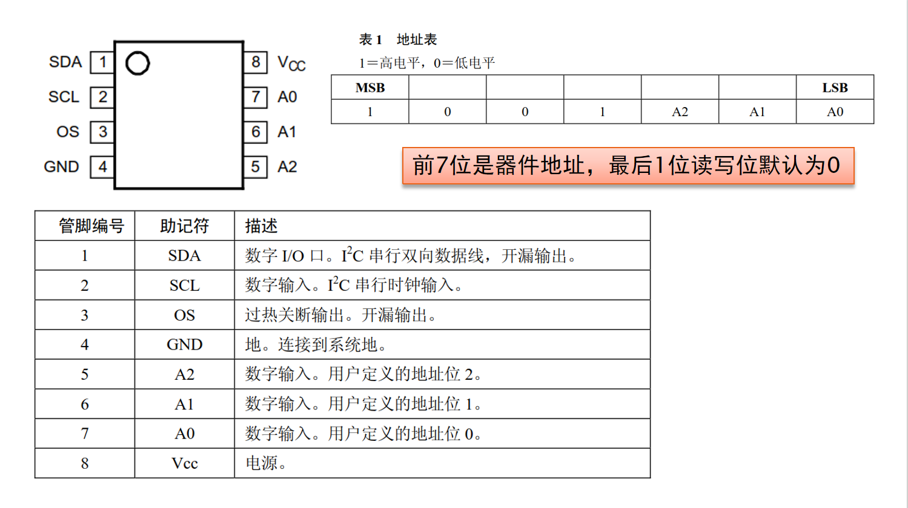
  <figcaption>图5-7　LM75A引脚与地址</figcaption>
</figure>

```c
#define LM75A_ADDR         0x4FU
#define LM75A_WRITE        ((LM75A_ADDR << 1) | 0U)  /* 0x9E */
#define LM75A_READ         ((LM75A_ADDR << 1) | 1U)  /* 0x9F */

#define LM75A_TEMP_REG     0x00U
#define LM75A_CONFIG_REG   0x01U
```

| 地址形式 | 数值 | 应在什么地方使用 |
|---|---:|---|
| 7位设备地址 | `0x4F` | 传给 `I2C_ReadReg()`、`I2C_WriteReg()` |
| 8位写地址字节 | `0x9E` | 底层发送地址阶段 |
| 8位读地址字节 | `0x9F` | 底层读取地址阶段 |

> 本工程便捷函数接收7位地址，因此调用时传 `LM75A_ADDR`，不能再传 `LM75A_WRITE` 或 `LM75A_READ`。

LM75A内部通过指针值选择4个主要寄存器：

<figure class="course-figure">
  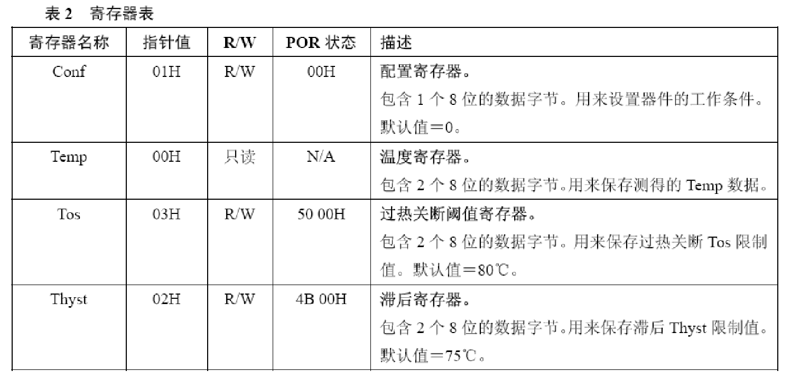
  <figcaption>图5-8　LM75A内部寄存器表</figcaption>
</figure>

|    指针值 | 寄存器   | 主要作用       | 本课处理方式 |
| -----: | ----- | ---------- | ------ |
| `0x00` | Temp  | 保存当前温度，2字节 | 重点读取   |
| `0x01` | Conf  | 配置工作模式     | 重点控制关断 |
| `0x02` | Thyst | 迟滞温度阈值     | 原理了解   |
| `0x03` | Tos   | 过温温度阈值     | 原理了解   |

#### 5.2.3 如何读取温度寄存器？

主机先以写方向发送Temp寄存器指针 `0x00`，再通过重复起始切换到读方向，连续读取高、低两个字节。

```mermaid
sequenceDiagram
    participant M as STM32
    participant L as LM75A
    M->>L: START + 0x9E（写地址字节）
    L-->>M: ACK
    M->>L: 0x00（选择Temp寄存器）
    L-->>M: ACK
    M->>L: Re-START + 0x9F（读地址字节）
    L-->>M: 高字节
    M->>L: ACK
    L-->>M: 低字节
    M->>L: NACK + STOP
```

在本工程中，上述总线事务已经封装为：

```c
uint8_t buffer[2];
uint8_t result = I2C_ReadReg(LM75A_ADDR,
LM75A_TEMP_REG,
buffer,
2U);
```

`I2C_ReadReg()` 内部完成“写寄存器指针—重复起始—连续读取—最后一个字节返回NACK—停止”的完整过程。

#### 5.2.4 温度数据怎样表示？

Temp寄存器返回2字节，高11位为有效温度数据，低5位不参与计算；有效值采用二进制补码，每个最低有效位代表 `0.125 ℃`。

<figure class="course-figure">
  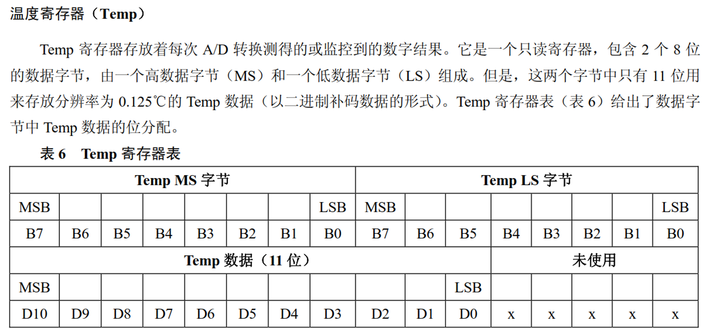
  <figcaption>图5-9　LM75A温度寄存器格式</figcaption>
</figure>

```mermaid
flowchart LR
    A["buffer[0]高字节"] --> C["拼成16位有符号数"]
    B["buffer[1]低字节"] --> C
    C --> D["算术右移5位"]
    D --> E["得到11位有符号温度编码"]
    E --> F["乘0.125 ℃"]
```

```c
static float LM75A_DecodeTemperature(uint8_t high, uint8_t low)
{
    int16_t raw = (int16_t)(((uint16_t)high << 8) | low);
    raw >>= 5;
    return (float)raw * 0.125f;
}
```

采用 `int16_t` 后，算术右移能够保留负温度符号，不需要再手工执行一次补码转换。

| 原始有效值 | 换算 | 温度 |
|---:|---:|---:|
| `200` | `200 × 0.125` | `25.0 ℃` |
| `1` | `1 × 0.125` | `0.125 ℃` |
| `-200` | `-200 × 0.125` | `-25.0 ℃` |

#### 5.2.5 工程驱动文件与接口

```text
Hardware/LM75A/
├─ lm75a.h    地址、寄存器和对外函数声明
└─ lm75a.c    温度读取与关断控制
```

```c
float LM75A_ReadTemperature(void);

void LM75A_EnterShutdown(void);

void LM75A_ExitShutdown(void);
```

```mermaid
flowchart TD
    APP["main.c应用"] --> API["lm75a.h"]
    API --> DRIVER["lm75a.c"]
    DRIVER --> READ["I2C_ReadReg"]
    DRIVER --> WRITE["I2C_WriteReg"]
    READ --> SOFT["软件I²C基本时序"]
    WRITE --> SOFT
```

#### 5.2.6 读取温度的工程实现

根据提供的 `lm75a.c` 整理后，温度读取函数如下。函数名称和底层调用保持与工程一致，并补充通信失败判断：

```c
float LM75A_ReadTemperature(void)
{
    uint8_t buffer[2];

    if (I2C_ReadReg(LM75A_ADDR,
    LM75A_TEMP_REG,
    buffer,
    2U) != 0U)
    {
        return -99.0f;
    }

    return LM75A_DecodeTemperature(buffer[0], buffer[1]);
}
```

```mermaid
flowchart TD
    A["调用LM75A_ReadTemperature"] --> B["I2C_ReadReg读取2字节"]
    B --> C{"通信成功？"}
    C -->|"否"| D["返回错误指示值"]
    C -->|"是"| E["拼接、右移并换算"]
    E --> F["返回摄氏温度"]
```

> `-99.0f` 作为错误值便于兼容当前函数原型，但正式项目更推荐返回状态码，并通过指针参数输出温度，避免错误值与合法测量值混淆。

#### 5.2.7 关断模式的工程实现

Conf寄存器bit0为1时进入关断模式，为0时恢复正常转换。为了保留其他配置位，应采用“读—改—写”。

```c
void LM75A_EnterShutdown(void)
{
    uint8_t config;

    if (I2C_ReadReg(LM75A_ADDR,
    LM75A_CONFIG_REG,
    &config,
    1U) != 0U)
    {
        return;
    }

    config |= 0x01U;
    (void)I2C_WriteReg(LM75A_ADDR,
    LM75A_CONFIG_REG,
    &config,
    1U);
}

void LM75A_ExitShutdown(void)
{
    uint8_t config;

    if (I2C_ReadReg(LM75A_ADDR,
    LM75A_CONFIG_REG,
    &config,
    1U) != 0U)
    {
        return;
    }

    config &= (uint8_t)~0x01U;
    (void)I2C_WriteReg(LM75A_ADDR,
    LM75A_CONFIG_REG,
    &config,
    1U);
}
```

```mermaid
flowchart LR
    A["读取Conf"] --> B{"目标状态"}
    B -->|"关断"| C["bit0置1"]
    B -->|"工作"| D["bit0清0"]
    C --> E["写回Conf"]
    D --> E
```

#### 5.2.8 应用调用与错误处理

```c
i2c_init();

float temperature = LM75A_ReadTemperature();
if (temperature > -99.0f)
{
    printf("Temperature: %.3f C\r\n", temperature);
}
else
{
    printf("LM75A communication error\r\n");
}
```

| 现象 | 优先检查 |
|---|---|
| 没有ACK | 7位地址是否为`0x4F`、A2～A0接线、供电和上拉 |
| 温度固定 | 是否正确发送Temp指针`0x00`、是否使用重复起始 |
| 负温度异常 | 是否使用有符号数并执行算术右移 |
| 偶发错误 | 检查总线波形、超时与错误返回值 |

### 5.3 OLED0561：再完成数据显示

**设备学习顺序：** 显示原理 → 显存组织 → 地址与控制字节 → 初始化 → 字符、汉字与图片 → 性能优化。

> 驱动来源：`E:/HAL_STM32/GPIO_Demo/Hardware/OLED0561/`
> 使用 `I2C_WriteReg()` 发送命令和显示数据

#### 5.3.1 OLED为什么能够显示图像？

OLED由大量可以独立发光的像素组成。STM32并不直接控制每个像素引脚，而是通过I²C把命令和显示数据发送给显示控制器。控制器把数据保存到显存，再驱动对应像素。

```mermaid
flowchart LR
    A["STM32准备命令和点阵数据"] --> B["软件I²C"]
    B --> C["OLED显示控制器"]
    C --> D["内部显存GDDRAM"]
    D --> E["行列驱动"]
    E --> F["128×64像素"]
```

#### 5.3.2 屏幕与显存怎样对应？

128×64屏幕纵向分成8页，每页高8个像素。一个数据字节控制同一列中的8个纵向像素。

```mermaid
flowchart TB
    S["128列 × 64行"] --> P["Page 0～Page 7"]
    P --> B["每页128个显示字节"]
    B --> X["每字节控制8个纵向像素"]
    X --> R["bit=1点亮，bit=0熄灭"]
```

| 概念 | 含义 | 驱动怎样操作 |
|---|---|---|
| Page | 8行像素组成的一页 | 发送 `0xB0～0xB7` |
| Column | 水平列位置 | 发送列地址高、低4位 |
| Data | 8个纵向像素 | 以控制字节`0x40`写入 |

#### 5.3.3 驱动文件与字模资源

```text
Hardware/OLED0561/
├─ oled0561.h      地址、控制字节和对外接口
├─ oled0561.c      初始化与显示函数
├─ ASCII_8x16.h    8×16 ASCII字模
├─ CHS_16x16.h     16×16汉字字模
└─ PIC1.h          128×64图片点阵
```

```mermaid
flowchart TD
    APP["main.c"] --> OLED["oled0561.c"]
    OLED --> ASCII["ASCII_8x16.h"]
    OLED --> CHS["CHS_16x16.h"]
    OLED --> PIC["PIC1.h"]
    OLED --> WRITE["I2C_WriteReg"]
    WRITE --> BUS["软件I²C"]
```

字模文件保存的是像素数据，不是可以直接显示的文字。驱动根据字符编码找到对应字模，再把点阵字节写入OLED显存。

#### 5.3.4 地址、控制字节与工程接口

```c
#define OLED0561_ADD 0x78U
#define COM          0x00U
#define DAT          0x40U
```

`OLED0561_ADD=0x78` 是已经左移后的8位写地址字节；而本工程 `I2C_WriteReg()` 接收7位地址，因此实际调用必须右移1位：

```c
I2C_WriteReg(OLED0561_ADD >> 1,
COM,
command_buffer,
command_length);
```

| 参数 | 总线上的作用 |
|---|---|
| `OLED0561_ADD >> 1` | 7位设备地址`0x3C` |
| `COM=0x00` | 控制字节，后续内容作为命令 |
| `DAT=0x40` | 控制字节，后续内容作为显存数据 |

```mermaid
flowchart LR
    A["START + 设备写地址"] --> B{"控制字节"}
    B -->|"0x00"| C["后续字节解释为命令"]
    B -->|"0x40"| D["后续字节写入显存"]
```

#### 5.3.5 初始化流程与命令序列

工程入口先关显示、清空显存，再写入初始化命令并开显示：

```c
void OLED0561_Init(void)
{
    OLED_DISPLAY_OFF();
    OLED_DISPLAY_CLEAR();
    OLED_DISPLAY_ON();
}
```

```mermaid
flowchart LR
    A["关闭显示"] --> B["清空8页显存"]
    B --> C["配置时钟、扫描方向、复用率等"]
    C --> D["开启电荷泵"]
    D --> E["发送0xAF开启显示"]
```

工程通过数组批量发送初始化命令：

```c
void OLED_DISPLAY_ON(void)
{
    uint8_t commands[28] = {
        0xAE,
        0x00, 0x10,
        0xD5, 0x80,
        0xA8, 0x3F,
        0xD3, 0x00,
        0xB0,
        0x40,
        0x8D, 0x14,
        0xA1,
        0xC8,
        0xDA, 0x12,
        0x81, 0xFF,
        0xD9, 0xF1,
        0xDB, 0x30,
        0x20, 0x00,
        0xA4,
        0xA6,
        0xAF
    };

    (void)I2C_WriteReg(OLED0561_ADD >> 1,
    COM,
    commands,
    sizeof(commands));
}
```

> 初始化命令必须与实际控制器和模块连接方式匹配。SSD1306与SH1106结构相似，但显存列数、列偏移和寻址行为可能不同，不能只修改芯片名称。

#### 5.3.6 清屏为什么是写满整个显存？

清屏不是发送一个“清屏命令”，而是依次选择8个页面，并把每个显示数据字节写成 `0x00`。

```mermaid
flowchart TD
    A["选择Page 0"] --> B["设置起始列"]
    B --> C["连续写0x00"]
    C --> D{"8页全部完成？"}
    D -->|"否"| E["切换下一页"]
    E --> B
    D -->|"是"| F["所有像素熄灭"]
```

提供的工程当前逐字节调用 `I2C_WriteReg()`。这种写法便于理解，但每个字节都会产生新的I²C事务。更高效的方法是准备一页缓冲区并批量写入。

```c
uint8_t clear_buffer[128] = {0};

for (uint8_t page = 0; page < 8U; page++)
{
    OLED_SetPosition(page, 0U);
    (void)I2C_WriteReg(OLED0561_ADD >> 1,
    DAT,
    clear_buffer,
    sizeof(clear_buffer));
}
```

#### 5.3.7 8×16字符与字符串显示

一个8×16字符占两页、每页8个字节。`ASCII_8x16.h` 中每个字符保存16字节点阵：前8字节写上半页，后8字节写下半页。

```mermaid
flowchart LR
    A["ASCII字符码"] --> B["查ASCII_8x16字模"]
    B --> C["前8字节写当前页"]
    B --> D["后8字节写下一页"]
    C --> E["形成8×16字符"]
    D --> E
```

```c
void OLED_DISPLAY_8x16_BUFFER(uint8_t row, uint8_t *str)
{
    uint8_t column = 0;

    while (*str != '\0')
    {
        OLED_DISPLAY_8x16(row, column * 8U, *str);
        str++;
        column++;
    }
}
```

#### 5.3.8 汉字显示与编码

`CHS_16x16.h` 中每个汉字包含2字节编码和32字节点阵。驱动先用字符串中的双字节编码查找字模，再将上、下两部分分别写入相邻页面。

```mermaid
flowchart TD
    A["读取汉字双字节编码"] --> B["遍历z_GB_16字模表"]
    B --> C{"找到匹配项？"}
    C -->|"是"| D["写32字节点阵"]
    C -->|"否"| E["跳过或显示占位符"]
    D --> F["列坐标增加16"]
    E --> F
    F --> G{"超出当前行？"}
    G -->|"是"| H["页地址增加2并换行"]
    G -->|"否"| A
    H --> A
```

> 工程注释按GB2312/GBK双字节编码处理汉字。如果编译器源文件采用UTF-8，一个汉字通常占3字节，原来的双字节查找逻辑会失败。字符编码必须与字模索引方式保持一致。

#### 5.3.9 图片显示

`PIC1.h` 保存一幅128×64图片的点阵。全屏图像需要：

$$
128 \times 64 \div 8 = 1024\text{ Byte}
$$

显示流程与清屏一致，只是写入的不是全0数组，而是图片点阵：

```mermaid
flowchart LR
    A["PIC1点阵数组"] --> B["按页选择128字节"]
    B --> C["设置页和列"]
    C --> D["以DAT=0x40写入"]
    D --> E["8页完成后得到整屏图像"]
```

#### 5.3.10 OLED对外接口与应用调用

```c
void OLED0561_Init(void);

void OLED_DISPLAY_ON(void);

void OLED_DISPLAY_OFF(void);

void OLED_DISPLAY_LIT(uint8_t brightness);

void OLED_DISPLAY_CLEAR(void);

void OLED_DISPLAY_8x16(uint8_t page, uint8_t column, uint16_t character);

void OLED_DISPLAY_8x16_BUFFER(uint8_t row, uint8_t *str);

void OLED_DISPLAY_16x16(uint8_t page, uint8_t column, uint16_t index);

void OLED_Display_String(uint8_t start_page,
uint8_t start_col,
const char *chinese_str);

void OLED_DISPLAY_PIC1(void);
```

```c
OLED0561_Init();
OLED_DISPLAY_LIT(100U);

OLED_DISPLAY_PIC1();
HAL_Delay(1000U);
OLED_DISPLAY_CLEAR();

OLED_DISPLAY_8x16_BUFFER(0U, (uint8_t *)"   Jsetc-LG ");
OLED_DISPLAY_8x16_BUFFER(6U, (uint8_t *)"  Temp:");
OLED_Display_String(2U, 2U * 16U, "嵌入式智能硬件");
```

#### 5.3.11 OLED驱动优化

| 当前实现 | 适合教学的原因 | 工程优化方向 |
|---|---|---|
| 每个数据字节调用一次写函数 | 时序与代码容易对应 | 按页或按块批量发送 |
| 直接写屏 | 调用关系简单 | 增加1024字节帧缓冲区 |
| 全屏清空或刷新 | 行为直观 | 只刷新变化区域 |
| 字模表直接查找 | 便于理解点阵 | 增加字符范围和编码检查 |
| 忽略部分返回值 | 示例简洁 | 每层返回并处理错误状态 |

```mermaid
flowchart LR
    A["逐字节写屏"] --> B["批量写一页"]
    B --> C["增加帧缓冲"]
    C --> D["只刷新脏区域"]
    D --> E["减少总线事务和屏幕闪烁"]
```

### 5.4 完整应用流程

主程序先完成LM75A温度采集，再把结果交给OLED显示：

```mermaid
flowchart TD
    INIT["HAL、时钟、GPIO和USART初始化"] --> I2C["i2c_init初始化软件I²C"]
    I2C --> LM["调用LM75A_ReadTemperature"]
    LM --> OK{"读取成功？"}
    OK -->|"否"| ERROR["串口输出通信故障"]
    OK -->|"是"| OLED_INIT["初始化OLED"]
    OLED_INIT --> FORMAT["格式化温度字符串"]
    FORMAT --> OLED["OLED显示温度"]
    FORMAT --> UART["串口输出温度"]
    OLED --> DELAY["周期等待"]
    UART --> DELAY
    ERROR --> DELAY
    DELAY --> LM
```

核心代码可以整理为：

```c
char info[30];

i2c_init();
OLED0561_Init();
OLED_DISPLAY_LIT(100U);
OLED_DISPLAY_8x16_BUFFER(0U, (uint8_t *)"   Jsetc-LG ");
OLED_DISPLAY_8x16_BUFFER(6U, (uint8_t *)"  Temp:");

while (1)
{
    float temperature = LM75A_ReadTemperature();

    if (temperature > -99.0f)
    {
        snprintf(info,
        sizeof(info),
        "  Temp:%.2fC",
        (double)temperature);

        OLED_DISPLAY_8x16_BUFFER(6U, (uint8_t *)info);
        printf("当前温度：%.2f C\r\n", (double)temperature);
    }
    else
    {
        printf("LM75A communication error\r\n");
    }

    HAL_Delay(2000U);
}
```

### 5.5 驱动分层

```mermaid
flowchart TD
    MAIN["main.c应用逻辑"] --> LM75_API["LM75A设备驱动"]
    MAIN --> OLED_API["OLED0561设备驱动"]
    LM75_API --> TRANS["I2C_ReadReg / I2C_WriteReg"]
    OLED_API --> TRANS
    TRANS --> BYTE["i2c_sendByte / i2c_recvByte"]
    BYTE --> SIGNAL["Start / Stop / ACK / NACK"]
    SIGNAL --> GPIO["HAL GPIO操作"]
    GPIO --> BUS["I²C总线"]
    BUS --> LM75["LM75A"]
    BUS --> OLED["OLED0561"]
```

| 层次 | 应负责什么 | 不应负责什么 |
|---|---|---|
| 应用层 | 决定何时采样、显示和关断 | 不直接拼接 I²C 时序 |
| 设备驱动层 | 解释 OLED 命令和 LM75A 数据格式 | 不关心业务流程 |
| I²C 传输层 | 完成寄存器读写和字节传输 | 不解释温度或字模 |
| GPIO/硬件层 | 产生真实 SDA/SCL 信号 | 不处理设备业务 |

---

> **上一节结论**：不同器件的业务不同，但底层都在重复相同的I²C步骤。下面让硬件外设自动完成这些基础动作。

---

## 6 STM32硬件I²C工作原理

> **内容衔接**：软件模拟由CPU逐次控制GPIO，便于理解但占用处理器。STM32硬件I²C把起始、地址、应答和数据移位交给外设状态机完成。

### 6.1 为什么还要认识硬件I²C？

前面的软件I²C由CPU逐次控制SCL和SDA，适合学习协议，也方便选择任意GPIO；但每一位数据都需要软件参与。STM32硬件I²C把起始、停止、地址发送、数据移位和应答处理交给片上外设状态机。

```mermaid
flowchart LR
    CPU["CPU提交地址和数据"] --> PERI["STM32 I²C外设状态机"]
    CLOCK["APB外设时钟"] --> PERI
    PERI --> SCL["自动产生SCL"]
    PERI <--> SDA["自动收发SDA"]
    PERI --> EVENT["完成、中断或错误事件"]
    EVENT --> CPU
```

| 对比项 | 软件模拟I²C | STM32硬件I²C |
|---|---|---|
| 时序产生 | CPU操作GPIO | 外设状态机自动产生 |
| CPU占用 | 较高 | 较低 |
| 引脚选择 | 灵活 | 受复用功能限制 |
| 协议理解 | 波形与代码直接对应 | 需要理解外设状态和HAL封装 |
| 中断与DMA | 需要自行设计 | 外设原生支持 |

### 6.2 硬件外设内部完成什么？

```mermaid
flowchart TD
    CFG["配置时钟频率和自身地址"] --> START["请求产生START"]
    START --> ADDR["硬件移出设备地址和方向位"]
    ADDR --> ACK{"从机应答？"}
    ACK -->|"否"| ERROR["产生应答失败错误"]
    ACK -->|"是"| DATA["通过数据寄存器收发字节"]
    DATA --> NEXT{"还有数据？"}
    NEXT -->|"是"| DATA
    NEXT -->|"否"| STOP["产生STOP"]
```

虽然开发时不再直接操作寄存器，但仍需理解以下状态：

| 状态 | 含义 | HAL调用失败时的排查方向 |
|---|---|---|
| BUSY | 总线正在通信或被持续拉低 | 检查SDA/SCL电平和未完成事务 |
| 地址应答失败 | 从机没有返回ACK | 检查7位地址、供电和接线 |
| 发送/接收完成 | 指定数据已经传输 | 进入下一步业务处理 |
| 总线错误 | 出现非法起始、停止或电平变化 | 检查上拉、干扰和时序 |
| 仲裁丢失 | 多主环境下本机失去总线控制 | 等待总线空闲后重试 |

### 6.3 从协议步骤到HAL函数

HAL并没有创造新的I²C协议，只是把常见事务交给硬件外设完成：

```mermaid
flowchart LR
    P["I²C协议事务"] --> M["主机直接收发"]
    P --> R["内部寄存器/存储器访问"]
    M --> HM["HAL_I2C_Master_Transmit / Receive"]
    R --> HR["HAL_I2C_Mem_Write / Mem_Read"]
    HM --> HW["STM32硬件I²C"]
    HR --> HW
```

> 本讲不再提供硬件I²C寄存器版本。软件I²C用于讲清协议与当前OLED/LM75A工程；需要使用片上硬件I²C时，统一采用下一章的HAL接口。

---

> **上一节结论**：硬件I²C通过外设状态机组织通信流程。下面看HAL如何封装同一套硬件。

---

## 7 HAL 库开发

> **内容衔接**：硬件寄存器展示了I²C状态机如何工作；HAL进一步把常见收发流程封装成函数。学习HAL时仍要能把函数参数还原为总线上的地址、方向和数据阶段。

### 7.1 CubeMX 配置

```mermaid
flowchart LR
    MCU[1 选择 MCU] --> DEBUG[2 配置 SWD]
    DEBUG --> CLOCK[3 配置 RCC 和时钟]
    CLOCK --> I2C[4 配置 I²C]
    I2C --> GPIO[5 检查 GPIO]
    GPIO --> PROJECT[6 生成工程]
```

| 创建工程 | 选择芯片 |
|---|---|
| 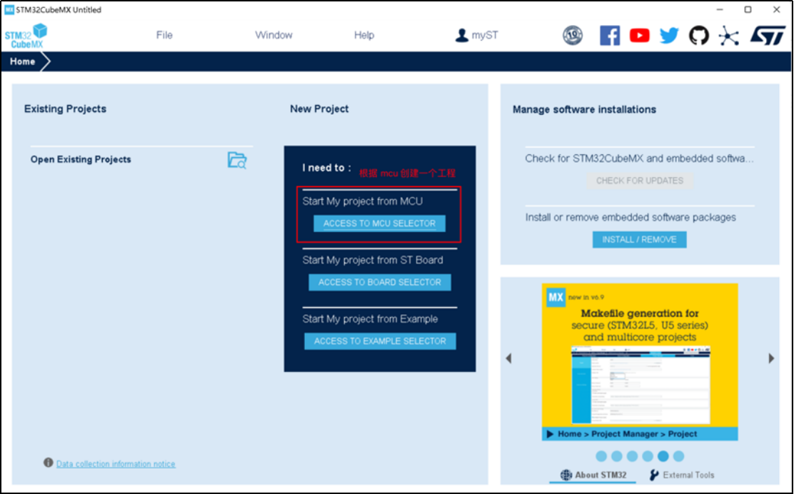 |  |

| 配置 I²C | 检查 I²C 引脚 |
|---|---|
|  |  |

> CubeMX 中的 `Serial Wire` 是 SWD 调试接口，不是串口通信。建议保留 SWD 下载调试功能。

### 7.2 初始化函数

```c
HAL_StatusTypeDef HAL_I2C_Init(I2C_HandleTypeDef *hi2c);
```

```c
hi2c1.Instance = I2C1;
hi2c1.Init.ClockSpeed = 100000;
hi2c1.Init.DutyCycle = I2C_DUTYCYCLE_2;
hi2c1.Init.OwnAddress1 = 0;
hi2c1.Init.AddressingMode = I2C_ADDRESSINGMODE_7BIT;
hi2c1.Init.DualAddressMode = I2C_DUALADDRESS_DISABLE;
hi2c1.Init.OwnAddress2 = 0;
hi2c1.Init.GeneralCallMode = I2C_GENERALCALL_DISABLE;
hi2c1.Init.NoStretchMode = I2C_NOSTRETCH_DISABLE;
HAL_I2C_Init(&hi2c1);
```

`HAL_I2C_MspInit()` 负责与具体硬件相关的底层初始化，例如 GPIO、外设时钟、NVIC 和 DMA。

### 7.3 主机收发函数

**选择原则：** 简单低频任务可用阻塞方式；需要CPU并行处理时选择中断；连续大批量传输可考虑DMA。

#### 7.3.1 阻塞方式

```c
HAL_StatusTypeDef HAL_I2C_Master_Transmit(
I2C_HandleTypeDef *hi2c,
uint16_t DevAddress,
uint8_t *pData,
uint16_t Size,
uint32_t Timeout);
```

```c
HAL_StatusTypeDef HAL_I2C_Master_Receive(
I2C_HandleTypeDef *hi2c,
uint16_t DevAddress,
uint8_t *pData,
uint16_t Size,
uint32_t Timeout);
```

HAL 的 `DevAddress` 参数通常需要传入左移一位后的 7 位地址：

```c
#define LM75A_HAL_ADDR (0x4FU << 1)
```

指定地址写时，可以把内部寄存器地址和数据放在同一缓冲区：

```c
uint8_t tx_data[2] = {LM75A_CONFIG_REG, 0x00U};

HAL_I2C_Master_Transmit(&hi2c1,
LM75A_HAL_ADDR,
tx_data,
sizeof(tx_data),
100U);
```

#### 7.3.2 中断方式

| 操作 | 函数 |
|---|---|
| 主机中断发送 | `HAL_I2C_Master_Transmit_IT()` |
| 主机中断接收 | `HAL_I2C_Master_Receive_IT()` |
| 发送完成回调 | `HAL_I2C_MasterTxCpltCallback()` |
| 接收完成回调 | `HAL_I2C_MasterRxCpltCallback()` |
| 错误回调 | `HAL_I2C_ErrorCallback()` |

```c
void HAL_I2C_MasterRxCpltCallback(I2C_HandleTypeDef *hi2c)
{
    if (hi2c->Instance == I2C1)
    {
        i2c_rx_ready = 1U;
    }
}
```

中断模式只启动一次操作。下一次收发需要在合适的位置重新调用启动函数。

#### 7.3.3 DMA 方式

DMA 适合较长数据块或频繁传输，可以降低 CPU 逐字节搬运数据的负担。LM75A 每次只读取少量数据，阻塞方式通常足够；OLED 大块刷新时更值得考虑批量传输或 DMA。

### 7.4 存储器访问函数

**关键认识：** HAL中的Memory并不只表示EEPROM，而是指“先发送一个器件内部地址，再收发数据”的通用访问模型。OLED控制字节和LM75A寄存器指针也可按这一模型理解。

带内部寄存器或存储地址的 I²C 设备，优先使用 HAL 的 Memory 接口：

```c
HAL_StatusTypeDef HAL_I2C_Mem_Write(
I2C_HandleTypeDef *hi2c,
uint16_t DevAddress,
uint16_t MemAddress,
uint16_t MemAddSize,
uint8_t *pData,
uint16_t Size,
uint32_t Timeout);
```

```c
HAL_StatusTypeDef HAL_I2C_Mem_Read(
I2C_HandleTypeDef *hi2c,
uint16_t DevAddress,
uint16_t MemAddress,
uint16_t MemAddSize,
uint8_t *pData,
uint16_t Size,
uint32_t Timeout);
```

#### 7.4.1 Memory Write 时序

```mermaid
flowchart LR
    S[起始] --> AW[设备地址 + W]
    AW --> MEM[内部地址]
    MEM --> DATA[写入数据]
    DATA --> P[停止]
```

#### 7.4.2 Memory Read 时序

```mermaid
flowchart LR
    S[起始] --> AW[设备地址 + W]
    AW --> MEM[内部地址]
    MEM --> RS[重复起始]
    RS --> AR[设备地址 + R]
    AR --> DATA[接收数据]
    DATA --> P[停止]
```

HAL 自动完成内部地址、重复起始和读写方向切换，不需要应用程序手工组织“假写”时序。

#### 7.4.3 地址宽度

| 内部地址长度 | 参数 |
|---|---|
| 8 位内部地址 | `I2C_MEMADD_SIZE_8BIT` |
| 16 位内部地址 | `I2C_MEMADD_SIZE_16BIT` |

设备地址和内部地址是两个不同概念：

```text
DevAddress：选择总线上的哪一个芯片
MemAddress：选择该芯片内部的哪一个寄存器或存储单元
```

### 7.5 工程驱动调用

HAL 工程对同一个 I²C1 句柄进行复用：

```mermaid
flowchart TD
    HI2C[hi2c1] --> OLED_CALL[OLED0561 驱动<br/>HAL_I2C_Mem_Write]
    HI2C --> LM_READ[LM75A 读取<br/>HAL_I2C_Mem_Read]
    HI2C --> LM_CONFIG[LM75A 配置<br/>Mem Read + Mem Write]
```

| 外设 | 主要 HAL 函数 | 数据特点 |
|---|---|---|
| OLED0561 | `HAL_I2C_Mem_Write()` | 主要写入，显示数据量较大 |
| LM75A | `HAL_I2C_Mem_Read/Write()` | 少量寄存器读写 |

两个驱动的完整工程代码与优化方式已在第5章展开，此处重点是理解 HAL Memory 接口如何分别适配 OLED 控制字节和 LM75A 内部寄存器地址。

### 7.6 错误排查

```mermaid
flowchart TD
    START[I²C 通信失败] --> LEVEL{SDA/SCL 空闲时为高?}
    LEVEL -->|否| FIX1[检查上拉、短路和被占用总线]
    LEVEL -->|是| STARTBIT{有起始和时钟?}
    STARTBIT -->|否| FIX2[检查 GPIO、时钟和外设使能]
    STARTBIT -->|是| ADDRESS{地址后有 ACK?}
    ADDRESS -->|否| FIX3[检查地址、左移、电源和接线]
    ADDRESS -->|是| DATA{数据格式正确?}
    DATA -->|否| FIX4[检查内部地址、字节序和时序]
    DATA -->|是| SOFTWARE[检查返回值和上层解析]
```

| 现象 | 常见原因 |
|---|---|
| SDA/SCL 始终为低 | 无上拉、短路、从机锁住总线、GPIO 模式错误 |
| 地址无 ACK | 设备地址错误、重复左移、器件未供电 |
| 读到固定 `0xFF` | 从机未驱动 SDA、地址错误、线路被上拉 |
| 读到固定 `0x00` | SDA 被拉低或设备异常 |
| 波形上升太慢 | 上拉阻值过大或总线电容过大 |
| OLED 没有显示 | 控制字节、初始化命令、列偏移或地址错误 |
| 温度数值错误 | 有效位、符号扩展、右移位数或比例错误 |
| HAL 返回 `HAL_BUSY` | 上一次操作未完成或总线状态未恢复 |

---

> **上一节结论**：软件I²C和HAL硬件I²C遵循同一套总线协议，OLED与LM75A设备驱动都建立在统一的读写事务之上。

---

## 8 总结

> **回到主线**：I²C学习不能停留在函数调用，应能从电气连接、协议时序、器件手册、底层实现和错误现象五个层面定位问题。

### 8.1 内容主线

```mermaid
flowchart LR
    NEED[为什么需要 I²C] --> PHYSICAL[开漏与上拉]
    PHYSICAL --> PROTOCOL[起始、地址、ACK、数据、停止]
    PROTOCOL --> SOFT[软件模拟 I²C]
    SOFT --> DEVICE[OLED0561 / LM75A 驱动]
    DEVICE --> HARDWARE[STM32 硬件 I²C]
    HARDWARE --> HAL[HAL 库开发]
```

### 8.2 核心结论

| 核心问题 | 结论 |
|---|---|
| I²C 为什么只需要两根信号线？ | 多个设备共享 SDA 和 SCL，并通过地址区分 |
| 为什么必须使用开漏和上拉？ | 多个设备才能安全共享线路并实现应答和仲裁 |
| 数据什么时候有效？ | SCL 高时 SDA 稳定，SCL 低时允许改变 SDA |
| 起始和停止如何识别？ | SCL 高时 SDA 下降为起始，上升为停止 |
| 一个字节后为什么有第 9 个时钟？ | 接收方在第 9 位返回 ACK 或 NACK |
| 7 位地址为什么要左移？ | 地址字节最低位用于表示读写方向 |
| 指定寄存器读取为什么先写？ | 先把内部地址指针设置到目标寄存器，再重复起始读取 |
| 软件和硬件 I²C 有何区别？ | 软件控制每个 GPIO 时序，硬件外设自动产生协议时序 |
| HAL Memory 接口有什么作用？ | 自动完成内部地址和重复起始读写流程 |
| OLED 的 `0x00/0x40` 是什么？ | 控制字节，分别表示后续内容是命令或显示数据 |
| LM75A 温度如何得到？ | 合并两字节，算术右移5位，再乘以0.125 °C |
| 为什么 OLED 和 LM75A 能共用 I²C1？ | 两个设备地址不同，主机通过地址选择目标设备 |

> I²C 开发流程：
> **检查开漏和上拉 → 确认 OLED/LM75A 的7位地址 → 根据控制字节或内部寄存器组织传输 → 检查 ACK 和返回状态 → 显示或解析设备数据。**
