# 嵌入式智能硬件开发（06）——定时器。

---

## 0 本讲内容主线

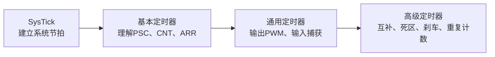
```mermaid
flowchart LR
    A["SysTick<br/>建立系统节拍"] --> B["基本定时器<br/>理解PSC、CNT、ARR"]
    B --> C["通用定时器<br/>输出PWM、输入捕获"]
    C --> D["高级定时器<br/>互补、死区、刹车、重复计数"]
```

| 学习阶段 | 先回答的问题 | 对应硬件能力 |
|---|---|---|
| SysTick | 程序怎样获得稳定的毫秒时间？ | 内核递减计数与异常 |
| 基本定时器 | PSC和ARR怎样共同决定定时时间？ | 时基与更新事件 |
| 通用定时器 | 怎样产生或测量PWM？ | 捕获/比较通道 |
| 高级定时器 | 怎样安全驱动功率器件并控制脉冲数量？ | 互补输出、死区、刹车、RCR |

---

## 1 SysTick：建立系统时间基准

> **内容衔接**：程序首先需要一个稳定的“时间刻度”。SysTick位于Cortex-M内核中，最适合先讲清楚1 ms节拍、定时中断和延时函数，为后续外设定时器打基础。

### 1.1 SysTick是什么

- **SysTick是ARM Cortex-M内核集成的24位递减计数器**

- **专为操作系统或实时任务提供精确的时间基准**

### 1.2 SysTick为什么适合作为系统节拍

- **独立性 ：不依赖特定外设模块，属于CPU内核资源，所有Cortex-M系列芯片均支持**

- **固定时钟源 ：可选择内核时钟（如HCLK）或 HCLK的1/8（具体取决于控制寄存器的设置）**

- **中断驱动 ：计数器归零时触发中断，适用于周期性任务调度**

  - **SysTick定时器能产生中断，CM3为它专门开出一个异常类型**

    <figure class="course-figure">
      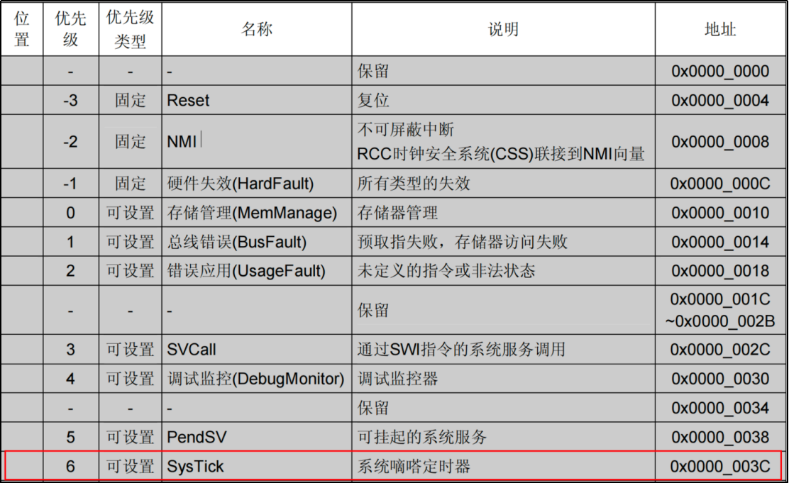
      <figcaption>图6-1　SysTick定时器能产生中断，CM3为它专门开出一个异常类型</figcaption>
    </figure>

  - **在所有CM3产品间SysTick的处理方式都是相同的**

### 1.3 从寄存器理解SysTick

**阅读顺序：** `CTRL`决定怎样工作 → `LOAD`决定周期 → `VAL`反映当前计数 → `Handler`处理到时事件。

- **相关寄存器**

  - **CTRL 控制寄存器（使能计数器、选择时钟源、中断使能等）**

    <figure class="course-figure">
      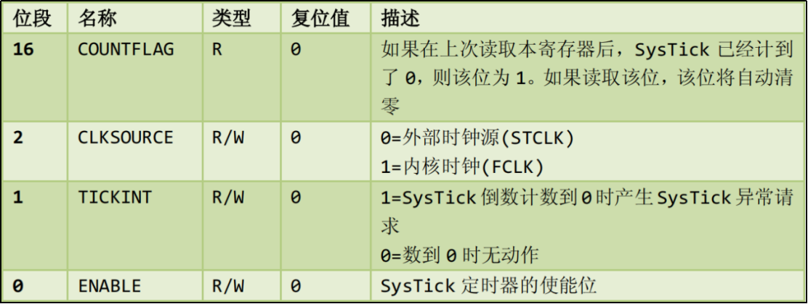
      <figcaption>图6-2　CTRL 控制寄存器（使能计数器、选择时钟源、中断使能等）</figcaption>
    </figure>

    <figure class="course-figure">
      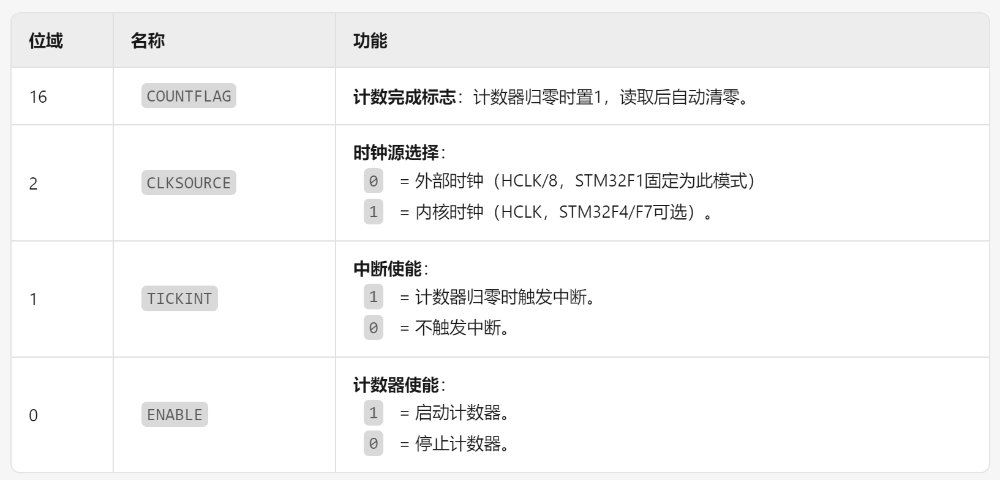
      <figcaption>图6-3　CTRL 控制寄存器（使能计数器、选择时钟源、中断使能等）</figcaption>
    </figure>

  - **LOAD 重装载值寄存器（设置计数器的初始值）**

    <figure class="course-figure">
      
      <figcaption>图6-4　LOAD 重装载值寄存器（设置计数器的初始值）</figcaption>
    </figure>

    <figure class="course-figure">
      
      <figcaption>图6-5　LOAD 重装载值寄存器（设置计数器的初始值）</figcaption>
    </figure>

    <figure class="course-figure">
      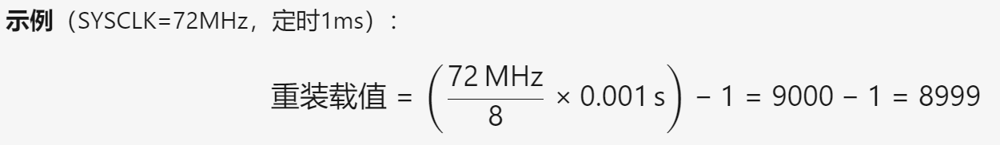
      <figcaption>图6-6　LOAD 重装载值寄存器（设置计数器的初始值）</figcaption>
    </figure>

  - **VAL当前值寄存器（读取当前计数值或写入任意值清零计数器）**

    <figure class="course-figure">
      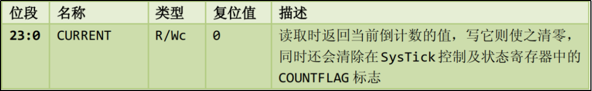
      <figcaption>图6-7　VAL当前值寄存器（读取当前计数值或写入任意值清零计数器）</figcaption>
    </figure>

  - **CALIB  校准值寄存器（提供默认重装载值和时钟频率信息，通常无需配置）**

- **实现1s翻转LED灯**

  - **中断方式**

    - **初始化:SysTick_Init**

      - **配置时钟源  1=AHB(72MHz) 0=AHB/8：SysTick->CTRL |= SysTick_CTRL_CLKSOURCE;**

      - **使能中断： SysTick->CTRL |= SysTick_CTRL_TICKINT;**

      - **定时器 1ms 产生一次中断：SysTick->LOAD = 72000 - 1;**

      - **使能定时器：SysTick->CTRL |= SysTick_CTRL_ENABLE;**

    - **中断处理:SysTick_Handler**

  - **轮询方式**

    - **实现延时函数**

      ```c
      #include "delay.h" // Device header
      
      void Delay_us(uint16_t us)
      {
          /* 设计定时器重装值 */
          SysTick->LOAD = 72 * us;
          /* 清除当前计数值 */
          SysTick->VAL = 0;
          /* 设置内部时钟源（2位->1）,不需要中断（1位->0），并启动定时器(0位->1) */
          SysTick->CTRL = 0x5;
          /* 等待计数到0， 如果计数到0则16位会置为1 */
          while (!(SysTick->CTRL & SysTick_CTRL_COUNTFLAG));
          /* 关闭定时器 */
          SysTick->CTRL &= ~SysTick_CTRL_ENABLE;
      }
      
      void Delay_ms(uint16_t ms)
      {
          while (ms--)
          {
              Delay_us(1000);
          }
      }
      
      void Delay_s(uint16_t s)
      {
          while (s--)
          {
              Delay_ms(1000);
          }
      }
      ```

### 1.4 HAL中的时间基准与阻塞延时

**阅读顺序：** CubeMX配置 → HAL初始化 → `HAL_IncTick()`维护节拍 → `HAL_Delay()`使用节拍。

- **HAL库工程创建**

  - **根据MCU型号创建工程**

    <figure class="course-figure">
      
      <figcaption>图6-8　根据MCU型号创建工程</figcaption>
    </figure>

    - **选择MCU型号**

      <figure class="course-figure">
        
        <figcaption>图6-9　选择MCU型号</figcaption>
      </figure>

  - **参数配置界面**

    <figure class="course-figure">
      
      <figcaption>图6-10　参数配置界面</figcaption>
    </figure>

    <figure class="course-figure">
      
      <figcaption>图6-11　参数配置界面</figcaption>
    </figure>

    <figure class="course-figure">
      
      <figcaption>图6-12　参数配置界面</figcaption>
    </figure>

    <figure class="course-figure">
      
      <figcaption>图6-13　参数配置界面</figcaption>
    </figure>

    <figure class="course-figure">
      
      <figcaption>图6-14　参数配置界面</figcaption>
    </figure>

    - **Debug参数选择**

      <figure class="course-figure">
        
        <figcaption>图6-15　Debug参数选择</figcaption>
      </figure>

      - **选择串口即可。这个地方务必设置好，否则只能下载一次程序到MCU，以后就无法下载了。**

    - **RCC时钟选择**

      <figure class="course-figure">
        
        <figcaption>图6-16　RCC时钟选择</figcaption>
      </figure>

      <figure class="course-figure">
        
        <figcaption>图6-17　RCC时钟选择</figcaption>
      </figure>

    - **串口配置**

      <figure class="course-figure">
        
        <figcaption>图6-18　串口配置</figcaption>
      </figure>

      <figure class="course-figure">
        
        <figcaption>图6-19　串口配置</figcaption>
      </figure>

      <figure class="course-figure">
        
        <figcaption>图6-20　串口配置</figcaption>
      </figure>

      - **选择串口**

        <figure class="course-figure">
          
          <figcaption>图6-21　选择串口</figcaption>
        </figure>

      - **配置串口**

        <figure class="course-figure">
          
          <figcaption>图6-22　配置串口</figcaption>
        </figure>

      - **开启串口中断**

        <figure class="course-figure">
          
          <figcaption>图6-23　开启串口中断</figcaption>
        </figure>

      - **IO口自动设置**

        <figure class="course-figure">
          
          <figcaption>图6-24　IO口自动设置</figcaption>
        </figure>

    - **滴答定时器设置**

      <figure class="course-figure">
        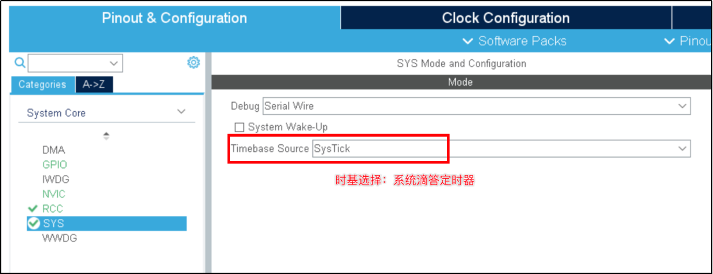
        <figcaption>图6-25　滴答定时器设置</figcaption>
      </figure>

      <figure class="course-figure">
        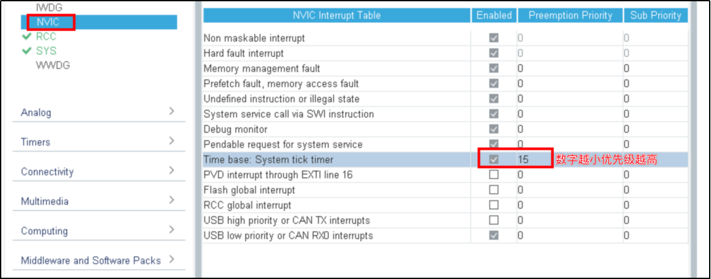
        <figcaption>图6-26　滴答定时器设置</figcaption>
      </figure>

      - **建议把SysTick定时器的抢占优先级设置为最高，否则在其他中断中使用延时函数的时候会阻塞卡死**

    - **工程配置**

      <figure class="course-figure">
        
        <figcaption>图6-27　工程配置</figcaption>
      </figure>

      <figure class="course-figure">
        
        <figcaption>图6-28　工程配置</figcaption>
      </figure>

      <figure class="course-figure">
        
        <figcaption>图6-29　工程配置</figcaption>
      </figure>

    - **生成代码**

      <figure class="course-figure">
        
        <figcaption>图6-30　生成代码</figcaption>
      </figure>

      <figure class="course-figure">
        
        <figcaption>图6-31　生成代码</figcaption>
      </figure>

    - **生成的工程目录介绍**

      <figure class="course-figure">
        
        <figcaption>图6-32　生成的工程目录介绍</figcaption>
      </figure>

      - **main函数中已经替我们调用了HAL的初始化，时钟的初始化，GPIO的初始化**

        ```c
        int main(void)
        {
            HAL_Init();
            SystemClock_Config();
            MX_GPIO_Init();
            while (1)
            {
            }
        }
        ```

- **SysTick初始化代码解读**

  <figure class="course-figure">
    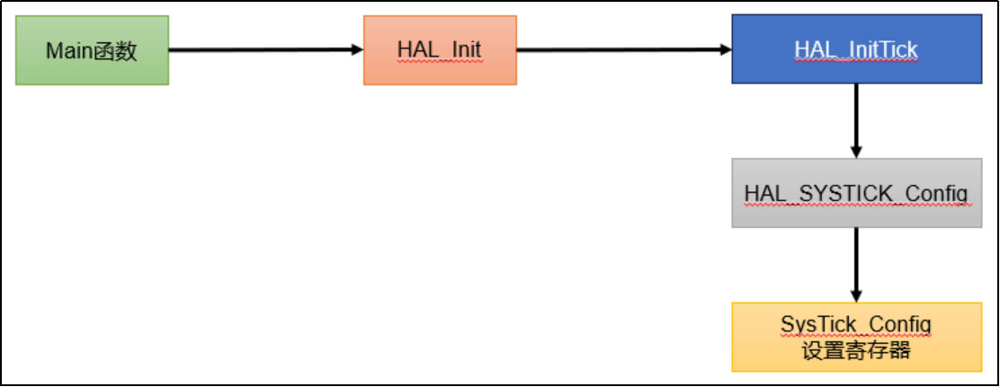
    <figcaption>图6-33　SysTick初始化代码解读</figcaption>
  </figure>

  - **stm32f1xx_it.c中已经定义了中断服务函数：SysTick_Handler----HAL_IncTick**

    ```c
    __weak void HAL_IncTick(void) {
        uwTick += 1;
    }
    uwTick是一个全局变量，每1ms中断一次，每产生一次中断就加1，所以这个变量表示的计时的ms值
    ```

  - **实现1s翻转LED灯**

    ```c
    void HAL_IncTick(void)
    {
        uwTick += uwTickFreq;
        if (uwTick % 1000 == 0)
        {  // 产生了1s的计时
            // 翻转LED灯
            HAL_GPIO_TogglePin(GPIOA, GPIO_PIN_0);
        }
    }
    ```

- **阻塞式延时：HAL_Delay()**

  - **阻塞当前代码执行，等待指定毫秒数（ms）**

  - **实现代码**

    ```c
    __weak void HAL_Delay(uint32_t Delay) {
        uint32_t tickstart = HAL_GetTick();  // 获取当前时间戳
        uint32_t wait = Delay;
        // 处理可能的计数器溢出（uwTick为32位，约49天溢出一次）
        if (wait < HAL_MAX_DELAY) {
            wait += (uint32_t)(uwTickFreq);  // uwTickFreq默认为1（1ms）
        }
        // 阻塞等待，直到时间差达到目标值
        while ((HAL_GetTick() - tickstart) < wait) {
            // 空循环或调用空闲任务（如启用低功耗）
        }
    }
    ```

---

> **上一节得到的结论**：SysTick能够产生系统节拍，但它不能输出PWM，也不能测量外部信号。下面转向STM32片上定时器外设。

---

## 2 基本定时器：从计数到周期中断

> **内容衔接**：SysTick解决了系统节拍问题，但只有一个且功能固定。接下来把时间基准交给独立外设TIM6/TIM7，学习所有STM32定时器共有的PSC、CNT、ARR和更新事件。

### 2.1 为什么还需要基本定时器

- **2个基本定时器只能向上计数，由于没有外部IO，只能计时，不能对外部脉冲进行计数**

- **功能**

  - **定时中断**

  - **主模式**

  - **触发DAC**

### 2.2 时基单元怎样产生更新事件

**核心路径：** 定时器时钟 → `PSC`预分频 → `CNT`计数 → 达到`ARR` → 更新事件/中断。

<figure class="course-figure">
  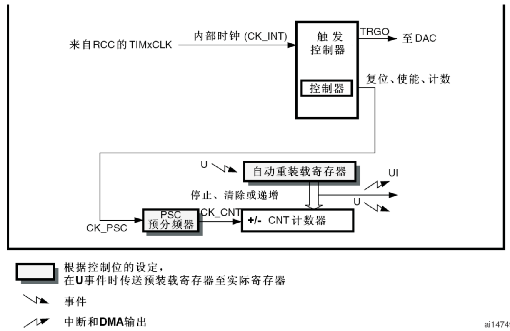
  <figcaption>图6-34　功能框图</figcaption>
</figure>

- **时钟源**

  <figure class="course-figure">
    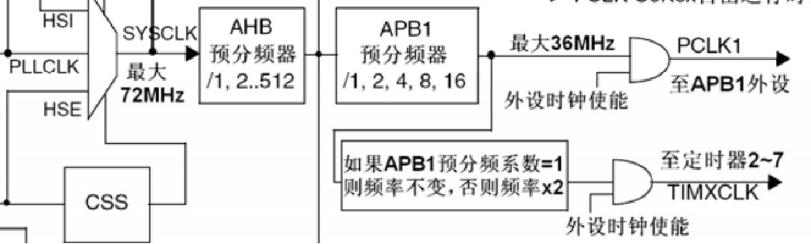
    <figcaption>图6-35　时钟源</figcaption>
  </figure>

- **触发控制器**

  - **通常用于触发其他外设的操作，使得不同的外设能够协同工作。比如触发DAC输出**

  - **基本定时器只是把时钟信号传输给时基单元**

- **时基单元**

  <figure class="course-figure">
    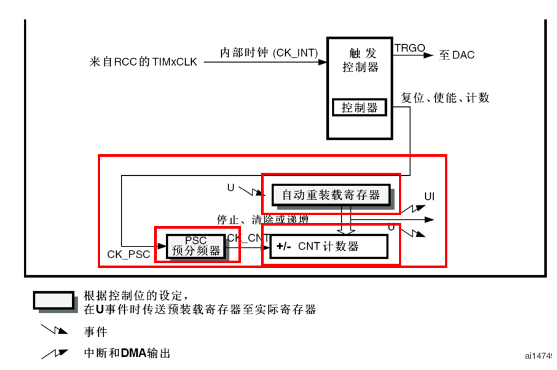
    <figcaption>图6-36　时基单元</figcaption>
  </figure>

  - **PSC预分频寄存器**

    - **预分频器将过来的时钟信号进行预分频**

    - **按1到65536之间的任意值分频，然后把分频后的信号作为计数器的时钟**

  - **计数器寄存器**

    - **基本定时器只能向上计数，从0开始自增**

    - **自增到自动重装载寄存器的值时，下一个时钟上升沿到来后，计数器产生溢出，从0重新计数，并产生更新事件（UEV）**

      <figure class="course-figure">
        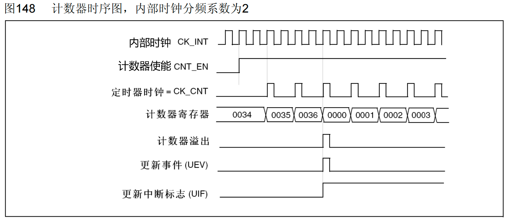
        <figcaption>图6-37　自增到自动重装载寄存器的值时，下一个时钟上升沿到来后，计数器产生溢出，从0重新计数，并产生更新事件（UEV）</figcaption>
      </figure>

    - **如果开启中断，也会产生更新中断**

  - **自动重装载寄存器**

    - **包含两个寄存器：预加载寄存器和影子寄存器**

      - **写数据到自动重装载寄存器时先写到预加载寄存器，然后再更新到影子寄存器**

      - **计数器是否溢出，是查看的影子寄存器的值**

    - **寄存器CR1的ARPE位决定更新时机（是否预加载）**

      - **没有预加载时，写入的值会立即更新到影子寄存器**

        <figure class="course-figure">
          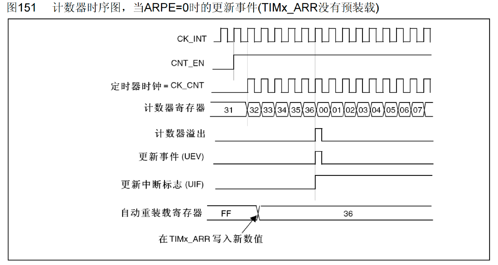
          <figcaption>图6-38　没有预加载时，写入的值会立即更新到影子寄存器</figcaption>
        </figure>

      - **有预加载时，写入的值会等到产生更新事件(计数器溢出)才更新到影子寄存器**

        <figure class="course-figure">
          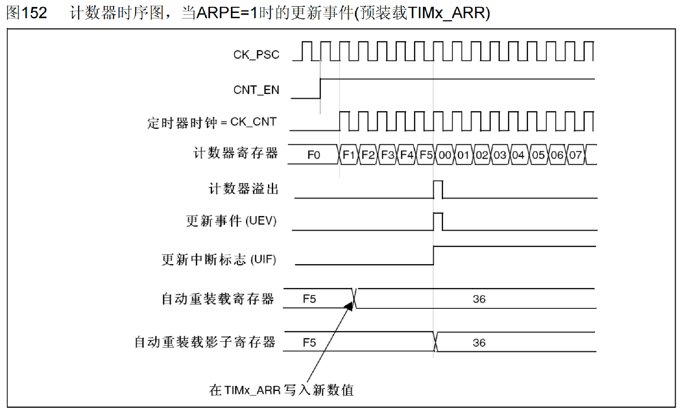
          <figcaption>图6-39　有预加载时，写入的值会等到产生更新事件(计数器溢出)才更新到影子寄存器</figcaption>
        </figure>

- **计算定时时间**

  - **计数器的时钟频率是多少**

    - **内部时钟频率/预分频系数+1**

    - **内部时钟频率72M，预分频系数7199，则计数器时钟频率为10000**

  - **计数器的周期是多少？ 也就是累加一次需要的时间**

    - **预分频系数+1/内部时钟频频率**

    - **1/10000s=100us**

  - **计数器累加多少次产生一次更新事件**

    - **自动重装载值+1**

    - **假设自动重装载值3。则加到4时溢出到0**

  - **定时时间：（预分频系数+1/内部时钟频频率）∗(自动重装载值+1)**

    - **假设定时1s，内部时钟频率72MHz：**

      - **令预分频系数=7200-1,计数器频率=10000**

      - **则自动重装载值=10000-1**

### 2.3 用TIM6实现周期中断

**实现路径：** 先计算时间参数，再配置寄存器或HAL，最后在中断/回调函数中执行任务。

- **寄存器实现方式**

  - **相关寄存器**

    - **控制寄存器1（TIMx_CR1）**

      <figure class="course-figure">
        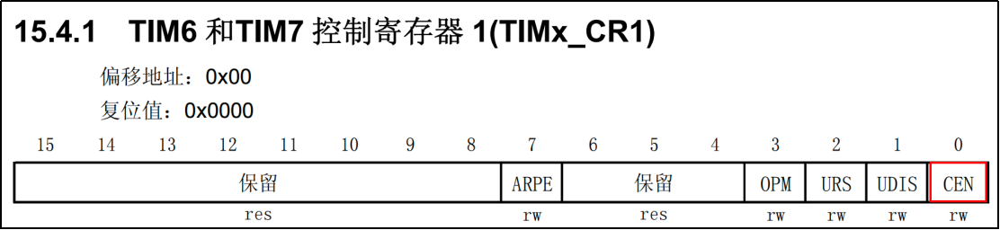
        <figcaption>图6-40　控制寄存器1（TIMx_CR1）</figcaption>
      </figure>

      <figure class="course-figure">
        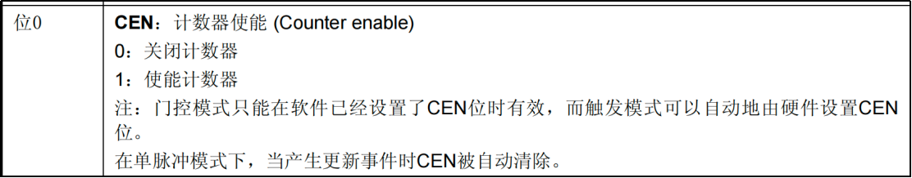
        <figcaption>图6-41　控制寄存器1（TIMx_CR1）</figcaption>
      </figure>

      <figure class="course-figure">
        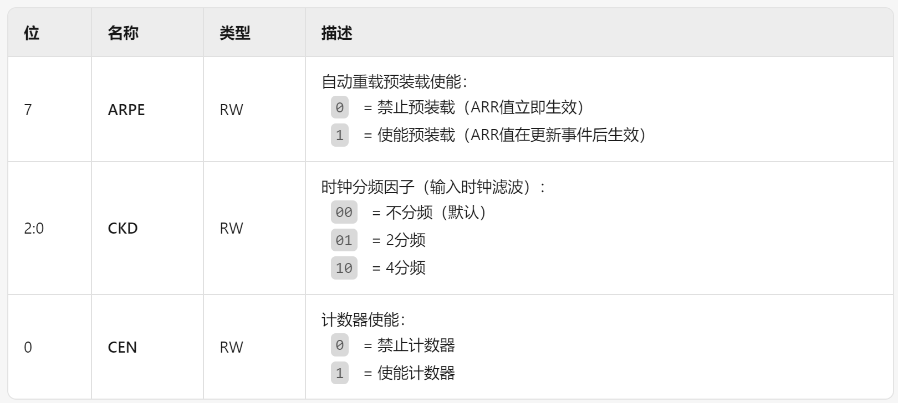
        <figcaption>图6-42　控制寄存器1（TIMx_CR1）</figcaption>
      </figure>

    - **控制寄存器2（TIMx_CR2）**

      <figure class="course-figure">
        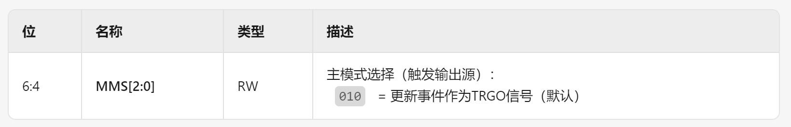
        <figcaption>图6-43　控制寄存器2（TIMx_CR2）</figcaption>
      </figure>

    - **预分频器寄存器（TIMx_PSC）**

      <figure class="course-figure">
        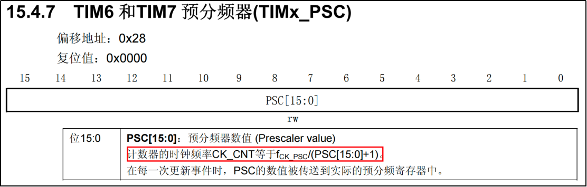
        <figcaption>图6-44　预分频器寄存器（TIMx_PSC）</figcaption>
      </figure>

    - **自动重载寄存器（TIMx_ARR）**

      <figure class="course-figure">
        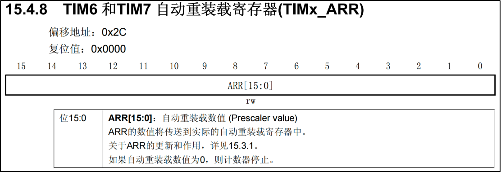
        <figcaption>图6-45　自动重载寄存器（TIMx_ARR）</figcaption>
      </figure>

    - **状态寄存器（TIMx_SR）**

      <figure class="course-figure">
        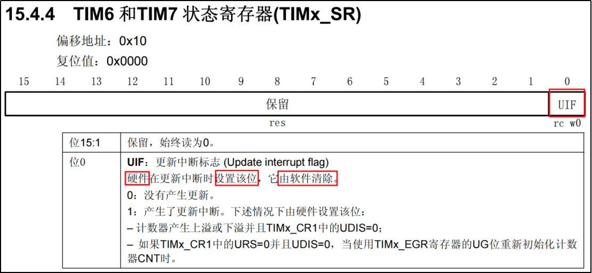
        <figcaption>图6-46　状态寄存器（TIMx_SR）</figcaption>
      </figure>

    - **中断使能寄存器（TIMx_DIER）**

      <figure class="course-figure">
        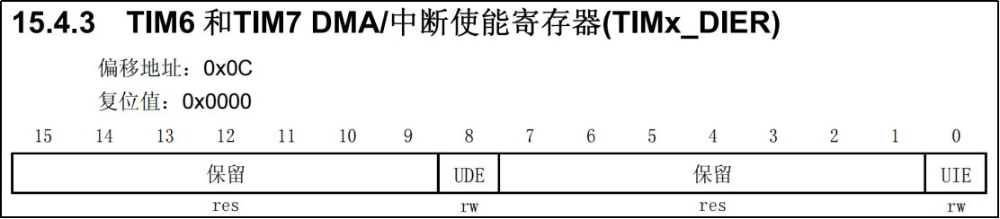
        <figcaption>图6-47　中断使能寄存器（TIMx_DIER）</figcaption>
      </figure>

      <figure class="course-figure">
        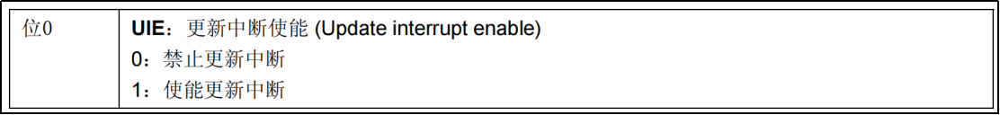
        <figcaption>图6-48　中断使能寄存器（TIMx_DIER）</figcaption>
      </figure>

    - **事件生成寄存器（TIMx_EGR）**

      <figure class="course-figure">
        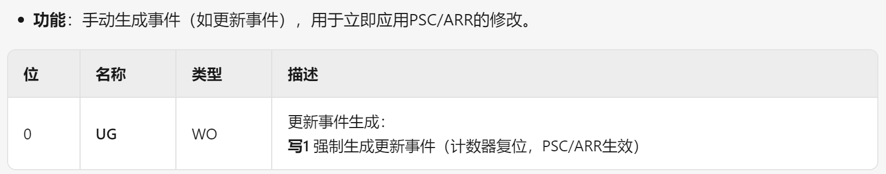
        <figcaption>图6-49　事件生成寄存器（TIMx_EGR）</figcaption>
      </figure>

  - **实现流程**

    - **给定时器6开启时钟：RCC->APB1ENR |= RCC_APB1ENR_TIM6EN;**

    - **设置预分频值: 分频值7199表示7200分频。分频后频率10K，周期100us：TIM6->PSC = 7200 - 1;**

    - **设置自动重转载寄存器的值，决定中断发生的频率（1s溢出）：TIM6->ARR = 10000 - 1;**

    - **使能更新中断：TIM6->DIER |= TIM_DIER_UIE**

    - **NVIC配置**

      - **设置中断优先级分组：NVIC_SetPriorityGrouping(3);**

      - **设置中断优先级：NVIC_SetPriority(TIM6_IRQn, 1);**

      - **使能定时器6的中断：NVIC_EnableIRQ(TIM6_IRQn);**

    - **使能计数器：TIM6->CR1 |= TIM_CR1_CEN;**

    - **TIM6的中断服务函数：TIM6_IRQHandler**

      - **清除中断标志位：TIM6->SR &= ~TIM_SR_UIF;**

      - **实现led反转**

  - **注意事项**

    - **修改ARR/PSC后为何未生效？**

      - **需要有更新事件才能生效**

      - **TIM6->EGR |= TIM_EGR_UG; // 手动触发更新事件**

- **HAL库实现方式**

  - **HAL库工程创建**

    - **根据MCU型号创建工程**

      <figure class="course-figure">
        
        <figcaption>图6-50　根据MCU型号创建工程</figcaption>
      </figure>

      - **选择MCU型号**

        <figure class="course-figure">
          
          <figcaption>图6-51　选择MCU型号</figcaption>
        </figure>

    - **参数配置界面**

      <figure class="course-figure">
        
        <figcaption>图6-52　参数配置界面</figcaption>
      </figure>

      <figure class="course-figure">
        
        <figcaption>图6-53　参数配置界面</figcaption>
      </figure>

      <figure class="course-figure">
        
        <figcaption>图6-54　参数配置界面</figcaption>
      </figure>

      <figure class="course-figure">
        
        <figcaption>图6-55　参数配置界面</figcaption>
      </figure>

      <figure class="course-figure">
        
        <figcaption>图6-56　参数配置界面</figcaption>
      </figure>

      - **Debug参数选择**

        <figure class="course-figure">
          
          <figcaption>图6-57　Debug参数选择</figcaption>
        </figure>

        - **选择串口即可。这个地方务必设置好，否则只能下载一次程序到MCU，以后就无法下载了。**

      - **RCC时钟选择**

        <figure class="course-figure">
          
          <figcaption>图6-58　RCC时钟选择</figcaption>
        </figure>

        <figure class="course-figure">
          
          <figcaption>图6-59　RCC时钟选择</figcaption>
        </figure>

      - **串口配置**

        <figure class="course-figure">
          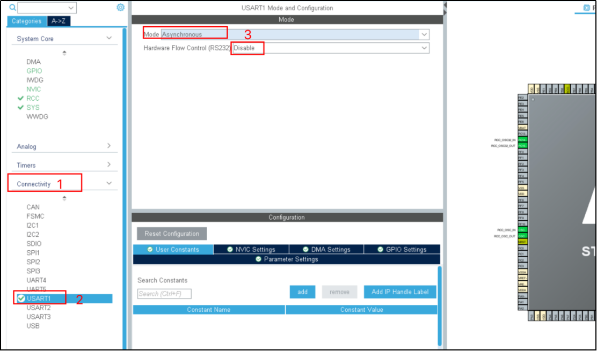
          <figcaption>图6-60　串口配置</figcaption>
        </figure>

        <figure class="course-figure">
          
          <figcaption>图6-61　串口配置</figcaption>
        </figure>

        <figure class="course-figure">
          
          <figcaption>图6-62　串口配置</figcaption>
        </figure>

        - **选择串口**

          <figure class="course-figure">
            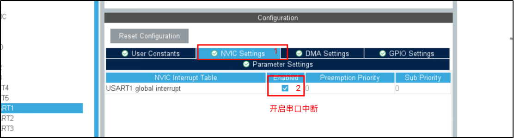
            <figcaption>图6-63　选择串口</figcaption>
          </figure>

        - **配置串口**

          <figure class="course-figure">
            
            <figcaption>图6-64　配置串口</figcaption>
          </figure>

        - **开启串口中断**

          <figure class="course-figure">
            
            <figcaption>图6-65　开启串口中断</figcaption>
          </figure>

        - **IO口自动设置**

          <figure class="course-figure">
            
            <figcaption>图6-66　IO口自动设置</figcaption>
          </figure>

      - **GPIO配置**

        <figure class="course-figure">
          
          <figcaption>图6-67　GPIO配置</figcaption>
        </figure>

      - **TIM6配置**

        <figure class="course-figure">
          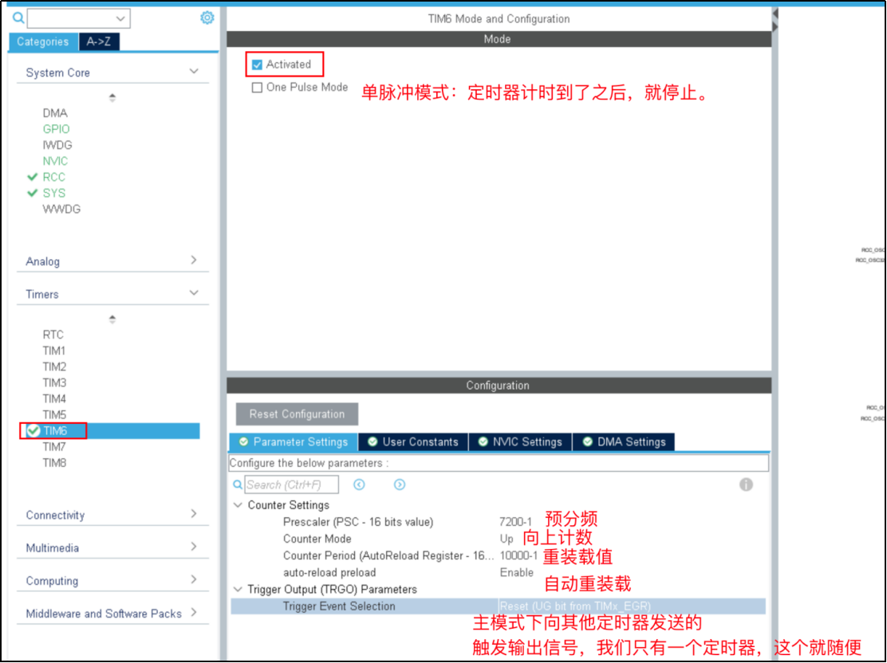
          <figcaption>图6-68　TIM6配置</figcaption>
        </figure>

        <figure class="course-figure">
          
          <figcaption>图6-69　TIM6配置</figcaption>
        </figure>

      - **工程配置**

        <figure class="course-figure">
          
          <figcaption>图6-70　工程配置</figcaption>
        </figure>

        <figure class="course-figure">
          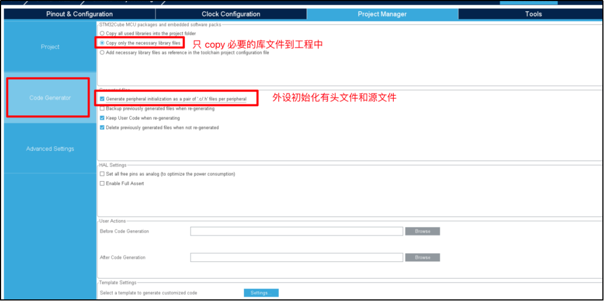
          <figcaption>图6-71　工程配置</figcaption>
        </figure>

        <figure class="course-figure">
          
          <figcaption>图6-72　工程配置</figcaption>
        </figure>

      - **生成代码**

        <figure class="course-figure">
          
          <figcaption>图6-73　生成代码</figcaption>
        </figure>

        <figure class="course-figure">
          
          <figcaption>图6-74　生成代码</figcaption>
        </figure>

      - **生成的工程目录介绍**

        <figure class="course-figure">
          
          <figcaption>图6-75　生成的工程目录介绍</figcaption>
        </figure>

        - **main函数中已经替我们调用了HAL的初始化，时钟的初始化，GPIO的初始化**

          ```c
          int main(void)
          {
              HAL_Init();
              SystemClock_Config();
              MX_GPIO_Init();
              while (1)
              {
              }
          }
          ```

  - **HAL库相关函数**

    #### **1. 定时器初始化函数**

    ##### **函数原型**

    ```c
    HAL_StatusTypeDef HAL_TIM_Base_Init(TIM_HandleTypeDef *htim);
    ```

    - **形参**：

    - `*htim`：指向`TIM_HandleTypeDef`结构体的指针，包含定时器配置参数。

    ```c
    typedef struct {
    
        TIM_TypeDef          *Instance;  // 定时器实例（如TIM6）
    
        TIM_Base_InitTypeDef Init;  // 定时器初始化结构体
    
        HAL_TIM_ActiveChannel  Channel;  // 通道（基本定时器未使用）
    
        DMA_HandleTypeDef      *hdma[7];  // DMA句柄数组（基本定时器通常未使用）
    
        HAL_LockTypeDef        Lock;  // 锁机制
    
        __IO HAL_TIM_StateTypeDef State;  // 定时器状态
    
    } TIM_HandleTypeDef;
    
    typedef struct {
    
        uint32_t Prescaler;  // 预分频系数（0~65535）
    
        uint32_t CounterMode;  // 计数模式（基本定时器仅支持TIM_COUNTERMODE_UP）
    
        uint32_t Period;  // 自动重载值（0~65535）
    
        uint32_t ClockDivision;  // 时钟分频（基本定时器未使用）
    
        uint32_t RepetitionCounter;  // 重复计数器（高级定时器专用，基本定时器未使用）
    
        uint32_t AutoReloadPreload;  // 自动重载预装载（TIM_AUTORELOAD_PRELOAD_ENABLE/DISABLE）
    
    } TIM_Base_InitTypeDef;
    ```

    - **功能**：

    初始化定时器的基本参数（预分频系数、计数模式、自动重载值等）。

    - **返回值**：

    - `HAL_OK`：初始化成功。

    - `HAL_ERROR`：参数错误或硬件错误。

    ---

    #### **2. 定时器启动函数**

    ##### **2.1 启动定时器（无中断/DMA）**

    ```c
    HAL_StatusTypeDef HAL_TIM_Base_Start(TIM_HandleTypeDef *htim);
    ```

    - **形参**：

    - `*htim`：定时器句柄。

    - **功能**：

    启动定时器计数器，但不启用中断或DMA。

    - **返回值**：

    - `HAL_OK`：启动成功。

    - `HAL_ERROR`：定时器未初始化或硬件错误。

    ##### **2.2 启动定时器并启用中断**

    ```c
    HAL_StatusTypeDef HAL_TIM_Base_Start_IT(TIM_HandleTypeDef *htim);
    ```

    - **形参**：

    - `*htim`：定时器句柄。

    - **功能**：

    启动定时器计数器，并启用更新中断（需配置NVIC）。

    - **返回值**：

    - 同`HAL_TIM_Base_Start()`。

    ##### **2.3 启动定时器并启用DMA**

    ```c
    HAL_StatusTypeDef HAL_TIM_Base_Start_DMA(TIM_HandleTypeDef *htim, uint32_t *pData, uint16_t Length);
    ```

    - **形参**：

    - `*htim`：定时器句柄。

    - `*pData`：DMA传输目标缓冲区地址。

    - `Length`：DMA传输数据长度。

    - **功能**：

    启动定时器计数器，并通过DMA传输更新事件触发的数据。

    - **返回值**：

    - `HAL_OK`：启动成功。

    - `HAL_ERROR`：DMA配置错误或硬件故障。

    ---

    #### **3. 定时器停止函数**

    ##### **3.1 停止定时器**

    ```c
    HAL_StatusTypeDef HAL_TIM_Base_Stop(TIM_HandleTypeDef *htim);
    ```

    - **形参**：

    - `*htim`：定时器句柄。

    - **功能**：

    停止定时器计数器，关闭中断/DMA（如果启用）。

    - **返回值**：

    - 同`HAL_TIM_Base_Start()`。

    ##### **3.2 停止定时器中断**

    ```c
    HAL_StatusTypeDef HAL_TIM_Base_Stop_IT(TIM_HandleTypeDef *htim);
    ```

    - **形参**：

    - `*htim`：定时器句柄。

    - **功能**：

    停止定时器计数器，并禁用更新中断。

    ##### **3.3 停止定时器DMA**

    ```c
    HAL_StatusTypeDef HAL_TIM_Base_Stop_DMA(TIM_HandleTypeDef *htim);
    ```

    - **形参**：

    - `*htim`：定时器句柄。

    - **功能**：

    停止定时器计数器，并禁用DMA传输。

    ---

    #### **4. 中断处理函数**

    ##### **4.1 中断请求统一处理**

    ```c
    void HAL_TIM_IRQHandler(TIM_HandleTypeDef *htim);
    ```

    - **形参**：

    - `*htim`：定时器句柄。

    - **功能**：

    处理定时器的所有中断标志（如更新中断、触发中断等），并调用对应的回调函数。

    ##### **4.2 更新事件回调函数**

    ```c
    __weak void HAL_TIM_PeriodElapsedCallback(TIM_HandleTypeDef *htim);
    ```

    - **形参**：

    - `*htim`：定时器句柄。

    - **功能**：

    用户需重写的回调函数，用于处理定时器溢出中断事件（如翻转LED）。

    - **示例**：

    ```c
    void HAL_TIM_PeriodElapsedCallback(TIM_HandleTypeDef *htim) {
    
        if (htim->Instance == TIM6) {
    
            // 执行任务
    
        }
    
    }
    
    #### **5. 辅助函数**
    
    ##### **5.1 获取定时器状态**
    ```

    ```c
    HAL_TIM_StateTypeDef HAL_TIM_Base_GetState(TIM_HandleTypeDef *htim);
    ```

    - **形参**：

    - `*htim`：定时器句柄。

    - **功能**：

    返回定时器的当前状态（如`HAL_TIM_STATE_READY`、`HAL_TIM_STATE_BUSY`）。

    ##### **5.2 获取计数器值**

    ```c
    uint32_t HAL_TIM_Base_GetCounter(TIM_HandleTypeDef *htim);
    ```

    - **形参**：

    - `*htim`：定时器句柄。

    - **功能**：

    读取当前计数器的值（CNT寄存器的内容）。

    ##### **5.3 设置计数器值**

    ```c
    void HAL_TIM_Base_SetCounter(TIM_HandleTypeDef *htim, uint32_t Counter);
    ```

    - **形参**：

    - `*htim`：定时器句柄。

    - `Counter`：要设置的计数器值（0~65535）。

    - **功能**：

    手动设置计数器的初始值。

    ---

    ### **函数使用示例**

    #### **场景**：配置TIM6每1秒触发中断翻转LED。

    ```c
    TIM_HandleTypeDef htim6;
    
    void MX_TIM6_Init(void) {
    
        htim6.Instance = TIM6;
      htim6.Init.Prescaler = 7199;  // 分频至10kHz
        htim6.Init.Period = 9999;  // 1秒溢出周期
      htim6.Init.AutoReloadPreload = TIM_AUTORELOAD_PRELOAD_ENABLE;
        HAL_TIM_Base_Init(&htim6);
    }
    
  
  int main(void) {
  
      HAL_Init();
        
      SystemClock_Config();
        
      MX_TIM6_Init();
        
      HAL_TIM_Base_Start_IT(&htim6);  // 启动中断
        
      HAL_NVIC_EnableIRQ(TIM6_IRQn);
        
      while (1) { /* 主循环 */ }
  
  }
  
  void HAL_TIM_PeriodElapsedCallback(TIM_HandleTypeDef *htim) {
  
      if (htim->Instance == TIM6) {
        
          HAL_GPIO_TogglePin(GPIOB, GPIO_PIN_0);  // 翻转LED
        
      }
  
  }
    ```
  
  - **中断回调函数**
  
    <figure class="course-figure">
      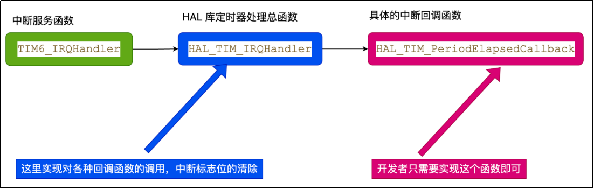
      <figcaption>图6-76　中断回调函数</figcaption>
    </figure>
  
  - **实现**
  
    ```c
    /* USER CODE BEGIN 1 */
    
    void HAL_TIM_PeriodElapsedCallback(TIM_HandleTypeDef *htim)
    {
        // 定时器6产生中断。任何一个定时器产生中断都会进入到这个方法中，所以需要判断下定时器实例
        if (htim->Instance == TIM6)
        {
            // 翻转LEDB
            HAL_GPIO_TogglePin(GPIOA, GPIO_PIN_1);
        }
    }
    /* USER CODE END 1 *
    
    int main(void)
    {
    HAL_Init();
    SystemClock_Config();
    MX_GPIO_Init();
    MX_TIM6_Init();
    // 启动定时器6
    HAL_TIM_Base_Start_IT(&htim6);
    while (1)
    {
    }
    }
    ```

---

> **上一节得到的结论**：只要掌握 `PSC`、`CNT`、`ARR` 和更新事件，就掌握了定时器的时基部分。下面在这个时基上增加捕获/比较通道。

---

## 3 通用定时器：从定时扩展到信号输入与输出

> **内容衔接**：基本定时器只能在芯片内部计时。通用定时器增加捕获/比较通道后，既能向外输出PWM，也能把外部边沿的到达时刻记录下来。

### 3.1 通用定时器增加了哪些能力

- **支持的定时器 ：TIM2、TIM3、TIM4、TIM5（TIM2/TIM5为32位，TIM3/TIM4为16位）**

- **功能**

  - **基础定时（向上/向下/中央对齐计数）**

  - **PWM信号生成（边沿对齐、中心对齐模式）**

  - **输入捕获（测量脉冲宽度或频率）**

  - **输出比较（生成特定时序的脉冲）**

  - **编码器接口（读取正交编码器信号）**

### 3.2 先建立通用定时器整体结构

**先看共性，再看分支：** 时基单元是基础；输出比较负责“产生波形”，输入捕获负责“测量波形”，触发与从模式负责“硬件协同”。

<figure class="course-figure">
  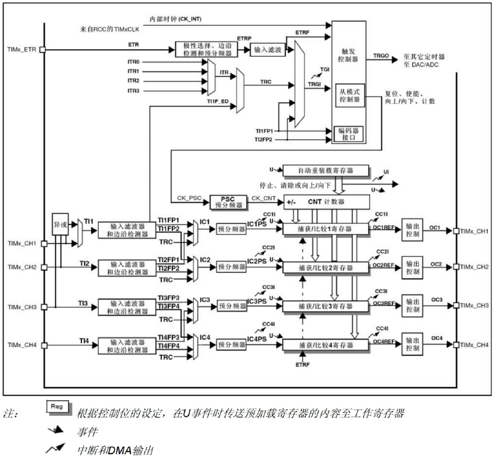
  <figcaption>图6-77　通用定时器功能框图</figcaption>
</figure>

- **时钟源**

  - **内部时钟源：一般72MHz。与基本定时器一致**

    <figure class="course-figure">
      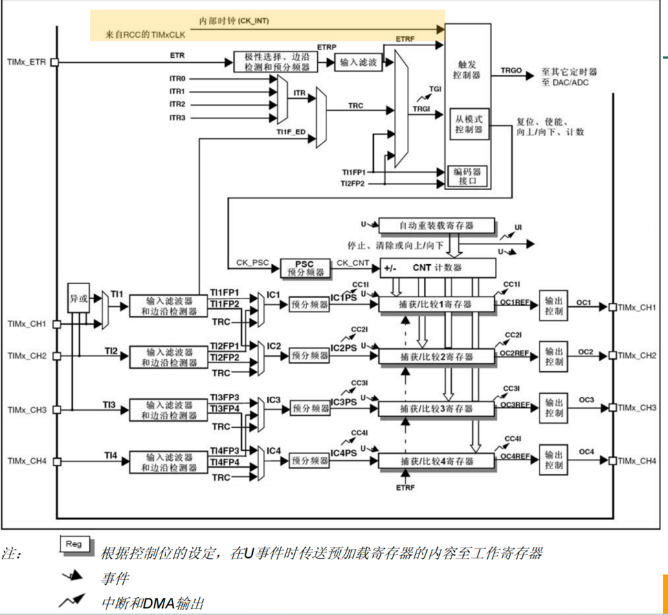
      <figcaption>图6-78　内部时钟源：一般72MHz。与基本定时器一致</figcaption>
    </figure>

  - **外部时钟源模式1**

    <figure class="course-figure">
      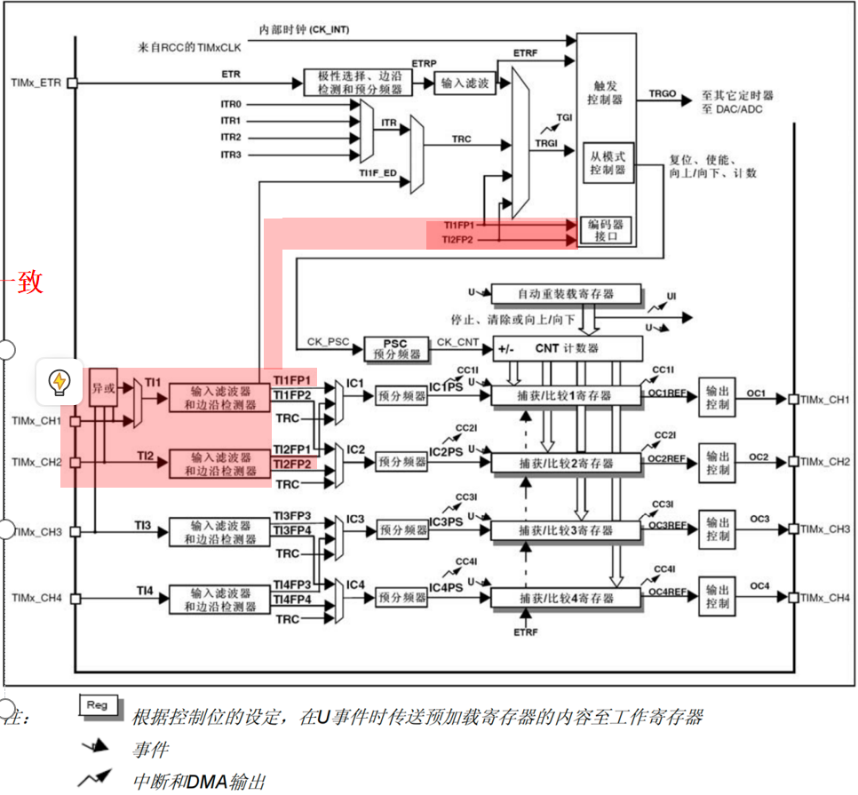
      <figcaption>图6-79　外部时钟源模式1</figcaption>
    </figure>

    - **使用定时器自身通道的输入信号作为时钟源**

    - **每个定时器有4个输入通道，只有通道1和通道2的信号可以作为时钟信号源**

    - **通道1和通道2的信号经过输入滤波和边缘检测器，成为了时钟源**

  - **外部时钟源模式2**

    <figure class="course-figure">
      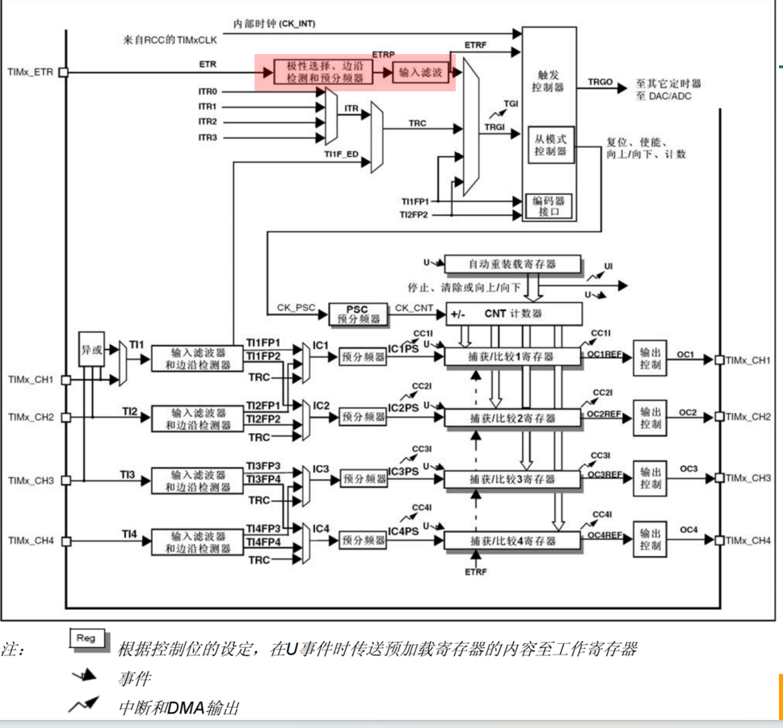
      <figcaption>图6-80　外部时钟源模式2</figcaption>
    </figure>

    - **使用定时器的特殊引脚ETR引脚的信号作为时钟源**

    - **每个通用定时器都有一个ETR引脚，比如TIM3的时ETR引脚是PD2**

    - **ETR引脚信号经过极性选择，边缘检测，预分频器，输入滤波，得到信号ETRF**

    - **ETRF就成为外部时钟源**

  - **不配置时钟源的情况下，默认选择的就是内部时钟源**

- **输出比较框图**

  <figure class="course-figure">
    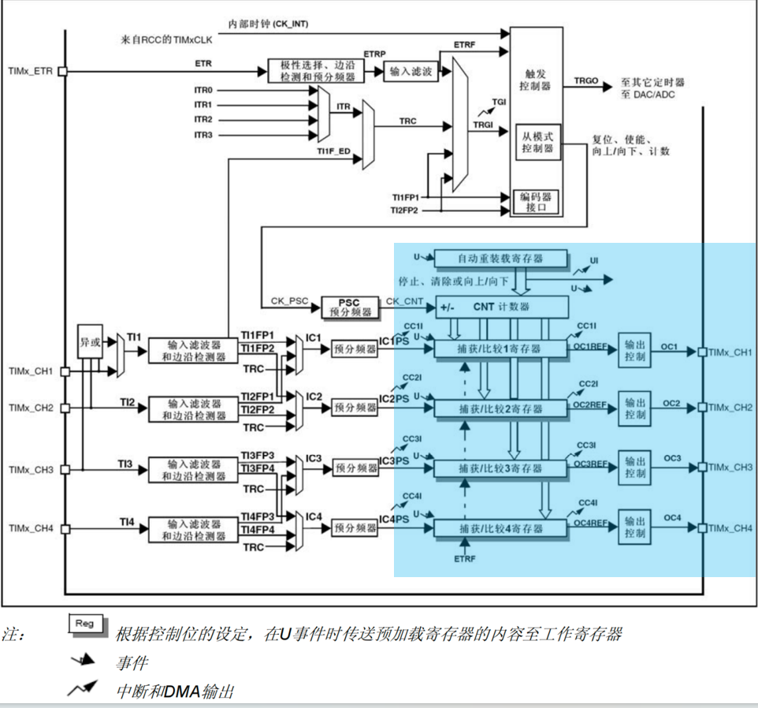
    <figcaption>图6-81　输出比较框图</figcaption>
  </figure>

  - **计数器部分**

    <figure class="course-figure">
      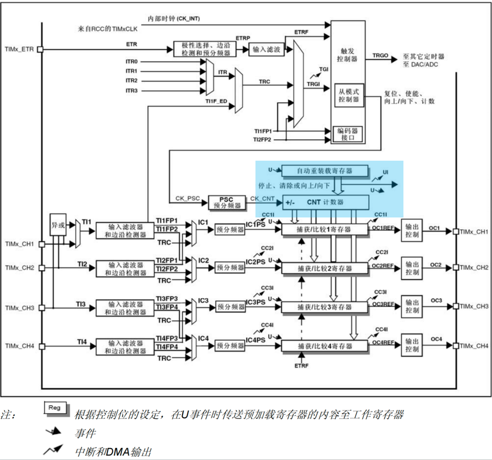
      <figcaption>图6-82　计数器部分</figcaption>
    </figure>

    - **向上计数模式**

      <figure class="course-figure">
        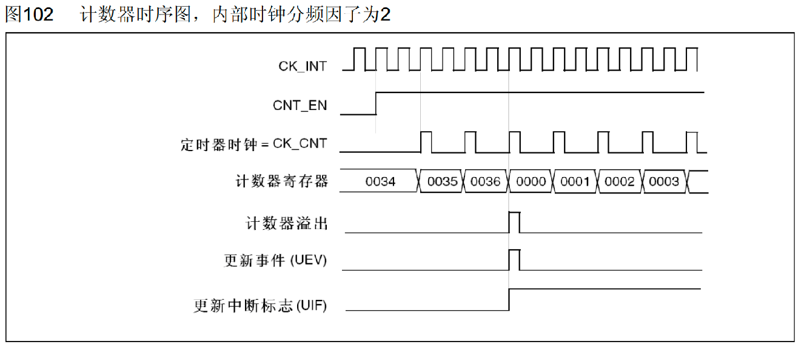
        <figcaption>图6-83　向上计数模式</figcaption>
      </figure>

      - **与基本定时器一样，都是从0开始加，一直加到自动重装载寄存器的值**

    - **向下计数模式**

      <figure class="course-figure">
        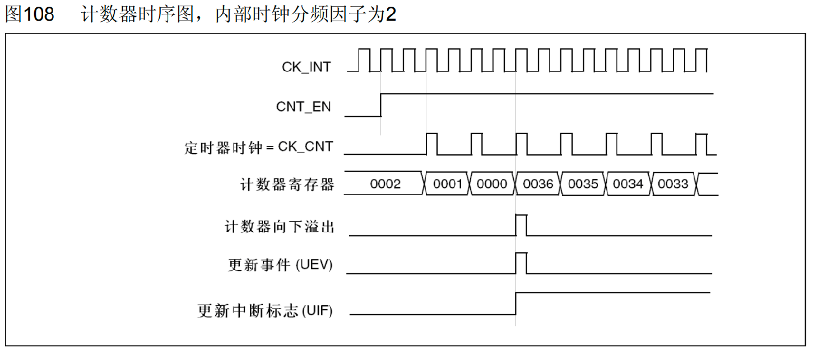
        <figcaption>图6-84　向下计数模式</figcaption>
      </figure>

      - **从自动重装载寄存器的值开始计数，直至减到0**

    - **中央对齐模式（向上和向下计数）**

      <figure class="course-figure">
        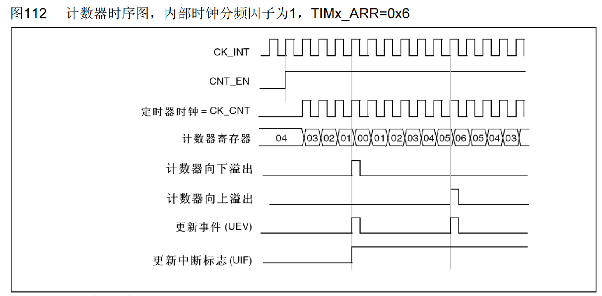
        <figcaption>图6-85　中央对齐模式（向上和向下计数）</figcaption>
      </figure>

      - **从0开始向上计数，一直计数到自动重装载寄存器的值–1**

      - **再来一个时钟信号会产生更新事件，然后继续从自动重装载寄存器的值向下计数**

      - **向下计数到1，再来一个时钟信号会产生更新事件，然后继续从0开始向上就计数**

  - **捕获比较寄存器**

    - **每个定时器有4个，可以同时实现4路比较**

      <figure class="course-figure">
        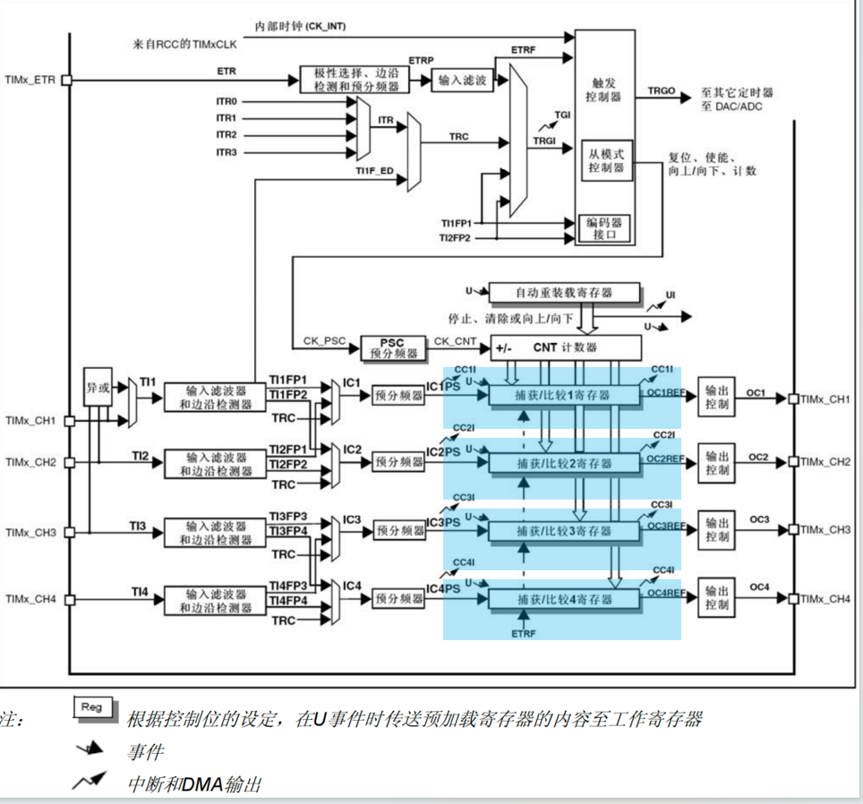
        <figcaption>图6-86　每个定时器有4个，可以同时实现4路比较</figcaption>
      </figure>

  - **输出部分**

    <figure class="course-figure">
      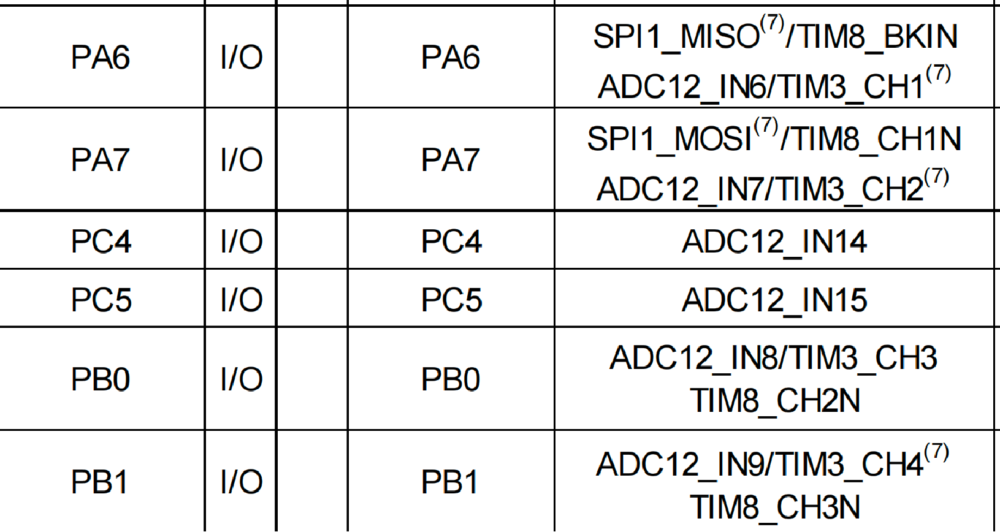
      <figcaption>图6-87　输出部分</figcaption>
    </figure>

    - **4路输出，分别对应4个引脚**

- **输出比较原理**

  - **初始化**

    - **假设计数器向上计数，重装载寄存器的值为99**

    - **假设捕获/比较寄存器的值我们设置为60**

  - **原理**

    - **比较寄存器的值和计数器的值进行大小比较**

    - **根据比较结果（> = <）不同，产生不同输出:高电平or低电平**

  - **PWM**

    - **脉冲宽度调制 Pulse-width modulation**

    - **条件：被控制的电路必须要有一定的“惯性”**

      - **比如LED即使断电了也不会立即熄灭，电机断电了也不会立即停止**

    - **作用**

      - **是利用微处理器的数字输出来对模拟电路进行控制的一种非常有效的技术**

      - **通过更改占空比达到对外输出的有效电压的值。**

      - **PWM通常用于控制电机、LED亮度调节等应用**

    - **PWM的3个参数**

      <figure class="course-figure">
        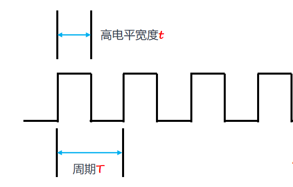
        <figcaption>图6-88　PWM的3个参数</figcaption>
      </figure>

      - **周期：连续的两个上升沿或连续两个下降沿之间的宽度，我们用T表示**

      - **频率：周期的倒数。1/T**

      - **占空比：高电平宽度t除以周期T。t/T**

  - **输出比较的8种模式**

    - **由CCMR1寄存器的OC1M[2,0]，共3位来控制**

    - **OC1M[2:0]=000**

      - **输出冻结。CNT和CCR比较结果不影响输出**

    - **OC1M[2:0]=001**

      - **强制输出高电平。一旦CNT=CCR，强制输出高电平，再不改变**

    - **OC1M[2:0]=010**

      - **强制输出低电平。一旦CNT=CCR，强制输出低电平，再不改变**

    - **OC1M[2:0]=011**

      - **输出翻转。一旦CNT=CCR，则翻转输出。高->低， 低->高**

        <figure class="course-figure">
          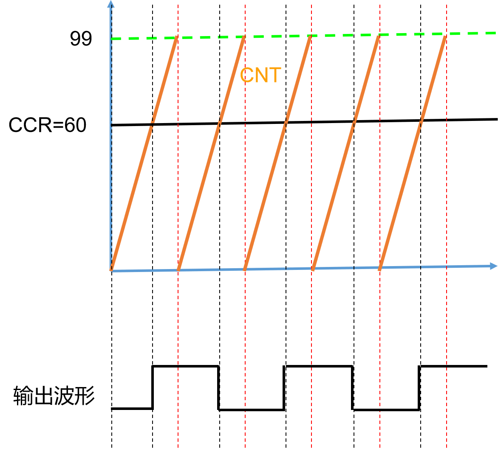
          <figcaption>图6-89　输出翻转。一旦CNT=CCR，则翻转输出。高-&gt;低， 低-&gt;高</figcaption>
        </figure>

    - **OC1M[2:0]=100**

      - **强制输出低电平**

    - **OC1M[2:0]=101**

      - **强制输出高电平**

    - **OC1M[2:0]=110**

      - **PWM模式1**

        <figure class="course-figure">
          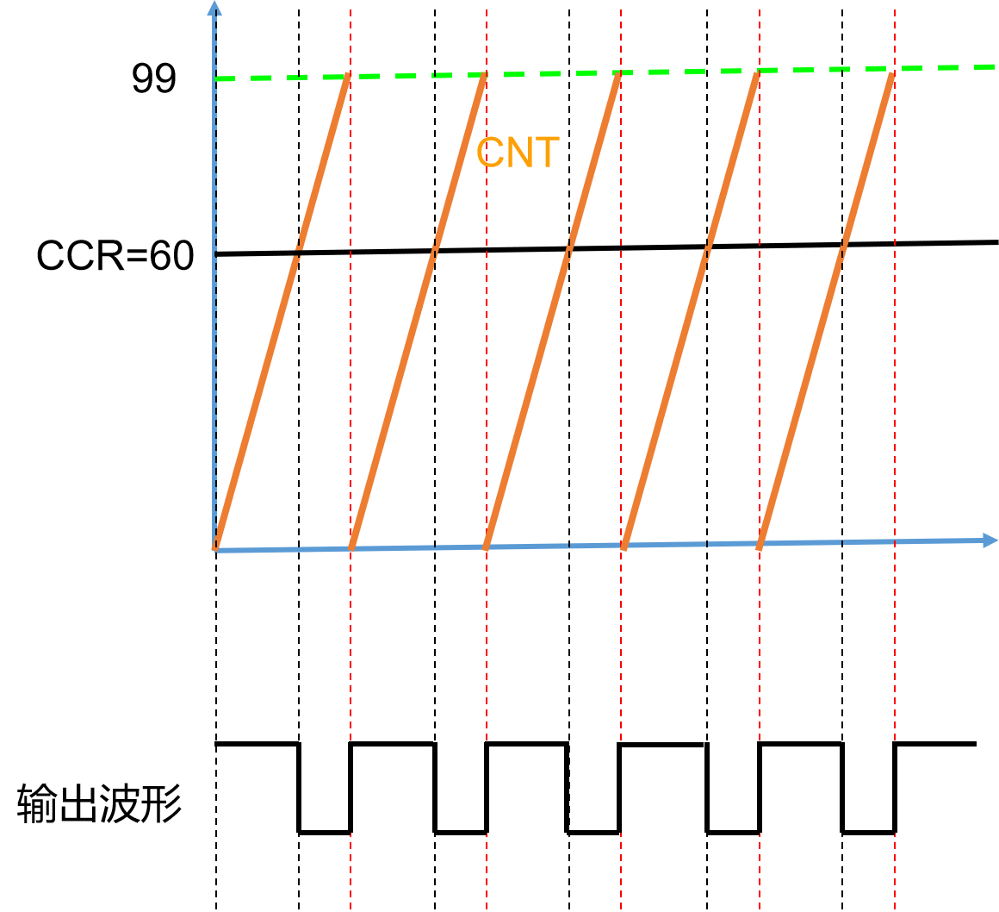
          <figcaption>图6-90　PWM模式1</figcaption>
        </figure>

        - **CNT < CCR     输出高电平**

        - **CNT >= CCR   输出低电平**

      - **波形占空比: CCR/（重装载寄存器值+1）=60/（99+1）=60%**

    - **OC1M[2:0]=111**

      - **PWM模式2**

        <figure class="course-figure">
          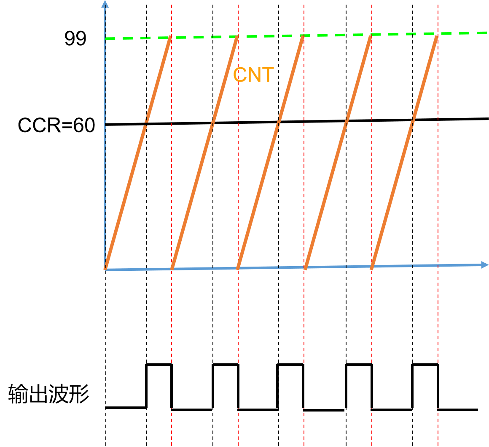
          <figcaption>图6-91　PWM模式2</figcaption>
        </figure>

        - **CNT < CCR     输出低电平**

        - **CNT >= CCR   输出高电平**

      - **波形占空比：  (重装载寄存器值+1−CCR)/(重装载寄存器值+1)=(99+1−60)/(99+1)=40%**

- **输入捕获框图**

  <figure class="course-figure">
    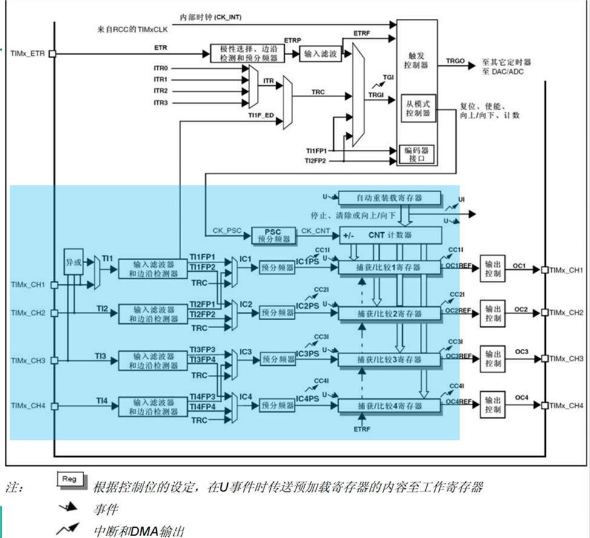
    <figcaption>图6-92　输入捕获框图</figcaption>
  </figure>

  - **输入部分**

    <figure class="course-figure">
      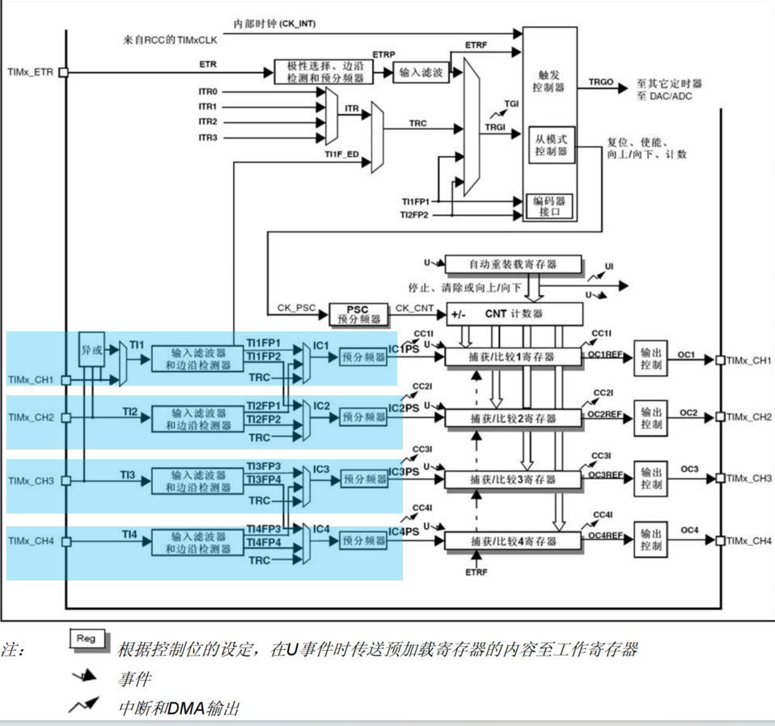
      <figcaption>图6-93　输入部分</figcaption>
    </figure>

    - **共4路输入信号，每路都有自己的输入引脚**

      <figure class="course-figure">
        
        <figcaption>图6-94　共4路输入信号，每路都有自己的输入引脚</figcaption>
      </figure>

    - **注意4路输入引脚和4路的输出比较的引脚是一致的，对同一路引脚，只能处于输入捕获或输出比较**

  - **计数器部分**

    <figure class="course-figure">
      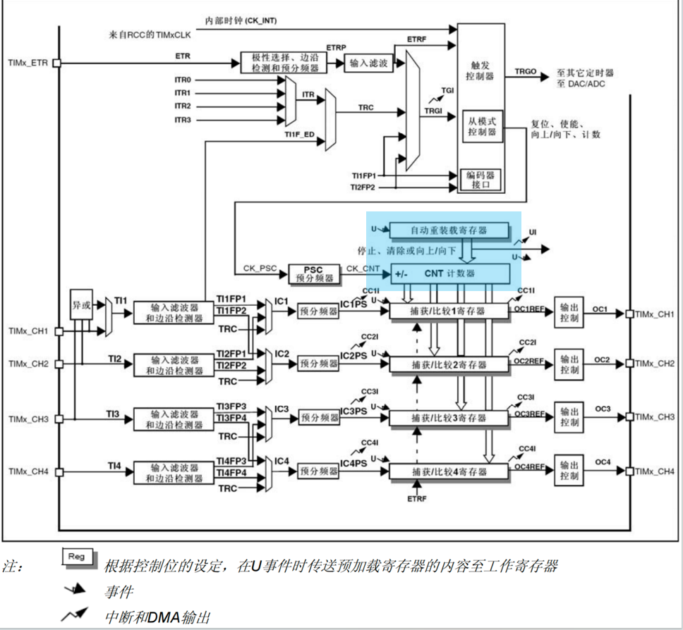
      <figcaption>图6-95　计数器部分</figcaption>
    </figure>

  - **捕获寄存器部分**

    <figure class="course-figure">
      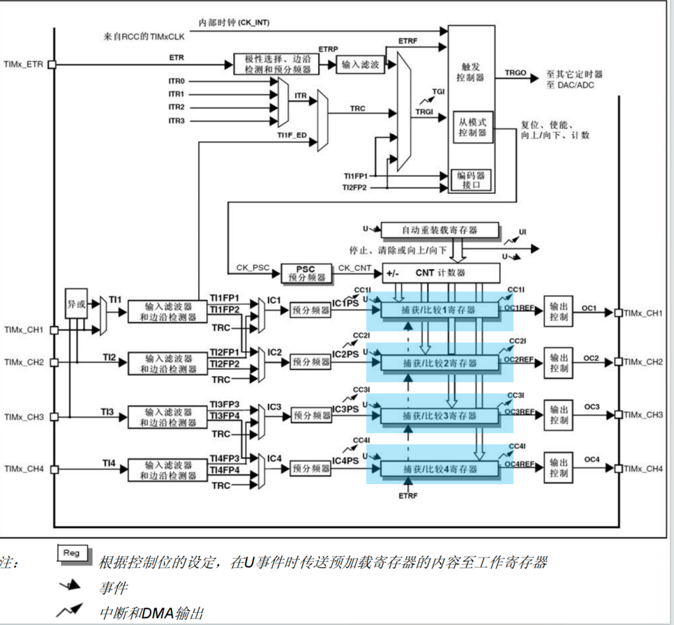
      <figcaption>图6-96　捕获寄存器部分</figcaption>
    </figure>

    - **共有4路，与比较寄存器共用**

- **输入捕获原理**

  - **初始化**

    - **采用通道1，计数器向上计数，重装载寄存器的值为65535，尽量避免计数器溢出**

  - **流程**

    - **信号经过通道1的引脚进入通道1，得到TI1**

      <figure class="course-figure">
        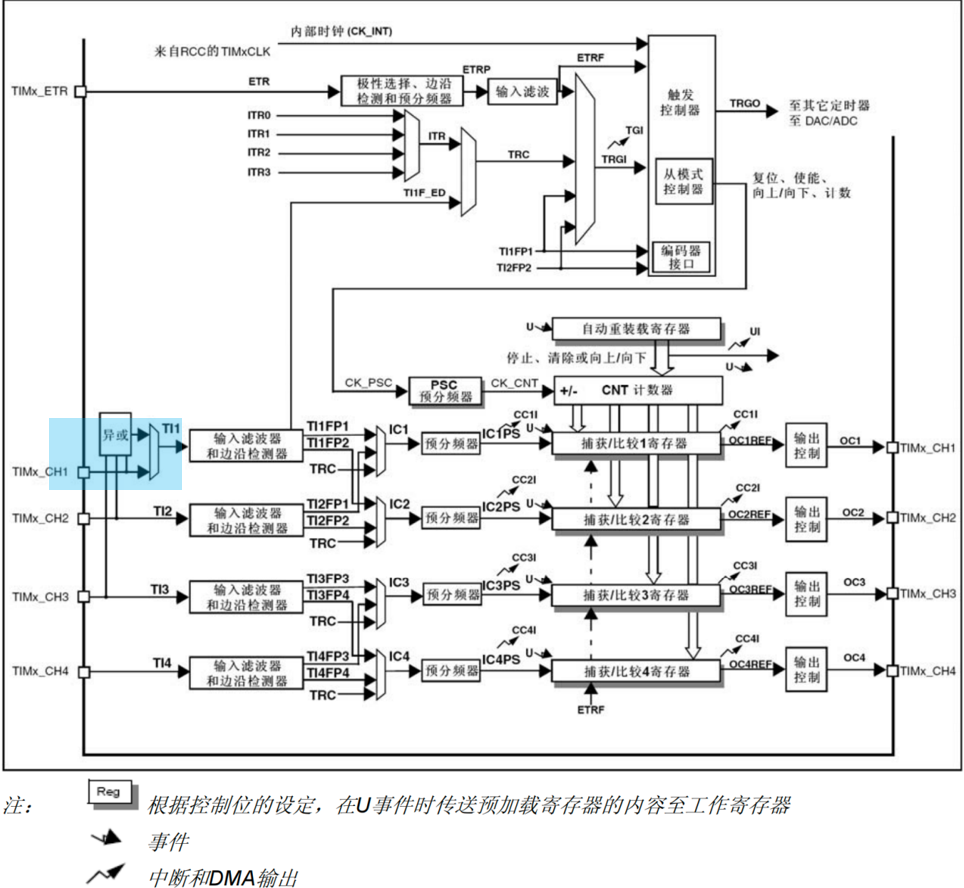
        <figcaption>图6-97　信号经过通道1的引脚进入通道1，得到TI1</figcaption>
      </figure>

    - **TI1信号进入滤波器和边沿检测器**

      - **滤波器用来滤掉一些毛刺信号，信号质量好可以不滤波**

      - **边沿检测器确定要捕获上升沿还是下降沿**

    - **从边沿检测器出来的上升沿或下降沿信号为TI1FP1**

      <figure class="course-figure">
        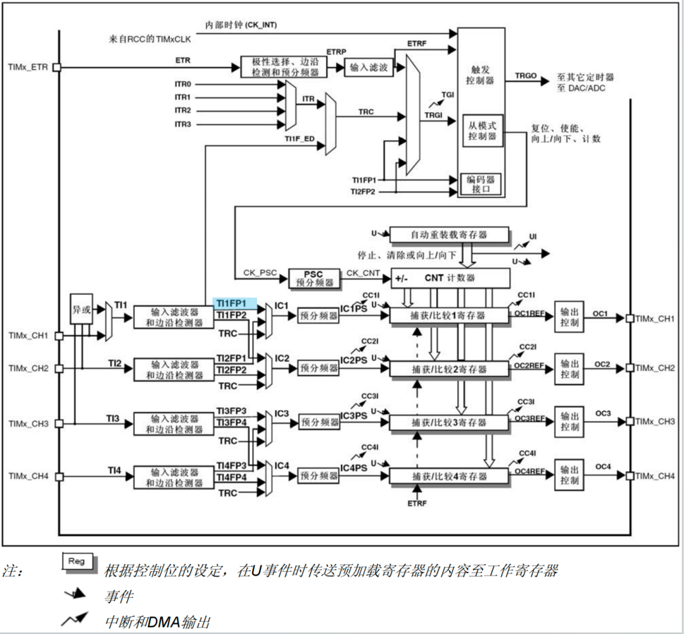
        <figcaption>图6-98　从边沿检测器出来的上升沿或下降沿信号为TI1FP1</figcaption>
      </figure>

    - **T1FP1经过信号选择器得到IC1**

      <figure class="course-figure">
        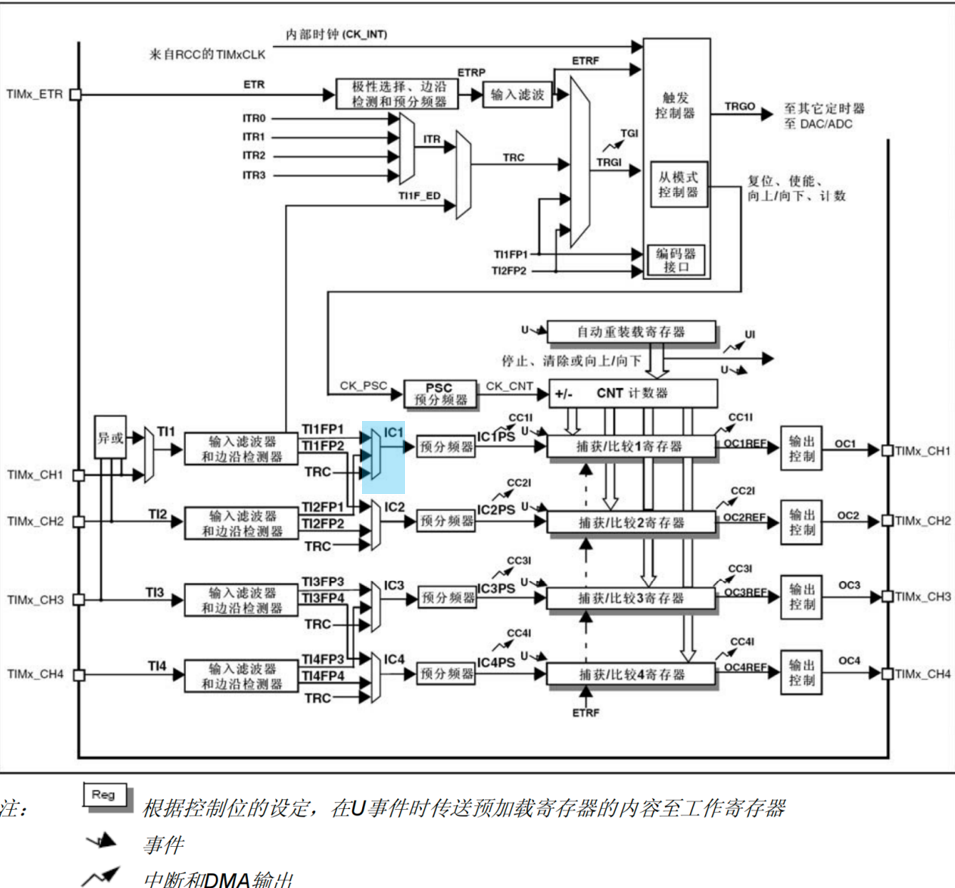
        <figcaption>图6-99　T1FP1经过信号选择器得到IC1</figcaption>
      </figure>

    - **IC1进入预分频器，可以对信号选择分频或不分频。如果捕获的频率很高，可以分频。**

      <figure class="course-figure">
        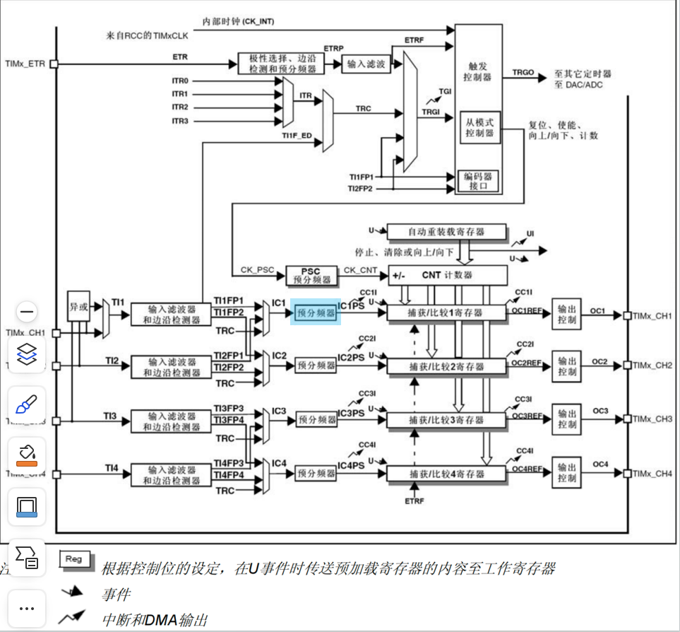
        <figcaption>图6-100　IC1进入预分频器，可以对信号选择分频或不分频。如果捕获的频率很高，可以分频。</figcaption>
      </figure>

    - **信号从预分频器出来，信号为IC1PS**

      - **会产生一个捕获比较事件**

      - **如果开启了中断也会产生捕获比较中断**

      - **立即把计数器寄存器的值存入到捕获寄存器中。在下次捕获事件产生之前，捕获寄存器的值不会发生变化**

  - **测量PWM周期原理**

    - **时钟**

      - **对计数器时钟72分频（主要是方便计算），则计数器时钟频率为1MHz，计数器累加一次的时间为 1us**

    - **测量的信号周期小于65535us即频率大于16Hz**

      - **保证在一个周期内，计数器不会溢出。**

      - **当第1个上升沿到来时，重置计数器的值（让计数器从0开始计数）**

      - **当第2个上升沿到来时,计数器的值会自动copy到捕获寄存器，读出捕获寄存器的值，这个值就表示信号的周期**

    - **测量频率超过1MHz（超过计数器的时钟频率）**

      - **第2个上升沿到了之后，计数器还没有完成一次累加，则无法测量**

      - **可以考虑测试第1个上升沿和第n个上升沿的的间隔。这种一般用来测量高频信号，频率超过了计数器的时钟频率。**

- **触发输入和从模式**

  - **触发信号**

    - **触发输入信号（TRGI）**

      <figure class="course-figure">
        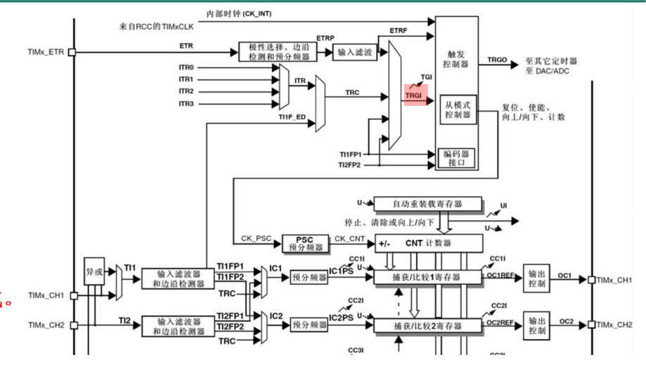
        <figcaption>图6-101　触发输入信号（TRGI）</figcaption>
      </figure>

      - **功能**

        - **通过外部信号（如其他定时器的信号、外部引脚输入或内部触发）控制从定时器的行为，例如启动、停止、复位计数器或同步计数**

        - **从模式的类型**

          - **复位模式**

            - **当检测到触发信号的有效边沿时，计数器复位为0，并重新开始计数**

            - **应用场景 ：同步多个定时器的计数器**

          - **门控模式**

            - **触发条件 ：触发信号的电平控制计数器的启停**

              - **高电平：计数器运行**

              - **低电平：计数器暂停**

            - **应用场景 ：测量外部信号的高电平持续时间**

          - **触发模式**

            - **触发条件 ：触发信号的有效边沿启动计数器。**

            - **应用场景 ：通过外部事件启动定时器**

              - **按键按下时触发定时器开始计数**

          - **外部时钟模式1**

            - **触发条件 ：将外部信号（如TIMx_ETR引脚或内部触发信号）作为计数器的时钟源**

            - **应用场景 ：外部时钟分频或事件计数**

              - **通过TIMx_ETR引脚输入外部脉冲，每个上升沿计数器加1**

          - **编码器模式**

            - **通过编码器信号（如TIMx_CH1和TIMx_CH2）控制计数器方向和计数。**

            - **应用场景 ：电机编码器信号处理**

          - **组合模式**

            - **某些模式可组合使用，例如同时配置复位和门控逻辑**

      - **种类**

        - **从模式控制寄存器中TS[2:0]这3位的描述**

          <figure class="course-figure">
            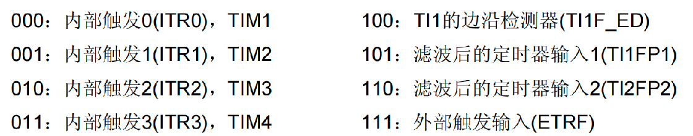
            <figcaption>图6-102　从模式控制寄存器中TS 2:0 这3位的描述</figcaption>
          </figure>

        - **TS[2:0]=000-011  共4个**

          - **来源于其他定时器的TRGO信号**

            <figure class="course-figure">
              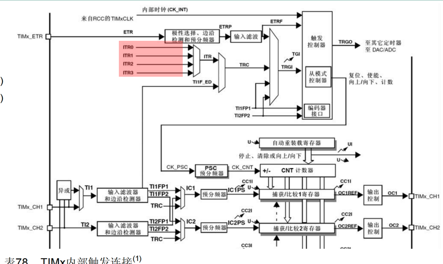
              <figcaption>图6-103　来源于其他定时器的TRGO信号</figcaption>
            </figure>

          - **经过芯片内部连接，来到本定时器的ITR0/1/2/3，内部连接是定死的，不能更改**

            <figure class="course-figure">
              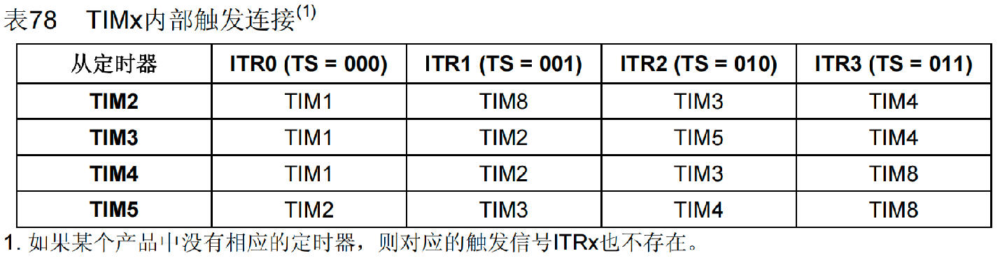
              <figcaption>图6-104　经过芯片内部连接，来到本定时器的ITR0/1/2/3，内部连接是定死的，不能更改</figcaption>
            </figure>

          - **ITRx中某个信号经过信号选择器最终成为TRGI信号，TRGI信号通过从模式控制器控制本定时器实现复位或使能或更改计数方式等**

            <figure class="course-figure">
              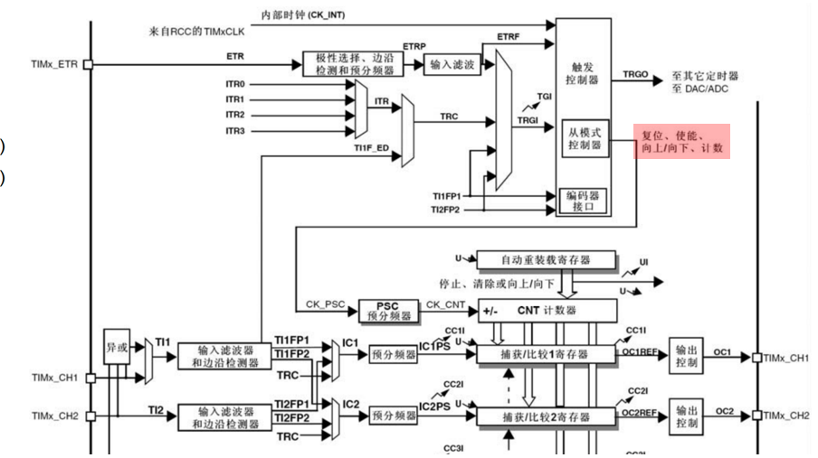
              <figcaption>图6-105　ITRx中某个信号经过信号选择器最终成为TRGI信号，TRGI信号通过从模式控制器控制本定时器实现复位或使能或更改计数方式等</figcaption>
            </figure>

        - **TS[2:0]=111  共1个**

          - **来源于外部触发脚ETR**

          - **经过极性选择，边沿检测和预分频器，输入滤波器，成为TRGI信号**

          - **TRGI信号通过从模式控制器控制本定时器实现复位或使能或更改计数方式等**

        - **TS[2:0]=100  共1个**

          - **来源于定时器自身的通道1信号**

            <figure class="course-figure">
              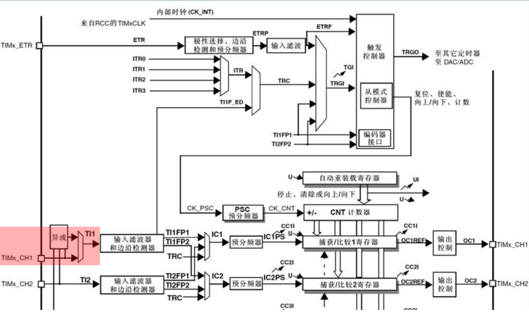
              <figcaption>图6-106　来源于定时器自身的通道1信号</figcaption>
            </figure>

          - **经过输入滤波器和边缘检测器，得到TI1F_ED信号**

          - **上升沿和下降沿都会产生TI1F_ED信号**

          - **经过信号选择器最终成为TRGI信号**

        - **TS[2:0]=101/110  共2个**

          - **来源于定时器自身的通道1信号或通道2信号**

            <figure class="course-figure">
              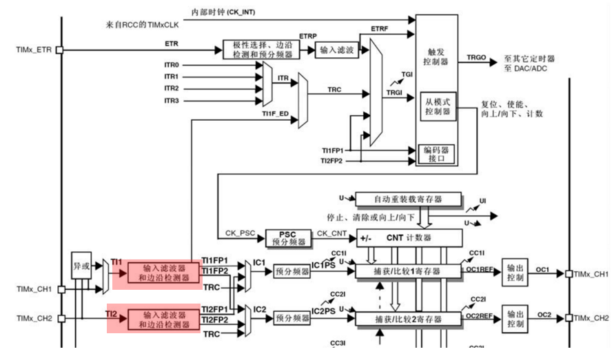
              <figcaption>图6-107　来源于定时器自身的通道1信号或通道2信号</figcaption>
            </figure>

            <figure class="course-figure">
              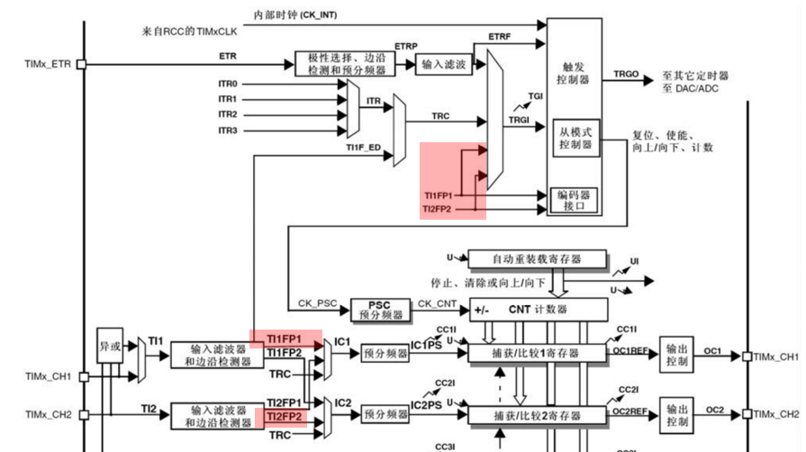
              <figcaption>图6-108　来源于定时器自身的通道1信号或通道2信号</figcaption>
            </figure>

          - **经过输入滤波器和边沿检测器**

          - **得到TI1FP1和TI2FP2信号，他们是上升沿或下降沿，只能选择一种，最终成为TRGI信号**

    - **触发输出信号（TRGO）**

      <figure class="course-figure">
        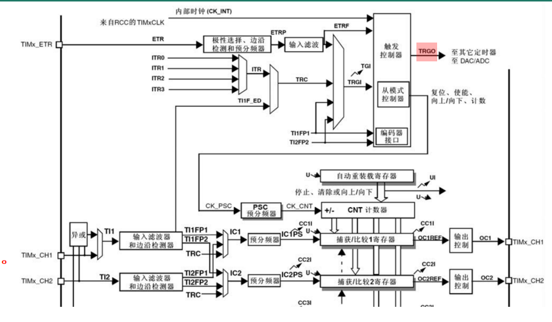
        <figcaption>图6-109　触发输出信号（TRGO）</figcaption>
      </figure>

      - **是本定时器输出到其他定时器或其他外设的信号**

      - **用于与其他定时器的级联（触发其他定时器的一些工作）或触发一些其他外设工作**

      - **这个时候本定时器就是主从模式中的主模式**

  - **定时器从模式**

    - **TRGI信号要控制定时器，必须把定时器配置为从模式，从模式控制寄存器（SMCR）的SMS[2:0]位用来配置从模式工作模式**

      <figure class="course-figure">
        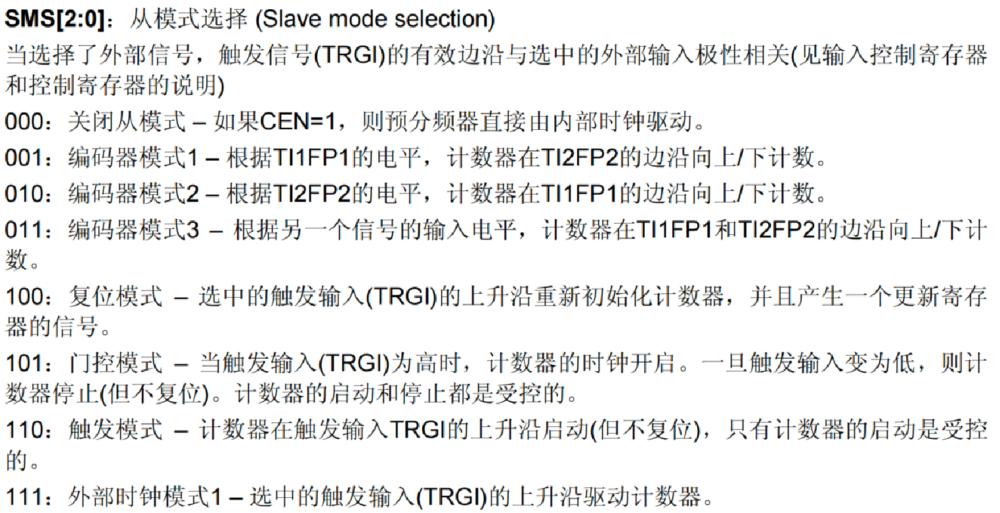
        <figcaption>图6-110　TRGI信号要控制定时器，必须把定时器配置为从模式，从模式控制寄存器（SMCR）的SMS 2:0 位用来配置从模式工作模式</figcaption>
      </figure>

    - **SMS[2:0] = 000**

      - **关闭从模式，默认值**

    - **SMS[2:0] = 001/010/011**

      - **编码器模式**

    - **SMS[2:0] = 100**

      - **复位模式**

        - **触发输入的上升沿会重新初始化计数器（让计数器重新从0开始计数）**

        - **这样就不需要手动清0计数器，也不需要去数上升沿的个数，从而可以硬件自动完成测量。**

    - **SMS[2:0] = 101**

      - **门控模式**

        - **TRGI上升沿启动计数器，下降沿停止计数器。**

    - **SMS[2:0] = 110**

      - **触发模式**

        - **TRGI上升沿启动计数器。但是不会停止计数器**

    - **SMS[2:0] = 111**

      - **外部时钟模式1**

### 3.3 输出比较与PWM：实现LED呼吸灯

**讲解路径：** `CNT`与`CCR`比较 → PWM模式定义电平 → `ARR`控制周期 → `CCR`控制占空比 → 周期修改`CCR`形成呼吸效果。

- **功能**

  - **使用输出比较：输出占空比可调的PWM波形，作用到二极管，使二极管（LED）呈现呼吸灯的效果**

- **硬件**

  - **查看原理图，及用户手册**

  - **确定定时器通道及相关IO口，连接LED**

- **寄存器实现方式**

  - **相关寄存器**

    - **控制寄存器1（TIMx_CR1）**

      - **控制计数器模式、方向、对齐方式及预装载机制**

        <figure class="course-figure">
          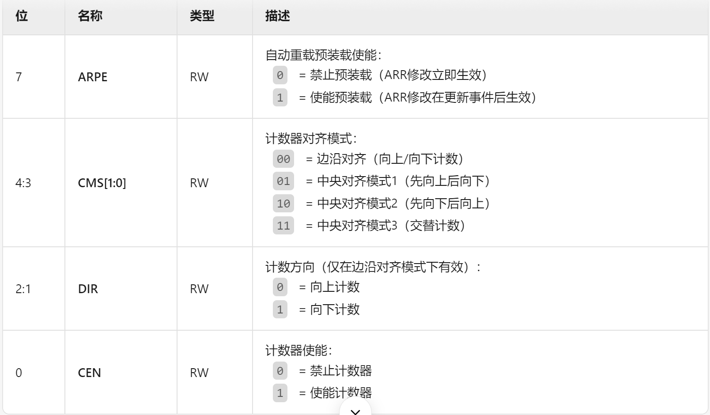
          <figcaption>图6-111　控制计数器模式、方向、对齐方式及预装载机制</figcaption>
        </figure>

    - **控制寄存器2（TIMx_CR2）**

      - **配置触发输出（TRGO）、主从模式及编码器接口**

        <figure class="course-figure">
          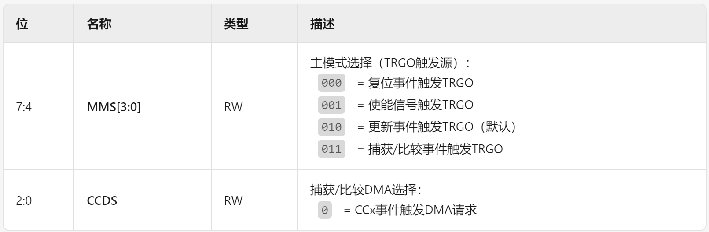
          <figcaption>图6-112　配置触发输出（TRGO）、主从模式及编码器接口</figcaption>
        </figure>

    - **预分频器寄存器（TIMx_PSC）**

    - **自动重载寄存器（TIMx_ARR）**

    - **捕获/比较模式寄存器（TIMx_CCMR1/CCMR2）**

      <figure class="course-figure">
        
        <figcaption>图6-113　捕获/比较模式寄存器（TIMx_CCMR1/CCMR2）</figcaption>
      </figure>

      - **配置通道的输入捕获（Input Capture）或输出比较（Output Compare）模式**

        - **TIMx_CCMR1（CH1/CH2）**

        - **TIMx_CCMR2（CH3/CH4）**

      - **重点位段**

        - **CCxS[1:0]**

          - **通道方向（输入/输出）**

            <figure class="course-figure">
              
              <figcaption>图6-114　通道方向（输入/输出）</figcaption>
            </figure>

            <figure class="course-figure">
              
              <figcaption>图6-115　通道方向（输入/输出）</figcaption>
            </figure>

        - **OCxM[2:0]**

          - **输出比较模式**

            <figure class="course-figure">
              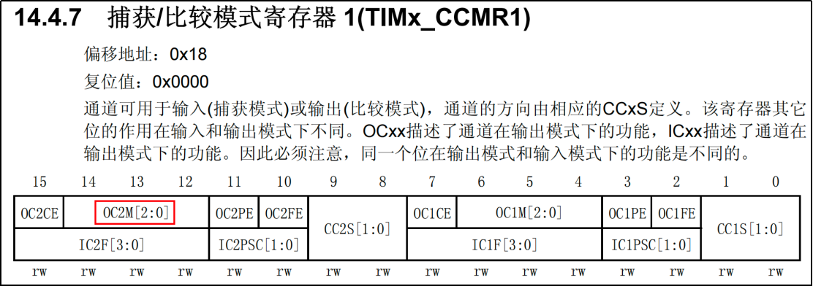
              <figcaption>图6-116　输出比较模式</figcaption>
            </figure>

            <figure class="course-figure">
              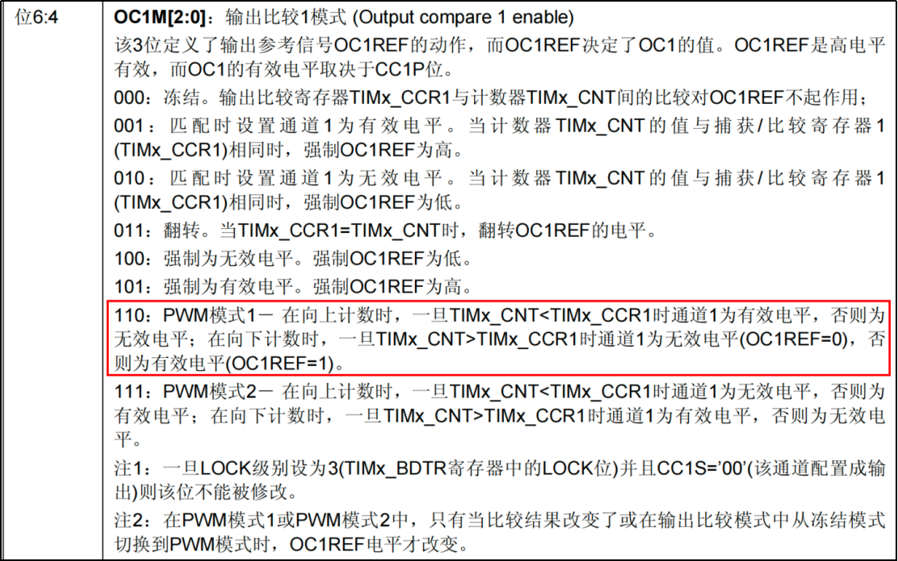
              <figcaption>图6-117　输出比较模式</figcaption>
            </figure>

        - **OC1PE**

          - **输出比较预装载使能**

            OC1PE​  输出比较预装载使能：

            0 = 禁用预装载（修改CCRx立即生效）

            1 = 启用预装载（修改CCRx在更新事件后生效）。

    - **捕获/比较使能寄存器（TIMx_CCER）**

      - **使能通道输出/输入，配置捕获极性**

        <figure class="course-figure">
          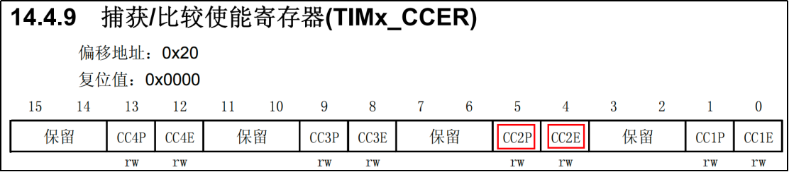
          <figcaption>图6-118　使能通道输出/输入，配置捕获极性</figcaption>
        </figure>

        <figure class="course-figure">
          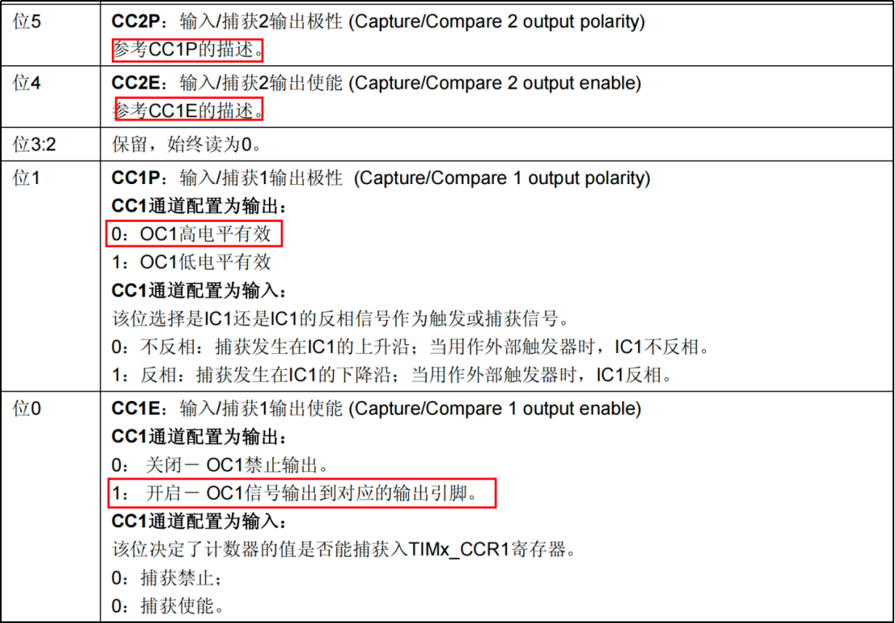
          <figcaption>图6-119　使能通道输出/输入，配置捕获极性</figcaption>
        </figure>

    - **捕获/比较寄存器（TIMx_CCR1-CCR4）**

      - **输出比较 ：设置比较值，控制PWM占空比或输出时序**

      - **输入捕获 ：存储捕获事件时的计数器值**

    - **状态寄存器（TIMx_SR）**

      - **标志位管理，用于中断请求和状态查询**

      - **UIF**

        - **更新中断标志**

      - **CCXIF**

        - **通道X捕获/比较中断标志**

      - **TIF**

        - **触发中断标志（高级定时器专用）**

    - **中断使能寄存器（TIMx_DIER）**

      - **使能中断和DMA请求**

      - **UIE**

        - **更新中断使能**

      - **CCXIE**

        - **通道X捕获/比较中断使能**

      - **UDE**

        - **更新DMA请求使能**

  - **实现思路**

    - **开启时钟**

      - **定时器的时钟**

      - **GPIO的时钟**

    - **设置GPIO的复用推挽输出**

    - **定时器配置**

      - **预分频器的配置**

      - **自动重装载寄存器的配置**

      - **计数器的计数方向 0=向上 1=向下**

      - **配置通道X的捕获比较寄存器**

        - **把通道X配置为输出**

        - **配置通道的输出比较模式**

      - **捕获/比较使能寄存器**

        - **使能通道X**

        - **设置通道的极性 0=高电平有效  1=低电平有效**

    - **使能/关闭计数器**

    - **PWM占空比修改**

      - **通过修改通道X的捕获比较寄存器的值改变占空比**

  - **代码**

    - **以Tim5通道2为例**

      - **tim5.c**

        ```c
        void TIM5_Init(void)
        {
            /* 1.  开启时钟 */
            /* 1.1 定时器5的时钟 */
            RCC->APB1ENR |= RCC_APB1ENR_TIM5EN;
            /* 1.2 GPIO的时钟 PA */
            RCC->APB2ENR |= RCC_APB2ENR_IOPAEN;
            /* 2. 设置GPIO的复用推挽输出 PA1 CNF=10 MODE=11 */
            GPIOA->CRL |= (GPIO_CRL_CNF1_1 | GPIO_CRL_MODE1);
            GPIOA->CRL &= ~GPIO_CRL_CNF1_0;
            /* 3. 定时器配置 */
            /* 3.1 预分频器的配置 */
            TIM5->PSC = 7200 - 1;
            /* 3.2 自动重装载寄存器的配置 */
            TIM5->ARR = 100 - 1;
            /* 3.3 计数器的计数方向 0=向上 1=向下 */
            TIM5->CR1 &= ~TIM_CR1_DIR;
            /* 3.4 配置通道2的捕获比较寄存器 */
            TIM5->CCR2 = 97;
            /* 3.5 把通道2配置为输出  CCMR1_CC2S=00 */
            TIM5->CCMR1 &= ~TIM_CCMR1_CC2S;
            /* 3.6 配置通道的输出比较模式 CCMR1_OC2M=110 */
            TIM5->CCMR1 |= TIM_CCMR1_OC2M_2;
            TIM5->CCMR1 |= TIM_CCMR1_OC2M_1;
            TIM5->CCMR1 &= ~TIM_CCMR1_OC2M_0;
            /* 3.7 使能通道2  CCER_CC2E=1 */
            TIM5->CCER |= TIM_CCER_CC2E;
            /* 3.8 设置通道的极性 0=高电平有效  1=低电平有效 */
            TIM5->CCER &= ~TIM_CCER_CC2P;
        }

        void TIM5_Start(void)
        {
            /* 使能计数器 */
            TIM5->CR1 |= TIM_CR1_CEN;
        }

        void TIM5_Stop(void)
        {
            /* 失能计数器 */
            TIM5->CR1 &= ~TIM_CR1_CEN;
        }

        void TIM5_SetDutyCycle(uint8_t dutyCycle)
        {
            TIM5->CCR2 = dutyCycle;
        }
        ```

      - **main.c**

        ```c
        int main()
        {
            USART1_Init();
            printf("系统定时器实验开始...\r\n");
            //Driver_LED_Init();
            TIM5_Init();
            TIM5_Start();
            uint8_t dutyCycle = 0;
            uint8_t dir = 0;  // 变大
            TIM5_SetDutyCycle(dutyCycle);
            while (1)
            {
                if (dir == 0)
                {
                    dutyCycle += 1;
                    if (dutyCycle >= 99)
                    {
                        dir = 1;
                    }
                }
                else
                {
                    dutyCycle -= 1;
                    if (dutyCycle <= 1)
                    {
                        dir = 0;
                    }
                }
                TIM5_SetDutyCycle(dutyCycle);
                Delay_ms(10);
            }
        }
        ```

- **HAL库实现**

  - **HAL库工程创建**

    - **根据MCU型号创建工程**

      <figure class="course-figure">
        
        <figcaption>图6-120　根据MCU型号创建工程</figcaption>
      </figure>

      - **选择MCU型号**

        <figure class="course-figure">
          
          <figcaption>图6-121　选择MCU型号</figcaption>
        </figure>

    - **参数配置界面**

      <figure class="course-figure">
        
        <figcaption>图6-122　参数配置界面</figcaption>
      </figure>

      <figure class="course-figure">
        
        <figcaption>图6-123　参数配置界面</figcaption>
      </figure>

      <figure class="course-figure">
        
        <figcaption>图6-124　参数配置界面</figcaption>
      </figure>

      <figure class="course-figure">
        
        <figcaption>图6-125　参数配置界面</figcaption>
      </figure>

      <figure class="course-figure">
        
        <figcaption>图6-126　参数配置界面</figcaption>
      </figure>

      - **Debug参数选择**

        <figure class="course-figure">
          
          <figcaption>图6-127　Debug参数选择</figcaption>
        </figure>

        - **选择串口即可。这个地方务必设置好，否则只能下载一次程序到MCU，以后就无法下载了。**

      - **RCC时钟选择**

        <figure class="course-figure">
          
          <figcaption>图6-128　RCC时钟选择</figcaption>
        </figure>

        <figure class="course-figure">
          
          <figcaption>图6-129　RCC时钟选择</figcaption>
        </figure>

      - **串口配置**

        <figure class="course-figure">
          
          <figcaption>图6-130　串口配置</figcaption>
        </figure>

        <figure class="course-figure">
          
          <figcaption>图6-131　串口配置</figcaption>
        </figure>

        <figure class="course-figure">
          
          <figcaption>图6-132　串口配置</figcaption>
        </figure>

        - **选择串口**

          <figure class="course-figure">
            
            <figcaption>图6-133　选择串口</figcaption>
          </figure>

        - **配置串口**

          <figure class="course-figure">
            
            <figcaption>图6-134　配置串口</figcaption>
          </figure>

        - **开启串口中断**

          <figure class="course-figure">
            
            <figcaption>图6-135　开启串口中断</figcaption>
          </figure>

        - **IO口自动设置**

          <figure class="course-figure">
            
            <figcaption>图6-136　IO口自动设置</figcaption>
          </figure>

      - **GPIO配置**

        <figure class="course-figure">
          
          <figcaption>图6-137　GPIO配置</figcaption>
        </figure>

      - **TIM5配置**

        <figure class="course-figure">
          
          <figcaption>图6-138　TIM5配置</figcaption>
        </figure>

      - **工程配置**

        <figure class="course-figure">
          
          <figcaption>图6-139　工程配置</figcaption>
        </figure>

        <figure class="course-figure">
          
          <figcaption>图6-140　工程配置</figcaption>
        </figure>

        <figure class="course-figure">
          
          <figcaption>图6-141　工程配置</figcaption>
        </figure>

      - **生成代码**

        <figure class="course-figure">
          
          <figcaption>图6-142　生成代码</figcaption>
        </figure>

        <figure class="course-figure">
          
          <figcaption>图6-143　生成代码</figcaption>
        </figure>

      - **生成的工程目录介绍**

        <figure class="course-figure">
          
          <figcaption>图6-144　生成的工程目录介绍</figcaption>
        </figure>

        - **main函数中已经替我们调用了HAL的初始化，时钟的初始化，GPIO的初始化，定时器初始化**

          ```c
          int main(void)
          {
              HAL_Init();
              SystemClock_Config();
              MX_GPIO_Init();
              while (1)
              {
              }
          }
          ```

  - **HAL库相关函数**

    - **初始化定时器的PWM模式**

      - **HAL_StatusTypeDef HAL_TIM_PWM_Init(TIM_HandleTypeDef *htim);**

    - **启动或停止指定PWM通道**

      HAL_TIM_PWM_Start(&htim2, TIM_CHANNEL_1);  // 启动TIM2_CH1输出PWM

      - **HAL_StatusTypeDef HAL_TIM_PWM_Start(TIM_HandleTypeDef *htim, uint32_t Channel);**

      - **HAL_StatusTypeDef HAL_TIM_PWM_Stop(TIM_HandleTypeDef *htim, uint32_t Channel);**

    - **宏定义，动态设置PWM占空比**

      - **__HAL_TIM_SET_COMPARE()**

        __HAL_TIM_SET_COMPARE(&htim2, TIM_CHANNEL_1, 300); // 占空比30%

  - **实现**

    - **添加修改占空比的函数**

      - **在tim.c中添加下面的方法，并在tim.h中声明**

        ```c
        /* USER CODE BEGIN 1 */
        
        void setDutyCycle(uint16_t dutyCycle)
        {
            // 设置捕获比较寄存器的值
            __HAL_TIM_SetCompare(&htim5, TIM_CHANNEL_2, dutyCycle);
        }
        /* USER CODE END 1 */
        ```

    - **主函数**

      ```c
      int main(void)
      {
          HAL_Init();
          SystemClock_Config();
          MX_GPIO_Init();
          MX_TIM5_Init();
          HAL_TIM_PWM_Start(&htim5, TIM_CHANNEL_2);
          uint8_t dutyCycle = 1;
          int8_t step = 1;
          while (1)
          {
              if (dutyCycle <= 0 || dutyCycle >= 99)
              {
                  step = -step;
              }
              dutyCycle += step;
              setDutyCycle(dutyCycle);
              HAL_Delay(10);
          }
      }
      ```

### 3.4 输入捕获：测量PWM周期与频率

**讲解路径：** 输入滤波与边沿选择 → 边沿到达时锁存`CNT` → 两次捕获求时间差 → 换算周期和频率。

- **寄存器方式实现**

  - **功能**

    - **使用输入捕获功能，来测试PWM波的频率/周期，把测到的结果通过串口发送到电脑，检查测试的结果**

  - **硬件电路设计**

    - **输出PWM方波的接口借入Tim4的通道1**

  - **相关寄存器**

    - **控制寄存器1（TIMx_CR1）**

      - **控制计数器模式、方向、对齐方式及预装载机制**

        <figure class="course-figure">
          
          <figcaption>图6-145　控制计数器模式、方向、对齐方式及预装载机制</figcaption>
        </figure>

    - **控制寄存器2（TIMx_CR2）**

      - **配置触发输出（TRGO）、主从模式及编码器接口**

        <figure class="course-figure">
          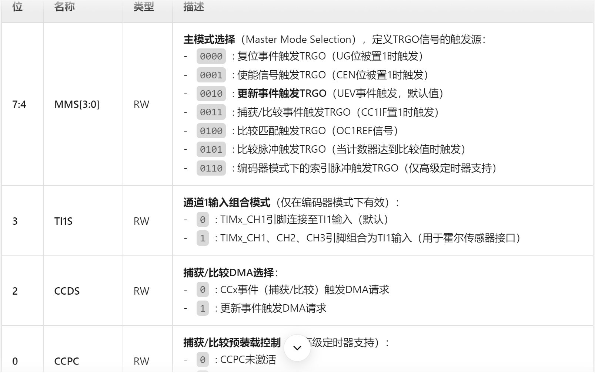
          <figcaption>图6-146　配置触发输出（TRGO）、主从模式及编码器接口</figcaption>
        </figure>

    - **预分频器寄存器（TIMx_PSC）**

    - **自动重载寄存器（TIMx_ARR）**

    - **捕获/比较模式寄存器（TIMx_CCMR1/CCMR2）**

      <figure class="course-figure">
        
        <figcaption>图6-147　捕获/比较模式寄存器（TIMx_CCMR1/CCMR2）</figcaption>
      </figure>

      - **配置通道的输入捕获（Input Capture）或输出比较（Output Compare）模式**

        - **TIMx_CCMR1（CH1/CH2）**

        - **TIMx_CCMR2（CH3/CH4）**

      - **重点位段**

        - **CCxS[1:0]**

          - **通道方向（输入/输出）**

            <figure class="course-figure">
              
              <figcaption>图6-148　通道方向（输入/输出）</figcaption>
            </figure>

            <figure class="course-figure">
              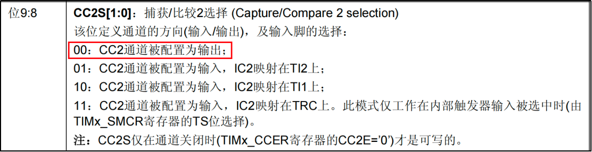
              <figcaption>图6-149　通道方向（输入/输出）</figcaption>
            </figure>

        - **IC1F[3:0]**

          - **输入滤波器配置**

            <figure class="course-figure">
              
              <figcaption>图6-150　输入滤波器配置</figcaption>
            </figure>

        - **IC1PSC[1:0]**

          - **输入预分频器**

            输入预分频器：

            00 = 每1个边沿触发一次捕获

            01 = 每2个边沿触发一次捕获

            10 = 每4个边沿触发一次捕获

            11 = 每8个边沿触发一次捕获

    - **捕获/比较使能寄存器（TIMx_CCER）**

      <figure class="course-figure">
        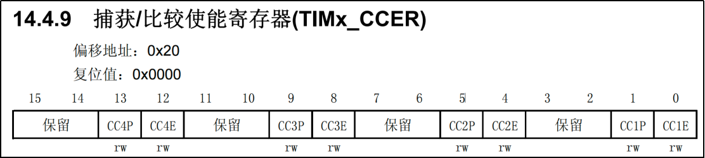
        <figcaption>图6-151　捕获/比较使能寄存器（TIMx_CCER）</figcaption>
      </figure>

      - **使能通道输出/输入，配置捕获极性**

        <figure class="course-figure">
          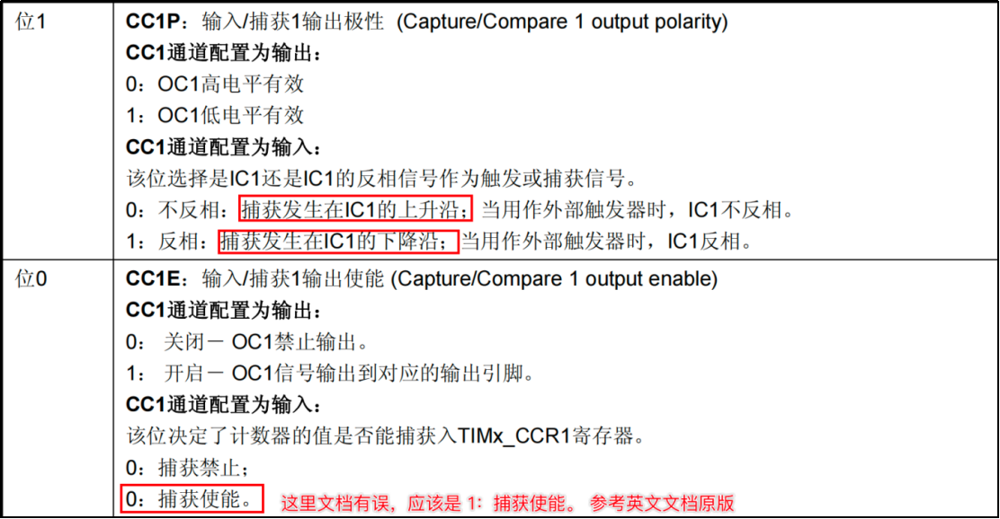
          <figcaption>图6-152　使能通道输出/输入，配置捕获极性</figcaption>
        </figure>

    - **捕获/比较寄存器（TIMx_CCR1-CCR4）**

      - **输出比较 ：设置比较值，控制PWM占空比或输出时序**

      - **输入捕获 ：存储捕获事件时的计数器值**

    - **状态寄存器（TIMx_SR）**

      - **标志位管理，用于中断请求和状态查询**

      - **UIF**

        - **更新中断标志**

      - **CCXIF**

        - **通道X捕获/比较中断标志**

      - **TIF**

        - **触发中断标志（高级定时器专用）**

    - **中断使能寄存器（TIMx_DIER）**

      - **使能中断和DMA请求**

      - **UIE**

        - **更新中断使能**

      - **CCXIE**

        - **通道X捕获/比较中断使能**

      - **UDE**

        - **更新DMA请求使能**

  - **实现思路**

    - **开启时钟**

      - **定时器的时钟**

      - **GPIO的时钟**

    - **设置GPIO的浮空输入**

    - **定时器配置**

      - **预分频器的配置**

      - **自动重装载寄存器的配置：设置最大,尽量避免溢出65535**

      - **计数器的计数方向 0=向上 1=向下**

      - **输入捕获**

        - **控制寄存器2（TIMx_CR2）：TI1的选择: 把CH1直接连接到TI1**

        - **捕获/比较模式寄存器（TIMx_CCMR1/CCMR2）**

          - **信号的输入滤波器: 不滤波**

          - **通道1配置为输入,并把信号映射到IC1**

          - **对信号做分频(信号频率比较高的时候)**

        - **捕获/比较使能寄存器（TIMx_CCER）**

          - **配置边缘检测器: 上升沿 CCER_CC1P=0  1下降沿捕获**

          - **通道1输入捕获使能 CCER_CC1E=1**

        - **中断使能寄存器（TIMx_DIER）**

          - **开启捕获中断 DIER_CC1IE=1**

      - **NVIC的配置**

        - **优先级组**

        - **优先级**

        - **使能中断**

    - **使能/关闭计数器**

    - **实现中断服务程序：TIM4_IRQHandler**

      - **判断是否是TIM4的通道1发生了捕获中断**

        - **中断标记位清除**

        - **判断上升沿个数**

          - **如果是第1个上升沿,则清零计数器,让计数器从0开始计数**

          - **如果是第2个上升沿,读取捕获寄存器的值,就是周期 单位是us**

          - **上升沿的计数从0重新计数**

  - **代码实现**

    - **功能函数**

      - **初始化：TIM4_Init**

        ```c
        void TIM4_Init(void)
        {
            /* 1. 开启时钟 */
            /* 1.1 TIM4的时钟 */
            RCC->APB1ENR |= RCC_APB1ENR_TIM4EN;
            /* 1.2 把引脚(PB6) 对应的端口开启时钟 */
            RCC->APB2ENR |= RCC_APB2ENR_IOPBEN;
            /* 2. PB6设置为输入: 浮空输入 CNF=01 MODE=00 */
            GPIOB->CRL &= ~(GPIO_CRL_CNF6_1 | GPIO_CRL_MODE6);
            GPIOB->CRL |= GPIO_CRL_CNF6_0;
            /* 3. 配置定时器的时基部分 */
            /* 3.1 预分频系数配置 分频后计数器的时钟时1MHz 周期:1us */
            TIM4->PSC = 72 - 1;
            /* 3.2 自动重装载寄存器的值: 设置最大,尽量避免溢出 */
            TIM4->ARR = 65535;
            /* 3.3 计数方向: 向上计数 */
            TIM4->CR1 &= ~TIM_CR1_DIR;
            /* 4. 输入捕获部分 */
            /* 4.1 TI1的选择: 把CH1直接连接到TI1 */
            TIM4->CR2 &= ~TIM_CR2_TI1S;
            /* 4.2 信号的输入滤波器: 不滤波  CCMR1_IC1F=0000 */
            TIM4->CCMR1 &= ~TIM_CCMR1_IC1F;
            /* 4.3 配置边缘检测器: 上升沿 CCER_CC1P=0  1下降沿捕获 */
            TIM4->CCER &= ~TIM_CCER_CC1P;
            /* 4.4 通道1配置为输入,并把信号映射到IC1  CC1S=01 */
            TIM4->CCMR1 &= ~TIM_CCMR1_CC1S_1;
            TIM4->CCMR1 |= TIM_CCMR1_CC1S_0;
            /* 4.5 对信号做分频(信号频率比较高的时候) CCMR1_IC1PSC=00不分频 01=2分频 10=4分频 11=8分频 */
            TIM4->CCMR1 &= ~TIM_CCMR1_IC1PSC;
            /* 4.6 通道1输入捕获使能 CCER_CC1E=1 */
            TIM4->CCER |= TIM_CCER_CC1E;
            /* 4.7 开启捕获中断 DIER_CC1IE=1 */
            TIM4->DIER |= TIM_DIER_CC1IE;
            /* 5. NVIC的配置 */
            /* 5.1 优先级组 */
            NVIC_SetPriorityGrouping(3);
            /* 5.2 优先级 */
            NVIC_SetPriority(TIM4_IRQn, 3);
            /* 5.3 使能中断 */
            NVIC_EnableIRQ(TIM4_IRQn);
        }
        ```

      - **启动定时器：TIM4_Start**

        ```c
        void TIM4_Start(void)
        {
            TIM4->CR1 |= TIM_CR1_CEN; /* 计数器使能 */
        }
        ```

      - **关闭定时器：TIM4_Stop**

        ```c
        void TIM4_Stop(void)
        {
            TIM4->CR1 &= ~TIM_CR1_CEN; /* 计数器失能 */
        }
        ```

      - **中断服务程序：TIM4_IRQHandler**

        ```c
        /* 记录上升沿的个数 */
        uint8_t raiseEdgeCount = 0;
        /* 存储信号的周期 */
        uint16_t t = 0;
        /* TIM4中断服务函数 */

        void TIM4_IRQHandler(void)
        {
            /* 判断是否是TIM4的通道1发生了捕获中断 */
            if (TIM4->SR & TIM_SR_CC1IF)
            {
                /* 中断标记位清除 */
                TIM4->SR &= ~TIM_SR_CC1IF;
                /* 上升沿个数 */
                raiseEdgeCount++;
                /* 如果是第1个上升沿,则清零计数器,让计数器从0开始计数 */
                if (raiseEdgeCount == 1)
                {
                    TIM4->CNT = 0; /* 计数器清零 */
                }
                else if (raiseEdgeCount == 2)
                {
                    /* 读取捕获寄存器的值,就是周期 单位是us */
                    t = TIM4->CCR1;
                    /* 上升沿的计数从0重新计数 */
                    raiseEdgeCount = 0;
                }
            }
        }
        ```

      - **PWM的周期：TIM4_GetPWMCycle**

        double TIM4_GetPWMCycle(void)

        {

        return t / 1000.0;

        }

      - **PWM的频率：TIM4_GetPWMFreq**

        double TIM4_GetPWMFreq(void)

        {

        return 1000000 / t;

        }

    - **主函数**

      ```c
      #include "USART.h"
      #include "Delay.h"
      #include "TIM5.h"
      #include "TIM4.h"
    
      int main()
      {
          USART1_Init();
          printf("系统定时器实验开始...\r\n");
          TIM5_Init();
          TIM5_Start();
          TIM4_Init();
          TIM4_Start();
          double t, f;
          while (1)
          {
              t = TIM4_GetPWMCycle();
              f = TIM4_GetPWMFreq();
              printf("t=%.4fms, f=%.4fHz\r\n", t, f);
              Delay_ms(1000);
          }
      }
      ```

  - **如何实现同时测量PWM的频率/周期和占空比**

    ```c
    volatile uint32_t rise1 = 0, fall = 0, rise2 = 0;
    volatile uint32_t period = 0, high_time = 0, duty = 0;
    
    void TIM4_IRQHandler(void) {
        if (TIM4->SR & TIM_SR_CC1IF) {  // 捕获中断触发
            uint32_t capture = TIM4->CCR1;  // 读取捕获值
            if ((TIM4->CCER & TIM_CCER_CC1P) == 0) {
                // 当前为上升沿触发模式
                if (rise1 == 0) {
                    rise1 = capture;
                    // 切换为下降沿触发
                    TIM4->CCER |= TIM_CCER_CC1P;
                } else {
                    // 第二次上升沿：计算周期
                    rise2 = capture;
                    period = (rise2 - rise1);  // 周期（μs）
                    high_time = fall - rise1;  // 高电平时间（μs）
                    duty = (high_time * 100) / period;  // 占空比（%）
                    rise1 = rise2;  // 重置为下次周期测量
                }
            } else {
                // 当前为下降沿触发模式
                fall = capture;
                // 切换回上升沿触发
                TIM4->CCER &= ~TIM_CCER_CC1P;
            }
            TIM4->SR &= ~TIM_SR_CC1IF;  // 清除中断标志
        }
    }
    ```

- **HAL库实现**

  - **HAL库工程创建**

    - **根据MCU型号创建工程**

      <figure class="course-figure">
        
        <figcaption>图6-153　根据MCU型号创建工程</figcaption>
      </figure>

      - **选择MCU型号**

        <figure class="course-figure">
          
          <figcaption>图6-154　选择MCU型号</figcaption>
        </figure>

    - **参数配置界面**

      <figure class="course-figure">
        
        <figcaption>图6-155　参数配置界面</figcaption>
      </figure>

      <figure class="course-figure">
        
        <figcaption>图6-156　参数配置界面</figcaption>
      </figure>

      <figure class="course-figure">
        
        <figcaption>图6-157　参数配置界面</figcaption>
      </figure>

      <figure class="course-figure">
        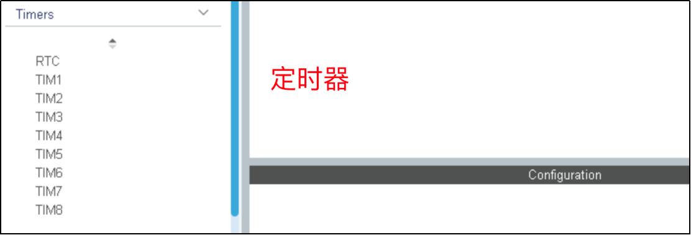
        <figcaption>图6-158　参数配置界面</figcaption>
      </figure>

      <figure class="course-figure">
        
        <figcaption>图6-159　参数配置界面</figcaption>
      </figure>

      - **Debug参数选择**

        <figure class="course-figure">
          
          <figcaption>图6-160　Debug参数选择</figcaption>
        </figure>

        - **选择串口即可。这个地方务必设置好，否则只能下载一次程序到MCU，以后就无法下载了。**

      - **RCC时钟选择**

        <figure class="course-figure">
          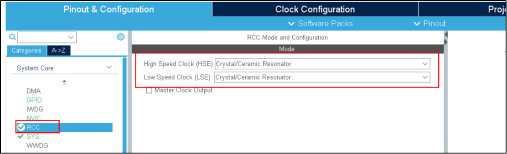
          <figcaption>图6-161　RCC时钟选择</figcaption>
        </figure>

        <figure class="course-figure">
          
          <figcaption>图6-162　RCC时钟选择</figcaption>
        </figure>

      - **串口配置**

        <figure class="course-figure">
          
          <figcaption>图6-163　串口配置</figcaption>
        </figure>

        <figure class="course-figure">
          
          <figcaption>图6-164　串口配置</figcaption>
        </figure>

        <figure class="course-figure">
          
          <figcaption>图6-165　串口配置</figcaption>
        </figure>

        - **选择串口**

          <figure class="course-figure">
            
            <figcaption>图6-166　选择串口</figcaption>
          </figure>

        - **配置串口**

          <figure class="course-figure">
            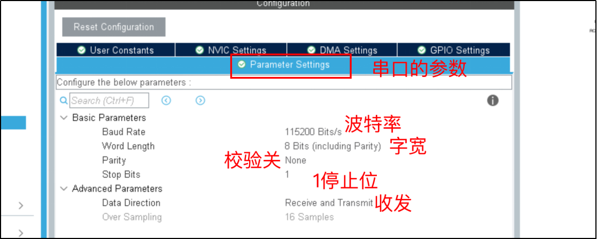
            <figcaption>图6-167　配置串口</figcaption>
          </figure>

        - **开启串口中断**

          <figure class="course-figure">
            
            <figcaption>图6-168　开启串口中断</figcaption>
          </figure>

        - **IO口自动设置**

          <figure class="course-figure">
            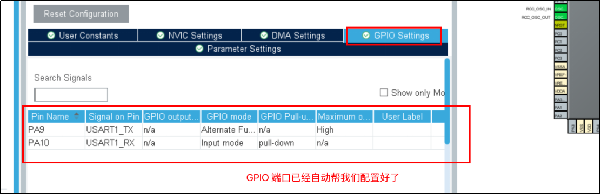
            <figcaption>图6-169　IO口自动设置</figcaption>
          </figure>

      - **GPIO配置**

        <figure class="course-figure">
          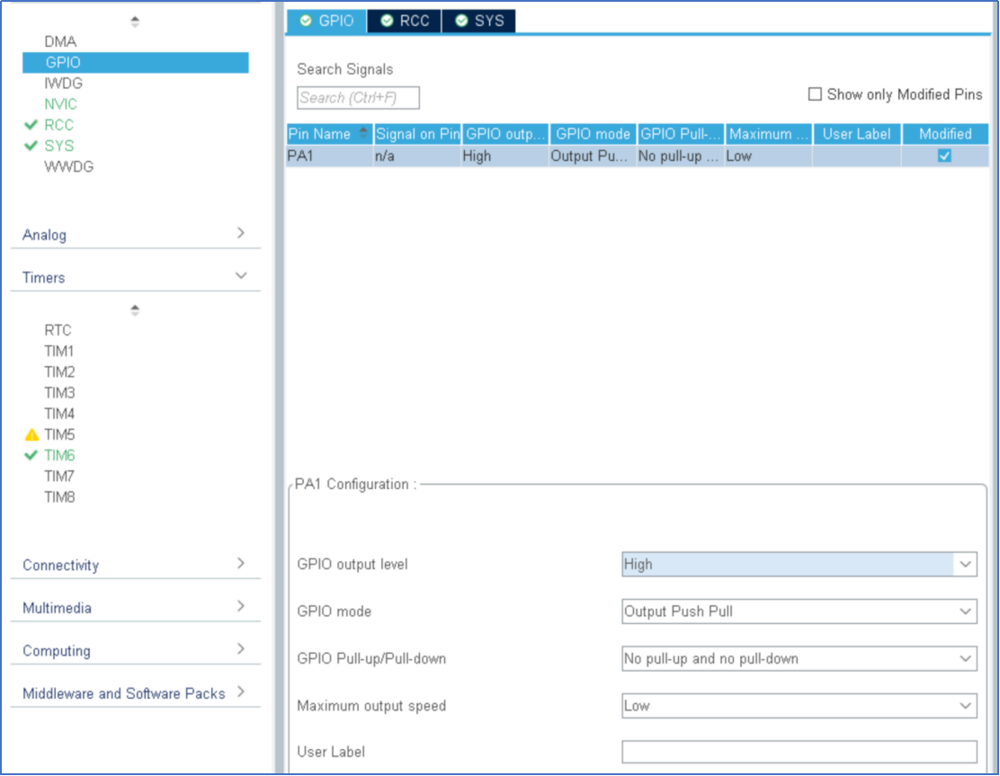
          <figcaption>图6-170　GPIO配置</figcaption>
        </figure>

      - **TIM5配置**

        <figure class="course-figure">
          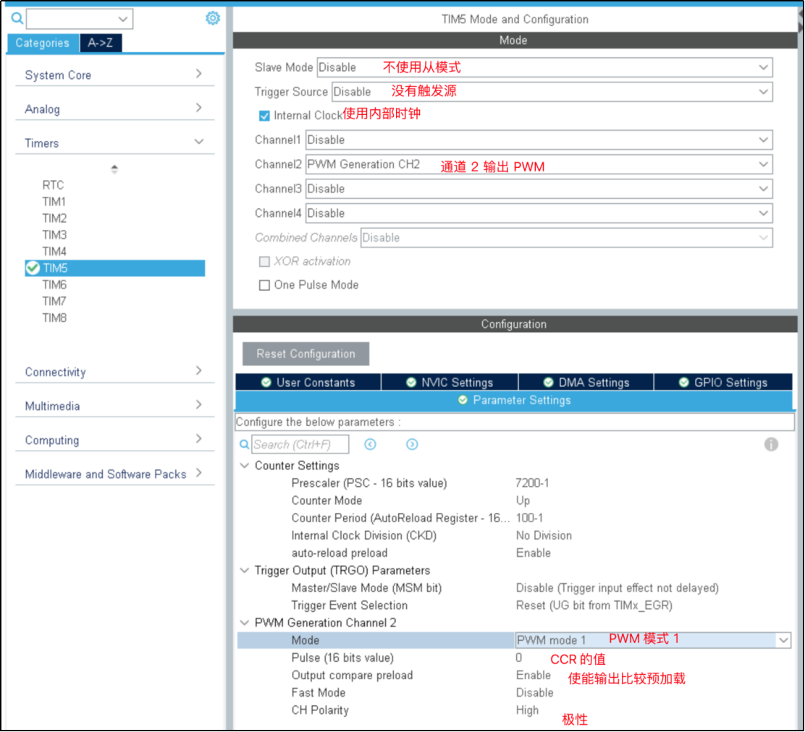
          <figcaption>图6-171　TIM5配置</figcaption>
        </figure>

      - **TIM4配置**

        <figure class="course-figure">
          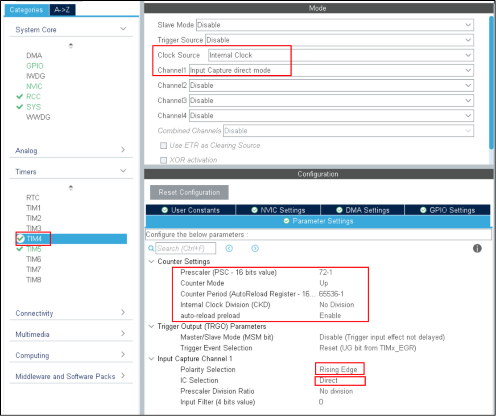
          <figcaption>图6-172　TIM4配置</figcaption>
        </figure>

        <figure class="course-figure">
          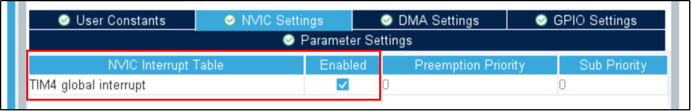
          <figcaption>图6-173　TIM4配置</figcaption>
        </figure>

        <figure class="course-figure">
          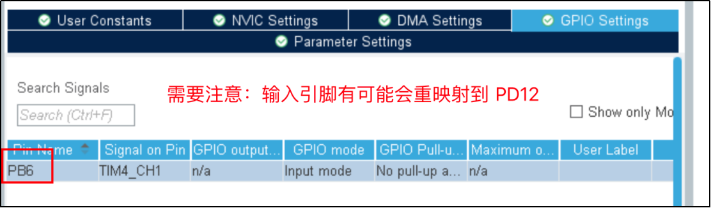
          <figcaption>图6-174　TIM4配置</figcaption>
        </figure>

      - **工程配置**

        <figure class="course-figure">
          
          <figcaption>图6-175　工程配置</figcaption>
        </figure>

        <figure class="course-figure">
          
          <figcaption>图6-176　工程配置</figcaption>
        </figure>

        <figure class="course-figure">
          
          <figcaption>图6-177　工程配置</figcaption>
        </figure>

      - **生成代码**

        <figure class="course-figure">
          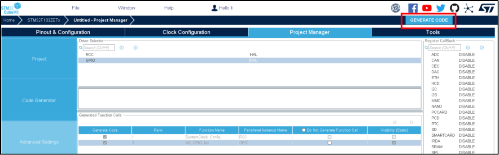
          <figcaption>图6-178　生成代码</figcaption>
        </figure>

        <figure class="course-figure">
          
          <figcaption>图6-179　生成代码</figcaption>
        </figure>

      - **生成的工程目录介绍**

        <figure class="course-figure">
          
          <figcaption>图6-180　生成的工程目录介绍</figcaption>
        </figure>

        - **main函数中已经替我们调用了HAL的初始化，时钟的初始化，GPIO的初始化，定时器初始化**

          ```c
          int main(void)
          {
              HAL_Init();
              SystemClock_Config();
              MX_GPIO_Init();
              while (1)
              {
              }
          }
          ```

  - **HAL库函数**

    - **输入捕获初始化函数**

      - **HAL_StatusTypeDef HAL_TIM_IC_Init(TIM_HandleTypeDef *htim);**

        ```c
        TIM_HandleTypeDef htim4;
      
        void TIM4_Init(void) {
            htim4.Instance = TIM4;
            htim4.Init.Prescaler = 71;  // 分频至1MHz（1μs分辨率）
            htim4.Init.CounterMode = TIM_COUNTERMODE_UP;
            htim4.Init.Period = 0xFFFF;  // ARR最大值（避免溢出）
            HAL_TIM_IC_Init(&htim4);
        }
        ```

    - **配置输入捕获通道的触发边沿、滤波器等参数**

      - **HAL_StatusTypeDef HAL_TIM_IC_ConfigChannel(TIM_HandleTypeDef *htim, TIM_IC_InitTypeDef *sConfig, uint32_t Channel);**

        ```c
        TIM_IC_InitTypeDef sConfigIC;
      
        void TIM4_Config_InputCapture(void) {
            sConfigIC.ICPolarity = TIM_ICPOLARITY_RISING;  // 上升沿触发
            sConfigIC.ICSelection = TIM_ICSELECTION_DIRECTTI;  // 直接映射到通道引脚
            sConfigIC.ICPrescaler = TIM_ICPSC_DIV1;  // 不分频
            sConfigIC.ICFilter = 0;  // 无滤波
            HAL_TIM_IC_ConfigChannel(&htim4, &sConfigIC, TIM_CHANNEL_1);
        }
        ```

    - **输入捕获启动/停止函数**

      - **HAL_StatusTypeDef HAL_TIM_IC_Start_IT(TIM_HandleTypeDef *htim, uint32_t Channel);**

        // 启动TIM4通道1输入捕获并开启中断

        HAL_TIM_IC_Start_IT(&htim4, TIM_CHANNEL_1);

      - **HAL_StatusTypeDef HAL_TIM_IC_Stop_IT(TIM_HandleTypeDef *htim, uint32_t Channel);**

      - **启动或停止输入捕获，并使用DMA传输捕获值（适合高频信号）**

        - **HAL_StatusTypeDef HAL_TIM_IC_Start_DMA(TIM_HandleTypeDef *htim, uint32_t Channel, uint32_t *pData, uint16_t Length);**

          ```c
          uint32_t capture_buffer[10];  // 存储捕获值的数组
          // 启动DMA传输，捕获10次后自动停止
          HAL_TIM_IC_Start_DMA(&htim4, TIM_CHANNEL_1, capture_buffer, 10);
          ```

        - **HAL_StatusTypeDef HAL_TIM_IC_Stop_DMA(TIM_HandleTypeDef *htim, uint32_t Channel);**

    - **输入捕获中断处理函数**

      - **void HAL_TIM_IRQHandler(TIM_HandleTypeDef *htim);**

        ```c
        // TIM4中断服务函数

        void TIM4_IRQHandler(void) {
            HAL_TIM_IRQHandler(&htim4);  // 处理所有定时器中断标志
        }
        ```

      - **__weak void HAL_TIM_IC_CaptureCallback(TIM_HandleTypeDef *htim);**

        ```c
        volatile uint32_t rise_time = 0, fall_time = 0, pulse_width = 0;
      
        void HAL_TIM_IC_CaptureCallback(TIM_HandleTypeDef *htim) {
            if (htim->Instance == TIM4) {
                // 获取捕获值（单位：μs）
                uint32_t current_capture = HAL_TIM_ReadCapturedValue(htim, TIM_CHANNEL_1);
                // 计算占空比（假设交替捕获上升沿和下降沿）
                if (htim->Channel == HAL_TIM_ACTIVE_CHANNEL_1) {
                    if (sConfigIC.ICPolarity == TIM_ICPOLARITY_RISING) {
                        rise_time = current_capture;
                        // 切换为下降沿捕获
                        sConfigIC.ICPolarity = TIM_ICPOLARITY_FALLING;
                    } else {
                        fall_time = current_capture;
                        // 切换为上升沿捕获
                        sConfigIC.ICPolarity = TIM_ICPOLARITY_RISING;
                        pulse_width = fall_time - rise_time;  // 高电平时间
                    }
                    HAL_TIM_IC_ConfigChannel(htim, &sConfigIC, TIM_CHANNEL_1);
                }
            }
        }
        ```

    - **辅助函数**

      - **读取输入捕获通道的当前值**

        - **uint32_t HAL_TIM_ReadCapturedValue(TIM_HandleTypeDef *htim, uint32_t Channel);**

          ```c
          uint32_t capture_value = HAL_TIM_ReadCapturedValue(&htim4, TIM_CHANNEL_1);
          ```

      - **宏定义，动态设置捕获极性（上升沿/下降沿）**

        - **__HAL_TIM_SET_CAPTUREPOLARITY()**

          // 设置TIM4通道1为下降沿触发

          __HAL_TIM_SET_CAPTUREPOLARITY(&htim4, TIM_CHANNEL_1, TIM_ICPOLARITY_FALLING);

  - **实现**

    - **在tim.c添加代码，实现回调函数**

      ```c
      /* USER CODE BEGIN 1 */
      /* 记录上升沿的个数 */
      uint8_t raiseEdgeCount = 0;
      /* 存储信号的周期 */
      uint16_t t = 0;

      void HAL_TIM_IC_CaptureCallback(TIM_HandleTypeDef *htim)
      {
          if (htim->Instance == TIM4)
          {
              if (htim->Channel == HAL_TIM_ACTIVE_CHANNEL_1)
              {
                  /* 上升沿个数 */
                  raiseEdgeCount++;
                  /* 如果是第1个上升沿,则清零计数器,让计数器从0开始计数 */
                  if (raiseEdgeCount == 1)
                  {
                      //TIM4->CNT = 0; /* 计数器清零 */
                      __HAL_TIM_SetCounter(htim, 0);
                  }
                  else if (raiseEdgeCount == 2)
                  {
                      /* 读取捕获寄存器的值,就是周期 单位是us */
                      //t = TIM4->CCR1;
                      t = __HAL_TIM_GetCompare(htim, TIM_CHANNEL_1);
                      /* 上升沿的计数从0重新计数 */
                      raiseEdgeCount = 0;
                  }
              }
          }
      }
      /* 返回PWM的周期 ms */

      double TIM4_GetPWMCycle(void)
      {
          return t / 1000.0;
      }
      /* 返回PWM的频率 */

      double TIM4_GetPWMFreq(void)
      {
          return 1000000 / t;
      }
      /* USER CODE END 1 */
      ```

    - **main.c代码**

      ```c
      int main(void)
      {
          HAL_Init();
          SystemClock_Config();
          MX_GPIO_Init();
          MX_TIM4_Init();
          MX_TIM5_Init();
          MX_USART1_UART_Init();
          HAL_TIM_PWM_Start(&htim5, TIM_CHANNEL_2);  // 让tim5产生pwm
          HAL_TIM_IC_Start_IT(&htim4, TIM_CHANNEL_1);;
          double t, f;
          while (1)
          {
              t = TIM4_GetPWMCycle();
              f = TIM4_GetPWMFreq();
              printf("t=%.4fms, f=%.4fHz\r\n", t, f);
              HAL_Delay(1000);
          }
      }
      ```

  - **如何实现同时测量PWM的频率/周期和占空比**

    ```c
    volatile uint32_t period = 0, high_time = 0, duty = 0;
    uint32_t rise1 = 0, fall = 0, rise2 = 0;
    
    void HAL_TIM_IC_CaptureCallback(TIM_HandleTypeDef *htim) {
        if (htim->Instance == TIM4) {
            uint32_t capture = HAL_TIM_ReadCapturedValue(htim, TIM_CHANNEL_1);
            if (sConfigIC.ICPolarity == TIM_ICPOLARITY_RISING) {
                // 上升沿捕获
                if (rise1 == 0) {
                    rise1 = capture;
                } else {
                    rise2 = capture;
                    period = rise2 - rise1;  // 周期（μs）
                    duty = (high_time * 100) / period;  // 占空比
                    rise1 = rise2;  // 重置
                }
                // 切换为下降沿捕获
                sConfigIC.ICPolarity = TIM_ICPOLARITY_FALLING;
            } else {
                // 下降沿捕获
                fall = capture;
                high_time = fall - rise1;  // 高电平时间（μs）
                // 切换回上升沿捕获
                sConfigIC.ICPolarity = TIM_ICPOLARITY_RISING;
            }
            // 重新配置通道极性
            HAL_TIM_IC_ConfigChannel(htim, &sConfigIC, TIM_CHANNEL_1);
        }
    }
    ```

### 3.5 PWM输入模式：同时测量周期与占空比

**讲解路径：** 一个输入映射到两个通道 → `CCR1`保存周期 → `CCR2`保存高电平时间 → 从模式自动复位计数器。

- **PWM输入模式**

  - **该模式是输入捕获模式的一个特例，操作与输入捕获模式相同。**

  - **原理（通道1输入）**

    - **经过输入滤波器和边沿检测器得到2路信号：TI1FP1和TI1FP2**

      <figure class="course-figure">
        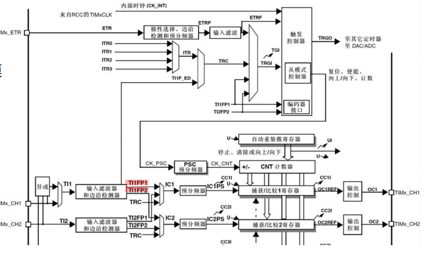
        <figcaption>图6-181　经过输入滤波器和边沿检测器得到2路信号：TI1FP1和TI1FP2</figcaption>
      </figure>

    - **TI1FP1得到IC1信号，在通道1，用来测量周期**

    - **TI1FP2得到IC2信号，在通道2，用来测量高电平时间**

    - **TI1FP1得作为触发输入信号，开启从模式中的复位模式**

      <figure class="course-figure">
        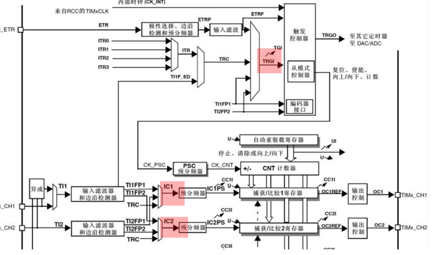
        <figcaption>图6-182　TI1FP1得作为触发输入信号，开启从模式中的复位模式</figcaption>
      </figure>

  - **时序图**

    <figure class="course-figure">
      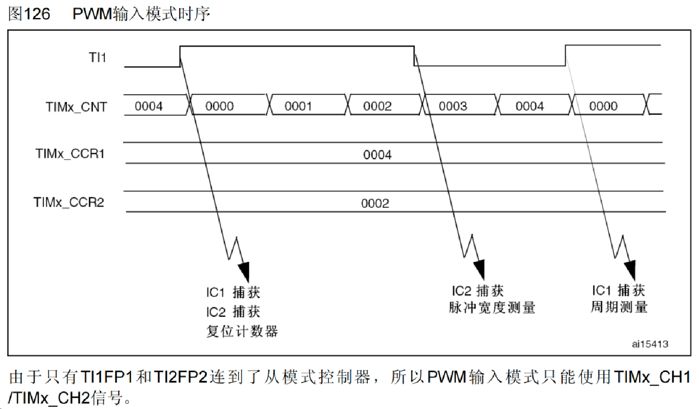
      <figcaption>图6-183　时序图</figcaption>
    </figure>

    - **当上升沿到**

      - **通道1捕获**

      - **通道2捕获**

      - **从模式复位计数器**

    - **当下降沿到**

      - **通道2捕获，CCR2存储的就是高电平宽度**

    - **当上升沿到**

      - **通道1捕获   CCR1存储的就是周期从模式会复位计数器**

- **寄存器实现**

  - **相关寄存器**

    - **控制寄存器1（TIMx_CR1）**

      - **控制计数器模式、方向、对齐方式及预装载机制**

        <figure class="course-figure">
          
          <figcaption>图6-184　控制计数器模式、方向、对齐方式及预装载机制</figcaption>
        </figure>

    - **控制寄存器2（TIMx_CR2）**

      - **配置触发输出（TRGO）、主从模式及编码器接口**

        <figure class="course-figure">
          
          <figcaption>图6-185　配置触发输出（TRGO）、主从模式及编码器接口</figcaption>
        </figure>

    - **预分频器寄存器（TIMx_PSC）**

    - **自动重载寄存器（TIMx_ARR）**

    - **捕获/比较模式寄存器（TIMx_CCMR1/CCMR2）**

      <figure class="course-figure">
        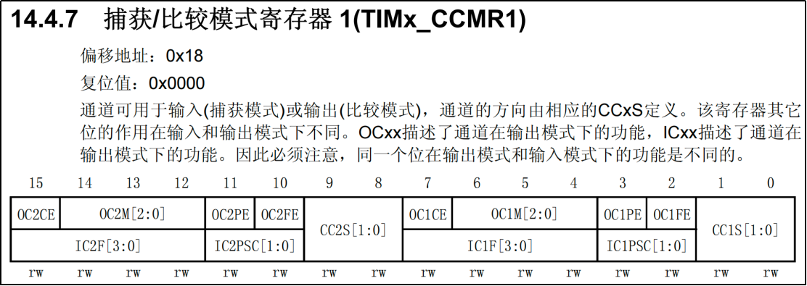
        <figcaption>图6-186　捕获/比较模式寄存器（TIMx_CCMR1/CCMR2）</figcaption>
      </figure>

      - **配置通道的输入捕获（Input Capture）或输出比较（Output Compare）模式**

        - **TIMx_CCMR1（CH1/CH2）**

        - **TIMx_CCMR2（CH3/CH4）**

      - **重点位段**

        - **CCxS[1:0]**

          - **通道方向（输入/输出）**

            <figure class="course-figure">
              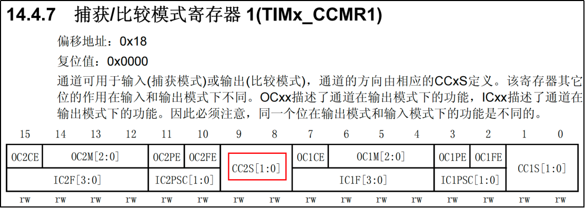
              <figcaption>图6-187　通道方向（输入/输出）</figcaption>
            </figure>

            <figure class="course-figure">
              
              <figcaption>图6-188　通道方向（输入/输出）</figcaption>
            </figure>

        - **IC1F[3:0]**

          - **输入滤波器配置**

            <figure class="course-figure">
              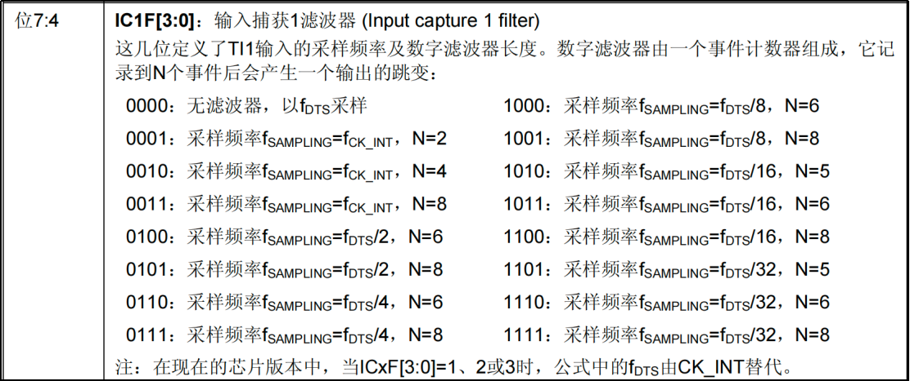
              <figcaption>图6-189　输入滤波器配置</figcaption>
            </figure>

        - **IC1PSC[1:0]**

          - **输入预分频器**

            输入预分频器：

            00 = 每1个边沿触发一次捕获

            01 = 每2个边沿触发一次捕获

            10 = 每4个边沿触发一次捕获

            11 = 每8个边沿触发一次捕获

    - **捕获/比较使能寄存器（TIMx_CCER）**

      <figure class="course-figure">
        
        <figcaption>图6-190　捕获/比较使能寄存器（TIMx_CCER）</figcaption>
      </figure>

      - **使能通道输出/输入，配置捕获极性**

        <figure class="course-figure">
          
          <figcaption>图6-191　使能通道输出/输入，配置捕获极性</figcaption>
        </figure>

    - **捕获/比较寄存器（TIMx_CCR1-CCR4）**

      - **输出比较 ：设置比较值，控制PWM占空比或输出时序**

      - **输入捕获 ：存储捕获事件时的计数器值**

    - **状态寄存器（TIMx_SR）**

      - **标志位管理，用于中断请求和状态查询**

      - **UIF**

        - **更新中断标志**

      - **CCXIF**

        - **通道X捕获/比较中断标志**

      - **TIF**

        - **触发中断标志（高级定时器专用）**

    - **中断使能寄存器（TIMx_DIER）**

      - **使能中断和DMA请求**

      - **UIE**

        - **更新中断使能**

      - **CCXIE**

        - **通道X捕获/比较中断使能**

      - **UDE**

        - **更新DMA请求使能**

    - **从模式寄存器（TIMx_SMCR）**

      - **主/从模式**

        <figure class="course-figure">
          
          <figcaption>图6-192　主/从模式</figcaption>
        </figure>

      - **触发源选择**

        <figure class="course-figure">
          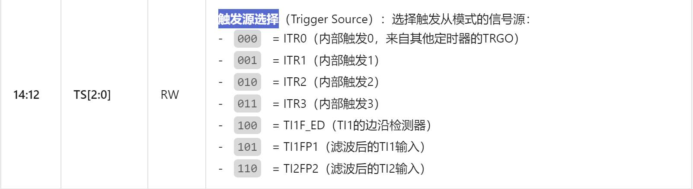
          <figcaption>图6-193　触发源选择</figcaption>
        </figure>

      - **从模式选择**

        <figure class="course-figure">
          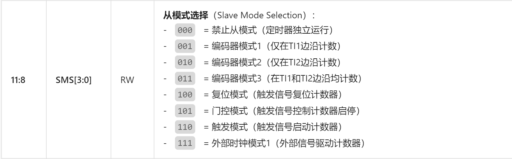
          <figcaption>图6-194　从模式选择</figcaption>
        </figure>

      - **外部触发滤波器**

        <figure class="course-figure">
          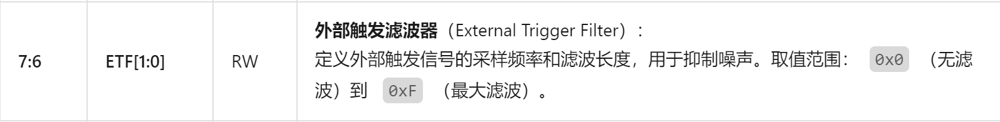
          <figcaption>图6-195　外部触发滤波器</figcaption>
        </figure>

      - **外部触发预分频器**

        <figure class="course-figure">
          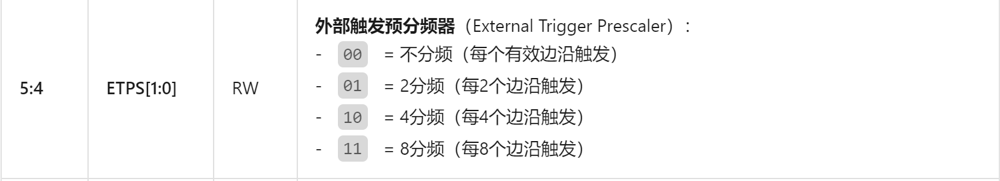
          <figcaption>图6-196　外部触发预分频器</figcaption>
        </figure>

      - **外部时钟使能**

        <figure class="course-figure">
          
          <figcaption>图6-197　外部时钟使能</figcaption>
        </figure>

  - **实现思路**

    - **开启时钟**

      - **定时器的时钟**

      - **GPIO的时钟**

    - **设置GPIO的浮空输入**

    - **定时器配置**

      - **预分频器的配置**

      - **自动重装载寄存器的配置：设置最大,尽量避免溢出65535**

      - **计数器的计数方向 0=向上 1=向下**

      - **输入捕获**

        - **捕获/比较模式寄存器（TIMx_CCMR1/CCMR2）**

          - **信号的输入滤波器: 不滤波**

          - **把IC1映射到TI1 CCMR1_CC1S=01 上升沿**

          - **把IC2映射到TI1 CCMR1_CC2S=10 下降沿**

          - **对信号做分频(信号频率比较高的时候)**

        - **捕获/比较使能寄存器（TIMx_CCER）**

          - **配置边缘检测: 去IC1上升沿 去IC2的下降沿**

          - **使能通道1捕获和通道2捕获**

        - **从模式寄存器（TIMx_SMCR）**

          - **配置TRGI信号:  TI1FP1   SMCR_TS=101**

          - **配置从模式: 为复位模式 SMCR_SMS=100**

    - **使能/关闭计数器**

    - **思考：为什么不用中断？**

  - **代码实现**

    - **功能函数**

      - **初始化：TIM4_Init**

        ```c
        void TIM4_Init(void)
        {
            /* 1. 开启时钟 */
            /* 1.1 TIM4的时钟 */
            RCC->APB1ENR |= RCC_APB1ENR_TIM4EN;
            /* 1.2 把引脚(PB6) 对应的端口开启时钟 */
            RCC->APB2ENR |= RCC_APB2ENR_IOPBEN;
            /* 2. PB6设置为输入: 浮空输入 CNF=01 MODE=00 */
            GPIOB->CRL &= ~(GPIO_CRL_CNF6_1 | GPIO_CRL_MODE6);
            GPIOB->CRL |= GPIO_CRL_CNF6_0;
            /* 3. 配置定时器的时基部分 */
            /* 3.1 预分频系数配置 分频后计数器的时钟时1MHz 周期:1us */
            TIM4->PSC = 72 - 1;
            /* 3.2 自动重装载寄存器的值: 设置最大,尽量避免溢出 */
            TIM4->ARR = 65535;
            /* 3.3 计数方向: 向上计数 */
            TIM4->CR1 &= ~TIM_CR1_DIR;
            /* 4. 输入捕获部分 */
            /* 4.1 输入信号不滤波 */
            TIM4->CCMR1 &= ~TIM_CCMR1_IC1F;
            /* 4.2 配置边缘检测: 去IC1上升沿 去IC2的下降沿 */
            TIM4->CCER &= ~TIM_CCER_CC1P;
            TIM4->CCER |= TIM_CCER_CC2P;
            /* 4.3 把 IC1映射到TI1 CCMR1_CC1S=01 上升沿 */
            TIM4->CCMR1 &= ~TIM_CCMR1_CC1S_1;
            TIM4->CCMR1 |= TIM_CCMR1_CC1S_0;
            /* 4.4 把 IC2映射到TI1 CCMR1_CC2S=10 下降沿 */
            TIM4->CCMR1 |= TIM_CCMR1_CC2S_1;
            TIM4->CCMR1 &= ~TIM_CCMR1_CC2S_0;
            /* 4.5 IC1和IC2的预分频 都不分频 */
            TIM4->CCMR1 &= ~TIM_CCMR1_IC1PSC;
            TIM4->CCMR1 &= ~TIM_CCMR1_IC2PSC;
            /* 4.6 配置TRGI信号:  TI1FP1   SMCR_TS=101 */
            TIM4->SMCR |= (TIM_SMCR_TS_2 | TIM_SMCR_TS_0);
            TIM4->SMCR &= ~TIM_SMCR_TS_1;
            /* 4.7 配置从模式: 为复位模式 SMCR_SMS=100 */
            TIM4->SMCR |= TIM_SMCR_SMS_2;
            TIM4->SMCR &= ~(TIM_SMCR_SMS_1 | TIM_SMCR_SMS_0);
            /* 4.8 使能通道1捕获和通道2捕获 */
            TIM4->CCER |= TIM_CCER_CC1E;
            TIM4->CCER |= TIM_CCER_CC2E;
        }
        ```

      - **启动定时器：TIM4_Start**

        ```c
        void TIM4_Start(void)
        {
            TIM4->CR1 |= TIM_CR1_CEN; /* 计数器使能 */
        }
        ```

      - **关闭定时器：TIM4_Stop**

        ```c
        void TIM4_Stop(void)
        {
            TIM4->CR1 &= ~TIM_CR1_CEN; /* 计数器失能 */
        }
        ```

      - **PWM的周期：TIM4_GetPWMCycle**

        /* 返回PWM的周期 ms*/

        double TIM4_GetPWMCycle(void)

        {

        return TIM4->CCR1 / 1000.0;

        }

      - **PWM的频率：TIM4_GetPWMFreq**

        /* 返回PWM的频率 */

        double TIM4_GetPWMFreq(void)

        {

        return 1000000.0 / TIM4->CCR1;

        }

      - **PWM占空比：TIM4_GetDutyCycle**

        double TIM4_GetDutyCycle(void)

        {

        return TIM4->CCR2 * 1.0 / TIM4->CCR1;

        }

    - **主函数**

      ```c
      #include "USART.h"
      #include "Delay.h"
      #include "SysTick.h"
      #include "TIM5.h"
      #include "TIM4.h"
      
      int main()
      {
          USART1_Init();
          printf("系统定时器实验开始...\r\n");
          TIM5_Init();
          TIM5_Start();
          TIM4_Init();
          TIM4_Start();
          double t, f, dutyCycle;
          while (1)
          {
              t = TIM4_GetPWMCycle();
              f = TIM4_GetPWMFreq();
              dutyCycle = TIM4_GetDutyCycle();
              printf("t=%.4fms, f=%.4fHz, dutyCycle=%.2f%%\r\n", t, f, dutyCycle * 100);  // 40%
              Delay_ms(1000);
          }
      }
      ```

- **HAL库实现**

  - **HAL库工程创建**

    - **根据MCU型号创建工程**

      <figure class="course-figure">
        
        <figcaption>图6-198　根据MCU型号创建工程</figcaption>
      </figure>

      - **选择MCU型号**

        <figure class="course-figure">
          
          <figcaption>图6-199　选择MCU型号</figcaption>
        </figure>

    - **参数配置界面**

      <figure class="course-figure">
        
        <figcaption>图6-200　参数配置界面</figcaption>
      </figure>

      <figure class="course-figure">
        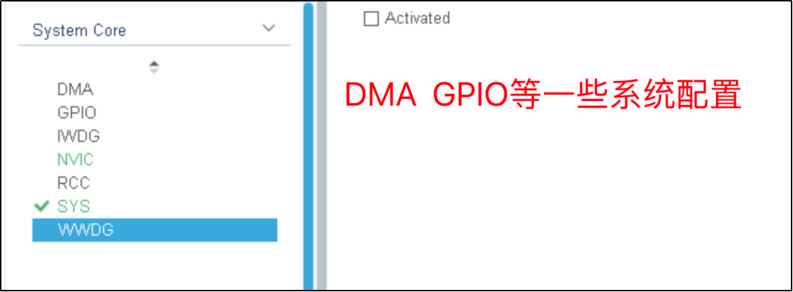
        <figcaption>图6-201　参数配置界面</figcaption>
      </figure>

      <figure class="course-figure">
        
        <figcaption>图6-202　参数配置界面</figcaption>
      </figure>

      <figure class="course-figure">
        
        <figcaption>图6-203　参数配置界面</figcaption>
      </figure>

      <figure class="course-figure">
        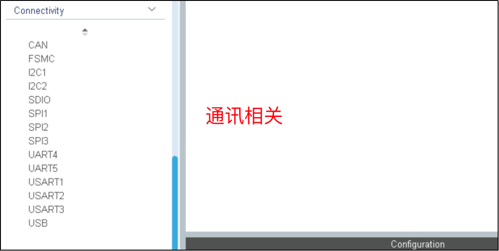
        <figcaption>图6-204　参数配置界面</figcaption>
      </figure>

      - **Debug参数选择**

        <figure class="course-figure">
          
          <figcaption>图6-205　Debug参数选择</figcaption>
        </figure>

        - **选择串口即可。这个地方务必设置好，否则只能下载一次程序到MCU，以后就无法下载了。**

      - **RCC时钟选择**

        <figure class="course-figure">
          
          <figcaption>图6-206　RCC时钟选择</figcaption>
        </figure>

        <figure class="course-figure">
          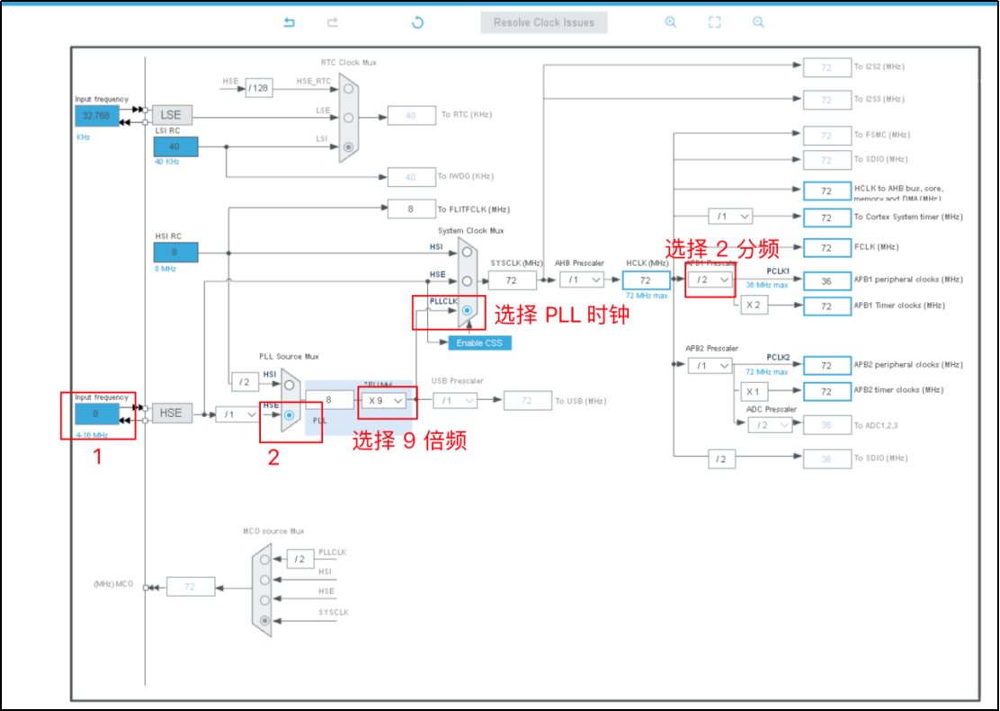
          <figcaption>图6-207　RCC时钟选择</figcaption>
        </figure>

      - **串口配置**

        <figure class="course-figure">
          
          <figcaption>图6-208　串口配置</figcaption>
        </figure>

        <figure class="course-figure">
          
          <figcaption>图6-209　串口配置</figcaption>
        </figure>

        <figure class="course-figure">
          
          <figcaption>图6-210　串口配置</figcaption>
        </figure>

        - **选择串口**

          <figure class="course-figure">
            
            <figcaption>图6-211　选择串口</figcaption>
          </figure>

        - **配置串口**

          <figure class="course-figure">
            
            <figcaption>图6-212　配置串口</figcaption>
          </figure>

        - **开启串口中断**

          <figure class="course-figure">
            
            <figcaption>图6-213　开启串口中断</figcaption>
          </figure>

        - **IO口自动设置**

          <figure class="course-figure">
            
            <figcaption>图6-214　IO口自动设置</figcaption>
          </figure>

      - **GPIO配置**

        <figure class="course-figure">
          
          <figcaption>图6-215　GPIO配置</figcaption>
        </figure>

      - **TIM5配置**

        <figure class="course-figure">
          
          <figcaption>图6-216　TIM5配置</figcaption>
        </figure>

      - **TIM4配置**

        <figure class="course-figure">
          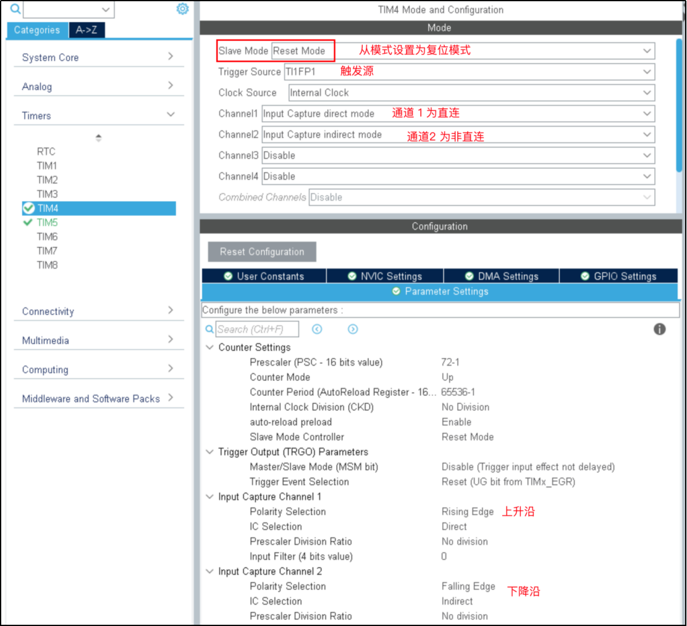
          <figcaption>图6-217　TIM4配置</figcaption>
        </figure>

        <figure class="course-figure">
          
          <figcaption>图6-218　TIM4配置</figcaption>
        </figure>

      - **工程配置**

        <figure class="course-figure">
          
          <figcaption>图6-219　工程配置</figcaption>
        </figure>

        <figure class="course-figure">
          
          <figcaption>图6-220　工程配置</figcaption>
        </figure>

        <figure class="course-figure">
          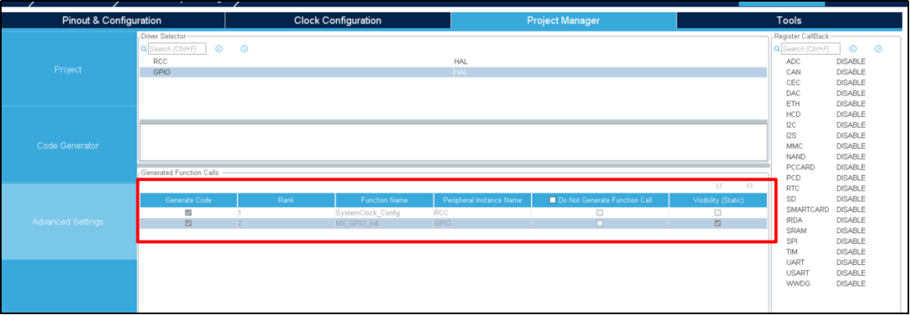
          <figcaption>图6-221　工程配置</figcaption>
        </figure>

      - **生成代码**

        <figure class="course-figure">
          
          <figcaption>图6-222　生成代码</figcaption>
        </figure>

        <figure class="course-figure">
          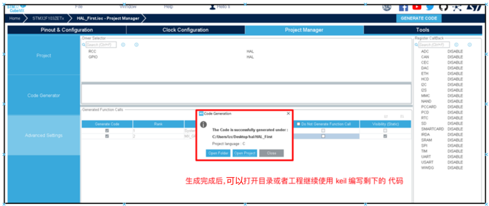
          <figcaption>图6-223　生成代码</figcaption>
        </figure>

      - **生成的工程目录介绍**

        <figure class="course-figure">
          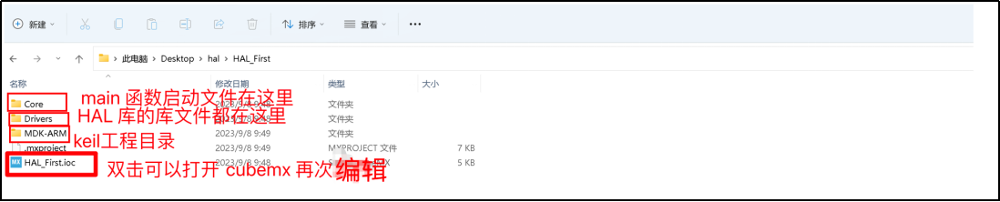
          <figcaption>图6-224　生成的工程目录介绍</figcaption>
        </figure>

        - **main函数中已经替我们调用了HAL的初始化，时钟的初始化，GPIO的初始化，定时器初始化**

          ```c
          int main(void)
          {
              HAL_Init();
              SystemClock_Config();
              MX_GPIO_Init();
              while (1)
              {
              }
          }
          ```

  - **代码实现**

    - **tim.c 添加代码**

      ```c
      /* USER CODE BEGIN 1 */
      /* 返回PWM的周期 ms */

      double TIM4_GetPWMCycle(void)
      {
          // return TIM4->CCR1 / 1000.0;;
          return (__HAL_TIM_GetCompare(&htim4, TIM_CHANNEL_1) + 1) / 1000.0;
      }
      /* 返回PWM的频率 */

      double TIM4_GetPWMFreq(void)
      {
          // return 1000000.0 / TIM4->CCR1;
          return 1000000.0 / (__HAL_TIM_GetCompare(&htim4, TIM_CHANNEL_1) + 1);
      }
      // 返回占空比

      double TIM4_GetDutyCycle(void)
      {
          // return TIM4->CCR2 * 1.0 / TIM4->CCR1;
          return (1 + __HAL_TIM_GetCompare(&htim4, TIM_CHANNEL_2)) * 1.0 / (1 + __HAL_TIM_GetCompare(&htim4, TIM_CHANNEL_1));
      }
      ```

    - **main.c添加代码**

      ```c
      int main(void)
      {
          HAL_Init();
          SystemClock_Config();
          MX_GPIO_Init();
          MX_TIM4_Init();
          MX_TIM5_Init();
          MX_USART1_UART_Init();
          HAL_TIM_PWM_Start(&htim5, TIM_CHANNEL_2);
          HAL_TIM_IC_Start(&htim4, TIM_CHANNEL_1);
          HAL_TIM_IC_Start(&htim4, TIM_CHANNEL_2);
          double t, f, dutyCycle;
          while (1)
          {
              t = TIM4_GetPWMCycle();
              f = TIM4_GetPWMFreq();
              dutyCycle = TIM4_GetDutyCycle();
              printf("t=%.4fms, f=%.4fHz, dutyCycle=%.2f%%\r\n", t, f, dutyCycle * 100);  // 40%
              HAL_Delay(1000);
          }
      }
      ```

---

> **上一节得到的结论**：通用定时器解决了波形的产生与测量。下面继续考虑功率器件的互锁保护和有限次数输出。

---

## 4 高级定时器：面向功率驱动与复杂控制

> **内容衔接**：通用定时器已经能产生和测量PWM，但直接驱动电机或功率电路还需要互补输出、死区、刹车与重复计数。高级定时器正是在通用定时器基础上的安全增强。

### 4.1 高级定时器为何面向电机控制

- **高级定时器（如TIM1、TIM8）专为复杂应用设计，支持电机控制、电源转换等场景**

- **核心功能详解**

  - **拥有通用定时器所有功能**

  - **互补输出与死区时间**

    <figure class="course-figure">
      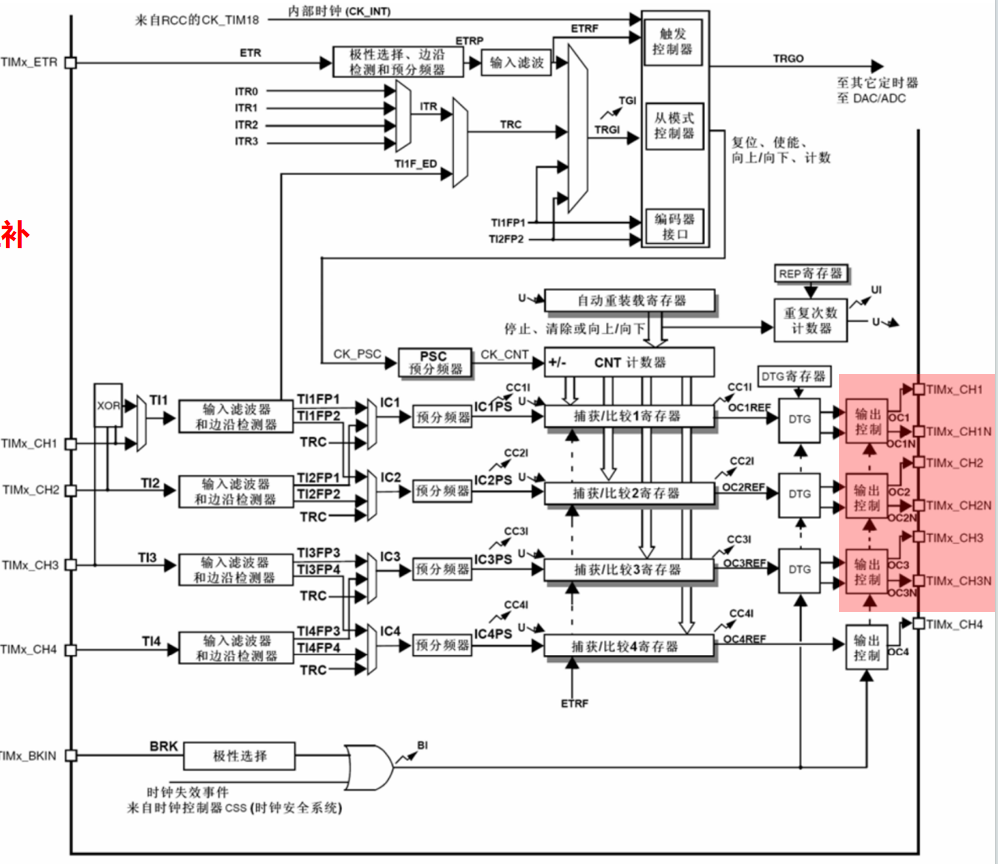
      <figcaption>图6-225　互补输出与死区时间</figcaption>
    </figure>

    - **高级定时器的通道1/2/3可以分别输出2路互补信号：CH1和CH1N（注意通道4没有）**

    - **互补信号：频率周期相等，相位相差180°**

    - **互补输出一般用于驱动H桥电路，H桥通常用于驱动电流较大的负载，比如电机。**

      <figure class="course-figure">
        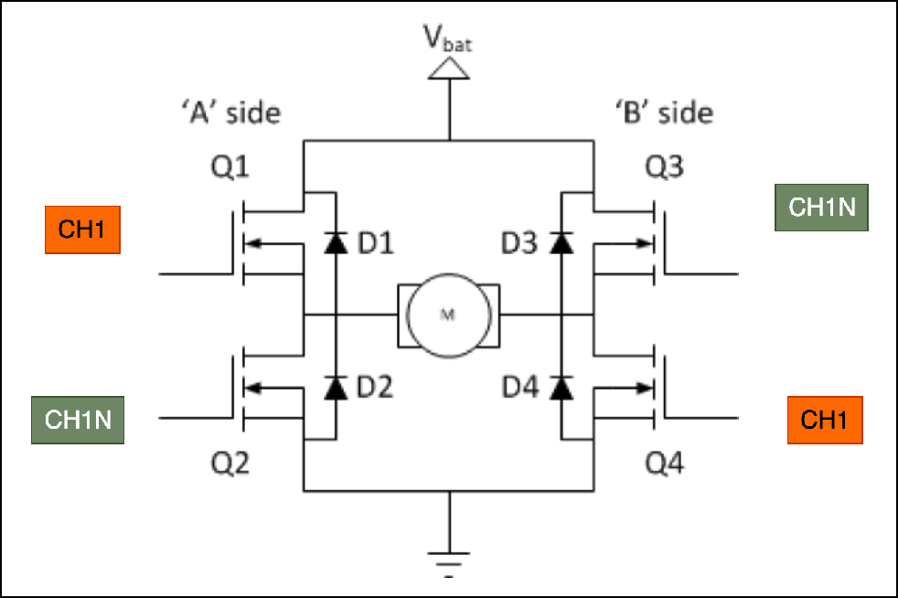
        <figcaption>图6-226　互补输出一般用于驱动H桥电路，H桥通常用于驱动电流较大的负载，比如电机。</figcaption>
      </figure>

      CH1高电平，  Q1和Q4导通，电机正转

      CH1N高电平，Q3和Q2导通，电机反转

    - **死区时间**

      - **理论上CH1和CH1N永远反相，所以可以非常方便的控制电机的转动**

      - **实际情况下由于MOS管器件关断慢，开通快，如果Q1和Q4还没有完全关断，Q2和Q3导通，就会造成短路，导致器件烧毁，所以这种情况是严格禁止的。**

      - **解决方法：延时一段时间再开通**

        <figure class="course-figure">
          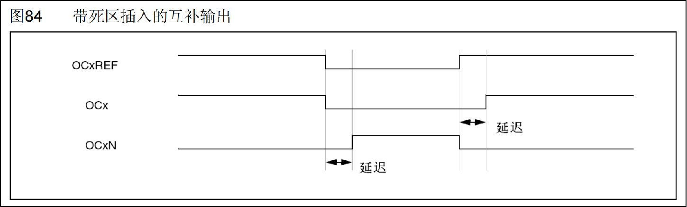
          <figcaption>图6-227　解决方法：延时一段时间再开通</figcaption>
        </figure>

        - **OCxREF可以认为是标准信号**

        - **OCx和OCxN 的低电平立即变化**

        - **OCx和OCxN 的高电平延迟变化**

  - **刹车功能 ，硬件刹车输入，紧急关闭输出**

    - **触发源 ：外部引脚（BKIN）或内部时钟失效事件。**

  - **重复计数器  支持重复计数（RCR），用于控制更新事件频率**

    <figure class="course-figure">
      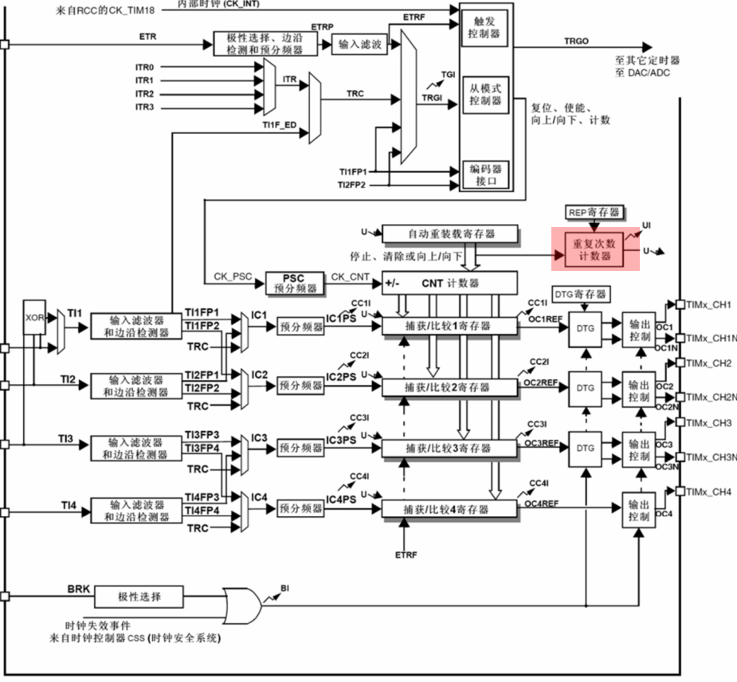
      <figcaption>图6-228　重复计数器  支持重复计数（RCR），用于控制更新事件频率</figcaption>
    </figure>

    - **在基本定时器和通用定时器中，计数器每溢出1次，就产生1次更新事件**

    - **在高级定时器中，计数器每溢出1次，会产生和一个信号，让重复计数器的值 - 1**

    - **当重复计数器的值减到0，如果计数器再溢出1次，则会产生更新事件。**

### 4.2 在通用定时器上增加了什么

<figure class="course-figure">
  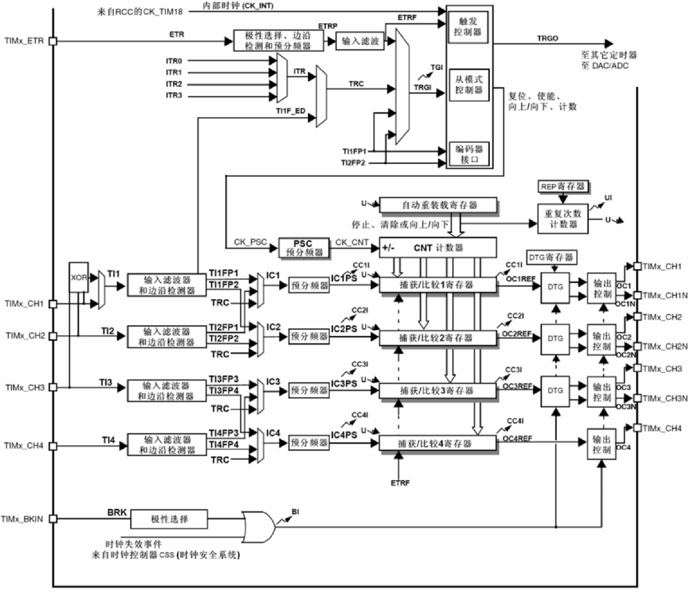
  <figcaption>图6-229　高级定时器功能框图</figcaption>
</figure>

### 4.3 高级功能对应的关键寄存器

- **刹车和死区时间寄存器（TIMx_BDTR）**

  - **配置死区时间、刹车功能、输出状态**

    <figure class="course-figure">
      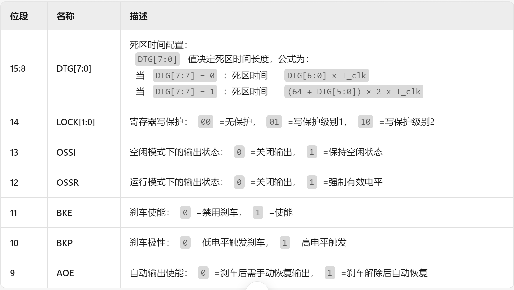
      <figcaption>图6-230　配置死区时间、刹车功能、输出状态</figcaption>
    </figure>

- **重复计数器寄存器（TIMx_RCR）**

  - **REP[7:0]  ：重复计数值（0~255），每计数到该值产生一次更新事件**

  - **应用场景 ：减少中断频率，适用于步进电机控制或低频触发**

### 4.4 利用重复计数器输出有限周期PWM

**讲解路径：** 先确定PWM频率 → 设置重复次数 → 使能高级定时器主输出 → 更新中断中停止输出。

- **需求**

  - **输出5个周期的PWM波，频率2Hz，观察发光二极管闪烁5次，或者用示波器观察波形。**

- **实现思路**

  - **使用高级定时器的重复计数器，当计数器溢出时，在溢出中断中停止定时器工作。重复计数器寄存器的值设置为4，即可输出5个周期的PWM波，发光二极管会闪烁5次。**

  - **2Hz的周期是500ms，需要将72MHz的时钟预分配7200，得到10KHz, 每计数一次需要0.1ms，那么自动预装载器的值就是5000-1才能得到2Hz的pwm脉冲**

    <figure class="course-figure">
      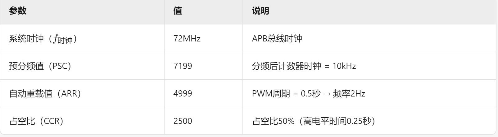
      <figcaption>图6-231　2Hz的周期是500ms，需要将72MHz的时钟预分配7200，得到10KHz, 每计数一次需要0.1ms，那么自动预装载器的值就是5000-1才能得到2Hz的pwm脉冲</figcaption>
    </figure>

- **寄存器实现**

  - **实现思路**

    - **开启时钟**

      - **定时器的时钟**

      - **GPIO的时钟**

    - **设置GPIO的复用推挽输出**

    - **定时器配置**

      - **预分频器的配置**

      - **自动重装载寄存器的配置**

      - **计数器的计数方向 0=向上 1=向下**

      - **配置通道X的捕获比较寄存器**

        - **把通道X配置为输出**

        - **配置通道的输出比较模式**

      - **重复寄存器 RCR=4 表示CNT计数器溢出5次,才会产生更新时间**

      - **捕获/比较使能寄存器**

        - **使能通道X**

        - **设置通道的极性 0=高电平有效  1=低电平有效**

      - **刹车和死区时间寄存器（TIMx_BDTR）**

        - **主输出使能(只有高级定时器需要配置)**

      - **中断使能寄存器（TIMx_DIER）**

        - **定时器更新中断使能**

      - **防止一启动就进入更新中断**

        - **使用UG位产生一个更新事件，然后预分频和重复计数器的值更新到影子寄存器**

        - **清除中断标志位UIF**

      - **NVIC的配置**

    - **使能/关闭计数器**

  - **代码实现**

    - **初始化定时器：TIM1_Init**

      ```c
      void TIM1_Init(void)
      {
          /* 1. 开启时钟 */
          /* 1.1 TIM1的时钟 */
          RCC->APB2ENR |= RCC_APB2ENR_TIM1EN;
          /* 1.2 GPIO的时钟 */
          RCC->APB2ENR |= RCC_APB2ENR_IOPAEN;
          /* 2. 给PA8配置复用推挽输出 CNF=10  MODE=11 */
          GPIOA->CRH |= (GPIO_CRH_CNF8_1 | GPIO_CRH_MODE8);
          GPIOA->CRH &= ~GPIO_CRH_CNF8_0;
          /* 3. 时基单元的配置  频率是2Hz的PWM */
          /* 3.1 预分频 */
          TIM1->PSC = 7200 - 1;
          /* 3.2 自动重装载寄存器的值 */
          TIM1->ARR = 5000 - 1;
          /* 3.3 计数方向 0=向上计数 1=向下计数 */
          TIM1->CR1 &= ~TIM_CR1_DIR;
          /* 3.4 重复寄存器 RCR=4 表示CNT计数器溢出5次,才会产生更新时间(中断) */
          TIM1->RCR = 4;
          /* 4. 输出部分配置 */
          /* 4.1 把通道1配置为输出 */
          TIM1->CCMR1 &= ~TIM_CCMR1_CC1S;
          /* 4.2 配置捕获比较寄存器的值 */;
          TIM1->CCR1 = 2500; /* 占空比 50% */
          /* 4.3 输出的极性 0=高电平有效 1=低电平有效 */;
          TIM1->CCER &= TIM_CCER_CC1P;
          /* 4.4 使能通道1 */;
          TIM1->CCER |= TIM_CCER_CC1E;
          /* 4.5 配置通道1输出模式: PWM1=110 */
          TIM1->CCMR1 |= (TIM_CCMR1_OC1M_2 | TIM_CCMR1_OC1M_1);
          TIM1->CCMR1 &= ~TIM_CCMR1_OC1M_0;
          /* 4.6 主输出使能(只有高级定时器需要配置) */
          TIM1->BDTR |= TIM_BDTR_MOE;
          /* 4.7 防止一启动就进入更新中断: 1. 使用UG位产生一个更新事件 2.然后预分频和重复计数器的值更新到影子寄存器 */;
          TIM1->EGR |= TIM_EGR_UG;
          TIM1->SR &= ~TIM_SR_UIF;
          /* 5. 配置中断 */
          /* 5.1 定时器更新中断使能 */
          TIM1->DIER |= TIM_DIER_UIE;
          /* 5.2 NVIC的配置 */
          NVIC_SetPriorityGrouping(3);
          NVIC_SetPriority(TIM1_UP_IRQn, 3);
          NVIC_EnableIRQ(TIM1_UP_IRQn);
      }

      void Driver_TIM1_Start(void)
      {
          TIM1->CR1 |= TIM_CR1_CEN;
      }

      void Driver_TIM1_Stop(void)
      {
          TIM1->CR1 &= ~TIM_CR1_CEN;
      }
      ```

    - **中断服务程序：TIM1_UP_IRQHandler**

      ```c
      void TIM1_UP_IRQHandler(void)
      {
          // 停掉计数器
          printf("a\r\n");
          TIM1->SR &= ~TIM_SR_UIF;
          Driver_TIM1_Stop();
      }
      ```

- **HAL库实现**

  - **HAL库工程创建**

    - **根据MCU型号创建工程**

      <figure class="course-figure">
        
        <figcaption>图6-232　根据MCU型号创建工程</figcaption>
      </figure>

      - **选择MCU型号**

        <figure class="course-figure">
          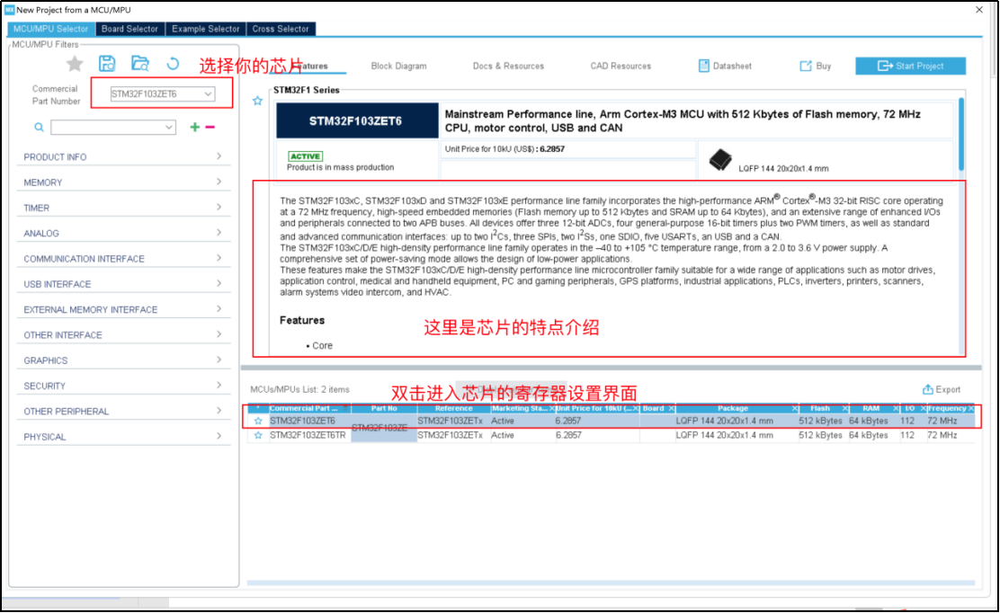
          <figcaption>图6-233　选择MCU型号</figcaption>
        </figure>

    - **参数配置界面**

      <figure class="course-figure">
        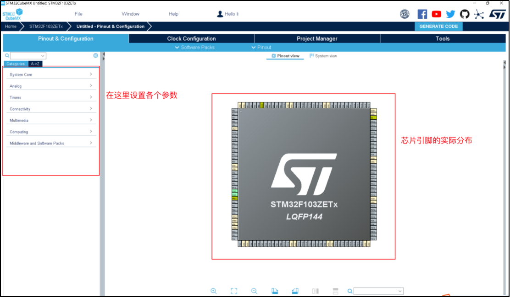
        <figcaption>图6-234　参数配置界面</figcaption>
      </figure>

      <figure class="course-figure">
        
        <figcaption>图6-235　参数配置界面</figcaption>
      </figure>

      <figure class="course-figure">
        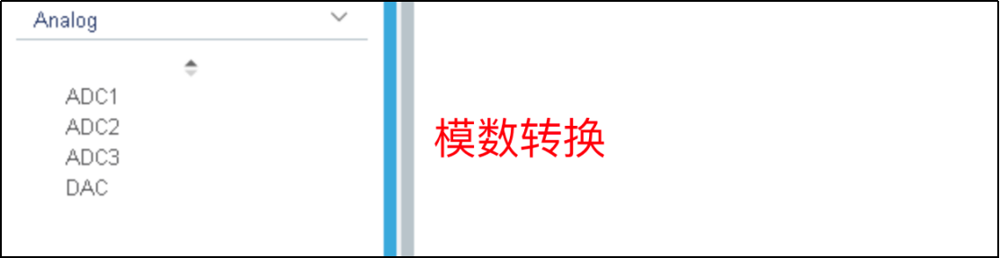
        <figcaption>图6-236　参数配置界面</figcaption>
      </figure>

      <figure class="course-figure">
        
        <figcaption>图6-237　参数配置界面</figcaption>
      </figure>

      <figure class="course-figure">
        
        <figcaption>图6-238　参数配置界面</figcaption>
      </figure>

      - **Debug参数选择**

        <figure class="course-figure">
          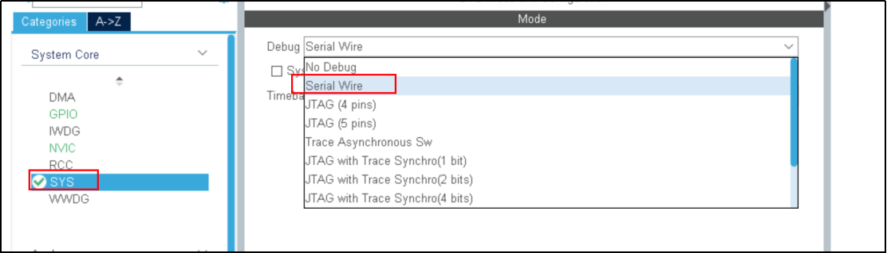
          <figcaption>图6-239　Debug参数选择</figcaption>
        </figure>

        - **选择串口即可。这个地方务必设置好，否则只能下载一次程序到MCU，以后就无法下载了。**

      - **RCC时钟选择**

        <figure class="course-figure">
          
          <figcaption>图6-240　RCC时钟选择</figcaption>
        </figure>

        <figure class="course-figure">
          
          <figcaption>图6-241　RCC时钟选择</figcaption>
        </figure>

      - **串口配置**

        <figure class="course-figure">
          
          <figcaption>图6-242　串口配置</figcaption>
        </figure>

        <figure class="course-figure">
          
          <figcaption>图6-243　串口配置</figcaption>
        </figure>

        <figure class="course-figure">
          
          <figcaption>图6-244　串口配置</figcaption>
        </figure>

        - **选择串口**

          <figure class="course-figure">
            
            <figcaption>图6-245　选择串口</figcaption>
          </figure>

        - **配置串口**

          <figure class="course-figure">
            
            <figcaption>图6-246　配置串口</figcaption>
          </figure>

        - **开启串口中断**

          <figure class="course-figure">
            
            <figcaption>图6-247　开启串口中断</figcaption>
          </figure>

        - **IO口自动设置**

          <figure class="course-figure">
            
            <figcaption>图6-248　IO口自动设置</figcaption>
          </figure>

      - **GPIO配置**

        <figure class="course-figure">
          
          <figcaption>图6-249　GPIO配置</figcaption>
        </figure>

      - **TIM1配置**

        <figure class="course-figure">
          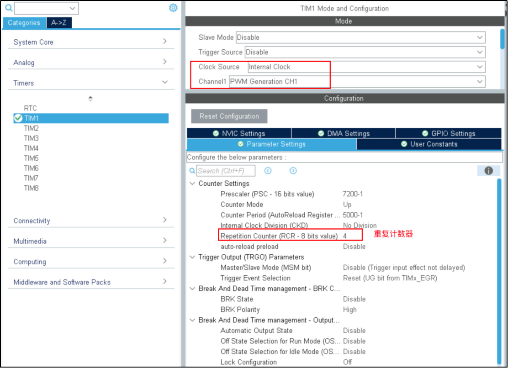
          <figcaption>图6-250　TIM1配置</figcaption>
        </figure>

        <figure class="course-figure">
          
          <figcaption>图6-251　TIM1配置</figcaption>
        </figure>

        <figure class="course-figure">
          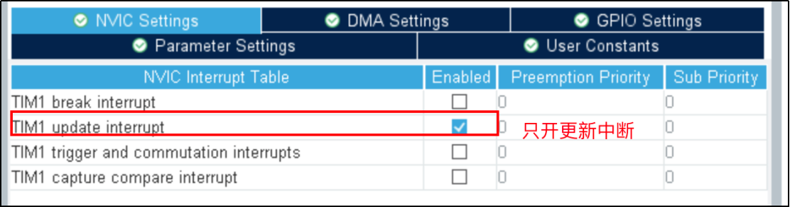
          <figcaption>图6-252　TIM1配置</figcaption>
        </figure>

      - **工程配置**

        <figure class="course-figure">
          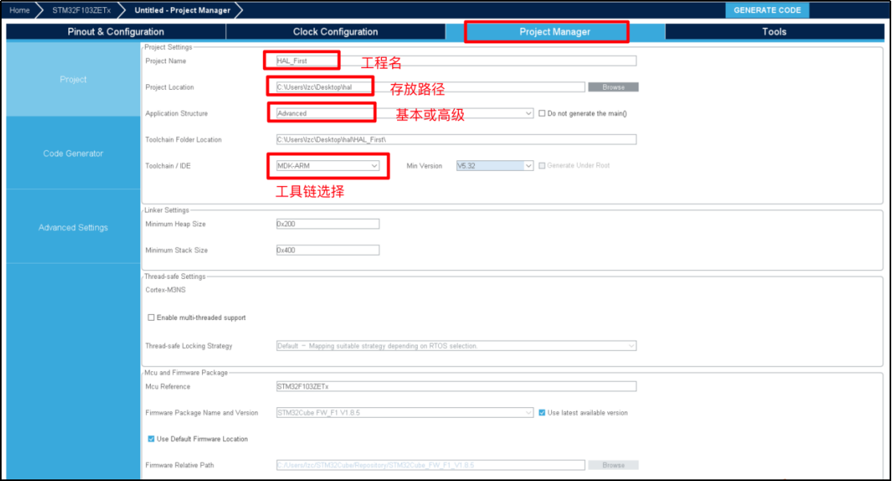
          <figcaption>图6-253　工程配置</figcaption>
        </figure>

        <figure class="course-figure">
          
          <figcaption>图6-254　工程配置</figcaption>
        </figure>

        <figure class="course-figure">
          
          <figcaption>图6-255　工程配置</figcaption>
        </figure>

      - **生成代码**

        <figure class="course-figure">
          
          <figcaption>图6-256　生成代码</figcaption>
        </figure>

        <figure class="course-figure">
          
          <figcaption>图6-257　生成代码</figcaption>
        </figure>

      - **生成的工程目录介绍**

        <figure class="course-figure">
          
          <figcaption>图6-258　生成的工程目录介绍</figcaption>
        </figure>

        - **main函数中已经替我们调用了HAL的初始化，时钟的初始化，GPIO的初始化，定时器初始化**

          ```c
          int main(void)
          {
              HAL_Init();
              SystemClock_Config();
              MX_GPIO_Init();
              while (1)
              {
              }
          }
          ```

  - **HAL库相关函数**

  - **代码实现**

    - **tim.c**

      ```c
      /* USER CODE BEGIN 1 */

      void HAL_TIM_PeriodElapsedCallback(TIM_HandleTypeDef *htim)
      {
          /* 关闭计数器 */
          if (htim->Instance == TIM1)
          {
              //HAL_TIM_PWM_Stop(&htim1, TIM_CHANNEL_1);
              TIM1->CCER &= ~TIM_CCER_CC1E;
              TIM1->BDTR &= ~TIM_BDTR_MOE;
              htim->Instance->CR1 &= ~TIM_CR1_CEN;
          }
      }
      /* USER CODE END 1 */
      ```

    - **main.c**

      ```c
      int main(void)
      {
          HAL_Init();
          SystemClock_Config();
          MX_GPIO_Init();
          MX_TIM1_Init();
          MX_USART1_UART_Init();
          /* 初始化的时候 UG已经被置位.  先清除中断标志位,防止一启动就进入中断 */
          __HAL_TIM_CLEAR_IT(&htim1, TIM_IT_UPDATE);
          /* 启用更新中断 */
          __HAL_TIM_ENABLE_IT(&htim1, TIM_IT_UPDATE);
          HAL_TIM_PWM_Start(&htim1, TIM_CHANNEL_1);
          while (1)
          {
          }
      }
      ```

---
