# 嵌入式智能硬件开发—Cortex-M开发

> **第 01 讲｜概述**  
> 从智能硬件系统组成出发，依次认识 STM32、系统架构、最小系统、开发环境与开发方式。

## 目录

1. [智能硬件开发概述](#1-智能硬件开发概述)
2. [认识 STM32](#2-认识-stm32)
3. [STM32 系统架构与时钟](#3-stm32-系统架构与时钟)
4. [STM32 最小系统](#4-stm32-最小系统)
5. [开发环境与工程准备](#5-开发环境与工程准备)
6. [STM32 开发流程与实现方式](#6-stm32-开发流程与实现方式)
7. [总结](#7-总结)

---

## 1 智能硬件开发概述

### 1.1 硬件系统的组成


#### 1.1.1 主控芯片：从体系结构到具体型号

> 学习芯片不能从某一个厂商、某一颗型号开始。正确顺序是：  
> **体系结构 → ARM 产品系列 → MCU/MPU → Cortex-M → 芯片厂商 → 具体型号参数。**

##### ◆ 先认识芯片体系结构

这里所说的 x86、ARM 和 RISC-V，首先指处理器的**指令集体系结构（ISA）**。它规定处理器能够执行哪些指令，以及软件如何控制处理器。

| 体系结构 | 指令集特点 | 主要优势 | 常见应用 |
|---|---|---|---|
| x86 | CISC 复杂指令集 | 性能强、软件生态成熟、兼容性好 | PC、工作站、服务器 |
| ARM | RISC 精简指令集 | 能效高、产品层次丰富、产业生态完善 | 手机、嵌入式、汽车、服务器 |
| RISC-V | 开放的 RISC 指令集 | 开放、可扩展、可定制、授权限制少 | MCU、物联网、教学、定制处理器 |
| MIPS | RISC 精简指令集 | 结构清晰、实现成熟 | 传统网络设备、教学和部分嵌入式设备 |

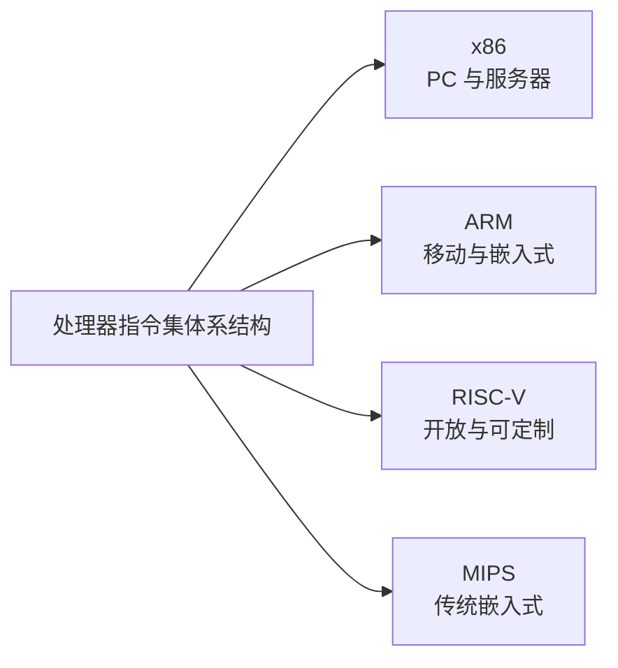

###### ◇ x86、ARM、RISC-V 的关系

- **x86**强调高性能、软件兼容和成熟的桌面/服务器生态。
- **ARM**以高能效和丰富产品系列见长，从低功耗 MCU 到高性能应用处理器均有覆盖。
- **RISC-V**是后来发展的开放指令集，为芯片厂商、研究机构和开发者提供了更大的自主设计空间。

##### ◆ 为什么 ARM 能在嵌入式领域广泛应用？

| ARM 的优势 | 对嵌入式开发的意义 |
|---|---|
| RISC 指令集，能效较高 | 在有限功耗下完成更多计算 |
| Cortex-A、R、M 产品系列完整 | 从复杂操作系统到实时控制均可覆盖 |
| 授权与 IP 核模式 | 多家厂商可以围绕相同内核设计不同芯片 |
| 工具链和软件生态成熟 | 编译器、调试器、RTOS、库和资料丰富 |
| 厂商与产品数量多 | 可以根据成本、性能和供货选择不同品牌 |

> ARM 的核心优势不只是“功耗低”，而是形成了完整的处理器系列、芯片厂商和软件工具生态。

##### ◆ RISC-V 的后发优势

| RISC-V 优势 | 具体含义 |
|---|---|
| 指令集开放 | 任何组织都可以基于规范研究和实现处理器 |
| 模块化设计 | 以基础指令集配合乘除法、浮点、向量等扩展 |
| 可定制 | 厂商可以面向控制、AI、安全等场景增加专用能力 |
| 有利于自主生态 | 高校、企业和研究机构可以深入处理器设计与验证 |
| 软件生态快速发展 | 编译器、操作系统、调试工具和开发板不断完善 |

RISC-V 的“后发优势”不表示它在所有场景都优于 ARM。当前选型仍要比较：

- 芯片是否量产并稳定供货。
- 开发工具、驱动库和技术资料是否完整。
- 团队是否具备对应的开发和调试经验。
- 项目是否真正需要开放和可定制能力。

##### ◆ ARM 处理器如何分类？

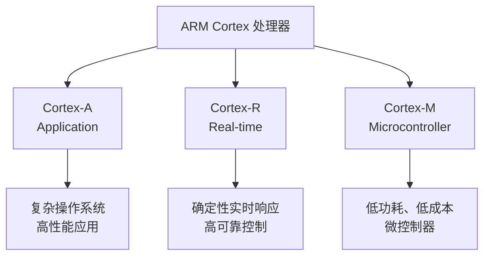

| 系列 | 设计目标 | 典型软件 | 典型应用 |
|---|---|---|---|
| Cortex-A | 高性能应用处理 | Linux、Android 等复杂操作系统 | 手机、网关、人机界面、边缘计算 |
| Cortex-R | 高可靠、确定性实时处理 | 实时系统或专用软件 | 汽车控制、存储控制、工业安全 |
| Cortex-M | 低功耗、低成本实时控制 | 裸机程序或 RTOS | 传感器、仪表、电机、物联网设备 |

##### ◆ MCU 和 MPU 有什么区别？

| 对比项 | MCU：微控制器 | MPU：微处理器 |
|---|---|---|
| 典型 ARM 内核 | Cortex-M | Cortex-A |
| 芯片内部 | 集成 CPU、Flash、SRAM 和外设 | 以处理器为主，通常需要外接内存和存储 |
| 软件系统 | 裸机或 RTOS | Linux、Android 等复杂操作系统 |
| 启动与实时性 | 启动快、响应可预测 | 系统复杂，实时性需专门设计 |
| 功耗与成本 | 较低 | 较高 |
| 应用 | 采集、控制、仪表、电机、物联网 | 图形界面、视频、网关和复杂应用 |

> Cortex-M 通常用于构成 MCU；Cortex-A 通常用于构成 MPU。  
> Cortex 是处理器内核，MCU/MPU 是芯片的集成形态，两者不是同一层级的分类。

##### ◆ 为什么本课程学习 Cortex-M？

- 智能硬件首先需要解决感知、控制、通信和实时响应问题。
- Cortex-M MCU 已集成存储器、定时器、ADC 和通信接口，容易构成完整系统。
- 功耗低、成本适中、启动快，适合大量物联网和工业控制设备。
- 中断、定时器和 DMA 等机制适合学习嵌入式系统的核心原理。
- ARM 厂商众多，掌握 Cortex-M 的共性后可以迁移到不同品牌。

###### ◇ Cortex-M 内核的能力层次

| 内核 | 主要特点 | 常见用途 |
|---|---|---|
| Cortex-M0 / M0+ | 结构简单、成本和功耗低 | 简单控制器、传感节点 |
| Cortex-M3 | 通用控制性能均衡 | 仪表、通信节点、工业控制 |
| Cortex-M4 | 增加 DSP 指令，部分实现带 FPU | 电机控制、信号处理、复杂算法 |
| Cortex-M7 | 更高性能，通常具有缓存和更强流水线 | 图形显示、高性能实时控制 |
| Cortex-M23 / M33 | 强调安全扩展和新型物联网应用 | 安全设备、可信物联网终端 |

##### ◆ 从 ARM 内核走向多厂商芯片

ARM 提供体系结构和处理器内核，芯片厂商在此基础上集成 Flash、SRAM、ADC、定时器、通信接口和特色外设，形成具体 MCU。

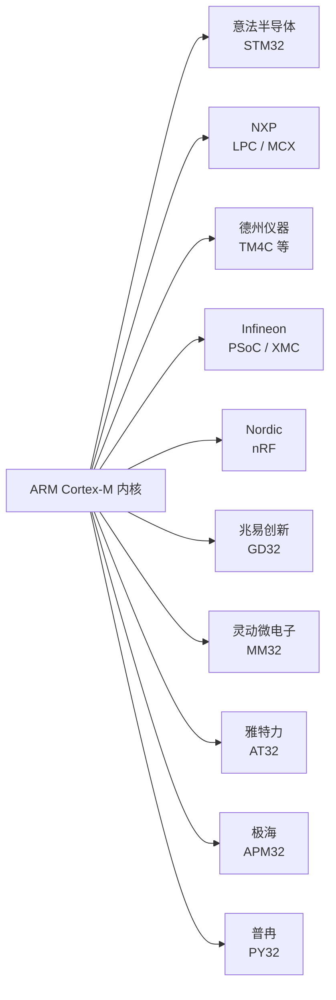

###### ◇ 国外代表厂商

| 厂商 | 代表产品或特点 |
|---|---|
| 意法半导体 ST | STM32 系列完整，资料和开发生态丰富 |
| NXP | LPC、MCX、i.MX RT 等系列，工业与高性能控制产品丰富 |
| Texas Instruments | 控制、模拟和无线产品结合紧密 |
| Infineon | 工业、汽车和安全控制领域产品丰富 |
| Nordic Semiconductor | 低功耗蓝牙和无线 SoC 具有代表性 |
| Microchip、Renesas、Silicon Labs | 覆盖通用控制、无线、低功耗和工业应用 |

###### ◇ 国内代表厂商

| 厂商 | 代表产品或方向 |
|---|---|
| 兆易创新 | GD32 系列 MCU |
| 灵动微电子 | MM32 系列 MCU |
| 雅特力科技 | AT32 系列 MCU |
| 极海半导体 | APM32 系列 MCU |
| 普冉半导体 | PY32 等 MCU 产品 |

###### ◇ 学习要求

不要把“学习 STM32”理解为只会调用某一家厂商的库函数。学生应重点掌握：

1. Cortex-M 内核、中断和存储映射等共性。
2. GPIO、定时器、ADC、DMA 和通信接口的工作原理。
3. 阅读数据手册、参考手册和原理图的方法。
4. 将同一设计思路迁移到 GD32、MM32、AT32、APM32 或其他 MCU。
5. 同时关注 RISC-V MCU 生态，理解不同体系结构和厂商的取舍。

##### ◆ 最后选择具体型号：重点看哪些参数？


###### ◇ 内核型号与核数

| 参数 | 需要回答的问题 |
|---|---|
| Cortex-M0/M3/M4/M7/M33 | 是否需要 DSP、FPU、高性能或安全能力？ |
| 单核/双核/异构多核 | 是否需要通信与控制分工，或实时任务隔离？ |
| FPU | 是否存在大量浮点运算、滤波、姿态解算或控制算法？ |
| DSP 指令 | 是否需要高效乘加、滤波或信号处理？ |

多数入门控制项目使用单核 MCU 即可。多核会带来任务协同、共享资源和调试复杂度，不能只因为“核数多”就优先选择。

###### ◇ 主频与实际性能

- 主频表示 CPU 的时钟速度，单位通常为 MHz。
- 相同主频下，不同内核、缓存、Flash 等待周期和总线结构会影响实际性能。
- 比较芯片时可参考 CoreMark、DMIPS、FPU 和 DSP 能力。
- 主频越高，通常功耗和电磁干扰也越高。

###### ◇ Flash 与 SRAM

| 存储器 | 存放内容 | 选型重点 |
|---|---|---|
| Flash | 程序代码、常量、字库 | 容量、擦写寿命、是否支持双 Bank 和在线升级 |
| SRAM | 变量、任务栈、通信缓存、图像或采样数据 | 总容量、分区、DMA 可访问性 |
| 外部存储接口 | 外部 Flash、SRAM、SDRAM、SD 卡 | 接口类型、速度、最大容量 |

> 使用 RTOS、网络协议栈、图形界面时，SRAM 往往比 Flash 更容易成为瓶颈。

###### ◇ ADC 与模拟资源

| 参数 | 含义 |
|---|---|
| 分辨率 | 常见为 8、10、12、16 位；位数越高，理论量化越细 |
| 通道数 | 决定可以连接多少路模拟信号 |
| 采样率 | 决定单位时间内可以完成多少次转换 |
| 参考电压 | 影响 ADC 的输入范围和测量精度 |
| 触发与 DMA | 是否支持定时器触发、连续采样和自动搬运数据 |
| 其他模拟资源 | DAC、比较器、运算放大器、触摸检测等 |

不能只看“ADC 是多少位”，还要看采样率、误差、参考电压、输入阻抗和 PCB 模拟设计。

###### ◇ 通信接口

| 接口 | 选型时重点检查 |
|---|---|
| UART / USART | 数量、最高波特率、是否支持同步、DMA |
| I²C | 控制器数量、速率、地址模式、滤波能力 |
| SPI | 控制器数量、最高时钟、数据位宽、片选方式 |
| CAN / CAN FD | 控制器数量、协议版本、是否需要外置收发器 |
| USB | Device、Host 或 OTG，速度等级 |
| Ethernet | MAC、PHY 接口、时间戳和 DMA |
| 无线 | 是否集成 Bluetooth、Wi-Fi、Sub-GHz 或 802.15.4 |

###### ◇ 定时器、PWM 与 DMA

- 定时器数量、位宽和最大计数频率。
- PWM 通道、互补输出、死区和刹车输入。
- 输入捕获、输出比较、编码器接口。
- DMA 控制器数量、通道数和外设映射方式。

电机控制、波形生成和高速采集项目必须重点检查这些参数。

###### ◇ 电气、封装与工程参数

| 类别 | 需要核对的参数 |
|---|---|
| 电气 | 工作电压、I/O 电平、5 V 容限、驱动电流 |
| 功耗 | 运行电流、睡眠电流、低功耗模式、唤醒时间 |
| 封装 | LQFP、QFN、BGA，引脚数量和 PCB 工艺 |
| 环境 | 工作温度、抗干扰、可靠性和安全等级 |
| 工程 | 单价、供货周期、开发板、调试器、库和资料 |

##### ◆ 型号选择的最终检查顺序

1. 确认体系结构和芯片类型。
2. 确认 ARM Cortex-A/R/M 系列定位。
3. 确认厂商及软件生态，但不依赖单一厂商。
4. 确认内核、核数、主频、Flash 和 SRAM。
5. 确认 ADC、定时器、DMA 和所有通信接口。
6. 检查引脚复用、封装、电压、功耗和温度。
7. 阅读数据手册、参考手册与勘误表。
8. 使用开发板或样片验证性能、功耗和接口。
#### 1.1.2 电源与时钟管理

- 功能：为系统提供稳定电能，优化功耗
- 电源输入：电池（锂电、纽扣电池）、电源适配器、太阳能板
- 电源管理芯片（PMIC）：电压转换（DC-DC）、充电管理、低功耗模式控制
- 保护电路：过压/过流保护、静电防护（ESD）
#### 1.1.3 存储单元


> 存储器主要解决三个问题：**程序放在哪里、运行数据放在哪里、断电后哪些数据需要保留。**

##### ◆ 存储器总体分类

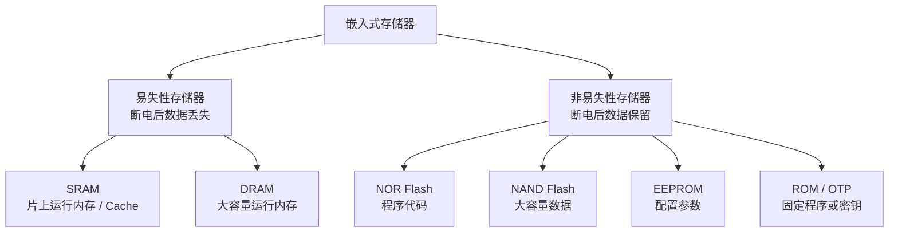

##### ◆ 易失性与非易失性存储器

| 对比项 | 易失性存储器 | 非易失性存储器 |
|---|---|---|
| 断电后数据 | 丢失 | 保留 |
| 主要用途 | 程序运行、变量、任务栈、数据缓存 | 程序代码、配置参数、日志和离线数据 |
| 典型类型 | SRAM、DRAM | Flash、EEPROM、ROM、FRAM、MRAM |
| 主要关注点 | 速度、容量、带宽、功耗 | 容量、写入速度、擦写寿命、数据保持时间 |

##### ◆ RAM：程序运行时的工作空间

| 类型 | 结构与特点 | 优势 | 常见应用 |
|---|---|---|---|
| SRAM | 不需要刷新，单位存储成本较高 | 速度快、控制简单、实时性好 | MCU 片上 RAM、CPU Cache、DMA 缓冲区 |
| DRAM | 需要周期性刷新，存储密度高 | 容量大、单位容量成本低 | MPU 外部内存、图像缓存、Linux 系统内存 |

###### ◇ MCU 中的 SRAM 通常存放什么？

| 内容 | 示例 |
|---|---|
| 全局变量与静态变量 | 设备状态、计数值、控制参数 |
| 局部变量与函数栈 | 函数调用、临时计算数据 |
| RTOS 任务栈 | 每个任务的运行现场 |
| 通信缓冲区 | UART、CAN、USB、网络收发数据 |
| 采样数据 | ADC 数组、DMA 缓冲区、滤波数据 |

> 使用 RTOS、图形界面、网络协议或大数组时，SRAM 往往比 Flash 更容易不足。

##### ◆ 非易失性存储器：断电后仍保存数据

| 类型 | 访问特点 | 适合存放 | 使用提醒 |
|---|---|---|---|
| NOR Flash | 随机读取快，可支持 XIP 原地执行 | MCU 程序代码、Bootloader、字库 | 写入和擦除通常按页或扇区进行 |
| NAND Flash | 顺序读写效率高、容量大 | eMMC、SD 卡、SSD、大容量日志 | 需要坏块管理和纠错 |
| EEPROM | 可按字节或小块修改 | 设备地址、校准值、少量配置参数 | 写入较慢，存在擦写寿命 |
| ROM / OTP | 固定或一次性编程 | 启动代码、芯片标识、密钥 | 写入后不能或不方便修改 |
| FRAM / MRAM | 非易失、写入快、寿命较高 | 高频参数记录、掉电数据保存 | 成本和器件选择需单独评估 |

##### ◆ 嵌入式系统中数据放在哪里？

| 数据内容 | 推荐存储位置 | 原因 |
|---|---|---|
| 程序代码 | 片上 NOR Flash | 断电保留，可直接读取执行 |
| 运行变量 | SRAM | 读写速度快 |
| 大型图像或离线文件 | 外部 Flash、SD 卡、eMMC | 容量大 |
| 少量配置参数 | EEPROM 或片上 Flash 指定区域 | 断电后保留 |
| 高频更新的关键数据 | FRAM、MRAM 或带磨损均衡的存储方案 | 降低擦写寿命风险 |

##### ◆ 以 STM32F103C8T6 为例：64 KB Flash 和 20 KB SRAM 怎么使用？

###### ◇ 先记住一句话

> **程序烧录到 Flash，程序运行时使用 SRAM。**  
> Flash 断电后内容保留；SRAM 断电后数据丢失。

| 存储器 | 容量示例 | 断电后 | 主要存放内容 |
|---|---:|---|---|
| 片上 Flash | 64 KB | 保留 | 程序代码、常量、初始值、向量表 |
| 片上 SRAM | 20 KB | 丢失 | 运行变量、数组、任务栈、堆、通信缓冲区 |

###### ◇ 程序到底烧写到哪里？

当我们在 Keil、STM32CubeIDE 等开发环境中完成编译并点击“Download”时：


因此，烧录并不是把程序放入 SRAM，而是把生成的机器指令写入芯片内部的 Flash。断电后程序仍然存在，下次上电可以继续运行。

###### ◇ 程序中的不同内容分别放在哪里？

| 程序内容 | 示例 | 编译后的区域 | 运行时位置 |
|---|---|---|---|
| 程序指令 | `main()`、函数代码 | `.text` | Flash |
| 只读常量 | `const` 常量、字符串 | `.rodata` | 通常在 Flash |
| 有初始值的全局/静态变量 | `int count = 10;` | 初始值保存在 Flash 的 `.data` 镜像中 | 启动时复制到 SRAM |
| 未初始化或初值为 0 的全局/静态变量 | `int count;`、`static int flag;` | `.bss` 只记录大小 | 启动时在 SRAM 中清零 |
| 局部变量 | 函数中的普通变量 | 不单独烧录数据 | 运行时使用 SRAM 栈 |
| 动态分配数据 | `malloc()` 创建的数据 | 不单独烧录数据 | 运行时使用 SRAM 堆 |
| 通信与采样缓存 | UART 数组、ADC DMA 数组 | 根据变量类型决定初始状态 | SRAM |

###### ◇ 上电或复位时发生了什么？

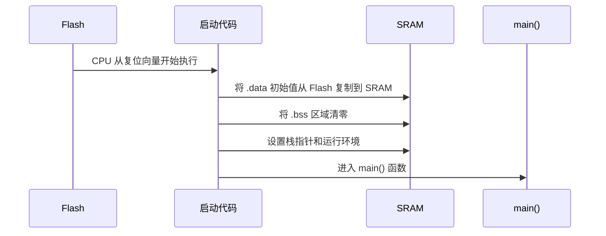

以代码为例：

```c
const int table[3] = {1, 2, 3};  // 通常保存在 Flash
int count = 10;                  // 初值 10 存在 Flash，运行变量在 SRAM
int result;                      // 运行前在 SRAM 中清零

int main(void)
{
    int temp = 5;                // 局部变量通常使用 SRAM 栈
    result = count + temp;
}
```

- `table`通常直接从 Flash 读取。
- `count`的初始值 `10`随程序一起烧入 Flash；上电时复制到 SRAM，运行过程中修改的是 SRAM 中的 `count`。
- `result`位于 SRAM 的 `.bss` 区，上电时由启动代码清零。
- `temp`通常在函数运行时进入 SRAM 栈，函数结束后其空间可以被其他数据复用。

###### ◇ 复位和断电后，数据会怎样？

| 情况 | Flash 中的程序 | SRAM 中的变量 |
|---|---|---|
| 软件复位或按下复位键 | 保留 | 重新执行初始化：`.data` 恢复初值，`.bss` 清零 |
| 关闭电源 | 保留 | 丢失 |
| 重新烧录程序 | 被新程序覆盖或更新 | 复位后重新初始化 |

例如运行过程中把 `count`从 `10`修改为 `50`：

- 发生复位后，`count`通常重新变成 `10`。
- 原因是 `50`只存在于 SRAM，而 Flash 中保存的初始化值仍然是 `10`。

###### ◇ 如果希望数据断电后仍然保存怎么办？

| 保存方式 | 适合内容 | 特点 |
|---|---|---|
| 片上 Flash 预留页 | 少量配置参数、设备编号、校准值 | 不增加器件，但需要按页擦除并考虑擦写寿命 |
| 外部 EEPROM | 经常修改的少量参数 | 支持较小粒度写入，使用方便 |
| 外部 SPI NOR Flash | 字库、日志、较大配置数据 | 容量较大，通常按页写、按扇区擦除 |
| SD 卡 / eMMC | 文件、图片、大量日志 | 容量大，需要文件系统和异常掉电保护 |
| 备份寄存器 + VBAT | RTC 和极少量备份状态 | 主电源断开后由备用电源维持 |

> 不要在主循环中频繁擦写片上 Flash。Flash 擦写有寿命限制，而且擦除通常以页为单位。需要高频保存的数据，应采用 EEPROM、FRAM、外部 Flash 或带磨损均衡的方案。

###### ◇ 64 KB Flash 和 20 KB SRAM 是否够用？

| 检查对象 | 判断方法 |
|---|---|
| Flash 是否够 | 查看编译结果中的 Code、RO-data、RW-data 等占用，并为升级预留空间 |
| SRAM 是否够 | 统计 RW-data、ZI-data、任务栈、堆、DMA 缓冲区和最大局部数组 |
| 是否存在栈溢出 | 检查深层函数调用、大型局部数组和 RTOS 任务栈 |
| 是否需要外部存储 | 判断字库、图片、日志和离线数据是否超过片上空间 |

> 不能因为编译成功就认为内存一定够用。程序可能能够烧录，却在运行过程中因为任务栈、堆或大型数组耗尽 SRAM。

##### ◆ 存储器选型看五项

| 参数 | 需要回答的问题 |
|---|---|
| 容量 | 程序、变量、缓存和日志分别需要多大空间？ |
| 速度 | CPU、DMA 和外设的数据速率能否满足？ |
| 易失性 | 数据断电后是否必须保留？ |
| 擦写寿命 | 参数或日志需要更新多少次？ |
| 成本与功耗 | 容量、速度、封装和待机功耗是否适合产品？ |
#### 1.1.4 通信模块

> 通信模块负责让 MCU 与传感器、其他控制器、计算机或云平台交换数据。选型时主要比较：**速率、距离、节点数量、功耗、可靠性和成本。**

##### ◆ 通信方式总体分类

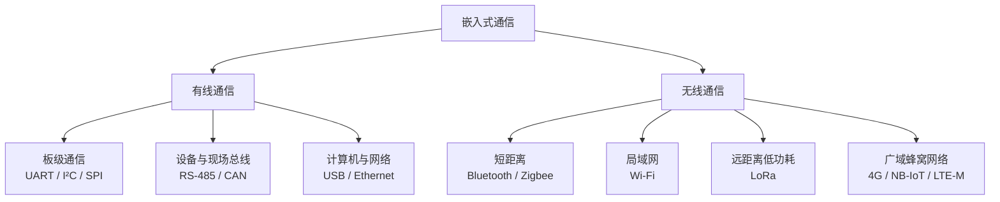

##### ◆ 常用有线通信接口

| 接口 | 连接方式 | 相对速率 | 典型距离 | 主要优势 | 常见应用 |
|---|---|---:|---:|---|---|
| UART | TX/RX，通常点对点 | 低～中 | 板内或数米 | 简单、调试方便 | 串口日志、GPS、无线模块 |
| I²C | 2 根信号线，多设备总线 | 低～中 | 板内短距离 | 节省引脚，可连接多个从设备 | 传感器、EEPROM、RTC |
| SPI | 时钟与独立收发线，主从结构 | 高 | 板内短距离 | 速度快、时序简单 | Flash、显示屏、高速 ADC |
| RS-485 | 差分总线，多节点 | 中 | 数百米级 | 抗干扰、距离远、可多节点 | 工业仪表、Modbus |
| CAN / CAN FD | 差分总线，多主节点 | 中～高 | 数十到数百米 | 仲裁、错误检测、可靠性高 | 汽车、机器人、工业控制 |
| USB | 主机与设备结构 | 中～高 | 数米 | 标准化程度高，可传输数据并供电 | PC 外设、升级、数据采集 |
| Ethernet | 星形网络，通常需要 PHY | 高 | 铜缆常见百米级 | 带宽高、网络协议成熟 | 网关、工业网络、远程维护 |

##### ◆ UART、I²C、SPI 快速对比

| 对比项 | UART | I²C | SPI |
|---|---|---|---|
| 信号线 | TX、RX | SCL、SDA | SCLK、MOSI、MISO、片选 |
| 时钟 | 异步，无独立时钟线 | 同步 | 同步 |
| 设备数量 | 通常点对点 | 同一总线可接多个设备 | 一个主机可接多个从机，但需要片选 |
| 速度 | 较低 | 中等 | 较高 |
| 引脚占用 | 少 | 最少 | 较多 |
| 最适合 | 调试与模块通信 | 多个低速传感器 | 屏幕、Flash 和高速外设 |

##### ◆ 常用无线通信方式

| 方式 | 速率 | 距离 | 功耗 | 组网特点 | 典型应用 |
|---|---:|---:|---:|---|---|
| Bluetooth LE | 低～中 | 近距离 | 低 | 手机连接方便 | 可穿戴设备、配置工具、传感器 |
| Zigbee / 802.15.4 | 低 | 近～中距离 | 低 | 支持多节点和 Mesh | 智能家居、照明、传感网络 |
| Wi-Fi | 高 | 局域网范围 | 较高 | 可直接接入 IP 网络 | 摄像头、家电、网关、OTA |
| LoRa / LoRaWAN | 很低 | 远距离 | 低 | 小数据、低频率、广覆盖 | 农业监测、抄表、环境监测 |
| NB-IoT / LTE-M | 低～中 | 蜂窝网络覆盖 | 中 | 依赖运营商网络 | 城市物联网、远程资产 |
| 4G / 5G | 高 | 蜂窝网络覆盖 | 高 | 带宽高、网络成熟 | 视频、车载终端、移动网关 |

> Wi-Fi、Bluetooth、LoRa 和蜂窝通信通常由无线 SoC 或独立通信模块完成，再通过 UART、SPI、USB、SDIO 等接口与主控 MCU 连接。

##### ◆ 按项目需求选择通信方式

| 项目需求 | 优先考虑 |
|---|---|
| MCU 输出调试日志 | UART |
| 一块板上连接多个低速传感器 | I²C |
| 连接显示屏或高速 Flash | SPI |
| 工厂内多个仪表远距离联网 | RS-485 或 CAN |
| 连接电脑、升级固件或高速采集 | USB |
| 接入局域网或云平台，数据量较大 | Ethernet 或 Wi-Fi |
| 手机近距离配置设备 | Bluetooth LE |
| 多个低功耗节点自组网 | Zigbee / 802.15.4 |
| 远距离发送少量传感数据 | LoRa / LoRaWAN |
| 无本地网络但需要远程联网 | NB-IoT、LTE-M 或 4G |

##### ◆ 通信接口选型检查表

| 检查项 | 需要回答的问题 |
|---|---|
| 数据量 | 每秒需要传输多少字节？是否有图片、音频或视频？ |
| 通信距离 | 板内、数米、数百米还是跨区域？ |
| 节点数量 | 点对点、一主多从、多主还是 Mesh？ |
| 环境 | 是否存在电机、长线缆或强电磁干扰？ |
| 功耗 | 电池设备能否长期保持无线连接？ |
| 实时性 | 数据允许多大延迟？丢包后是否可以重传？ |
| 成本 | 是否需要收发器、天线、PHY、SIM 卡或运营商费用？ |
| MCU 资源 | 芯片是否具有对应控制器、DMA 和足够的引脚？ |

---

## 2 认识 STM32

### 2.1 STM32、产品系列与选型

#### 2.1.1 ST Microelectronics（意法半导体） 推出的基于 ARM Cortex-M 内核 的 32 位微控制器（MCU）

- ARM处理器分类
  
- ARM处理器的主要厂商
  
- 兆易电子：GD32
#### 2.1.2 STM32 系列分类


- https://www.stmcu.com.cn/Product/pro_detail/PRODUCTSTM32/product
- stm32F103ZET6
#### 2.1.3 STM32 命名规范


- LQFP封装：单片机最常见的封装之一，这种封装很便于手工焊接，引脚都露在外面，检查、拆装方便，价格便宜。
  
- BGA封装：所有引脚都在片状的下方。这种封装的好处是片状下方的空间大，可以在不增加尺寸的情况下在下方引出更多的引脚
  
#### 2.1.4 如何检查选择的芯片符合项目开发要求？查看数据手册！

### 2.2 STM32 内核与基础资源

- 参考数据手册
  
- ARM 内核
  - ARM 32位Cortex™-M3，最高72MHz工作频率
  - 在存储器的0等待周期访问时可达1.25DMips/MHz
    - 存储器0等待周期是读写RAM和Flash时不需要浪费时间，读和写在一瞬间完成
- 存储器
  
  - 64KB或128KB的闪存程序存储器：flash
  - 高达20KB的SRAM
  - 工作流程
    
- 时钟
  
  - 单片机的时钟是指单片机工作的基准频率的来源，就是由一个电路产生类似脉搏的脉冲信号，一下一下有规律地稳定地跳动
  - 时钟种类
    
    - 外部高速晶体振荡器 HSE
    - 外部低速晶体振荡器 LSE
    - 内部高速 RC 振荡器 HIS
    - 内部低速 RC 振荡器 LSI
    - 分频器：锁相环PLL
  - 时钟区别
    
- 复位
  
  - 复位功能的作用是让 RAM中的数据清空，让所有连接到复位的相关功能都回到刚开始工作的（初始）状态
- 电源管理
  
  - 电源管理是指对单片机外接电源处理、分配的功能：目标低功耗
  - 组成部分
    - 备用电源输入
      - 专门给实时时钟（RTC）供电的，以保证在逻辑电源断开后依然让 RTC 保持走时
      - 也给唤醒电路和后备寄存器供电， 让 它 们 一 直 处 在 工 作 状 态
      - 备用电源输入可以外接独立电源或者一块 1.8 ～3.6V 的电池
    - 逻辑电源输入
      - 单片机最基本的供电输入端口。给这些接口输入 2 ～3.6V 的直流电压
      - 能让 ARM 内核、存储器、I/O 端口和其他纯数字电路工作了。逻辑输入电压还能让 I/O 端口输入或输出数字信号的电压
    - 模拟电源输入
      - 模拟电源输入的电压是用在模数转换器（ADC）、RC振荡器和 PLL 倍频等模拟电路上的
      - 引脚较少的单片机上，逻辑电源和模拟电源并联在一起使用
- 低功耗模式
  
    
    - 睡眠模式，只关掉 ARM 内核，其他所有功能正常工作。这种方式不怎么省电，但不会影响整个系统的工作
    - 停机模式
      - 睡眠模式的升级版,将ARM 内核与几乎所有内部功能，包括外部高速晶体振荡器和 PLL 都关掉了，只有RTC、看门狗定时器、中断控制器在工作
      - 能接收中断，SRAM 中的数据还保存。唤醒的方式是外部中断、RTC 的闹钟还有 USB 接口唤醒，除此之外再没有能恢复的方式
      - 停机模式适用于平时工作任务很少的情况，单片机完成工作后有很长一段时间可以休息，是最省电的模式
    - 待机模式
      - 和停机模式的区别是把 SRAM 和外部中断控制器也关掉了，用户运行的数据消失，也就表示唤醒后必须重头开始

### 2.3 STM32 片上外设资源


- ADC（模数转换器）
  
  - ADC 的功能是读取模拟量的电压
  - 单片机的 ADC 性能各有不同，有 8位、10 位、12 位甚至更高的，位数越多，表示测得的电压值更精密
- DMA
  
  - 代替CPU完成内部功能间的数据传递的，数据读取、存放的任务上完全解放内核
    
- I/O端口
  - I/O端口也可以代替除ADC之外所有的逻辑电平的通信接口
  - STM32F103最多有80个I/O端口，这些端口每16个被分成一组，一共有5组。组的名字分别是PA、PB、PC、PD和PE
    
  - 每一个I/O端口都有8种工作模式
    
- 调试模式
  
  - 在ARM的内核中，有一组用于仿真调试的接口叫JTAG，主要是做程序仿真，不把程序下载到Flash里，而是在计算机端直接控制单片机内核
  - 仿真的好处是可以在计算机上实时改动参数，还可以慢速一步一步地执行程序，看每一步的效果
    - JTAG的简化接口SWD
      - 5条线的标准JTAG
    - 简化版的2 条线的SWD
- 定时器
  
  - STM32F103 单片机有 1 个高级定时器和 3 个普通定时器
  - 看门狗定时器
    - 2 个看门狗定时器定时器，看门狗定时器的作用是在定时时间到了之后让单片机复位
  - 嘀嗒定时器
    - 嘀嗒定时器，它是专用于实时操作系统中的任务切换的

### 2.4 STM32 内部通信功能


- I2C总线
  
  - 飞利浦公司发布的一款通信总线标准
    - 总线，是指在一条数据线上同时并联多个设备。设备是指连接在数据线上的芯片或模块
  - 特点
    - 设备分为主设备和从设备
      - 只能有 1 个主设备，主设备是主导通信的，它能主动读取各个从设备上的数据
      - 从设备只能等待主设备对自己读写，果主设备无操作，从设备自己不能操作总线
    - I2C 总线理论上可挂接几百个从设备，每个从设备都有一个固定的 7 位或 10 位从设备地址
    - I2C 总线由 SCL 和 SDA 两条数据线构成
      - SCL 是总线的时钟线，用于主设备与从设备之间的计数同步
      - SDA是总线的数据线，用于收发数据。另外主设备和从设备都必须共地（GND 连在一起）
    - I2C 总线的通信速度分为 3 挡
      - 低速模式可达 100kHz
        - STM32 硬件 I2C 总线工作在 100kHz 以下时，通信非常稳定，工作在100kHz 以上时就会出现错误
        - 如果你需要高速通信，还是要换用 SPI 总线
      - 快速模式可达 400kHz
      - 高速模式可达 3.4MHz
    - EEPROM 存储器、温度传感器、RTC 时钟、气压传感器等都使用 I2C 总线作通信接口
- USART串口
  
  - RS232它用于工业控制类设备，常见于计算机和工控设备之间的通信
  - RS232转换芯片，把TTL的5V电平转换成了±12V电平。因为电平电压的升高，通信的距离和稳定性都有所提高。RS232的连接线可达20m长
  - RS485的通信线长度可达1000m，而且传输速度比RS232还要快很多
- SPI总线
  
  - SPI 总线也有主设备和从设备之分，单片机是主设备，各种周边芯片是从设备
  - 特点
    - SPI 和 I2C 一样是板级总线，也就是只能在 PCB 上近距离通信，而不能引出导线到较远的距离
    - SPI 最大的优势是有很高的通信速度，而且在高速下还能稳定工作，这是 I2C 所不能的
      - 没有采用地址的概念，不在通信数据里放入地址信息，而是使用硬件来选择总线上的设备
      - 当主设备想与哪个从设备通信时，只要开启那个从设备的开关控制线，总线上就只有这个设备是开启的，总线变成了一对一通信
    - SPI 速度快的另一个原因是全双工。全双工的意思是总线在通信时能同时收发数据。
  - STM32F103 单片机上有 2 个 SPI 总线，最大速度可达 18MB/s，而且还支持 DMA功能和 SD 卡读写功能
- CAN总线
  
  - CAN 总线是一种工业控制、汽车电子上常用的高级总线，功能复杂且智能
  - 特点
    - 可以连接无限多的设备，每一个设备即可作主设备，也可作从设备
    - CAN 总线的通信距离可达10km，速度可达 1MB/s
    - 当总线上的某个设备损坏时，总线可以把这个设备从总线上断开。
    - CAN总线的工作很稳定，在汽车行业中被用于车内各电子设备的通信。
  - STM32F103 单片机有 1 个 CAN 总 线接口，但必须外加一片 CAN 收发器芯片（用于电平转换）才能正常使用
- USB接口
  
  - STM32F103 单片机上有 1 个 USB 2.0 接口，它被定义为 USB 从设备
  - USB 虽然不是总线，但它和 CAN 总线一样都有底层非常复杂的通信协议
  - USB 有 2 条数据线，另外还有 2 条电源线，可以由计算机端给 USB 设备（单片机）供电。
  - USB 接口有明确的主从关系，单片机只能作为计算机的从设备
- CRC校验和芯片ID
  
  - CRC 校验是一种用于数据校对的计算器
  - CRC 能验证通信过程中的数据有没有出现错误
    - 把一组数据按一个公式计算得出一个短小的值，接收端只要比对这个值是否正确，就能判断整组数据的正确性
  - 每一片 STM32 单片机内部都有一组 96 位（二进制）全球唯一的序列号

---

## 3 STM32 系统架构与时钟

### 3.1 STM32 系统架构

- 系统级总线
  - I-Bus（指令总线）：CPU 从 Flash 读取指令
  - D-Bus（数据总线）：CPU 从 Flash/SRAM 读写数据
  - S-Bus（系统总线）：CPU 访问系统控制模块（如 NVIC、SCB）
- 3个被动单元
  
  - 内部SRAM
    - 存储程序执行时用到的变量
  - 内部闪存存储器
    - 存储下载的程序
    - 程序执行时用到的常量
  - HB到APB的桥(AHB to APBx)
    - 桥1，通过APB2总线连接到APB2上的外设。高速外设，最高72MHz。
    - 桥2，通过APB1总线连接APB1上的外设。低速外设，最高36MHz。
- 4个驱动（主动）单元
  
  - Cortex™-M3内核DCode总线(D-bus)
    - 通过外部的DCode总线连接到总线矩阵然后与闪存存储器的数据接口相连接，实现从Flash常量加载和调试访问
  - 内核系统总线(S-bus)
    - 通过外部的System总线连接到总线矩阵
  - 通用DMA1-2（Direct Memory Access）
    - 通过DMA总线，连接到总线矩阵。作用就是降低CPU负担，不通过CPU实现内存和外设之间的数据传输
- 其他单元
  - 内核Icode总线
    - 通过外部的Icode总线连接Flash，实现指令的读取
  - FSMC(Flexible Static Memory Controller)
    - 用来扩展外部SRAM，Flash，连接LCD屏幕等

### 3.2 STM32 时钟树

#### 3.2.1 时钟从哪里来？

| 时钟源 | STM32F103 典型频率 | 特点                 | 常见用途               |
| --- | -------------: | ------------------ | ------------------ |
| HSI |          8 MHz | 芯片内部 RC，启动快、无需外部器件 | 上电默认时钟、一般控制        |
| HSE |  常用 8 MHz 外部晶振 | 精度和稳定性较高           | 系统主时钟、USB 等精确时钟基础  |
| PLL |   对 HSI/HSE 倍频 | 将较低频率提升为高频系统时钟     | 生成最高 72 MHz SYSCLK |
| LSI |       约 40 kHz | 内部低速 RC，精度较低       | 独立看门狗              |
| LSE |     32.768 kHz | 外部低速晶振，低功耗且适合计时    | RTC 实时时钟           |

#### 3.2.2 时钟分发路径

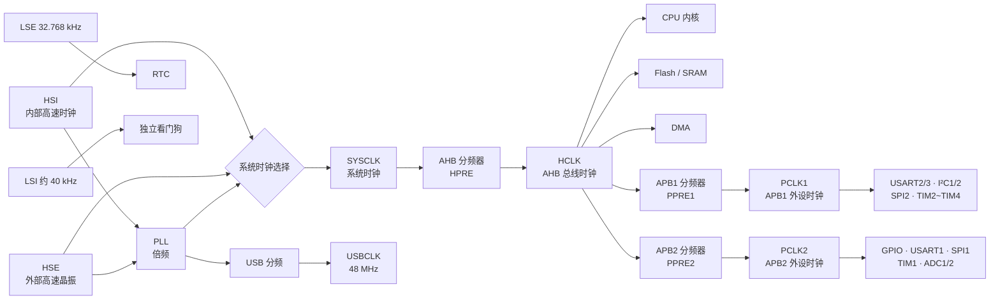

> 主线记忆：**时钟源 → PLL/系统时钟选择 → SYSCLK → AHB → APB1/APB2 → 具体外设。**

#### 3.2.3 各级时钟的关系

| 时钟名称 | 产生方式 | 为谁提供时钟 | STM32F103 典型上限 |
|---|---|---|---:|
| SYSCLK | HSI、HSE 或 PLLCLK 三选一 | 系统时钟入口 | 72 MHz |
| HCLK | `SYSCLK ÷ HPRE` | CPU、AHB、Flash、SRAM、DMA | 72 MHz |
| PCLK1 | `HCLK ÷ PPRE1` | APB1 低速外设 | 36 MHz |
| PCLK2 | `HCLK ÷ PPRE2` | APB2 高速外设 | 72 MHz |
| ADCCLK | `PCLK2 ÷ ADCPRE` | ADC1/ADC2 | 14 MHz |
| USBCLK | PLLCLK 经 USB 分频 | USB 模块 | 必须为 48 MHz |

#### 3.2.4 APB 定时器的特殊规则

| APB 分频器设置 | 定时器时钟 |
|---|---|
| APB 分频系数 = 1 | `TIMxCLK = PCLKx` |
| APB 分频系数 > 1 | `TIMxCLK = 2 × PCLKx` |

例如 PCLK1 为 36 MHz，且 APB1 分频系数为 2：

```text
TIM2、TIM3、TIM4 的定时器时钟 = 2 × 36 MHz = 72 MHz
```

这条规则解释了为什么“APB1 总线只有 36 MHz”，但 TIM2 的计数时钟仍然可以达到 72 MHz。

#### 3.2.5 STM32F103 72 MHz 配置示例

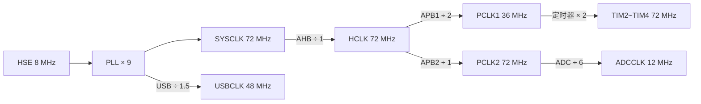

| 路径 | 计算结果 |
|---|---:|
| HSE → PLL | `8 MHz × 9 = 72 MHz` |
| SYSCLK → HCLK | `72 MHz ÷ 1 = 72 MHz` |
| HCLK → PCLK1 | `72 MHz ÷ 2 = 36 MHz` |
| HCLK → PCLK2 | `72 MHz ÷ 1 = 72 MHz` |
| PCLK1 → APB1 定时器 | `36 MHz × 2 = 72 MHz` |
| PCLK2 → ADC | `72 MHz ÷ 6 = 12 MHz` |
| PLLCLK → USB | `72 MHz ÷ 1.5 = 48 MHz` |

#### 3.2.6 时钟配置检查表

| 检查项 | 需要确认的问题 |
|---|---|
| 时钟源 | 使用 HSI 还是 HSE？是否需要 LSE？ |
| SYSCLK | PLL 输入与倍频是否正确？是否超过芯片上限？ |
| HCLK | CPU、Flash 和 AHB 时钟是否满足要求？ |
| PCLK1/PCLK2 | 是否超过对应总线允许的最高频率？ |
| ADC | ADCCLK 是否不高于 14 MHz？ |
| USB | USBCLK 是否精确为 48 MHz？ |
| Flash 等待周期 | 高主频下是否正确配置 Flash Latency？ |
| 外设时钟使能 | 使用外设前是否打开对应 RCC 时钟？ |

---

## 4 STM32 最小系统

### 4.1 什么是 STM32 最小系统？

> 最小系统是让 STM32 能够**稳定供电、正确启动、下载程序、运行程序和在线调试**所必需的基础电路。

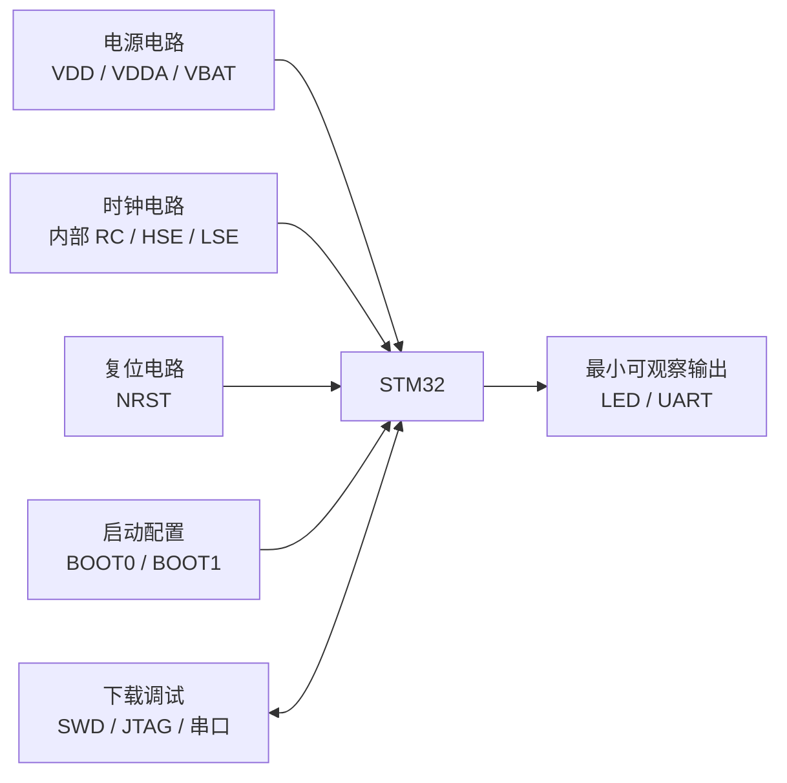

| 组成部分 | 解决的问题 | 缺失或设计错误的表现 |
|---|---|---|
| 电源与去耦 | 为数字、模拟和备份域提供稳定电压 | 芯片不启动、随机复位、ADC 不准 |
| 时钟 | 为 CPU 和外设提供工作节拍 | 主频异常、串口乱码、USB 无法工作 |
| 复位 | 保证上电和异常时回到确定状态 | 上电不稳定、程序无法重新运行 |
| 启动配置 | 决定从 Flash、系统 Bootloader 或 SRAM 启动 | 程序已烧录但不执行 |
| 下载与调试 | 写入程序、设置断点、观察变量 | 无法烧录、无法定位故障 |

### 4.2 电源与去耦电路

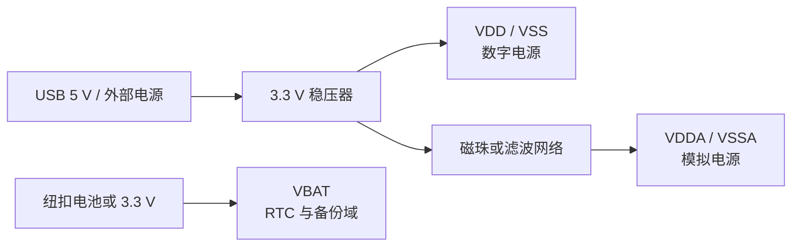

| 电源引脚 | 作用 | 典型连接 | 设计重点 |
|---|---|---|---|
| VDD / VSS | 数字核心与 I/O 供电 | 3.3 V / GND | 每组电源脚附近放置去耦电容 |
| VDDA / VSSA | ADC、PLL、内部 RC 等模拟电路供电 | 3.3 V 经磁珠或 RC/LC 滤波 | 模拟地回路短，远离高频开关信号 |
| VBAT | RTC 和备份寄存器供电 | 纽扣电池；不用备用电源时按手册连接 | 不可悬空，注意电压范围 |

###### ◇ 去耦电容怎么放？

| 电容 | 作用 | 布局要求 |
|---|---|---|
| 0.1 μF 陶瓷电容 | 滤除高频电源噪声 | 每组 VDD/VSS 就近放置，走线短而宽 |
| 1～10 μF 电容 | 提供低频储能，稳定电源 | 放在芯片电源入口或稳压器输出附近 |
| 稳压器输入/输出电容 | 保证稳压器稳定工作 | 容值和 ESR 按稳压器数据手册选择 |

> 电容值只是常见参考，最终必须以所用 STM32 和稳压器的数据手册为准。

### 4.3 复位电路

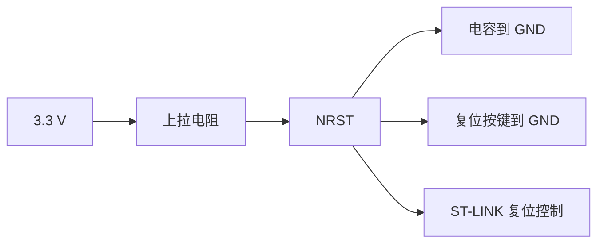

| 复位来源 | 触发条件 | 作用 |
|---|---|---|
| 上电复位 POR/PDR | 电源上升或下降越过阈值 | 保证电压稳定后开始运行 |
| NRST 外部复位 | 按键、调试器或外部电路拉低 NRST | 重新启动整个系统 |
| 看门狗复位 | 程序未按时喂狗 | 程序跑飞时自动恢复 |
| 软件复位 | 程序写入系统控制寄存器 | 由软件主动重新启动 |

> 常见开发板会为 NRST 配置上拉、按键和电容，但阻值、电容值和连接方式应参考对应芯片的硬件设计指南。

### 4.4 时钟电路

| 时钟方案 | 是否需要外部器件 | 优点 | 适合场景 |
|---|---|---|---|
| HSI 内部高速 RC | 不需要 | 成本低、启动快、最小系统简单 | 一般控制、对精度要求不高 |
| HSE 外部高速晶振 | 晶振与负载电容 | 精度和稳定性较高 | 精确通信、USB、稳定主频 |
| LSI 内部低速 RC | 不需要 | 成本低 | 独立看门狗 |
| LSE 32.768 kHz 晶振 | 晶振与负载电容 | 低功耗、适合精确计时 | RTC 实时时钟 |

###### ◇ 为什么 LSE 常用 32.768 kHz？

```text
32 768 Hz = 2¹⁵ Hz
经过 15 次二分频后：32 768 ÷ 2¹⁵ = 1 Hz
```

因此可以用简单的二进制计数器得到每秒一次的时钟信号。

###### ◇ 晶振布局注意事项

| 要点 | 原因 |
|---|---|
| 晶振靠近 MCU 引脚 | 减小走线寄生参数和干扰 |
| 两根晶振走线短、对称 | 提高振荡稳定性 |
| 负载电容按晶振参数计算 | 不能对所有晶振固定使用同一电容值 |
| 晶振区域远离高速与大电流信号 | 降低串扰和电磁干扰 |

### 4.5 启动模式


| BOOT 配置 | 启动位置 | 典型用途 |
|---|---|---|
| 主 Flash | 用户程序 | 产品正常运行 |
| 系统存储器 | ST 内置 Bootloader | 通过 UART、USB 等方式下载程序，具体接口因型号而异 |
| SRAM | 片上 SRAM | 调试或特殊启动场景 |

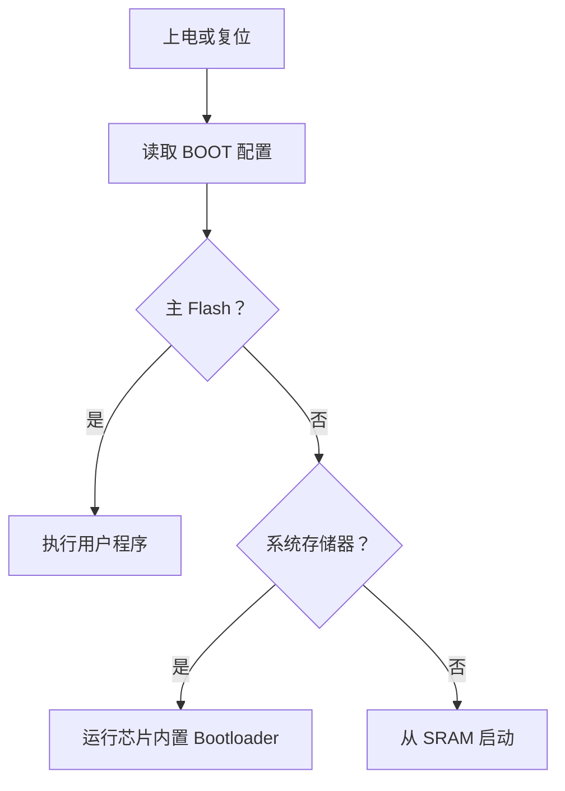

> 正常运行时应从主 Flash 启动。若 BOOT0 电平配置错误，程序即使已经烧入 Flash，也可能不会执行。

### 4.6 下载与调试接口

| 方式 | 主要信号 | 能否在线调试 | 适合场景 |
|---|---|---|---|
| SWD | SWDIO、SWCLK、GND、参考电压，可选 NRST/SWO | 可以 | STM32 最常用下载与调试方式 |
| JTAG | TMS、TCK、TDI、TDO 等 | 可以 | 边界扫描、复杂调试链 |
| 串口 Bootloader | UART TX/RX、BOOT0、NRST | 通常不能像 SWD 一样断点调试 | 量产下载、现场升级 |
| USB Bootloader | USB D+/D-，取决于芯片 Bootloader 支持 | 通常用于下载升级 | 无调试器升级 |

###### ◇ SWD 最小连接

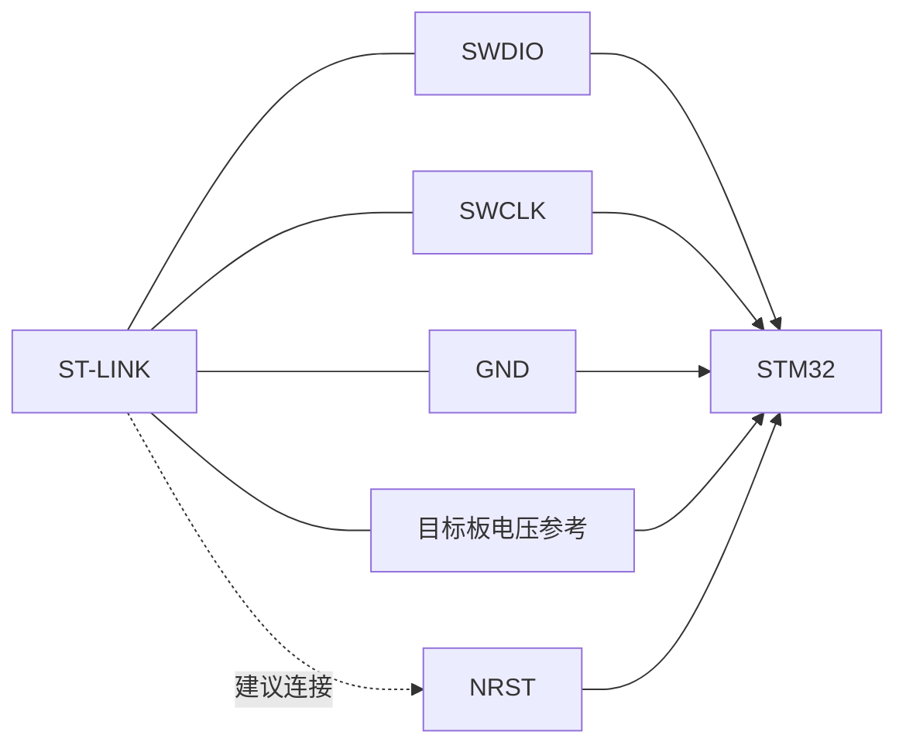

### 4.7 一键下载电路

> 一键下载是利用 USB 转串口芯片的控制信号自动改变 BOOT0 和 NRST，使芯片进入 Bootloader；下载结束后再自动返回主 Flash 启动。

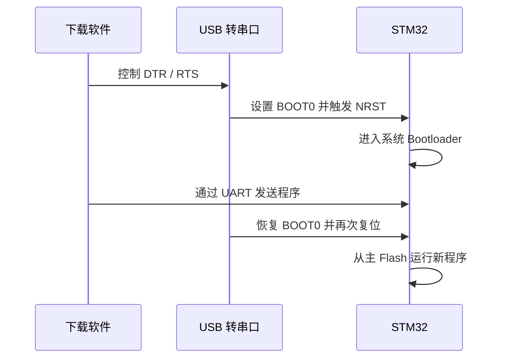

| 优点 | 注意事项 |
|---|---|
| 不需要手动切换 BOOT0 跳线 | DTR/RTS 逻辑必须与下载软件匹配 |
| 适合频繁下载和小批量生产 | 仍建议保留 SWD，便于断点调试和故障恢复 |
| 可与 USB 转串口功能复用 | 电平转换、复位脉冲和启动时序要可靠 |

### 4.8 最小系统上电运行流程

```mermaid
flowchart TD
    P[电源上升] --> POR[POR/PDR 保持系统复位]
    POR --> READY{电源达到稳定阈值？}
    READY -->|否| POR
    READY -->|是| RELEASE[释放复位<br/>CPU 先使用复位后的默认时钟]
    RELEASE --> BOOT[采样 BOOT 配置<br/>确定启动存储器]

    BOOT --> SELECT{启动位置}
    SELECT -->|主 Flash| USER[用户 Flash 映射到启动地址]
    SELECT -->|系统存储器| ROM[执行 ST 内置 Bootloader]
    SELECT -->|SRAM| RAM[从 SRAM 启动<br/>需准备有效向量表与程序]

    USER --> VECTOR[读取向量表前两个字]
    RAM --> VECTOR
    VECTOR --> MSP[第 1 个字装载到 MSP<br/>主栈指针]
    MSP --> PC[第 2 个字装载到 PC<br/>进入 Reset_Handler]
    PC --> STARTUP[执行启动文件中的 Reset_Handler]
    STARTUP --> INIT[系统与 C 运行环境初始化]
    INIT --> MAIN[调用 main()]
    MAIN --> APP[初始化外设并执行应用任务]
```

##### ◆ 用户程序启动时，各阶段做什么？

| 阶段 | 执行内容 | 关键说明 |
|---|---|---|
| 上电复位 | POR/PDR 在电压未稳定时保持复位 | 防止 CPU 在电源不稳定时执行错误指令 |
| 释放复位 | CPU 使用芯片复位后的默认时钟开始工作 | STM32F103 复位后通常先使用 HSI，而不是立即使用外部晶振或 PLL |
| 选择启动位置 | 根据 BOOT 配置选择主 Flash、系统存储器或 SRAM | 正常产品通常从主 Flash 启动 |
| 读取向量表 | 读取初始 MSP 和复位处理函数地址 | Cortex-M 硬件自动完成这两个装载动作 |
| `Reset_Handler` | 执行启动文件中的复位处理程序 | 它是用户程序真正的入口，而不是直接进入 `main()` |
| 系统初始化 | 执行 `SystemInit()` 等系统配置 | 可配置时钟、向量表、FPU 等；具体内容由芯片和工程决定 |
| C 运行环境初始化 | 复制 `.data`、清零 `.bss`，准备堆和栈 | 有初值变量复制到 SRAM，未初始化变量清零 |
| 进入 `main()` | 开始执行用户 C 程序 | 通常继续初始化 GPIO、串口、定时器等外设 |

> `SystemInit()` 与 `.data/.bss` 初始化的先后顺序可能因编译器、启动文件和工程模板不同而略有差异，但都发生在进入 `main()` 之前。

##### ◆ 向量表最前面的两个数据

| 向量表位置 | 内容 | CPU 的动作 |
|---|---|---|
| 启动地址 `+0x00` | 初始主栈指针值 | 装载到 MSP |
| 启动地址 `+0x04` | `Reset_Handler` 地址 | 装载到 PC 并开始执行 |

```text
上电后不是直接执行 main()

向量表 → MSP → Reset_Handler → 系统/C环境初始化 → main()
```

### 4.9 原理图检查表

| 检查对象 | 检查内容 |
|---|---|
| 电源 | 所有 VDD、VDDA、VBAT 和地引脚连接正确 |
| 去耦 | 每组电源脚附近有去耦电容，储能电容位置合理 |
| 复位 | NRST 上拉、按键和调试器连接正确 |
| 时钟 | 内部/外部时钟方案明确，晶振与负载电容匹配 |
| 启动 | BOOT 引脚具有确定电平，不悬空 |
| SWD | SWDIO、SWCLK、GND、VREF、NRST 已预留 |
| 可观察输出 | 至少预留 LED 或 UART，便于验证程序运行 |
| 引脚复用 | 调试口、晶振和启动脚没有与其他功能冲突 |

---

## 5 开发环境与工程准备

### 5.1 IDE 选择与调试配置

#### 5.1.1 IDE选择

> IDE 不是编译器，也不是调试器。它是把代码编辑、工程管理、编译、下载和调试组织在一起的开发界面。

##### ◆ 一套嵌入式开发环境由什么组成？

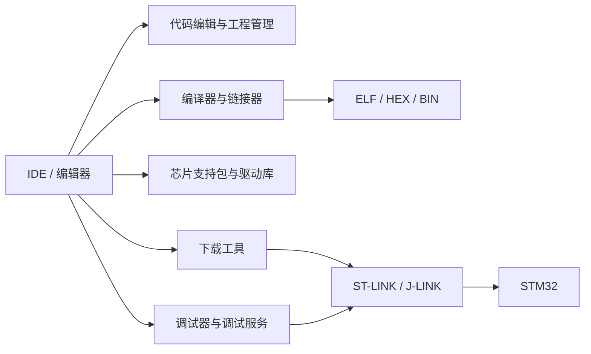

| 组成部分 | 作用 | 常见选择 |
|---|---|---|
| 编辑器 / IDE | 编写代码、管理工程、查看错误 | Keil、STM32CubeIDE、VS Code |
| 编译器 | 将 C/C++ 转换为机器指令 | Arm Compiler、GCC、Clang |
| 构建工具 | 决定哪些文件参与编译和链接 | IDE 工程、Make、CMake |
| 芯片支持 | 启动文件、头文件、链接脚本、驱动库 | CMSIS、STM32Cube 固件包 |
| 下载调试工具 | 烧录程序、断点、单步、查看变量 | ST-LINK、J-LINK、OpenOCD |

##### ◆ 常用开发工具对比

| 对比项 | Keil MDK | STM32CubeIDE | VS Code + 工具链 |
|---|---|---|---|
| 定位 | 一体化商业嵌入式 IDE | ST 官方免费一体化 IDE | 通用编辑器组合式开发环境 |
| 主要平台 | Windows | Windows、Linux、macOS | Windows、Linux、macOS |
| 工程配置 | 图形化工程选项，传统工程结构 | 与 STM32CubeMX 配合紧密 | Make/CMake、插件或外部生成工程 |
| 编译工具 | Arm Compiler，也可配置其他工具链 | GCC 工具链 | GCC、Clang 或厂商工具链 |
| 代码提示 | 基本完善 | 较完善 | 插件丰富、代码导航能力强 |
| 下载调试 | 集成度高，断点与外设观察方便 | 集成 ST-LINK 调试 | 需要配置 Cortex-Debug、OpenOCD 等 |
| STM32 配置生成 | 通常配合独立 STM32CubeMX | 内置 CubeMX 配置能力 | 通常配合 CubeMX 或脚本 |
| 学习成本 | 较低，传统教学资料多 | 较低，一站式流程清晰 | 较高，需要理解工具链和构建系统 |
| 适合场景 | 教学、传统项目、深入在线调试 | STM32 新项目、快速原型、HAL 开发 | 跨平台、大型工程、团队协作与自动化 |

> VS Code 本身只是编辑器。要完成 STM32 开发，还需要编译器、构建工具、芯片包、下载器和调试服务。

##### ◆ 按学习阶段选择

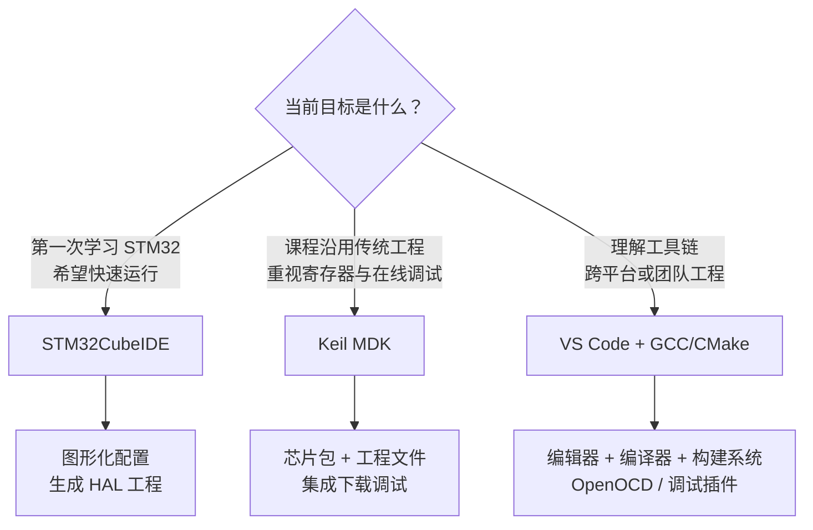

| 学习阶段 | 推荐方式 | 学习重点 |
|---|---|---|
| 入门阶段 | STM32CubeIDE 或课程指定的 Keil | 完成编译、下载、断点和串口输出 |
| 外设学习阶段 | Keil / CubeIDE 均可 | 理解寄存器、HAL 与外设工作原理 |
| 工程阶段 | 根据团队选择 Keil、CubeIDE 或 VS Code | 工程结构、版本管理、构建与自动化 |
| 跨厂商阶段 | VS Code + GCC/CMake 或厂商 IDE | 将 Cortex-M 和外设原理迁移到不同 MCU |

##### ◆ IDE 选择原则

| 选择问题 | 判断依据 |
|---|---|
| 课程是否提供统一模板？ | 优先使用课程模板对应的 IDE，减少环境差异 |
| 是否只开发 STM32？ | STM32CubeIDE 集成度较高 |
| 是否需要成熟的商业调试体验？ | 可选择 Keil MDK |
| 是否需要跨平台和自动构建？ | 可选择 VS Code + GCC/CMake |
| 团队已有哪套工具？ | 优先考虑工程兼容、维护成本和成员经验 |
| 是否准备学习其他厂商 MCU？ | 不要把知识绑定在某一 IDE 的按钮操作上 |

> 学习目标不是记住某个 IDE 的菜单，而是理解完整链路：  
> **源代码 → 编译链接 → 生成固件 → 下载到 Flash → 在线调试。**
#### 5.1.2 调试配置

- ST-Link/V2 调试器驱动
- USB转串口 UART通信驱动
  - 串口下载软件安装

### 5.2 Keil 工程文件建立

> 本节以 STM32F10x 标准外设库工程为例。完整流程为：准备文件 → 创建工程 → 添加分组和源码 → 配置目标参数 → 配置头文件路径 → 编译 → 下载调试。


#### 5.2.1 准备固件库与工程目录

工程目录建议按功能分为 `CMSIS`、`Startup`、`Lib`、`User` 和 `Project`，避免把所有文件放在同一目录。


| 文件夹 | 主要内容 | 文件来源 |
|---|---|---|
| CMSIS | Cortex-M3 内核接口、STM32F10x 设备头文件和系统文件 | `Libraries/CMSIS/CM3` |
| Startup | 与芯片容量型号匹配的启动文件 | `DeviceSupport/ST/STM32F10x/startup/arm` |
| Lib | 标准外设库头文件与源文件 | `Libraries/STM32F10x_StdPeriph_Driver` |
| User | `main.c`、中断处理、配置文件和用户模块 | 标准库模板与用户代码 |
| Project | Keil 工程文件和编译输出 | 新建工程时生成 |

| CMSIS 内核文件 | STM32 设备支持文件 |
|---|---|
|  |  |

| Startup 启动文件 | 标准外设库文件 |
|---|---|
|  |  |

| User 模板文件 |
|---|
|  |

> 启动文件必须与芯片型号和 Flash 容量等级匹配，否则可能出现中断向量不匹配或链接配置错误。

#### 5.2.2 新建工程并选择 MCU

1. 在 Keil 中创建新工程，将工程文件保存在 `Project` 文件夹。
2. 工程名称和路径尽量使用英文、数字和下划线。
3. 在器件列表中选择厂商和准确型号，例如 `STMicroelectronics → STM32F103C8`。
4. 是否使用软件自动添加启动文件，应与本课程的手动工程模板保持一致。

| ① 新建工程 | ② 选择保存位置与工程名称 |
|---|---|
|  |  |

| ③ 选择 MCU 型号 |
|---|
|  |

#### 5.2.3 建立分组并添加文件

Keil 中的 Group 应与硬盘文件夹保持对应，便于查找、迁移和维护。

| Keil 分组 | 应添加的文件 |
|---|---|
| CMSIS | 内核与设备系统源文件 |
| Startup | 当前芯片对应的启动汇编文件 |
| Lib | 项目实际使用的标准外设库 `.c` 文件 |
| User | `main.c`、中断文件和用户功能模块 |

| ① 打开工程文件管理 | ② 创建 Groups |
|---|---|
|  |  |

| ③ Add Files 添加源文件 | ④ 检查分组结果 |
|---|---|
|  |  |

| ⑤ 完整工程结构 |
|---|
|  |

#### 5.2.4 配置 Target 与输出文件

打开 `Options for Target`，重点配置目标参数、外部晶振频率和编译输出。

| 配置项 | 作用 | 检查结果 |
|---|---|---|
| Device | 确认目标 MCU | 与开发板实际芯片一致 |
| Xtal | 告诉调试环境外部晶振频率 | 与板载 HSE 晶振一致 |
| Create HEX File | 生成可用于烧录的 HEX 文件 | 编译后输出目录出现 `.hex` |
| Output Directory | 统一保存目标文件 | 避免编译文件散落在源码目录 |

| ① 打开 Target 设置 | ② 配置晶振频率 |
|---|---|
|  |  |

| ③ 生成 HEX 文件 |
|---|
|  |

#### 5.2.5 配置头文件搜索路径

源文件通过 `#include` 引用头文件时，编译器需要知道头文件所在目录。

```text
Options for Target → C/C++ → Include Paths
```

建议加入：

- `.\CMSIS`
- `.\Lib\inc`
- `.\User`

| ① 打开头文件路径设置 | ② 添加工程目录 |
|---|---|
|  |  |

| ③ 检查完整路径 |
|---|
|  |

> 应添加“目录”，不要逐个添加头文件；工程移动后应优先使用相对路径。

#### 5.2.6 编译并检查工程

| 操作 | 预期结果 |
|---|---|
| Build | 所有源文件完成编译和链接 |
| 查看错误列表 | `0 Error`；警告应逐项判断，不能一律忽略 |
| 查看容量信息 | 检查 Code、RO-data、RW-data、ZI-data |
| 查看输出目录 | 生成 `.axf/.elf`，启用后同时生成 `.hex` |

| ① 编译工程 | ② 查看编译结果 |
|---|---|
|  |  |

#### 5.2.7 配置 ST-LINK 并下载调试

1. 安装 ST-LINK 驱动，并在需要时升级调试器固件。
2. 将 ST-LINK 的 SWDIO、SWCLK、GND 和目标电压参考连接到开发板，建议同时连接 NRST。
3. 在 Keil 的 Debug 页面选择 ST-LINK Debugger。
4. 在 Settings 中选择 SW 接口并确认能够识别目标芯片。
5. 在 Flash Download 中添加与芯片匹配的 Flash Programming Algorithm。
6. 下载程序，进入调试模式验证断点、单步和变量观察。

| ① 升级 ST-LINK 固件 |
|---|
|  |

| ② 打开调试设置 | ③ 选择 ST-LINK |
|---|---|
|  |  |

| ④ 选择 SW 接口 | ⑤ 识别目标芯片 |
|---|---|
|  |  |

| ⑥ Flash Download 设置 | ⑦ 添加 Flash Algorithm |
|---|---|
|  |  |

| ⑧ 下载程序 | ⑨ 查看下载结果 |
|---|---|
|  |  |

| ⑩ 进入调试 | ⑪ 断点与单步运行 |
|---|---|
|  |  |

#### 5.2.8 工程建立检查表

| 检查项 | 合格标准 |
|---|---|
| 芯片型号 | 与开发板上的实际 MCU 完全一致 |
| 启动文件 | 与芯片系列和容量等级匹配 |
| 工程分组 | 与硬盘目录对应，文件归类清晰 |
| 宏定义 | 芯片型号、标准库和工程所需宏正确 |
| Include Paths | CMSIS、库和 User 目录均已加入 |
| 晶振频率 | 与开发板 HSE 实际频率一致 |
| 编译结果 | 无错误，警告已经分析 |
| 固件输出 | ELF/AXF 与 HEX 文件正常生成 |
| ST-LINK | 能识别芯片、擦除、下载和进入调试 |

---

## 6 STM32 开发流程与实现方式

### 6.1 通用开发流程


> 嵌入式开发不是“先写代码，再看能不能运行”，而是一个可验证的工程闭环：  
> **需求 → 设计 → 实现 → 下载 → 观察 → 验证 → 迭代。**

#### 6.1.1 开发流程总览

```mermaid
flowchart LR
    R[1 需求分析] --> H[2 硬件与资料确认]
    H --> D[3 软件设计]
    D --> C[4 配置与编码]
    C --> B[5 编译与下载]
    B --> T[6 调试与测试]
    T --> V{满足需求？}
    V -->|否| A[分析原因并修改]
    A --> D
    V -->|是| O[7 整理与交付]
```

| 阶段 | 核心问题 | 阶段输出 |
|---|---|---|
| 需求分析 | 系统要完成什么功能？性能指标是什么？ | 功能清单、接口清单、时序和性能要求 |
| 硬件确认 | 芯片、引脚和外围电路如何连接？ | 原理图标注、引脚分配表 |
| 软件设计 | 程序分为哪些模块？数据如何流动？ | 模块图、流程图、状态机 |
| 配置与编码 | 时钟、GPIO、外设和中断如何配置？ | 可编译工程和源代码 |
| 编译下载 | 程序能否正确生成并写入 Flash？ | ELF/HEX/BIN 与下载结果 |
| 调试测试 | 实际行为是否满足需求？ | 测试记录、波形、日志和问题清单 |
| 整理交付 | 工程能否复现、维护和升级？ | 版本、文档、固件和发布说明 |

#### 6.1.2 写代码前先确认四件事

| 检查对象 | 需要确认的内容 | 主要资料 |
|---|---|---|
| MCU | 型号、Flash、SRAM、主频、外设资源 | 数据手册 Datasheet |
| 外设原理 | 工作模式、寄存器、时钟、状态标志 | 参考手册 Reference Manual |
| 硬件连接 | 电源、引脚、上拉/下拉、芯片地址、接口电平 | 开发板或产品原理图 |
| 外部器件 | 通信时序、命令格式、初始化要求 | 传感器或模块数据手册 |

> 数据手册告诉我们“芯片有什么、引脚怎么接”；参考手册告诉我们“外设内部怎么工作、寄存器怎么配置”。

#### 6.1.3 从硬件连接推导软件配置

```mermaid
flowchart LR
    SCH[查看原理图] --> PIN[确认 MCU 引脚]
    PIN --> AF[确认 GPIO 模式<br/>与复用功能]
    AF --> BUS[确认外设挂载总线]
    BUS --> CLK[使能 GPIO 与外设时钟]
    CLK --> PARAM[配置速率、周期<br/>地址或工作模式]
    PARAM --> IRQ[配置中断 / DMA]
    IRQ --> API[编写收发与控制接口]
```


| 配置顺序 | 主要工作 | 常见错误 |
|---|---|---|
| 1. 确认引脚 | 检查 GPIO 端口、引脚号和复用功能 | 看错原理图、引脚复用冲突 |
| 2. 确认总线 | 判断外设位于 AHB、APB1 还是 APB2 | 使用错误的总线时钟 |
| 3. 使能时钟 | 打开 GPIO、AFIO 和目标外设时钟 | 忘记开时钟，寄存器配置不生效 |
| 4. 配置 GPIO | 输入、输出、复用、开漏、上下拉 | I²C 未使用开漏、输出速度错误 |
| 5. 配置外设 | 设置波特率、分频、周期、地址等 | 参数与外部器件不匹配 |
| 6. 配置中断/DMA | 设置优先级、通道和缓冲区 | 标志位未清、缓冲区越界 |
| 7. 启动外设 | 使能外设并开始收发或转换 | 初始化顺序错误 |

#### 6.1.4 外设驱动采用分层结构

```mermaid
flowchart TD
    APP[应用层<br/>业务任务与状态机] --> SERVICE[功能层<br/>传感器、电机、显示、通信协议]
    SERVICE --> DRIVER[驱动层<br/>GPIO、UART、I²C、SPI、ADC]
    DRIVER --> HAL[寄存器 / 标准库 / HAL / LL]
    HAL --> HW[STM32 硬件与外围电路]
```

| 层级 | 应该包含什么 | 不应该包含什么 |
|---|---|---|
| 应用层 | 业务流程、状态机、任务调度 | 具体寄存器位操作 |
| 功能层 | 设备命令、数据解析、控制算法 | 与某一引脚强绑定的底层代码 |
| 驱动层 | 外设初始化、收发、状态和错误处理 | 产品业务逻辑 |
| 硬件抽象层 | HAL/LL/寄存器访问 | 设备业务含义 |

分层后，更换传感器、开发方式或 MCU 厂商时，只需要修改相关层，而不必重写整个程序。

#### 6.1.5 编译、下载与最小验证

| 步骤 | 检查内容 | 通过标准 |
|---|---|---|
| 编译 | 语法、头文件、链接、Flash/SRAM 占用 | 无错误，警告已经分析 |
| 下载 | 调试器连接、Flash Algorithm、复位方式 | 固件成功写入并校验 |
| 最小运行 | LED、串口或调试变量 | 能证明 `main()` 正常运行 |
| 单外设测试 | 只测试一个 GPIO、UART、ADC 等功能 | 输入输出与预期一致 |
| 联调 | 按模块逐步组合 | 新增模块后已有功能不被破坏 |

> 不要一开始就运行全部业务。先验证最小程序，再验证单个外设，最后进行系统联调。

#### 6.1.6 调试排查顺序

```mermaid
flowchart LR
    P[电源与地] --> R[复位与 BOOT]
    R --> D[下载调试连接]
    D --> C[系统时钟]
    C --> G[GPIO 与引脚复用]
    G --> PER[外设配置]
    PER --> IRQ[中断 / DMA]
    IRQ --> LOGIC[业务逻辑]
```

| 现象 | 优先检查 |
|---|---|
| 调试器找不到芯片 | 供电、GND、SWDIO、SWCLK、NRST、BOOT |
| 程序烧录成功但不运行 | 启动模式、复位向量、时钟、HardFault |
| 串口乱码 | 时钟、波特率、TX/RX、电平和共地 |
| I²C 无应答 | 地址、上拉电阻、开漏模式、时序 |
| ADC 数值不准 | VDDA/VREF、采样时间、输入阻抗、接地 |
| 中断不进入 | 中断使能、NVIC、标志位和优先级 |
| DMA 数据异常 | 通道映射、方向、长度、数据宽度、缓冲区 |

#### 6.1.7 开发完成检查表

- [ ] 功能需求均有对应测试结果。
- [ ] 引脚分配、时钟和外设配置与原理图一致。
- [ ] Flash、SRAM、栈和缓冲区占用留有余量。
- [ ] 异常输入、超时、通信失败和复位场景已经测试。
- [ ] 调试日志可以关闭或调整等级。
- [ ] 工程可以在另一台电脑上重新编译。
- [ ] 源代码、固件、版本和测试记录已经归档。

### 6.2 寄存器开发

#### 6.2.1 核心概念：存储器映射 I/O

> STM32 把 Flash、SRAM 和外设寄存器统一编入 CPU 的地址空间。  
> CPU 访问某个地址时，片上总线根据地址范围把操作送到对应的存储器或外设。


```mermaid
flowchart LR
    CODE[C 代码<br/>写入某个地址] --> CPU[CPU 执行 STR 写指令]
    CPU --> BUS[AHB 系统总线<br/>传送地址、数据和读写信号]
    BUS --> DEC{地址译码}
    DEC -->|Flash 地址范围| FLASH[Flash 控制器]
    DEC -->|SRAM 地址范围| SRAM[SRAM]
    DEC -->|0x4000_0000 起<br/>外设地址范围| BRIDGE[AHB/APB 桥]
    BRIDGE --> RCC[RCC 寄存器]
    BRIDGE --> GPIO[GPIO 寄存器]
    BRIDGE --> UART[USART 寄存器]
    GPIO --> CIRCUIT[输出驱动电路]
    CIRCUIT --> PIN[引脚电平变化]
```

这就是“操作地址等于操作硬件”的原因：

1. 地址被映射到某个外设寄存器。
2. CPU 对地址执行读或写操作。
3. 总线译码器选择对应外设。
4. 写入值进入外设内部寄存器。
5. 寄存器中的位直接控制时钟门、输出驱动、定时器、串口等硬件电路。

#### 6.2.2 相同的“地址访问”，结果为什么不同？

| 地址指向 | 写入后的结果 |
|---|---|
| SRAM | 数据保存在存储单元中，供程序以后读取 |
| Flash | 不能像 SRAM 一样直接普通写入，需要解锁、擦除和编程流程 |
| RCC 使能寄存器 | 打开或关闭某个外设的时钟门 |
| GPIO 配置寄存器 | 改变引脚输入、输出、复用和速度模式 |
| GPIO 输出寄存器 | 改变输出锁存器，最终改变引脚电平 |
| USART 数据寄存器 | 触发串口发送或读取接收数据 |
| 状态寄存器 | 某些位由硬件自动更新，读取或写入还可能清除标志 |

> 外设寄存器不是普通 RAM。不同位可能是只读、只写、读写、写 1 清零或保留位，必须按照参考手册规定操作。

#### 6.2.3 地址是怎样计算出来的？

寄存器地址通常由“外设基地址 + 寄存器偏移量”得到。

```mermaid
flowchart LR
    PB[GPIOB 基地址<br/>0x40010C00] --> ADD[加 CRL 偏移<br/>0x00]
    ADD --> CRL[GPIOB_CRL<br/>0x40010C00]

    RB[RCC 基地址<br/>0x40021000] --> ADD2[加 APB2ENR 偏移<br/>0x18]
    ADD2 --> ENR[RCC_APB2ENR<br/>0x40021018]

    PB --> ADD3[加 ODR 偏移<br/>0x0C]
    ADD3 --> ODR[GPIOB_ODR<br/>0x40010C0C]
```

| 外设/寄存器 | 基地址 | 偏移量 | 最终地址 |
|---|---:|---:|---:|
| RCC_APB2ENR | `0x40021000` | `0x18` | `0x40021018` |
| GPIOB_CRL | `0x40010C00` | `0x00` | `0x40010C00` |
| GPIOB_ODR | `0x40010C00` | `0x0C` | `0x40010C0C` |
| GPIOB_BSRR | `0x40010C00` | `0x10` | `0x40010C10` |

> 地址、偏移量和寄存器位定义必须查阅对应芯片的参考手册，不能从其他型号照搬。

#### 6.2.4 C 语言如何向寄存器地址写数据？

```c
#include <stdint.h>

#define RCC_APB2ENR_ADDR  0x40021018UL

*(volatile uint32_t *)RCC_APB2ENR_ADDR |= (1UL << 3);
```

| 代码片段 | 含义 |
|---|---|
| `0x40021018UL` | RCC_APB2ENR 寄存器地址 |
| `(uint32_t *)` | 将这个数解释成“指向 32 位数据的指针” |
| `volatile` | 每次都真正访问硬件，禁止编译器省略或缓存该访问 |
| `*` | 访问指针指向的寄存器 |
| `1UL << 3` | 产生第 3 位为 1 的位掩码 |
| `|=` | 只把目标位置 1，尽量保留其他位 |

```mermaid
flowchart LR
    SRC[高级 C 表达式] --> ASM[编译为 LOAD / OR / STORE]
    ASM --> LOAD[读取 RCC_APB2ENR]
    LOAD --> OR[将第 3 位置 1]
    OR --> STORE[写回 0x40021018]
    STORE --> GATE[GPIOB 时钟门打开]
```

##### ◆ 为什么必须使用 `volatile`？

```c
volatile uint32_t *reg = (volatile uint32_t *)0x40021018UL;
```

外设寄存器可能被硬件自动改变，也可能每次读写都产生硬件动作。`volatile`告诉编译器：

- 不要认为寄存器值始终不变。
- 不要省略看似重复的读写。
- 不要只使用 CPU 寄存器中的旧值代替真正的硬件访问。

`volatile`不能保证多线程安全，也不能自动保证操作的原子性；它只约束编译器对访问的优化。

#### 6.2.5 示例：通过寄存器控制 PB0 LED


完整链路分为三步：

```mermaid
flowchart LR
    CLK[1 打开 GPIOB 时钟<br/>RCC_APB2ENR.IOPBEN = 1]
    MODE[2 配置 PB0 模式<br/>GPIOB_CRL.CNF0/MODE0]
    OUT[3 设置 PB0 电平<br/>GPIOB_BSRR]
    LED[4 输出驱动电路改变<br/>LED 亮或灭]
    CLK --> MODE --> OUT --> LED
```

##### ◆ 第一步：打开 GPIOB 时钟


```c
RCC->APB2ENR |= RCC_APB2ENR_IOPBEN;
```

| 操作 | 硬件结果 |
|---|---|
| APB2ENR 第 3 位置 1 | RCC 打开 GPIOB 的 APB2 时钟门 |
| GPIOB 获得时钟 | GPIOB 寄存器和内部逻辑可以正常工作 |

> 如果没有使能外设时钟，即使向 GPIOB 配置寄存器写入数据，外设也可能没有任何响应。

##### ◆ 第二步：配置 PB0 为通用推挽输出


STM32F103 的 `GPIOB_CRL`控制 PB0～PB7，每个引脚占 4 位：

```text
PB0 对应 CRL[3:0]

CNF0[1:0]  = 00：通用推挽输出
MODE0[1:0] = 10：输出模式，最高 2 MHz（示例）
```

```c
GPIOB->CRL &= ~(GPIO_CRL_CNF0 | GPIO_CRL_MODE0);  // 清除 PB0 的 4 位旧配置
GPIOB->CRL |=  GPIO_CRL_MODE0_1;                  // MODE0 = 10
```

不能直接使用：

```c
GPIOB->CRL = 0x2;
```

因为直接赋值会同时覆盖 PB1～PB7 的配置。安全做法是先清除目标位，再写入新值。

##### ◆ 第三步：使用 BSRR 原子地改变 PB0 电平


```c
GPIOB->BSRR = GPIO_BSRR_BS0;  // PB0 输出高电平
GPIOB->BSRR = GPIO_BSRR_BR0;  // PB0 输出低电平
```

| BSRR 写入位置 | 硬件动作 |
|---|---|
| 低 16 位写 1 | 对应 GPIO 引脚置 1 |
| 高 16 位写 1 | 对应 GPIO 引脚清 0 |
| 写 0 | 对应引脚不受影响 |

BSRR 适合置位/复位单个引脚，不需要“读—修改—写”，因此比直接修改 ODR 更适合中断或并发场景。

> LED 是高电平点亮还是低电平点亮，取决于原理图中 LED 与电源、限流电阻和 GPIO 的连接方式。

#### 6.2.6 从裸地址到 CMSIS 寄存器定义

下面三种写法最终都在访问同一个硬件寄存器：

```c
/* 1. 直接使用裸地址：最接近硬件，但可读性差 */
*(volatile uint32_t *)0x40021018UL |= (1UL << 3);

/* 2. 使用基地址和结构体：寄存器结构更清晰 */
RCC->APB2ENR |= (1UL << 3);

/* 3. 使用 CMSIS/厂商位定义：可读性最好 */
RCC->APB2ENR |= RCC_APB2ENR_IOPBEN;
```

```mermaid
flowchart LR
    RAW[裸地址<br/>0x40021018] --> STRUCT[结构体成员<br/>RCC->APB2ENR]
    STRUCT --> MASK[位定义<br/>RCC_APB2ENR_IOPBEN]
    RAW --> SAME[同一个地址<br/>同一个寄存器<br/>同一个硬件动作]
    STRUCT --> SAME
    MASK --> SAME
```

CMSIS 头文件没有改变硬件原理，只是把难记的地址和位编号变成了可读的名称。

#### 6.2.7 寄存器操作的常见错误

| 错误 | 后果 | 正确做法 |
|---|---|---|
| 忘记打开外设时钟 | 寄存器配置不生效 | 先在 RCC 中使能对应时钟 |
| 直接给共享寄存器整体赋值 | 破坏其他引脚或功能的配置 | 使用位掩码进行读—修改—写 |
| 未使用 `volatile` | 编译器可能省略或合并硬件访问 | 使用 CMSIS 的 `__IO` 或 `volatile` |
| 写入保留位 | 产生不可预测行为或兼容性问题 | 只修改手册允许的位 |
| 混淆只读/只写/写 1 清零 | 无法清标志或误触发硬件动作 | 查看寄存器访问属性 |
| 地址或偏移量使用错误 | 操作错误外设，甚至触发总线错误 | 从当前芯片参考手册核对 |
| 使用 ODR 修改单个引脚 | 读改写期间可能受中断影响 | 优先使用 BSRR 原子置位/清零 |
| 认为写寄存器后立即完成 | 忽略硬件状态和等待时间 | 查询状态位、超时和错误标志 |

#### 6.2.8 寄存器开发的价值与局限

| 优势 | 局限 |
|---|---|
| 能看清外设底层工作机制 | 需要频繁查阅参考手册 |
| 控制精确，抽象层开销小 | 开发和调试时间较长 |
| 有利于分析时序和性能问题 | 代码与具体芯片耦合，移植困难 |
| 适合驱动开发和关键路径优化 | 位操作错误容易影响其他硬件功能 |

推荐学习方式：

1. 先用寄存器理解时钟、GPIO、中断和数据通路。
2. 再使用 HAL、LL 或标准库提高工程效率。
3. 遇到性能、时序或驱动问题时，回到寄存器和参考手册分析。


### 6.3 标准库开发

- 本质
  - 通过C语言实现面向对象的封装，便于用户操作
- 特点
  - 直接封装寄存器
    - 通过结构体指针映射寄存器，提供更底层的硬件控制
  - 轻量级
    - 相比HAL库，代码体积更小，执行效率接近直接操作寄存器
  - 代码风格统一
    - 函数命名清晰（如GPIO_Init()，USART_SendData()），便于记忆。
  - 兼容性局限
    - 仅支持旧型号芯片（如STM32F1xx系列），新系列（F4/F7/H7）不再更新
- 工具
  - 库函数手册
- 标准库开发流程（LED案例）

### 6.4 HAL 库开发

> HAL（Hardware Abstraction Layer）通过统一的函数接口封装底层寄存器操作，使开发者能够把更多精力放在设备功能和业务逻辑上。

#### 6.4.1 HAL 的分层结构


```mermaid
flowchart TD
    APP[应用层<br/>业务逻辑、状态机、协议] --> DEVICE[设备驱动层<br/>LED、传感器、显示、电机]
    DEVICE --> HAL[STM32 HAL 驱动层<br/>初始化、收发、中断、DMA]
    HAL --> CMSIS[CMSIS 与设备头文件<br/>寄存器结构、内核接口]
    CMSIS --> REG[STM32 寄存器与硬件]
```

| 层级 | 主要内容 | 示例 |
|---|---|---|
| 应用层 | 产品功能与业务流程 | 数据处理、状态机、通信协议 |
| 设备驱动层 | 对具体器件进行封装 | LED、温湿度传感器、OLED |
| HAL 驱动层 | 对 STM32 外设进行抽象 | `HAL_GPIO_WritePin()`、`HAL_UART_Transmit()` |
| CMSIS/寄存器层 | Cortex-M 与芯片底层定义 | `GPIO_TypeDef`、NVIC、寄存器位 |

> CMSIS 是 ARM 面向 Cortex-M 制定的软件接口标准；HAL 是 ST 针对 STM32 外设提供的驱动抽象。两者层级和作用不同。

#### 6.4.2 HAL 的核心机制

| 机制 | 作用 | 示例 |
|---|---|---|
| 统一 API | 不同 STM32 系列采用相近的外设操作方式 | `HAL_UART_Transmit()` |
| Handle 句柄 | 保存外设实例、配置、状态、DMA 和错误信息 | `UART_HandleTypeDef` |
| 状态管理 | 防止外设在忙状态下重复启动 | `HAL_BUSY` |
| 返回值 | 明确函数执行结果 | `HAL_OK`、`HAL_ERROR`、`HAL_TIMEOUT` |
| 回调函数 | 在中断或 DMA 完成时通知应用 | `HAL_UART_RxCpltCallback()` |
| MSP 初始化 | 配置底层时钟、GPIO、DMA 和中断 | `HAL_UART_MspInit()` |

```mermaid
flowchart LR
    APP[应用调用 HAL API] --> HANDLE[读取外设 Handle]
    HANDLE --> CHECK{状态允许？}
    CHECK -->|否| BUSY[返回 HAL_BUSY]
    CHECK -->|是| CONFIG[配置寄存器并启动硬件]
    CONFIG --> IRQ[中断 / DMA 完成]
    IRQ --> CALLBACK[执行回调函数]
```

#### 6.4.3 准备 CubeMX 与芯片固件包

使用 STM32CubeMX 或 STM32CubeIDE 前，需要安装对应 STM32 系列的固件包。固件包包含 HAL/LL 驱动、CMSIS、启动文件、例程和中间件。

| ① 进入 CubeMX | ② 打开固件包管理 |
|---|---|
|  |  |

| ③ 选择并安装芯片支持包 | ④ 确认安装成功 |
|---|---|
|  |  |

> 软件版本、账号登录和运行环境可能随安装包更新而变化，课堂应以当前安装界面和官方安装说明为准。

#### 6.4.4 新建工程并选择准确型号

| ① 新建 MCU 工程 | ② 选择目标芯片型号 |
|---|---|
|  |  |

选择型号时应核对：

| 参数 | 检查内容 |
|---|---|
| Part Number | 与开发板芯片丝印完全一致 |
| Package | 封装和引脚数量一致 |
| Flash / SRAM | 容量满足程序与运行数据需求 |
| 外设资源 | GPIO、ADC、定时器和通信接口足够 |

#### 6.4.5 CubeMX 参数配置界面

CubeMX 的配置顺序建议为：**引脚 → 系统调试 → 时钟源 → 外设参数 → 时钟树 → 中断/DMA → 工程设置。**

| ① Pinout 引脚界面 | ② System Core 配置 |
|---|---|
|  |  |

| ③ 外设参数配置 | ④ Clock Configuration |
|---|---|
|  |  |

| ⑤ Project Manager |
|---|
|  |

#### 6.4.6 配置调试、时钟与 GPIO

##### ◆ 保留 SWD 调试接口

在 `System Core → SYS → Debug` 中选择 `Serial Wire`，避免 CubeMX 将 SWDIO/SWCLK 当作普通 GPIO 使用。

| Debug 参数 |
|---|
|  |

> 如果工程关闭了 SWD 并重新配置了调试引脚，程序下载后可能导致后续连接困难。通常可通过 Connect Under Reset、BOOT 配置或全片擦除恢复，但教学工程应始终保留 Serial Wire。

##### ◆ 选择 RCC 时钟源

| ① RCC 时钟源配置 | ② 时钟参数检查 |
|---|---|
|  |  |

##### ◆ 配置 GPIO

| ① 选择目标引脚 | ② 设置 GPIO 功能 |
|---|---|
|  |  |

| ③ 检查引脚名称 | ④ 设置输出模式与初始电平 |
|---|---|
|  |  |

| GPIO 参数 | 需要确认 |
|---|---|
| Mode | 输入、输出、复用、模拟或外部中断 |
| Pull | 无上下拉、上拉或下拉 |
| Output Level | 上电初始化后的输出电平 |
| Speed | 输出翻转速度，不等同于 CPU 主频 |
| User Label | 为引脚设置可读名称，如 `LED1` |

#### 6.4.7 工程设置与代码生成

| ① 设置工程名称与路径 | ② 选择目标 IDE |
|---|---|
|  |  |

| ③ 设置代码生成选项 | ④ 执行 Generate Code |
|---|---|
|  |  |

| ⑤ 打开生成的工程 | ⑥ 查看工程目录 |
|---|---|
|  |  |

生成后的 `main()` 通常具有以下基本结构：

```c
int main(void)
{
    HAL_Init();             // 初始化 HAL、SysTick 等基础功能
    SystemClock_Config();   // 配置系统时钟
    MX_GPIO_Init();         // 初始化 CubeMX 配置的 GPIO

    while (1)
    {
        /* 用户任务 */
    }
}
```

> 用户代码应写在 CubeMX 生成的 `USER CODE BEGIN/END` 区域，避免重新生成代码时被覆盖。

#### 6.4.8 使用 HAL 构建 LED 驱动

建议将设备驱动放在独立目录中，例如：

```text
Hardware/
└─ led/
   ├─ led.h
   └─ led.c
```

| ① 创建 Hardware 目录 | ② 创建 led 模块 |
|---|---|
|  |  |

| ③ 将模块加入工程 |
|---|
|  |

`led.h`：

```c
#ifndef LED_H
#define LED_H

#include "main.h"

void LED_On(GPIO_TypeDef *port, uint16_t pin);
void LED_Off(GPIO_TypeDef *port, uint16_t pin);
void LED_Toggle(GPIO_TypeDef *port, uint16_t pin);

#endif
```

`led.c`：

```c
#include "led.h"

/* 示例按低电平点亮设计；实际电平必须根据原理图确定。 */
void LED_On(GPIO_TypeDef *port, uint16_t pin)
{
    HAL_GPIO_WritePin(port, pin, GPIO_PIN_RESET);
}

void LED_Off(GPIO_TypeDef *port, uint16_t pin)
{
    HAL_GPIO_WritePin(port, pin, GPIO_PIN_SET);
}

void LED_Toggle(GPIO_TypeDef *port, uint16_t pin)
{
    HAL_GPIO_TogglePin(port, pin);
}
```

`main.c` 用户循环：

```c
while (1)
{
    LED_Toggle(LED1_GPIO_Port, LED1_Pin);
    HAL_Delay(200);
}
```

#### 6.4.9 HAL 开发的优势与局限

| 对比项 | HAL 的表现 |
|---|---|
| 开发效率 | 高，CubeMX 可生成初始化代码 |
| 可读性 | API 语义清晰，适合团队协作 |
| 移植性 | STM32 系列间接口相近，但并非无需修改即可移植 |
| 代码体积 | 通常比直接寄存器或 LL 更大 |
| 执行效率 | 状态检查和通用封装会带来一定开销 |
| 调试难度 | 应用开发简单，但深入问题仍需查看寄存器与 HAL 源码 |
| 适用场景 | 快速原型、复杂外设、团队项目和大多数通用产品 |

推荐原则：

- 普通业务与外设功能优先使用 HAL，提高开发效率。
- 对时间敏感或高频执行路径，可使用 LL 或寄存器优化。
- 无论使用 HAL 还是寄存器，都要理解时钟、GPIO、中断、DMA 和数据通路。

#### 6.4.10 HAL、标准库与寄存器开发对比

```mermaid
flowchart TD
    HW[STM32 硬件寄存器] --> REG[寄存器开发<br/>直接操作寄存器位]
    HW --> SPL[标准外设库 SPL<br/>函数封装寄存器]
    HW --> HAL[HAL 库<br/>句柄、状态机与统一 API]
    HAL --> CUBE[CubeMX / CubeIDE<br/>图形化配置与代码生成]
```

| 对比维度 | 寄存器开发 | 标准外设库 SPL | HAL 库 |
|---|---|---|---|
| 抽象层级 | 最低，直接操作地址和寄存器位 | 中等，用函数封装寄存器 | 较高，用句柄、状态机和统一 API 封装外设 |
| 学习重点 | 地址、寄存器、位操作、硬件时序 | 外设库函数与寄存器关系 | 外设配置、Handle、回调、中断和 DMA |
| 开发效率 | 低，需要逐项查手册和配置 | 中等，减少重复寄存器操作 | 高，可结合 CubeMX 生成初始化代码 |
| 代码可读性 | 取决于宏和封装，裸地址写法较差 | 函数名称清晰，结构直观 | API 统一，工程结构较完整 |
| 执行效率 | 最高，可精确控制每一次访问 | 较高，封装开销较小 | 通用检查和状态管理会产生一定开销 |
| 代码体积 | 最小 | 较小 | 通常较大 |
| 跨型号迁移 | 较差，寄存器差异需要手动适配 | 同一系列内较方便，跨系列能力有限 | STM32 系列间接口较统一，迁移相对方便 |
| 错误处理 | 需要开发者自行设计 | 主要依靠返回状态和手动判断 | 提供状态值、错误码、超时和回调机制 |
| 中断与 DMA | 完全由开发者配置 | 提供基础库函数 | 句柄与回调机制较完整 |
| 图形化配置 | 不支持 | 通常不依赖 CubeMX | 与 CubeMX、CubeIDE 紧密结合 |
| 调试透明度 | 高，容易对应到寄存器 | 较高，可跟踪库函数到底层 | 抽象较深，复杂问题需进入 HAL 源码和寄存器分析 |
| 生态现状 | 所有芯片都可以使用 | 主要用于 STM32F1 等较早的标准库项目 | STM32Cube 生态中的主流通用开发方式 |
| 适用场景 | 教学底层原理、驱动开发、极致优化 | 维护历史项目、学习早期 STM32 工程 | 新项目、快速原型、复杂外设和团队开发 |

##### ◆ HAL 相比寄存器开发的主要优势

| HAL 优势 | 给项目带来的价值 |
|---|---|
| API 语义清晰 | 代码更接近“发送、接收、启动转换”等功能描述 |
| 自动生成初始化代码 | 减少时钟、GPIO、DMA 和中断的重复配置工作 |
| 句柄集中管理状态 | 外设实例、DMA、错误和运行状态组织更清晰 |
| 提供超时与错误返回 | 更容易构建可靠的错误处理流程 |
| 中断与 DMA 回调完整 | 适合非阻塞通信和复杂数据流 |
| STM32 系列接口相近 | 更换同系列或其他 STM32 产品时修改范围较小 |
| 中间件集成方便 | 更容易使用 USB、文件系统、网络和 RTOS |

##### ◆ 为什么有了标准库还需要 HAL 库？

###### ◇ 第一步：标准库解决了寄存器开发的问题

寄存器开发需要开发者查地址、算偏移、配置每一个寄存器位：

```c
RCC->APB2ENR |= (1UL << 3);
GPIOB->CRL   &= ~(0xFUL << 0);
GPIOB->CRL   |=  (0x2UL << 0);
```

标准外设库把常用寄存器配置封装为函数：

```c
RCC_APB2PeriphClockCmd(RCC_APB2Periph_GPIOB, ENABLE);
GPIO_Init(GPIOB, &GPIO_InitStructure);
```

```mermaid
flowchart LR
    REG[寄存器开发<br/>地址与位操作] --> PROBLEM1[代码难读<br/>配置繁琐]
    PROBLEM1 --> SPL[标准外设库 SPL<br/>用函数封装寄存器]
    SPL --> RESULT1[可读性提高<br/>开发速度提升]
```

标准库已经解决了“寄存器太难操作”的问题，但它主要仍是**寄存器函数化**。

###### ◇ 第二步：项目复杂后，标准库还要开发者管理很多事情

| 复杂项目需求 | 使用标准库时通常需要开发者完成 |
|---|---|
| 判断外设是否忙 | 自己设计状态变量 |
| 阻塞操作超时退出 | 自己编写计时和超时逻辑 |
| 中断方式收发 | 自己组织中断状态和数据流程 |
| DMA 传输 | 自己关联外设、DMA 通道和缓冲区 |
| 发生错误 | 自己读取标志并设计错误码 |
| 同一外设多次操作 | 自己避免重复启动和状态冲突 |
| 接入 RTOS 或中间件 | 自己组织驱动与中间件接口 |
| 更换 STM32 系列 | 重新适配库文件、外设差异和工程结构 |

例如标准库可以提供“发送一个字节”和“读取一个标志”的函数，但“发送一段数据、等待完成、处理超时、支持中断/DMA并报告错误”仍需要用户自己组织。

###### ◇ 第三步：HAL 封装的不只是寄存器，而是完整操作流程

```mermaid
flowchart LR
    SPL[标准库<br/>寄存器函数化] --> NEED[更复杂的工程需求]
    NEED --> HANDLE[需要保存外设状态]
    NEED --> TIMEOUT[需要超时与错误处理]
    NEED --> ITDMA[需要中断与 DMA 流程]
    NEED --> PORT[需要跨系列统一接口]
    HANDLE --> HAL[HAL 库]
    TIMEOUT --> HAL
    ITDMA --> HAL
    PORT --> HAL
    HAL --> CUBE[CubeMX + 中间件 + 统一工程结构]
```

HAL 在标准库“函数封装寄存器”的基础上增加了：

| HAL 新增能力 | 解决的问题 |
|---|---|
| Handle 句柄 | 集中保存外设实例、配置、状态、错误和 DMA 关联 |
| 状态机 | 区分 Ready、Busy、发送中和接收中 |
| Timeout | 阻塞操作不能完成时能够退出 |
| 错误返回 | 使用 `HAL_OK`、`HAL_ERROR`、`HAL_BUSY`、`HAL_TIMEOUT` |
| `_IT` / `_DMA` API | 提供统一的中断和 DMA 操作入口 |
| 回调函数 | 在传输完成或错误发生时通知用户代码 |
| CubeMX 代码生成 | 自动生成时钟、GPIO、外设、DMA 和 NVIC 初始化 |
| Cube 中间件 | 方便连接 RTOS、USB、FatFs、LwIP 等组件 |

###### ◇ 第四步：HAL 是工程需求推动的结果

```text
寄存器开发
解决：能够直接控制硬件
        ↓
标准外设库
解决：寄存器配置繁琐、代码难读
        ↓
HAL 库
解决：复杂外设流程、状态管理、跨系列迁移和中间件集成
```

| 开发阶段 | 更关注什么 | 适合方式 |
|---|---|---|
| 学习硬件原理 | 地址、寄存器、位和总线 | 寄存器 |
| 简单外设与早期 STM32 项目 | 函数化配置、较小开销 | 标准外设库 |
| 新项目和复杂系统 | 效率、维护、DMA、中断、RTOS、中间件 | HAL |
| 性能关键路径 | 精确时序和最小开销 | HAL 框架 + LL/寄存器优化 |

> 所以，并不是“标准库不能用，必须换 HAL”，而是随着 STM32 产品系列和项目复杂度增加，需要一个覆盖更广、状态管理更完整、能与工具和中间件协同的开发框架。

###### ◇ HAL 为这些优势付出了什么？

| 获得的能力 | 对应代价 |
|---|---|
| 通用 API 和状态检查 | 调用路径更长 |
| Handle、超时和错误管理 | 占用更多 RAM 和 Flash |
| 跨系列统一封装 | 某些硬件细节不够直观 |
| CubeMX 自动生成 | 需要理解生成代码的结构和边界 |
| 完整中断/DMA流程 | 调试复杂问题时需要阅读 HAL 源码 |

HAL 是用一定的代码体积和执行开销，换取开发效率、可维护性和复杂项目支持能力。

##### ◆ 标准库封装和 HAL 封装的本质区别

```mermaid
flowchart LR
    APP1[用户代码] --> SPL[SPL 标准库函数]
    SPL --> REG1[直接读写外设寄存器]
    REG1 --> HW1[硬件]

    APP2[用户代码] --> API[HAL API]
    API --> HANDLE[Handle 句柄]
    HANDLE --> STATE[状态 / 锁 / 超时 / 错误]
    STATE --> ITDMA[轮询 / 中断 / DMA]
    ITDMA --> REG2[读写外设寄存器]
    REG2 --> HW2[硬件]
```

###### ◇ 标准库：对寄存器操作进行轻量封装

标准外设库 SPL 的核心思路是：

```text
寄存器位操作
→ 封装成外设函数
→ 用户通过初始化结构体和函数配置硬件
```

| 标准库封装内容 | 示例 |
|---|---|
| 寄存器配置 | `GPIO_Init()`、`USART_Init()` |
| 外设使能 | `USART_Cmd()`、`TIM_Cmd()` |
| 数据读写 | `USART_SendData()`、`USART_ReceiveData()` |
| 标志查询 | `USART_GetFlagStatus()` |
| 中断控制 | `USART_ITConfig()` |

标准库函数通常完成一次明确的寄存器操作，不长期保存外设运行状态。忙、超时、错误和多次操作的协调主要由用户程序负责。

###### ◇ HAL：对“外设操作过程”进行完整封装

HAL 不仅封装寄存器，还封装一次外设操作所需的上下文：

| HAL 封装内容 | 作用 |
|---|---|
| Handle 句柄 | 保存外设实例、初始化参数、状态、错误、DMA 关联 |
| 状态机 | 区分 Ready、Busy、接收中、发送中等状态 |
| Lock 锁机制 | 减少同一外设被重复启动的冲突 |
| Timeout 超时 | 阻塞操作在规定时间内未完成时退出 |
| 错误码 | 返回 `HAL_OK`、`HAL_ERROR`、`HAL_BUSY`、`HAL_TIMEOUT` |
| 中断/DMA API | 提供阻塞、IT 和 DMA 等多种工作方式 |
| 回调函数 | 在发送完成、接收完成或发生错误时通知应用 |
| MSP 初始化 | 统一配置底层 GPIO、时钟、DMA 和 NVIC |

###### ◇ 以 UART 发送为例

标准库写法：

```c
USART_SendData(USART1, data);

while (USART_GetFlagStatus(USART1, USART_FLAG_TXE) == RESET)
{
    /* 等待发送数据寄存器为空 */
}
```

用户需要自己：

- 查询标志位。
- 编写等待或超时逻辑。
- 管理发送流程和错误。
- 配置中断函数或 DMA。

HAL 阻塞发送：

```c
HAL_StatusTypeDef status;

status = HAL_UART_Transmit(&huart1, buffer, length, 100);

if (status != HAL_OK)
{
    /* 处理 Busy、Timeout 或 Error */
}
```

HAL 中断发送：

```c
HAL_UART_Transmit_IT(&huart1, buffer, length);

void HAL_UART_TxCpltCallback(UART_HandleTypeDef *huart)
{
    /* 发送完成后的处理 */
}
```

HAL 在函数内部协助完成：

```mermaid
flowchart LR
    CALL[HAL_UART_Transmit] --> CHECK[检查 Handle 与状态]
    CHECK --> LOCK[锁定外设并设置 Busy]
    LOCK --> SEND[写入数据寄存器]
    SEND --> WAIT[等待标志并检查超时]
    WAIT --> END[恢复 Ready 状态]
    END --> RETURN[返回 HAL_StatusTypeDef]
```

###### ◇ 两种封装方式对比

| 对比项 | 标准库 SPL | HAL |
|---|---|---|
| 封装对象 | 寄存器操作 | 完整外设操作过程 |
| 核心数据结构 | 外设初始化结构体 | 初始化结构体 + Handle 句柄 |
| 状态保存 | 主要由用户管理 | Handle 内保存状态和错误 |
| 超时处理 | 用户自行编写 | 阻塞 API 通常带 Timeout 参数 |
| 中断/DMA | 提供配置函数，流程由用户组织 | 提供 `_IT`、`_DMA` API 与回调 |
| 调用路径 | 短，接近寄存器 | 较长，包含检查和状态管理 |
| 执行效率 | 较高 | 有一定通用封装开销 |
| 使用难度 | 需要更熟悉外设标志和流程 | 常用功能调用更直接 |
| 调试底层问题 | 容易对应寄存器 | 需要跟进 HAL 源码和 Handle 状态 |

> 可以把两者简单理解为：  
> **标准库封装“寄存器怎么操作”，HAL 封装“这次外设任务怎样完成”。**

##### ◆ 三种方式不是互相排斥

一个工程可以同时使用不同层级：

```mermaid
flowchart LR
    APP[普通业务与复杂外设] --> HAL[优先使用 HAL]
    PERF[高频执行与性能关键路径] --> LL[使用 LL 或寄存器优化]
    DEBUG[底层故障与时序问题] --> REG[查看寄存器和参考手册]
    OLD[维护早期 STM32 项目] --> SPL[继续使用标准外设库]
```

| 项目情况 | 推荐方式 |
|---|---|
| 第一次理解 GPIO、时钟和中断原理 | 先学习寄存器 |
| 新建普通 STM32 项目 | HAL + CubeMX |
| 电机控制、精确时序或高频中断 | HAL 建框架，关键位置使用 LL/寄存器 |
| 维护已有 STM32F1 标准库项目 | 保持标准库，必要时逐步封装或迁移 |
| USB、文件系统、网络、RTOS 等复杂系统 | 优先 HAL 与 STM32Cube 中间件 |

> 最合适的工程方法通常不是“只用 HAL”或“只用寄存器”，而是：  
> **用 HAL 提高整体开发效率，用寄存器知识理解硬件，在性能关键位置进行针对性优化。**

---

## 7 总结


