# 嵌入式智能硬件开发—Cortex-M开发

> **第 04 讲｜USART 串口通信**  
> 从通信基础和串口数据帧出发，认识 STM32 USART 的结构与寄存器，并分别使用寄存器和 HAL 库完成计算机串口通信。

## 目录

1. [设备如何通信](#1-设备如何通信)
2. [通信方式](#2-通信方式)
3. [串口通信协议](#3-串口通信协议)
4. [USART 内部结构](#4-usart-内部结构)
5. [USART 寄存器](#5-usart-寄存器)
6. [寄存器版本](#6-寄存器版本)
7. [HAL 串口操作](#7-hal-串口操作)
8. [`printf` 实现](#8-printf-实现)
9. [环形队列接收](#9-环形队列接收)
10. [总结](#10-总结)

---

## 1 设备如何通信

### 1.1 通信的基本过程

通信是两个设备按照共同规则传递信息的过程。


一次可靠通信至少要约定：

| 内容   | 需要解决的问题       |
| ---- | ------------- |
| 物理连接 | 使用哪些信号线？怎样连接？ |
| 电平标准 | 什么电压表示 0 和 1？ |
| 传输速度 | 每秒传输多少码元或数据位？ |
| 数据格式 | 一帧由哪些位组成？     |
| 同步方式 | 接收方如何找到每一位？   |
| 差错检查 | 如何发现传输错误？     |

### 1.2 通信系统组成

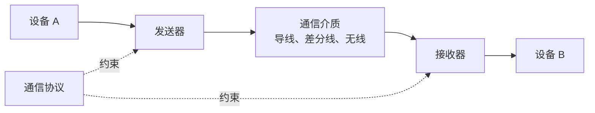

设备完成通信需要同时具备三个条件：

| 条件 | 作用 | 串口示例 |
|---|---|---|
| 物理通路 | 让电信号能够到达对方 | TX、RX、GND |
| 相容电平 | 让双方正确识别 0 和 1 | 3.3 V TTL 或经过收发器转换 |
| 相同协议 | 让双方用相同规则解释数据 | 115200-8-N-1 |

> 有连接不代表能通信。接线、电平和协议必须同时正确。

---

## 2 通信方式

### 2.1 串行与并行

#### 2.1.1 串行通信

串行通信通过一根数据线或一组差分线，按照时间顺序逐位传输数据。

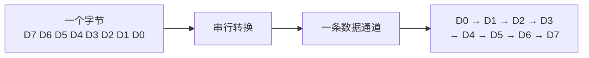

```text
时间 →
数据线：D0 ─ D1 ─ D2 ─ D3 ─ D4 ─ D5 ─ D6 ─ D7
```

| 优点 | 说明 |
|---|---|
| 线路较少 | 接口和连接器更简单 |
| 适合远距离 | 差分串行信号可提高抗干扰能力 |
| 扩展灵活 | UART、I²C、SPI、USB、CAN 等协议丰富 |

| 局限 | 说明 |
|---|---|
| 逐位传输 | 需要更高的位速率获得更大吞吐量 |
| 需要同步 | 依靠时钟线或约定波特率完成采样 |

典型串行接口：UART、I²C、SPI、USB、CAN、PCIe 和以太网物理链路等。

#### 2.1.2 并行通信

并行通信同时使用多根数据线传输多个数据位。例如，8 位数据可以通过 8 根数据线同时传送。

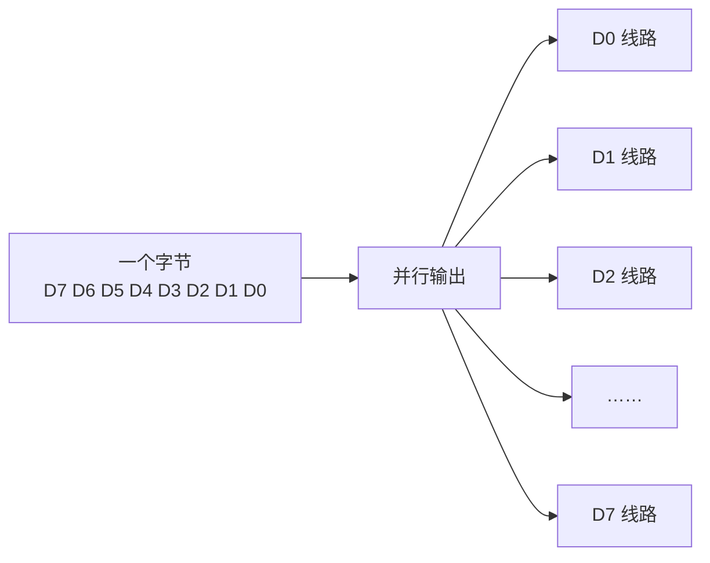

```text
发送端                           接收端
D0  ───────────────────────────> D0
D1  ───────────────────────────> D1
D2  ───────────────────────────> D2
...                              ...
D7  ───────────────────────────> D7
```

| 优点          | 局限               |
| ----------- | ---------------- |
| 单个时钟周期可传输多位 | 占用引脚和线路较多        |
| 短距离内吞吐量较高   | 长距离容易出现位间偏斜 Skew |
| 接口逻辑直观      | 多线同时翻转会增加串扰和 EMI |

典型并行接口：存储器总线、LCD 8080/6800 接口和传统并口。

> 并行数据位并非天然“完全同步”。频率和距离提高后，各线路传播延迟不同，会产生位间偏斜。

#### 2.1.3 对比选择

| 对比项    | 串行通信      | 并行通信          |
| ------ | --------- | ------------- |
| 数据传输   | 按时间逐位传输   | 多位同时传输        |
| 信号线数量  | 少         | 多             |
| 引脚占用   | 少         | 多             |
| 长距离能力  | 通常较好      | 通常较差          |
| PCB 布线 | 相对简单      | 需要关注多线等长与串扰   |
| 常见场景   | 设备通信、总线连接 | 存储器、显示接口、片内总线 |

### 2.2 通信方向

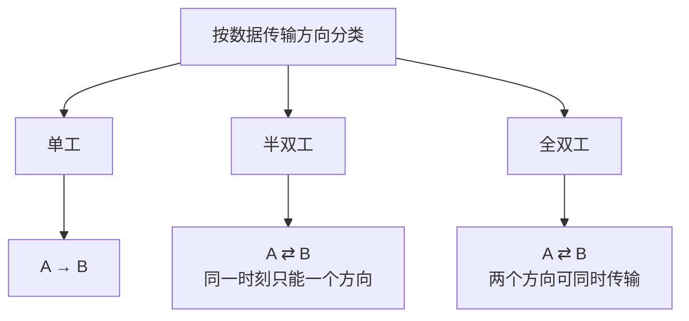

| 方式  | 特点       | 示例             |
| --- | -------- | -------------- |
| 单工  | 数据只能单向传输 | 单向广播、部分传感器输出   |
| 半双工 | 双向交替传输   | RS485 两线制、单线通信 |
| 全双工 | 双向同时传输   | UART 独立 TX/RX  |


串口设备连接时需要交叉连接信号：

```text
设备 1 TX ─────────> 设备 2 RX
设备 1 RX <───────── 设备 2 TX
设备 1 GND ───────── 设备 2 GND
```

> 只连接 TX 和 RX 而没有共同参考地，TTL 串口可能无法稳定通信。

### 2.3 同步与异步

无论同步还是异步，接收端都必须解决同一个问题：

> **数据线上的电平一直在变化，接收端应该在什么时刻读取这一位？**

如果采样太早或太晚，就可能把相邻数据位读错。同步通信与异步通信的核心区别，就是双方采用什么方法约定采样时刻。

#### 2.3.1 同步通信

同步通信通常增加一根时钟线。发送端在数据线上放置数据，同时在时钟线上产生周期性跳变；接收端根据约定的时钟边沿采样数据。


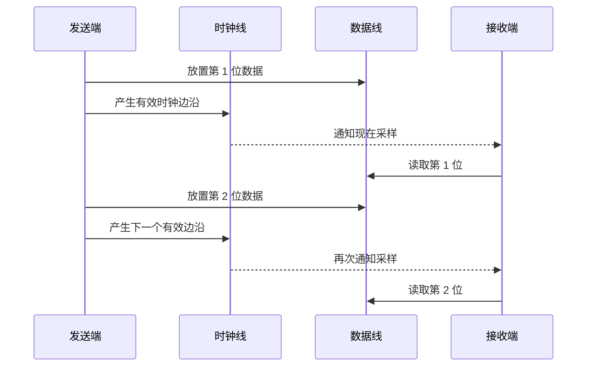

简化时序：

```text
时间  ──────────────────────────────────────>

CLK   ___/‾‾‾\___/‾‾‾\___/‾‾‾\___/‾‾‾\___
          ↑       ↑       ↑       ↑
          采样    采样    采样    采样

DATA  ---- D0 ----- D1 ----- D2 ----- D3 ----
```

时钟线相当于发送端不断告诉接收端：**“现在读取这一位。”**


同步通信的特点：

| 特点 | 说明 |
|---|---|
| 有明确采样节拍 | 接收端跟随时钟边沿读取数据 |
| 可连续传输 | 通常不必为每个字节增加起始位和停止位 |
| 效率较高 | 连续传输时协议额外开销较小 |
| 线路更多 | 除数据线外，通常还需要时钟线 |
| 需要约定边沿 | 双方必须确定上升沿还是下降沿采样 |

典型接口：SPI、I²C，以及 USART 的同步模式。

> “同步”不是指两个程序同时运行，而是指收发双方使用同一个时钟节拍确定数据位的边界和采样时刻。

#### 2.3.2 异步通信

异步通信没有单独的时钟线。发送端和接收端各自使用本地时钟，并提前约定相同的波特率和数据帧格式。


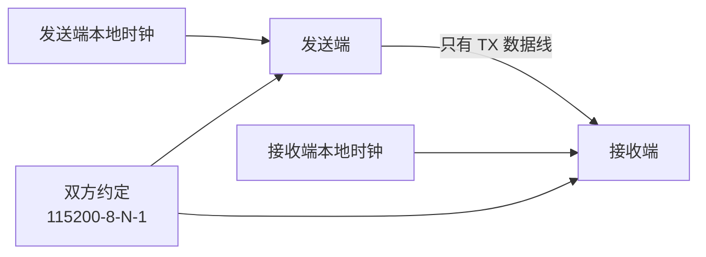

没有时钟线后，接收端需要使用起始位找到一帧数据的开始位置：

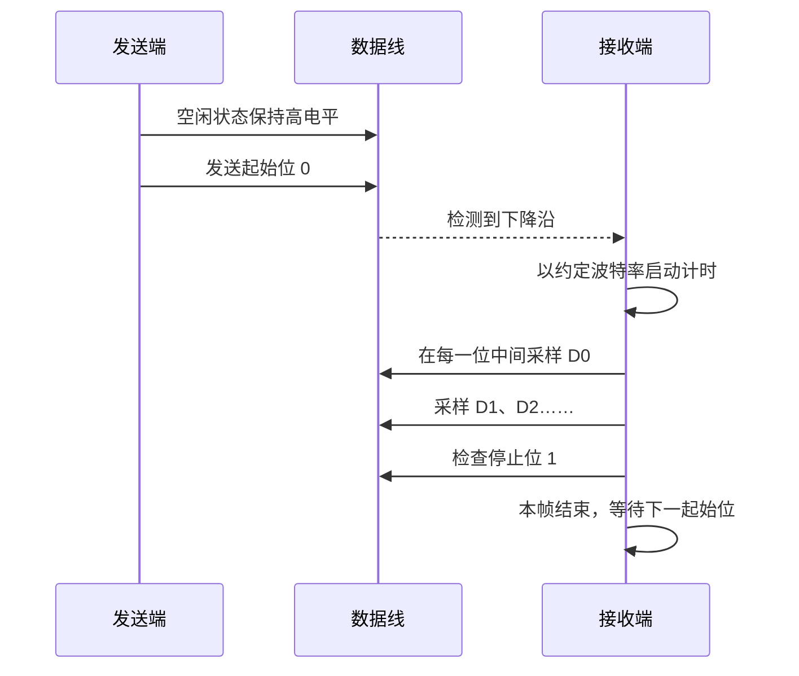

简化时序：

```text
线路：空闲 | 起始 | D0 | D1 | D2 | D3 | D4 | D5 | D6 | D7 | 停止 | 空闲
电平：  1  |  0   |    数据位，低位先发                 |  1   |  1
             ↓      ↓    ↓    ↓    ↓    ↓    ↓    ↓    ↓      ↓
          发现起点   接收端按自己的波特率在每位中间采样
```

异步通信的特点：

| 特点 | 说明 |
|---|---|
| 没有独立时钟线 | 线路少，连接简单 |
| 双方各用本地时钟 | 必须设置相同或足够接近的波特率 |
| 逐帧重新同步 | 每个字符的起始位提供新的时间起点 |
| 帧中包含额外位 | 起始位和停止位会占用传输时间 |
| 时钟误差有限制 | 误差过大时，采样位置会逐渐偏移 |

典型接口：UART，以及 USART 的异步模式。

#### 2.3.3 异步中的同步

“异步”并不表示双方完全不需要时间约定，而是表示**不通过独立时钟线持续传递节拍**。

UART 使用两层方法保持采样正确：


例如，波特率为 9600 Bd：

```text
每一位时间 = 1 ÷ 9600 ≈ 104.17 μs
```

接收端检测到起始位后，就按照约 104.17 μs 的间隔采样后续数据位。

如果发送端使用 9600 Bd，而接收端错误设置成 115200 Bd，双方对“一位持续多长时间”的理解完全不同，接收到的数据就会乱码。

#### 2.3.4 时钟误差

发送端和接收端使用两个独立时钟，它们的实际频率不可能完全相同。接收端每经过一个数据位，采样位置都可能产生少量偏移。

```text
正确采样： |----0----|----1----|----0----|----1----|
                  ↑         ↑         ↑         ↑

逐渐偏移： |----0----|----1----|----0----|----1----|
                   ↑          ↑          ↑          ↑
```

- 帧比较短时，累计误差通常仍处于数据位中间的安全区域。
- 帧结束后，下一帧的起始位会重新建立时间基准。
- 波特率误差过大时，后面的数据位或停止位会被错误采样。

这就是 UART 每帧都需要起始位和停止位，同时不宜把单帧设计得无限长的原因。

#### 2.3.5 对比总结

| 对比项 | 同步通信 | 异步通信 |
|---|---|---|
| 时钟来源 | 发送端通过时钟线提供共同节拍 | 双方各自使用本地时钟 |
| 采样时刻 | 根据时钟边沿采样 | 根据起始位和约定波特率推算 |
| 线路 | 通常需要数据线和时钟线 | 不需要独立时钟线 |
| 数据组织 | 可连续传输 | 每帧含起始位和停止位 |
| 同步频率 | 每个有效时钟边沿都在同步 | 每个数据帧开始时重新同步 |
| 主要风险 | 时钟边沿、极性或相位配置错误 | 波特率误差导致采样逐渐偏移 |
| 常见接口 | SPI、I²C、USART 同步模式 | UART、USART 异步模式 |

> 一句话区分：  
> **同步通信用时钟线告诉接收端“现在采样”；异步通信用起始位确定起点，再按约定波特率自行计时采样。**

---

## 3 串口通信协议

### 3.1 数据帧

异步串口以“帧”为单位传输字符。一帧通常由起始位、数据位、可选校验位和停止位组成。


```text
空闲    起始位      数据位（低位先发）       校验位    停止位    空闲
 1   |    0    | D0 D1 D2 D3 D4 D5 D6 D7 | 可选 |   1    |  1
```

常用配置 `115200-8-N-1` 表示：

| 参数 | 含义 |
|---|---|
| 115200 | 波特率 115200 Bd |
| 8 | 8 个有效数据位 |
| N | 无校验位 No parity |
| 1 | 1 个停止位 |

### 3.2 波特率

波特率表示每秒传输的码元数量。在常见二进制 UART 中，一个码元携带一位信息，因此通常可以近似理解为每秒传输的位数。

常见波特率：4800、9600、19200、38400、57600、115200 Bd。

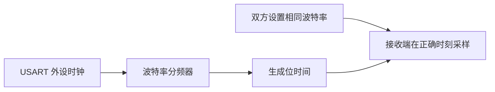

以 `115200-8-N-1` 为例，一帧包含：

```text
1 个起始位 + 8 个数据位 + 0 个校验位 + 1 个停止位 = 10 bit
```

理论最大字节速率约为：

```text
115200 bit/s ÷ 10 bit/字节 = 11520 字节/s
```

> 波特率不等于有效数据速率，因为起始位、校验位和停止位也占用传输时间。

### 3.3 空闲与起始位

| 项目 | 线路状态 | 作用 |
|---|---|---|
| 空闲状态 | 逻辑 1，高电平 | 表示当前没有数据 |
| 起始位 | 逻辑 0，低电平 | 通知接收方一帧即将开始 |

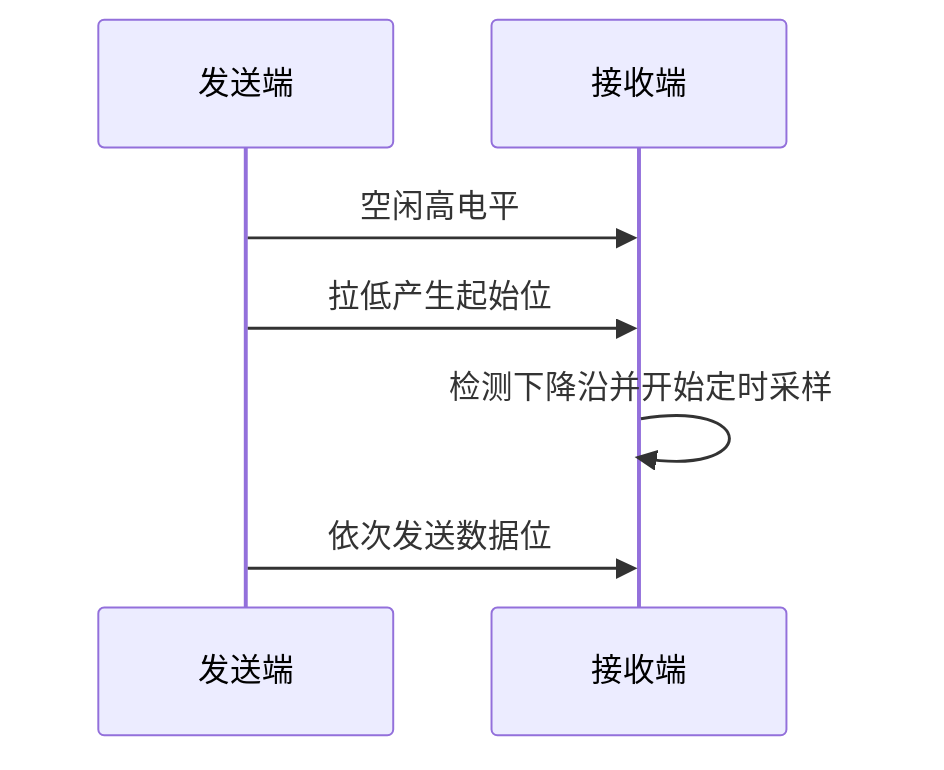

### 3.4 数据位

有效数据位通常为 8 位，也可以根据硬件配置使用其他字长。UART 发送时通常先发送最低有效位 LSB，最后发送最高有效位 MSB。

例如发送 `0x53`：

```text
0x53 = 0101 0011₂
位序：  D7 D6 D5 D4 D3 D2 D1 D0
发送：  D0 D1 D2 D3 D4 D5 D6 D7
        1  1  0  0  1  0  1  0
```

### 3.5 校验位

校验位用于发现部分传输错误，但不能纠正错误，也不能发现所有多位错误。

| 校验方式 | 规则 |
|---|---|
| 奇校验 Odd | 数据位与校验位中 1 的总数为奇数 |
| 偶校验 Even | 数据位与校验位中 1 的总数为偶数 |
| 无校验 None | 不添加校验位 |

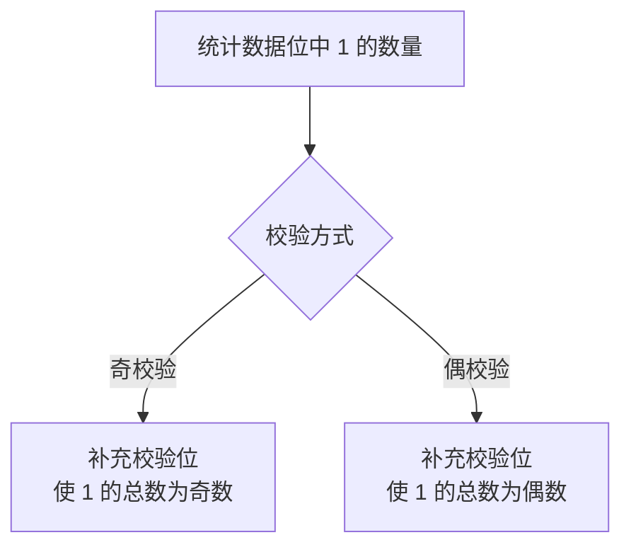

### 3.6 停止位

停止位使用逻辑 1，表示当前字符传输结束，并为下一帧提供恢复时间。

STM32 USART 支持的停止位配置与具体型号有关，常见选项包括 0.5、1、1.5 和 2 个停止位。通信双方必须保持一致。

### 3.7 参数匹配

串口通信失败时，应首先检查双方参数是否一致：

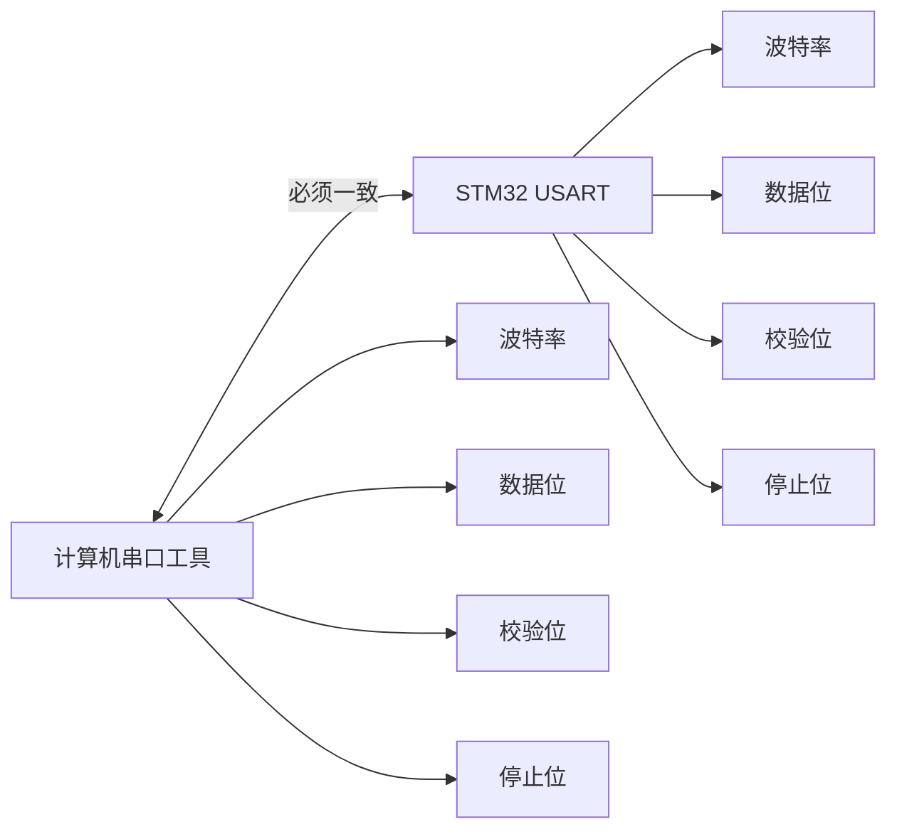

---

### 3.8 电平标准

#### 3.8.1 常见标准

UART 描述的是数据帧和收发逻辑，并不等于某一种固定的物理电平。

| 标准            | 信号形式              | 典型特点          | 能否直接连接 STM32     |
| ------------- | ----------------- | ------------- | ---------------- |
| TTL/CMOS UART | 单端，常见 3.3 V 或 5 V | 板级短距离、使用方便    | 电平兼容时可以          |
| RS-232        | 单端、正负电压、逻辑反相      | 点对点、距离较远      | 不可以，需要收发器        |
| RS-485        | 差分 A/B 线          | 抗干扰、适合长距离和多节点 | 不可以，需要 RS485 收发器 |

#### 3.8.2 TTL 串口

TTL/CMOS 串口通常以接近 0 V 表示逻辑 0，以接近供电电压表示逻辑 1。

```text
STM32 TX ─────────> USB-TTL RX
STM32 RX <───────── USB-TTL TX
STM32 GND ───────── USB-TTL GND
```

- STM32F103 的 GPIO 通常使用 3.3 V 逻辑。
- 连接 5 V USB-TTL 模块前，必须确认其 TX 输出电压及 STM32 对应引脚的容限。
- 不要将 USB-TTL 模块的 5 V 电源脚误接到不允许 5 V 的电路节点。

#### 3.8.3 RS-232

RS-232 使用正负电压并且逻辑含义与 TTL UART 不同，必须通过 MAX232 一类电平转换芯片连接。

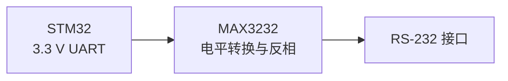

#### 3.8.4 RS-485

RS-485 使用 A、B 两线之间的差分电压表示逻辑状态，抗共模干扰能力较强，常用于工业现场。

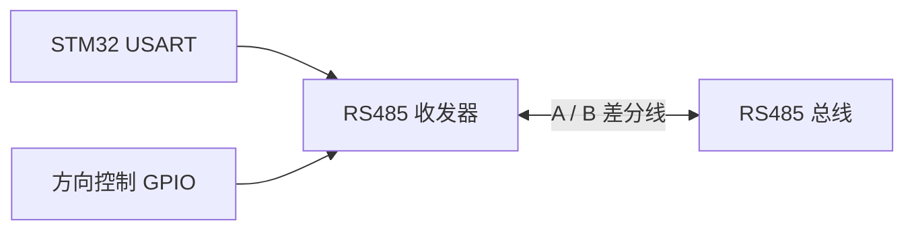

> RS-485 的逻辑判定应依据差分接收门限和所用收发器数据手册，不能只用固定的 A、B 对地电压判断。

---

## 4 USART 内部结构

### 4.1 USART 与 UART

USART 是 **Universal Synchronous/Asynchronous Receiver/Transmitter**，支持同步和异步通信；UART 只支持异步通信。

| 功能 | UART | USART |
|---|---|---|
| 异步通信 | 支持 | 支持 |
| 同步通信 | 不支持 | 支持 |
| TX/RX | 支持 | 支持 |
| 同步时钟 CK | 无 | 可支持 |

STM32 项目中最常用的是 USART 的异步 UART 模式。


### 4.2 核心特性

| 特性 | 说明 |
|---|---|
| 全双工异步通信 | TX 和 RX 独立，可同时收发 |
| 同步模式 | 可输出 CK 时钟，实际项目较少使用 |
| 可配置帧格式 | 支持字长、校验位和停止位配置 |
| 多种接收方式 | 轮询、中断、DMA、空闲线检测 |
| 硬件流控制 | 可使用 RTS/CTS 控制发送节奏 |
| 特殊模式 | 支持单线、智能卡等模式，具体以型号为准 |

### 4.3 功能结构


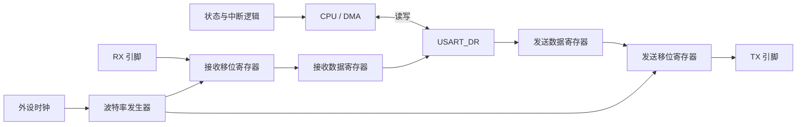

### 4.4 接口信号

| 信号 | 方向 | 作用 |
|---|---|---|
| TX | 输出 | 发送串行数据 |
| RX | 输入 | 接收串行数据 |
| CK/SCLK | 输出 | 同步模式的发送时钟 |
| nRTS | 输出 | 表示接收端是否准备好接收数据 |
| nCTS | 输入 | 表示对端是否允许本机继续发送 |
| SW_RX | 内部信号 | 用于单线和智能卡等特殊模式 |

#### 4.4.1 RTS 与 CTS

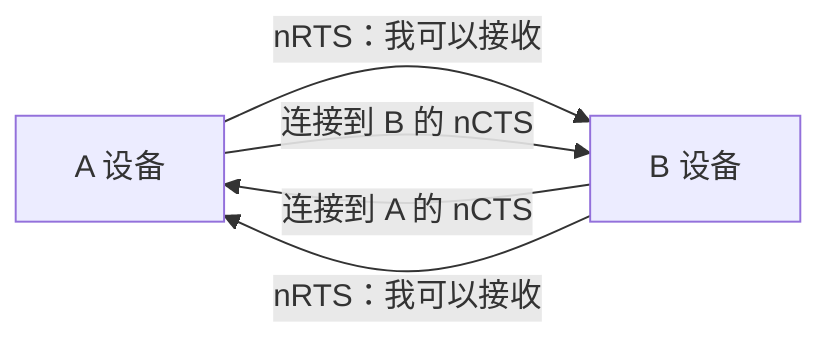

- nRTS 为低时，通常表示接收器可以接收新数据。
- nCTS 为低时，发送器可以继续发送下一帧。
- 字母 `n` 表示低电平有效。
- RTS/CTS 只在启用硬件流控制时使用。

### 4.5 数据收发路径

#### 4.5.1 发送路径

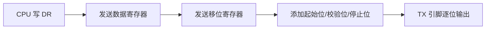

- `TXE=1`：发送数据寄存器为空，可以写入下一个数据。
- `TC=1`：发送数据寄存器和移位寄存器均为空，最后一个停止位已经发送完成。

> 连续发送字节时通常等待 TXE；切换 RS485 方向或关闭 USART 前，需要等待 TC。

#### 4.5.2 接收路径


---

## 5 USART 寄存器

### 5.1 寄存器总览

| 寄存器 | 名称 | 主要作用 |
|---|---|---|
| `USART_SR` | 状态寄存器 | 保存 TXE、TC、RXNE、IDLE 和错误标志 |
| `USART_DR` | 数据寄存器 | 写入数据发送，读取接收数据 |
| `USART_BRR` | 波特率寄存器 | 配置波特率分频值 |
| `USART_CR1` | 控制寄存器 1 | USART 使能、收发使能、字长、校验和中断 |
| `USART_CR2` | 控制寄存器 2 | 停止位和同步时钟配置 |
| `USART_CR3` | 控制寄存器 3 | DMA、硬件流控制和错误中断等 |

#### 5.1.1 状态寄存器 SR

| 标志位 | 含义 | 使用场景 |
|---|---|---|
| TXE | 发送数据寄存器为空 | 可以写下一个字节 |
| TC | 整帧发送完成 | 等待线路真正发送结束 |
| RXNE | 接收数据寄存器非空 | 可以读取收到的数据 |
| IDLE | RX 线路检测到空闲 | 判断一批变长数据结束 |
| ORE | 溢出错误 | 新数据到来前旧数据未读取 |
| FE | 帧错误 | 停止位或波特率可能不匹配 |
| PE | 校验错误 | 校验配置或传输数据异常 |

#### 5.1.2 波特率寄存器 BRR

波特率由 USART 外设时钟和 BRR 分频值共同决定。


在 STM32F103、USART1 时钟为 72 MHz、16 倍过采样时：

```text
USARTDIV = 72 000 000 ÷ (16 × 115200) = 39.0625
尾数 = 39
小数 = 0.0625 × 16 = 1
BRR = (39 << 4) | 1 = 0x0271
```

```c
USART1->BRR = 0x0271U;
```


> `0x0271` 只适用于外设时钟为 72 MHz、目标波特率为 115200 等特定条件。时钟或波特率变化后必须重新计算。

#### 5.1.3 为什么常用 115200？

| 原因 | 说明 |
|---|---|
| 传输效率较高 | 调试日志和命令交互速度明显高于 9600 |
| 工具普遍支持 | USB-TTL 和串口工具通常支持 |
| 时钟误差可接受 | 常见 MCU 时钟下容易获得较小误差 |
| 兼顾稳定性 | 在短距离 TTL 串口中通常稳定可靠 |

115200 不是必须值。长线、干扰较强或时钟误差较大时，可以选择更低波特率。

---

## 6 寄存器版本

### 6.1 硬件连接

本节以 STM32F103 的 USART1 与计算机 USB-TTL 模块通信为例：

```text
STM32 PA9  / USART1_TX ─────> USB-TTL RX
STM32 PA10 / USART1_RX <───── USB-TTL TX
STM32 GND               ───── USB-TTL GND
```

### 6.2 初始化流程

```mermaid
flowchart LR
    CLOCK[1 开启 GPIOA/USART1 时钟] --> GPIO[2 配置 PA9/PA10]
    GPIO --> BRR[3 配置波特率]
    BRR --> FRAME[4 配置字长/校验/停止位]
    FRAME --> MODE[5 使能发送与接收]
    MODE --> IRQ[6 按需配置中断]
    IRQ --> ENABLE[7 使能 USART]
```

| 引脚 | 功能 | STM32F1 GPIO 模式 |
|---|---|---|
| PA9 | USART1_TX | 复用推挽输出 |
| PA10 | USART1_RX | 浮空输入或按电路要求配置输入 |

### 6.3 初始化代码

```c
#include "stm32f10x.h"

static void USART1_Init_115200(void)
{
    /* 1. 开启 GPIOA 和 USART1 时钟 */
    RCC->APB2ENR |= RCC_APB2ENR_IOPAEN |
                    RCC_APB2ENR_USART1EN;

    /* 2. PA9：50 MHz 复用推挽输出，CNF=10，MODE=11 */
    GPIOA->CRH &= ~(0xFU << 4);
    GPIOA->CRH |=  (0xBU << 4);

    /* 3. PA10：浮空输入，CNF=01，MODE=00 */
    GPIOA->CRH &= ~(0xFU << 8);
    GPIOA->CRH |=  (0x4U << 8);

    /* 4. 72 MHz PCLK2，115200 Bd */
    USART1->BRR = 0x0271U;

    /* 5. 8 数据位、无校验、1 停止位 */
    USART1->CR1 &= ~(USART_CR1_M | USART_CR1_PCE);
    USART1->CR2 &= ~USART_CR2_STOP;

    /* 6. 开启发送、接收和 USART */
    USART1->CR1 |= USART_CR1_TE |
                   USART_CR1_RE |
                   USART_CR1_UE;
}
```

### 6.4 轮询收发

#### 6.4.1 发送一个字节

```c
static void USART1_SendByte(uint8_t byte)
{
    while ((USART1->SR & USART_SR_TXE) == 0U)
    {
    }

    USART1->DR = byte;
}
```

连续发送多个字节：

```c
static void USART1_SendBuffer(const uint8_t *data, uint16_t length)
{
    for (uint16_t i = 0U; i < length; ++i)
    {
        USART1_SendByte(data[i]);
    }

    while ((USART1->SR & USART_SR_TC) == 0U)
    {
    }
}
```

#### 6.4.2 接收一个字节

```c
static uint8_t USART1_ReceiveByte(void)
{
    while ((USART1->SR & USART_SR_RXNE) == 0U)
    {
    }

    return (uint8_t)USART1->DR;
}
```

```mermaid
flowchart LR
    WAIT[等待 RXNE=1] --> READ[读取 USART_DR]
    READ --> CLEAR[RXNE 被硬件清除]
    CLEAR --> DATA[获得接收字节]
```

轮询方式简单，但等待期间 CPU 不能处理其他任务。

### 6.5 中断接收

#### 6.5.1 配置步骤

在基本初始化基础上增加：

```c
USART1->CR1 |= USART_CR1_RXNEIE;

NVIC_SetPriority(USART1_IRQn, 2U);
NVIC_EnableIRQ(USART1_IRQn);
```

如果需要使用空闲线判断变长数据结束：

```c
USART1->CR1 |= USART_CR1_IDLEIE;
```

#### 6.5.2 中断服务程序

```c
#define RX_BUFFER_SIZE 128U

static volatile uint8_t rx_buffer[RX_BUFFER_SIZE];
static volatile uint16_t rx_length = 0U;
static volatile uint8_t frame_ready = 0U;

void USART1_IRQHandler(void)
{
    if ((USART1->SR & USART_SR_RXNE) != 0U)
    {
        uint8_t data = (uint8_t)USART1->DR;

        if (rx_length < RX_BUFFER_SIZE)
        {
            rx_buffer[rx_length++] = data;
        }
    }

    if ((USART1->SR & USART_SR_IDLE) != 0U)
    {
        volatile uint32_t temp;
        temp = USART1->SR;
        temp = USART1->DR;
        (void)temp;

        frame_ready = 1U;
    }
}
```

| 标志 | 清除方法 |
|---|---|
| RXNE | 读取 `USART_DR` |
| IDLE | 先读 `USART_SR`，再读 `USART_DR` |

> 接收缓冲区必须进行边界检查。ISR 中只保存数据和设置标志，完整的数据解析放到主循环中完成。

### 6.6 变长数据

串口本身只传输连续字节，不知道一条应用层消息在什么位置结束。常见分帧方式包括：

| 方法 | 判断依据 | 适用场景 |
|---|---|---|
| 固定长度 | 收满指定字节数 | 长度固定的数据包 |
| 结束符 | 收到 `\r\n` 等字符 | 文本命令 |
| 长度字段 | 帧头中携带数据长度 | 二进制协议 |
| 空闲线 IDLE | 一段时间没有新字节 | 不定长连续接收 |
| 接收超时 | 超过规定时间未收到新数据 | 简单协议 |

```mermaid
flowchart LR
    BYTE[连续接收字节] --> BUFFER[写入缓冲区]
    BUFFER --> IDLE{检测到 IDLE?}
    IDLE -->|否| BYTE
    IDLE -->|是| READY[标记一帧接收完成]
    READY --> PARSE[主程序解析]
```

---

## 7 HAL 串口操作

### 7.1 CubeMX 工程

原课件中的工程创建流程如下：

```mermaid
flowchart LR
    MCU[1 选择 MCU 型号] --> DEBUG[2 配置调试接口]
    DEBUG --> RCC[3 配置 RCC 与时钟]
    RCC --> UART[4 配置 USART]
    UART --> NVIC[5 按需开启中断]
    NVIC --> PROJECT[6 配置工程]
    PROJECT --> GENERATE[7 生成代码]
```

#### 7.1.1 选择芯片与工程

| 创建工程 | 选择 MCU |
|---|---|
|  |  |

#### 7.1.2 调试与时钟

| 配置调试接口 | 配置 RCC |
|---|---|
|  |  |

> CubeMX 中的 `Serial Wire` 指 SWD 下载调试接口，不是 USART 串口。建议保留 SWD，避免将调试引脚误作普通 GPIO 后无法正常连接调试器。

#### 7.1.3 USART 配置

| 选择 USART | 配置串口参数 |
|---|---|
|  |  |

| 开启 USART 中断 | 检查 GPIO 引脚 |
|---|---|
|  |  |

#### 7.1.4 生成代码

| 工程设置 | 代码生成 |
|---|---|
|  |  |

生成的 `main()` 通常已经调用：

```c
HAL_Init();
SystemClock_Config();
MX_GPIO_Init();
MX_USART1_UART_Init();
```

### 7.2 函数总览

HAL 串口函数可以按“初始化、发送、接收、状态和回调”分类学习：

| 类别   | 常用函数                         | 作用                  |
| ---- | ---------------------------- | ------------------- |
| 初始化  | `HAL_UART_Init()`            | 根据句柄配置 USART        |
| 阻塞发送 | `HAL_UART_Transmit()`        | 等待发送完成或超时           |
| 阻塞接收 | `HAL_UART_Receive()`         | 等待收到指定长度或超时         |
| 中断接收 | `HAL_UART_Receive_IT()`      | 启动非阻塞定长接收           |
| 空闲接收 | `HAL_UARTEx_ReceiveToIdle()` | 接收变长数据并通过 IDLE 判断结束 |
| 状态查询 | `HAL_UART_GetState()`        | 获取 UART 当前状态        |
| 接收回调 | `HAL_UART_RxCpltCallback()`  | 中断接收完成后执行用户逻辑       |

#### 7.2.1 初始化函数

```c
HAL_StatusTypeDef HAL_UART_Init(UART_HandleTypeDef *huart);
```

`UART_HandleTypeDef` 保存串口实例、初始化参数、缓冲区、状态和错误码。

```c
huart1.Instance = USART1;
huart1.Init.BaudRate = 115200;
huart1.Init.WordLength = UART_WORDLENGTH_8B;
huart1.Init.StopBits = UART_STOPBITS_1;
huart1.Init.Parity = UART_PARITY_NONE;
huart1.Init.Mode = UART_MODE_TX_RX;
huart1.Init.HwFlowCtl = UART_HWCONTROL_NONE;
huart1.Init.OverSampling = UART_OVERSAMPLING_16;
HAL_UART_Init(&huart1);
```

### 7.3 阻塞收发

#### 7.3.1 发送函数

```c
HAL_StatusTypeDef HAL_UART_Transmit(
    UART_HandleTypeDef *huart,
    uint8_t *pData,
    uint16_t Size,
    uint32_t Timeout);
```

```c
uint8_t message[] = "Hello, USART!\r\n";

HAL_UART_Transmit(&huart1,
                  message,
                  sizeof(message) - 1U,
                  100U);
```

#### 7.3.2 接收函数

```c
HAL_StatusTypeDef HAL_UART_Receive(
    UART_HandleTypeDef *huart,
    uint8_t *pData,
    uint16_t Size,
    uint32_t Timeout);
```

```c
uint8_t data;

if (HAL_UART_Receive(&huart1, &data, 1U, 100U) == HAL_OK)
{
    HAL_UART_Transmit(&huart1, &data, 1U, 100U);
}
```

| 返回值           | 含义         |
| ------------- | ---------- |
| `HAL_OK`      | 操作完成       |
| `HAL_ERROR`   | 参数或硬件错误    |
| `HAL_BUSY`    | 串口正在执行其他操作 |
| `HAL_TIMEOUT` | 在规定时间内未完成  |

> 阻塞函数会等待数据完成或超时，适合入门验证和数据量较小的场景。

### 7.4 中断收发

启动一次定长中断接收：

```c
static uint8_t rx_data;

HAL_UART_Receive_IT(&huart1, &rx_data, 1U);
```

接收完成后 HAL 调用回调函数：

```c
void HAL_UART_RxCpltCallback(UART_HandleTypeDef *huart)
{
    if (huart->Instance == USART1)
    {
        HAL_UART_Transmit_IT(&huart1, &rx_data, 1U);

        /* 重新启动下一次接收 */
        HAL_UART_Receive_IT(&huart1, &rx_data, 1U);
    }
}
```

```mermaid
flowchart LR
    START[HAL_UART_Receive_IT] --> WAIT[后台等待数据]
    WAIT --> IRQ[USART 中断]
    IRQ --> HANDLER[HAL_UART_IRQHandler]
    HANDLER --> CALLBACK[HAL_UART_RxCpltCallback]
    CALLBACK --> RESTART[重新启动下一次接收]
```

> `HAL_UART_Receive_IT()` 只启动一次接收。若要持续接收，通常需要在回调函数中再次启动。

### 7.5 变长接收

原课件使用空闲线检测接收不定长数据：

```c
HAL_StatusTypeDef HAL_UARTEx_ReceiveToIdle(
    UART_HandleTypeDef *huart,
    uint8_t *pData,
    uint16_t Size,
    uint16_t *RxLen,
    uint32_t Timeout);
```

```c
uint8_t rx_buffer[128];
uint16_t rx_length;

if (HAL_UARTEx_ReceiveToIdle(&huart1,
                             rx_buffer,
                             sizeof(rx_buffer),
                             &rx_length,
                             1000U) == HAL_OK)
{
    HAL_UART_Transmit(&huart1,
                      rx_buffer,
                      rx_length,
                      100U);
}
```

| 参数 | 含义 |
|---|---|
| `huart` | UART 句柄 |
| `pData` | 接收缓冲区 |
| `Size` | 缓冲区最大长度 |
| `RxLen` | 实际收到的数据长度 |
| `Timeout` | 最大等待时间 |

适用场景：Modbus、自定义协议、命令行和其他不定长数据帧。

非阻塞项目通常使用 `HAL_UARTEx_ReceiveToIdle_IT()` 或 DMA 版本，并在对应回调中处理实际长度。

### 7.6 获取状态

```c
HAL_UART_StateTypeDef HAL_UART_GetState(
    UART_HandleTypeDef *huart);
```

常见状态包括 `HAL_UART_STATE_READY`、发送忙和接收忙等。状态函数适合辅助判断和调试，但不应使用无限循环长期等待外设状态。

### 7.7 接收方式选择

| 接收方式 | CPU 占用 | 适用场景 |
|---|---|---|
| 阻塞轮询 | 高 | 入门、简单命令、少量数据 |
| 普通中断 | 中 | 低速或定长数据 |
| IDLE 中断 | 中 | 不定长数据帧 |
| DMA | 低 | 高速、连续、大批量数据 |
| DMA + IDLE | 更低 | 高速不定长数据流 |

```mermaid
flowchart TD
    NEED[选择接收方式] --> SIMPLE{数据少且允许等待?}
    SIMPLE -->|是| BLOCK[阻塞接收]
    SIMPLE -->|否| LENGTH{数据定长?}
    LENGTH -->|是| IT[中断接收]
    LENGTH -->|否| SPEED{数据量大或连续?}
    SPEED -->|否| IDLE[IDLE 中断接收]
    SPEED -->|是| DMA[DMA + IDLE]
```

---

## 8 `printf` 实现

### 8.1 实现原理

重定向 `printf` 后，可以把格式化文本通过 USART 发送到计算机串口工具，用于输出变量和调试信息。

```mermaid
flowchart LR
    PRINTF[printf] --> FPUTC[fputc]
    FPUTC --> USART[USART 发送]
    USART --> USBTTL[USB-TTL]
    USBTTL --> PC[计算机串口工具]
```

### 8.2 寄存器方式

```c
#include <stdio.h>

int fputc(int ch, FILE *stream)
{
    (void)stream;

    while ((USART1->SR & USART_SR_TXE) == 0U)
    {
    }

    USART1->DR = (uint8_t)ch;
    return ch;
}
```

### 8.3 HAL 方式

```c
#include <stdio.h>

int fputc(int ch, FILE *stream)
{
    uint8_t data = (uint8_t)ch;
    (void)stream;

    HAL_UART_Transmit(&huart1, &data, 1U, 100U);
    return ch;
}
```

使用示例：

```c
uint32_t count = 100U;
printf("count = %lu\r\n", (unsigned long)count);
```

### 8.4 Keil 设置


不同 C 库和编译器版本的重定向方式可能不同。若出现链接错误或无输出，应检查：

- 是否启用了合适的运行库配置。
- `fputc` 或底层写函数是否被正确链接。
- USART 是否已经初始化。
- 串口工具参数是否一致。
- 是否在高优先级 ISR 中调用了阻塞式 `printf`。

> `printf` 使用方便，但格式化和逐字节阻塞发送开销较大，不适合高频中断和强实时路径。

---

## 9 环形队列接收

### 9.1 为什么需要队列？

串口数据到达的时间由外部设备决定，而主程序处理数据的速度由当前任务决定，两者通常不同步。

```mermaid
sequenceDiagram
    participant UART as USART
    participant ISR as 接收中断
    participant Main as 主程序

    UART-->>ISR: 字节 A 到达
    ISR->>Main: 保存 A
    UART-->>ISR: 字节 B 到达
    ISR->>Main: 保存 B
    UART-->>ISR: 字节 C 到达
    Note over Main: 主程序此时正在执行其他任务
    ISR->>Main: 需要暂存 C
```

如果只使用一个接收变量：

```c
volatile uint8_t rx_data;
```

新字节可能在主程序处理旧字节之前到达，导致旧数据被覆盖。

```mermaid
flowchart LR
    A[收到 A<br/>rx_data=A] --> WAIT[主程序尚未读取]
    WAIT --> B[收到 B<br/>rx_data=B]
    B --> LOST[A 被覆盖]
```

使用普通线性数组虽然可以暂存多个字节，但处理完前面的数据后会出现两个问题：

- 删除队首数据时，如果移动其余数据，处理开销会随数据量增加。
- 数组尾部写满后，即使前面已有空位，也需要移动数据或重新从头组织。

环形队列可以让串口接收中断只负责快速写入，主程序按照自己的节奏读取，从而把“接收”和“处理”解耦。

```mermaid
flowchart LR
    UART[USART 硬件] --> ISR[ISR：快速取走字节]
    ISR --> RING[环形队列：暂存]
    RING --> MAIN[主循环：逐字节读取]
    MAIN --> PARSER[协议解析]
    PARSER --> BUSINESS[业务处理]
```

### 9.2 环形队列结构

环形队列使用固定长度数组，并用两个索引记录读写位置：

| 成员 | 含义 |
|---|---|
| `data[]` | 保存接收到的字节 |
| `head` | 下一个数据写入位置 |
| `tail` | 下一个数据读取位置 |
| `overflow` | 队列已满时的溢出次数 |

```text
                  head：下一次写入
                         ↓
       +----+----+----+----+----+----+----+----+
数组： | A  | B  | C  | 空 | 空 | 空 | 空 | 空 |
       +----+----+----+----+----+----+----+----+
         ↑
       tail：下一次读取
```

当索引到达数组末尾后，下一位置重新回到数组开头：

```mermaid
flowchart LR
    I0[0] --> I1[1]
    I1 --> I2[2]
    I2 --> DOT[...]
    DOT --> IN[N-1]
    IN --> I0
```

这就是“环形”的含义。数据没有真的在内存中转圈，循环的是 `head` 和 `tail` 索引。

### 9.3 空与满的判断

为了避免 `head == tail` 同时表示“空”和“满”，常用方法是预留一个数组单元：

| 状态 | 判断条件 |
|---|---|
| 队列为空 | `head == tail` |
| 队列已满 | `next_head == tail` |
| 可以写入 | `next_head != tail` |
| 可以读取 | `head != tail` |

其中：

```c
next_head = (head + 1U) % BUFFER_SIZE;
```

因此，一个长度为 `128` 的数组最多保存 `127` 个字节。

```text
空队列：
head
  ↓
[ ][ ][ ][ ][ ][ ][ ][ ]
  ↑
tail

满队列（预留一个位置）：
      tail          head
        ↓             ↓
[数据][数据][空][数据][数据][数据][数据][数据]
            ↑
      head 的下一位置等于 tail
```

### 9.4 数据结构

```c
#include <stdbool.h>
#include <stdint.h>

#define UART_RX_BUFFER_SIZE 128U

typedef struct
{
    uint8_t data[UART_RX_BUFFER_SIZE];
    volatile uint16_t head;
    volatile uint16_t tail;
    volatile uint32_t overflow;
} UartRingBuffer;

static UartRingBuffer uart1_rx_queue = {0};
```

为什么 `head` 和 `tail` 使用 `volatile`？

- `head` 由 USART ISR 更新，主程序读取。
- `tail` 由主程序更新，ISR 读取。
- `volatile` 提醒编译器每次访问都要读取实际内存值。

> `volatile` 只解决编译器可见性问题，不等同于线程锁。这里采用的是单核 MCU 中“ISR 单生产者、主循环单消费者”的简单模型。

### 9.5 写入数据

写入函数通常由 USART 接收 ISR 调用：

```c
static bool RingBuffer_Push(UartRingBuffer *queue, uint8_t value)
{
    uint16_t next_head = queue->head + 1U;

    if (next_head >= UART_RX_BUFFER_SIZE)
    {
        next_head = 0U;
    }

    if (next_head == queue->tail)
    {
        queue->overflow++;
        return false;  /* 队列已满，丢弃当前新字节 */
    }

    queue->data[queue->head] = value;
    __DMB();
    queue->head = next_head;
    return true;
}
```

```mermaid
flowchart TD
    START[收到一个字节] --> NEXT[计算 next_head]
    NEXT --> FULL{next_head == tail?}
    FULL -->|是| OVERFLOW[记录溢出并丢弃新字节]
    FULL -->|否| WRITE[写入 data head]
    WRITE --> MOVE[head = next_head]
```

写入时先保存数据，最后移动 `head`。只有 `head` 更新后，主程序才认为新数据已经可以读取。

### 9.6 读取数据

读取函数由主循环调用：

```c
static bool RingBuffer_Pop(UartRingBuffer *queue, uint8_t *value)
{
    uint16_t next_tail;

    if (queue->head == queue->tail)
    {
        return false;  /* 队列为空 */
    }

    *value = queue->data[queue->tail];

    next_tail = queue->tail + 1U;
    if (next_tail >= UART_RX_BUFFER_SIZE)
    {
        next_tail = 0U;
    }

    queue->tail = next_tail;
    return true;
}
```

```mermaid
flowchart TD
    START[主程序准备读取] --> EMPTY{head == tail?}
    EMPTY -->|是| NONE[当前没有数据]
    EMPTY -->|否| READ[读取 data tail]
    READ --> MOVE[tail 移到下一位置]
    MOVE --> RETURN[返回一个字节]
```

### 9.7 寄存器中断实现

USART ISR 只读取数据寄存器并放入环形队列：

```c
void USART1_IRQHandler(void)
{
    uint32_t status = USART1->SR;

    if ((status & USART_SR_RXNE) != 0U)
    {
        uint8_t data = (uint8_t)USART1->DR;
        (void)RingBuffer_Push(&uart1_rx_queue, data);
    }

    else if ((status & (USART_SR_ORE | USART_SR_NE |
                        USART_SR_FE  | USART_SR_PE)) != 0U)
    {
        /* STM32F1：按手册要求读 SR 后读 DR 清除相关错误序列 */
        volatile uint32_t dummy = USART1->DR;
        (void)dummy;
    }
}
```

主循环持续从队列取出数据并交给协议解析器：

```c
int main(void)
{
    uint8_t data;

    USART1_Init_115200();
    USART1->CR1 |= USART_CR1_RXNEIE;
    NVIC_EnableIRQ(USART1_IRQn);

    while (1)
    {
        while (RingBuffer_Pop(&uart1_rx_queue, &data))
        {
            Protocol_ParseByte(data);
        }

        /* 执行其他任务 */
    }
}
```

```mermaid
sequenceDiagram
    participant UART as USART
    participant ISR as USART1_IRQHandler
    participant Queue as 环形队列
    participant Main as 主循环
    participant Parser as 协议解析器

    UART-->>ISR: RXNE，字节到达
    ISR->>Queue: Push 字节
    ISR-->>Main: 快速退出
    Main->>Queue: Pop 字节
    Queue-->>Main: 返回数据
    Main->>Parser: ParseByte
```

### 9.8 HAL 中断实现

HAL 中仍可以使用环形队列。先启动单字节中断接收：

```c
static uint8_t uart1_rx_byte;

HAL_UART_Receive_IT(&huart1, &uart1_rx_byte, 1U);
```

在接收完成回调中写入队列，并立即重新启动下一字节接收：

```c
void HAL_UART_RxCpltCallback(UART_HandleTypeDef *huart)
{
    if (huart->Instance == USART1)
    {
        (void)RingBuffer_Push(&uart1_rx_queue, uart1_rx_byte);

        HAL_UART_Receive_IT(&huart1, &uart1_rx_byte, 1U);
    }
}
```

错误回调可以记录错误并恢复接收：

```c
void HAL_UART_ErrorCallback(UART_HandleTypeDef *huart)
{
    if (huart->Instance == USART1)
    {
        HAL_UART_Receive_IT(&huart1, &uart1_rx_byte, 1U);
    }
}
```

> 单字节 HAL 中断接收便于教学，但数据速率较高时中断频繁。工程中可以进一步使用 DMA + IDLE，把一批数据写入更大的软件环形缓冲区。

### 9.9 数据帧解析

环形队列只解决“字节暂存和按序读取”，并不能自动判断一帧数据是否完整。应用层仍需定义分帧规则。

```mermaid
flowchart LR
    QUEUE[环形队列] --> BYTE[逐字节读取]
    BYTE --> STATE[协议状态机]
    STATE --> HEADER[寻找帧头]
    HEADER --> LENGTH[读取长度]
    LENGTH --> PAYLOAD[接收数据区]
    PAYLOAD --> CHECK[校验]
    CHECK --> FRAME[得到完整数据帧]
```

以换行符结尾的文本命令为例：

```c
#define LINE_SIZE 64U

static char line[LINE_SIZE];
static uint16_t line_length = 0U;

static void Protocol_ParseByte(uint8_t data)
{
    if (data == '\n')
    {
        line[line_length] = '\0';
        ProcessCommand(line);
        line_length = 0U;
    }
    else if (data != '\r')
    {
        if (line_length < (LINE_SIZE - 1U))
        {
            line[line_length++] = (char)data;
        }
        else
        {
            line_length = 0U;  /* 当前命令过长，丢弃并重新接收 */
        }
    }
}
```

### 9.10 溢出处理

如果数据进入队列的平均速度长期大于主程序处理速度，任何有限缓冲区最终都会写满。

| 策略 | 做法 | 影响 |
|---|---|---|
| 丢弃新数据 | 队列满时拒绝本次写入 | 保留旧数据，当前新数据丢失 |
| 覆盖旧数据 | 移动 tail 后写入新数据 | 保留最新数据，旧数据丢失 |
| 流量控制 | RTS/CTS 或应用层暂停发送 | 尽量避免丢包 |
| 提高处理速度 | 减少阻塞、使用 DMA | 从根本上降低积压 |
| 扩大缓冲区 | 增加队列长度 | 只能吸收更长的瞬时突发 |

```mermaid
flowchart TD
    FULL[环形队列已满] --> POLICY{选择策略}
    POLICY --> DROP_NEW[丢弃新数据]
    POLICY --> DROP_OLD[覆盖最旧数据]
    POLICY --> FLOW[通知发送端暂停]
    POLICY --> OPTIMIZE[优化处理或使用 DMA]
```

调试时至少应保留 `overflow` 计数。只要该值增加，就说明接收链路的处理能力或缓冲容量不足。

### 9.11 使用边界

| 场景 | 推荐方案 |
|---|---|
| 低速命令行 | 单字节中断 + 环形队列 |
| 中速连续数据 | USART 中断 + 较大环形队列 |
| 高速大量数据 | DMA + IDLE + 环形缓冲区 |
| 固定长度短帧 | HAL 定长中断接收即可 |
| 有明确处理周期 | 定时扫描环形队列 |

> 环形队列的价值不是“让串口更快”，而是让接收中断与数据处理互不等待，吸收短时间的数据突发，并保持字节顺序。

---

## 10 总结

### 10.1 内容主线

```mermaid
flowchart LR
    DEVICE[设备如何通信] --> MODE[通信方式]
    MODE --> FRAME[串口协议]
    FRAME --> USART[USART 内部结构]
    USART --> REGISTER[寄存器与寄存器开发]
    REGISTER --> HAL[HAL 串口操作]
    HAL --> PRINTF[printf 输出]
    PRINTF --> RING[环形队列接收]
```

### 10.2 核心结论

| 核心问题 | 结论 |
|---|---|
| 串行与并行有何区别？ | 串行逐位传输、线路少；并行多位同时传输、线路多 |
| USART 常用什么模式？ | 使用独立 TX/RX 的全双工异步模式 |
| 双方必须匹配哪些参数？ | 波特率、数据位、校验位和停止位 |
| TTL、RS-232、RS-485 能否直接混接？ | 不能，必须使用匹配的物理层收发器 |
| TXE 和 TC 有何区别？ | TXE 表示数据寄存器空；TC 表示最后一帧已经发送完 |
| RXNE 如何清除？ | 读取数据寄存器 |
| IDLE 如何清除？ | STM32F1 中先读 SR，再读 DR |
| 怎样接收变长数据？ | 使用结束符、长度字段、IDLE 或超时判断 |
| HAL 中断接收为何要重新启动？ | 一次调用只安排一次指定长度的接收 |
| 为什么需要环形队列？ | 解耦中断接收和主程序处理，避免单变量覆盖并吸收突发数据 |
| 环形队列怎样判断空和满？ | `head == tail` 为空，`next_head == tail` 为满 |
| 环形队列能否自动分帧？ | 不能，它负责保存字节，协议状态机负责识别完整数据帧 |

> USART 开发流程：  
> **确认通信方式 → 统一串口协议 → 理解内部结构与寄存器 → 完成寄存器/HAL 开发 → 使用环形队列优化连续接收。**
